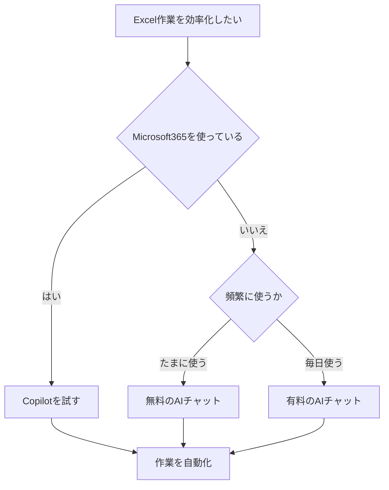

※本記事はアフィリエイト広告(PR)を含みます。

## AIでExcel作業を自動化するとどう変わる?

「関数の書き方がわからない」「毎回同じ集計に時間がかかる」「グラフを作るのが面倒」——Excel作業でこんな悩みを抱えていませんか?この記事では、**AIでExcel作業を自動化する方法**を初心者の方にもわかりやすく解説します。

この記事を読むと、次のことがわかります。

- AIがExcelのどんな作業を肩代わりしてくれるのか
- 関数やグラフ作成を時短できる具体的なツール
- 無料で試せるかどうか、料金の目安
- 実際の使い方の手順と、使うときの注意点

難しい設定は不要で、今日からすぐ試せる方法を中心に紹介します。Excelが苦手な方こそ、AIの力で「面倒な作業」から解放されましょう。

## AIはExcelのどんな作業を自動化できる?

まず、AIが得意とするExcel作業を整理してみましょう。AI(人工知能。ここでは文章で指示すると作業してくれるツールのこと)は、次のような作業を高速でこなしてくれます。

| 作業内容 | AIができること |
|---|---|
| 関数の作成 | 「合計を出す関数を教えて」と頼むと最適な数式を提案 |
| 数式のエラー修正 | なぜエラーになるか原因を説明し、直し方を提示 |
| データの集計・分析 | 大量のデータの傾向を要約・分析 |
| グラフの作成 | データに合ったグラフの種類を提案・作成 |
| マクロ・VBA作成 | 繰り返し作業を自動化するプログラムを生成 |
| データの整形 | 表記ゆれの統一や並べ替えのルール作り |

VBA(ブイビーエー)とは、Excelの作業を自動化するための簡単なプログラミング言語のことです。これまでは専門知識が必要でしたが、AIに「こういう作業を自動化したい」と日本語で伝えるだけで、コードを書いてもらえるようになりました。

## Excel作業を時短できるおすすめAIツール

ここからは、具体的に使えるツールを紹介します。大きく分けて「Excelに組み込まれたAI」と「外部のAIチャット」の2種類があります。

### 1. Microsoft Copilot(Excel内蔵のAI)

**Copilot(コパイロット)**は、Microsoftが提供するExcelに組み込まれたAIです。Excelの画面の中で、チャットに話しかけるように指示するだけで作業してくれるのが最大の魅力です。

- 「売上が高い順に並べ替えて」
- 「月別の合計を出してグラフにして」
- 「この表から気づく傾向を教えて」

このように日本語で頼むだけで、関数の入力やグラフ作成を自動で行ってくれます。Microsoft 365の有料プランに含まれる機能のため、利用には契約が必要です。最新の料金や対応プランは公式サイトで確認してください。

### 2. ChatGPT・Claude・Geminiなどの汎用AI

Excelに直接組み込まれていなくても、汎用的なAIチャットを使えば十分にExcel作業を効率化できます。たとえば次のように使います。

1. AIチャットに「VLOOKUPで別シートから商品名を取り出す数式を教えて」と質問する
2. 返ってきた数式をコピーしてExcelに貼り付ける
3. うまくいかなければ「エラーが出た」と伝えて修正してもらう

どのAIチャットを選べばよいか迷う方は、[ChatGPTとClaudeとGeminiを徹底比較!初心者におすすめのAIチャットはどれ?](/2026/06/09/ai-chat-comparison/)を参考にすると、自分に合ったツールが見つかります。

また、無料版でもExcelの関数質問程度なら十分対応できますが、複雑なデータ分析を頻繁に行うなら有料版が便利です。詳しくは[ChatGPT有料版は必要?無料版との違いと元が取れる使い方を解説](/2026/06/20/chatgpt-paid-vs-free/)もあわせてご覧ください。

### 3. 関数生成に特化したアドイン・ツール

「Excel Formula Bot」などの、関数生成に特化したツールもあります。「やりたいこと」を入力すると、それに合った数式を自動生成してくれます。英語のサービスが多いですが、簡単な英語や日本語でも動くものが増えています。

## ツールの選び方フローチャート

自分に合ったツールがどれか、次の流れで考えてみましょう。

まずは無料のAIチャットから始めて、物足りなければCopilotや有料版を検討する、という流れがおすすめです。

## 実践!AIで関数を作る手順

実際にAIチャットを使って関数を作る流れを見てみましょう。ここでは「売上表から特定の支店の合計を出したい」という例で説明します。

### ステップ1:やりたいことを具体的に伝える

AIには、できるだけ具体的に状況を伝えるのがコツです。

> A列に支店名、B列に売上金額が入っています。「東京支店」の売上合計を出す関数を教えてください。

このように「どの列に何が入っているか」を書くと、的確な数式が返ってきます。

### ステップ2:返ってきた数式を貼り付ける

AIは `=SUMIF(A:A,"東京支店",B:B)` のような数式を提案してくれます。これをExcelのセルに貼り付けるだけです。SUMIF(サムイフ)は「条件に合うものだけ合計する」関数です。

### ステップ3:エラーが出たら相談する

もしうまく動かなくても大丈夫です。「#N/Aエラーが出ました」とそのまま伝えれば、AIが原因と直し方を教えてくれます。何度でも質問できるのがAIの心強いところです。

## グラフ作成もAIにおまかせ

グラフ作成は「どの種類を選べばいいかわからない」とつまずきがちなポイントです。AIに「このデータに合うグラフを提案して」と頼めば、棒グラフ・折れ線グラフ・円グラフなど、目的に合った種類を理由つきで教えてくれます。

Copilotならその場でグラフを生成できますし、汎用AIでも「グラフ作成の手順を1から教えて」と聞けば操作方法を案内してくれます。プレゼン資料も同時に作りたい方は、[AIプレゼン資料作成ツール比較\|パワポ作業を時短する5つの方法](/2026/06/13/ai-presentation-tools/)も役立ちます。

## 作業環境を整えるとさらに快適に

AIツールを使った長時間のデスクワークでは、作業環境も大切です。複数のシートやAIチャットを並べて作業するなら、大きめのモニターや快適な入力環境があると効率が上がります。

👉 [Amazonで「モニター 27インチ」を見る](https://af.moshimo.com/af/c/click?a_id=5632371&p_id=170&pc_id=185&pl_id=38594&url=https%3A%2F%2Fwww.amazon.co.jp%2Fs%3Fk%3D%25E3%2583%25A2%25E3%2583%258B%25E3%2582%25BF%25E3%2583%25BC%252027%25E3%2582%25A4%25E3%2583%25B3%25E3%2583%2581)

また、自宅での作業を快適にするアイデアは[在宅ワークが捗るデスク周りガジェット10選\|快適環境の作り方](/2026/06/11/home-office-gadgets/)でも紹介しています。

## よくある質問(Q&A)

### Q. AIでExcelを自動化するのは無料でできる?

はい、無料でも始められます。ChatGPTやGeminiなどの無料版を使えば、関数の作成やエラー修正、グラフの相談などは十分に行えます。ただし、Excel画面内で直接作業してくれるCopilotは有料プランが基本です。料金は変更されることがあるため、最新情報は各公式サイトで確認してください。

### Q. AIが作った数式は信用していいの?

AIの提案はとても便利ですが、まれに間違った数式やエラーを返すこともあります。**必ず自分で計算結果を確認する**習慣をつけましょう。少量のデータで試してから本番に使うと安心です。

### Q. 会社のデータをAIに入力しても大丈夫?

機密情報や個人情報は安易に入力しないよう注意が必要です。会社のルールを確認し、心配な場合はデータを「A列、B列」のように抽象化して質問すると安全です。

## まとめ

AIを使えば、これまで時間がかかっていたExcelの関数作成やグラフ作成、データ集計が大幅に時短できます。最後にポイントを振り返りましょう。

- AIは関数・グラフ・VBA・データ分析など幅広い作業を自動化できる
- Microsoft 365ユーザーは**Copilot**、それ以外は**無料のAIチャット**から始めるのがおすすめ
- 質問は「どの列に何が入っているか」を具体的に伝えるのがコツ
- AIの出力は必ず自分で確認し、機密情報の入力には注意する

まずは普段使っているAIチャットに、今困っているExcel作業を1つ相談してみてください。「こんなに簡単だったのか」と驚くはずです。小さな自動化を積み重ねて、毎日の作業をぐっとラクにしていきましょう。
