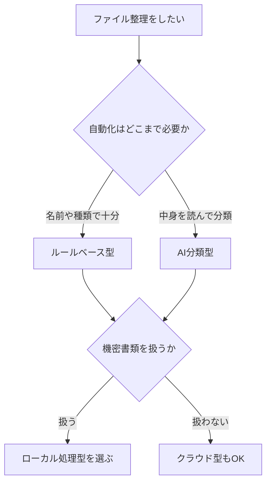

※本記事はアフィリエイト広告(PR)を含みます。

## AIファイル整理術とは?散らかったPCを自動で片付ける時代へ

「デスクトップがアイコンで埋め尽くされている」「ダウンロードフォルダがカオスで、ほしいファイルが見つからない」——そんな悩みを抱えていませんか?この記事では、**AIファイル整理術**を使って散らかったPCを自動で片付ける方法と、初心者にもおすすめのアプリを比較してわかりやすく紹介します。

この記事を読むと、次のことがわかります。

- AIによるファイル整理がどんな仕組みで動くのか
- 自分に合った整理アプリの選び方
- おすすめツールの特徴と料金の目安
- 無料で使えるのか、安全に使うための注意点

手作業でフォルダを分けるのに疲れた方こそ、AIの力を借りて「片付けの自動化」に挑戦してみましょう。

## なぜ今、AIでファイル整理なのか

従来のファイル整理は、自分でフォルダを作り、ファイルを一つずつドラッグして移動する手間がかかりました。これが続かない最大の原因です。

一方、AIを活用した整理ツールは、ファイルの種類・名前・作成日・中身などを自動で判断し、適切なフォルダへ振り分けてくれます。ここでいう「AI」とは、**過去のパターンやファイルの内容を学習して、人の代わりに判断する仕組み**のことです。

具体的には、こんなことが自動でできます。

- 画像・PDF・動画などを種類ごとに自動仕分け
- 「請求書」「契約書」など、書類の中身を読み取って分類
- 重複ファイルや不要なファイルの検出
- ファイル名を内容に合わせて自動リネーム(名前の付け直し)

紙の書類整理に悩んでいる方は、[AIで名刺・書類を整理する方法\|おすすめスキャナーとアプリ活用術](/2026/06/17/ai-business-card-scanner/)もあわせて読むと、デジタルと紙の両面から整理術が身につきます。

## 自分に合ったAI整理アプリの選び方

ツールを選ぶときは、次の3つのポイントを意識すると失敗しにくくなります。

### 1. 自動化のレベルで選ぶ

「ルールを決めて自動振り分け」する手軽なタイプから、「AIが中身を読んで分類」する高度なタイプまであります。まずは簡単なルールベースから始めるのがおすすめです。

### 2. 対応OSで選ぶ

Windows専用、Mac専用、両対応など、ツールによって異なります。お使いのパソコンに対応しているか必ず確認しましょう。

### 3. 安全性とプライバシーで選ぶ

ファイルの中身をクラウド(インターネット上のサーバー)に送って処理するタイプは、機密性の高い書類には注意が必要です。手元のPC内だけで処理する「ローカル処理型」だと安心感があります。

## おすすめのAIファイル整理アプリ比較

ここでは代表的なタイプのツールを比較します。料金は変動するため、必ず公式サイトで最新情報を確認してください。

| ツールの種類 | 特徴 | 向いている人 |
|---|---|---|
| ルールベース整理ソフト | フォルダ監視で自動振り分け。設定が簡単 | まずは手軽に始めたい人 |
| AI分類アプリ | 中身を読み取り賢く分類・リネーム | 書類が多い人 |
| クラウドストレージのAI検索 | 保存と同時にAIが整理・検索を補助 | 複数端末で使う人 |
| OS標準の整理機能 | 追加コストなしで基本整理が可能 | コストをかけたくない人 |

### ルールベース型ソフト

「ダウンロードフォルダに画像が入ったら自動で画像フォルダへ移動」といったルールを決めておくタイプです。AIというより自動化ツールに近いですが、手間を大きく減らせる入門に最適です。

### AI分類アプリ

ファイルの中身を解析して、「これは請求書」「これは履歴書」と判断し、フォルダ分けやリネームまで行ってくれます。書類が膨大な人ほど効果を実感できます。

### クラウド型サービス

Google DriveやOneDriveなどは、保存したファイルをAIが認識し、検索性を高めてくれます。整理というより「探しやすくする」発想です。情報整理全般を効率化したい方は、[Notion AIの使い方完全ガイド\|情報整理とタスク管理を効率化する活用法](/2026/06/17/notion-ai-guide/)も参考になります。

## 整理を快適にするデスク環境も大切

ファイル整理は、作業環境が整っているとさらに捗ります。大きなモニターで複数のフォルダを並べて確認できると、仕分け作業が一気にラクになります。デスク周りを見直したい方は、[在宅ワークが捗るデスク周りガジェット10選\|快適環境の作り方](/2026/06/11/home-office-gadgets/)もチェックしてみてください。

作業効率を上げる外付けストレージを探すなら、以下から比較してみるとよいでしょう。

👉 [Amazonで「外付けSSD ポータブル 大容量」を見る](https://af.moshimo.com/af/c/click?a_id=5632371&p_id=170&pc_id=185&pl_id=38594&url=https%3A%2F%2Fwww.amazon.co.jp%2Fs%3Fk%3D%25E5%25A4%2596%25E4%25BB%2598%25E3%2581%2591SSD%2520%25E3%2583%259D%25E3%2583%25BC%25E3%2582%25BF%25E3%2583%2596%25E3%2583%25AB%2520%25E5%25A4%25A7%25E5%25AE%25B9%25E9%2587%258F)

👉 [楽天市場で「外付けHDD パソコン用」を探す](https://af.moshimo.com/af/c/click?a_id=5632328&p_id=54&pc_id=54&pl_id=616&url=https%3A%2F%2Fsearch.rakuten.co.jp%2Fsearch%2Fmall%2F%25E5%25A4%2596%25E4%25BB%2598%25E3%2581%2591HDD%2520%25E3%2583%2591%25E3%2582%25BD%25E3%2582%25B3%25E3%2583%25B3%25E7%2594%25A8%2F)

## よくある質問(Q&A)

### AIファイル整理アプリは無料で使える?

多くのツールに無料プランや無料試用期間があります。ルールベースの整理ソフトには完全無料のものも存在します。ただし、AIによる高度な分類機能は有料プランで提供されることが多いです。料金体系はよく変わるため、導入前に公式サイトで最新情報を確認しましょう。

### 整理中にファイルが消えたり壊れたりしない?

基本的には「移動」や「分類」が中心なので、データが消えることは通常ありません。とはいえ万が一に備え、**初回は重要なフォルダのバックアップを取ってから試す**ことを強くおすすめします。

### 機密書類を扱っても安全?

クラウドにアップロードして処理するタイプは、サービスのプライバシーポリシーを必ず確認しましょう。機密性が高い書類は、PC内だけで処理が完結するローカル型ツールを選ぶと安心です。

## 整理を習慣化するコツ

ツールを導入しても、放置するとまた散らかってしまいます。次の習慣を取り入れると、きれいな状態を保ちやすくなります。

- 週に1回、自動整理を実行する曜日を決める
- ダウンロードフォルダを「一時置き場」と割り切る
- 1年使っていないファイルは別フォルダへ退避する

こうしたルーティンは、[AIスケジュール管理術\|忙しい人のためのタスク自動化入門](/2026/06/13/ai-schedule-automation/)で紹介しているタスク自動化の考え方と組み合わせると、無理なく続けられます。

## まとめ

AIファイル整理術を使えば、散らかったPCを自動で片付け、「探す時間」を大きく減らすことができます。最後にポイントを振り返りましょう。

- まずは**ルールベースの自動整理**から手軽に始める
- 書類が多い人は**AI分類アプリ**で中身ごと自動仕分け
- 機密書類はクラウド型の安全性を確認し、必要なら**ローカル処理型**を選ぶ
- 導入前に**バックアップ**を取り、料金は公式サイトで最新情報を確認する
- 整理を**習慣化**して、きれいな状態をキープする

散らかったPCは、放っておくほど片付けが大変になります。まずは無料で試せるツールから、今日の片付けを始めてみてください。
