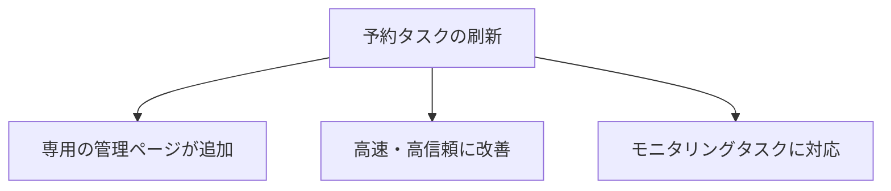

※本記事はアフィリエイト広告(PR)を含む場合があります。

## ChatGPTの「予約タスク」が使いやすくなった

2026年6月、OpenAIが **ChatGPTの予約タスク(Scheduled Tasks)** を大きく刷新しました。これは「決めた時間にChatGPTへ自動で指示を実行させる」機能で、今回**専用の管理ページが追加**され、ぐっと使いやすく・信頼できるものになりました。

「毎朝ニュースを要約させたい」「定期的にリマインドしてほしい」——そんな“AIの自動化”が、より身近になります。この記事では、**何が変わったのか・どう使うのか・誰が使えるのか**を初心者向けに整理します。

## 何が変わったのか(刷新の3ポイント)

### 1. 専用の「予約(Scheduled)」ページが追加

サイドバーに**予約タスク専用のページ**ができ、

- いま動いている**タスク一覧**と**実行予定の時刻**が一目で分かる
- そこから**一時停止・編集・削除**がワンタッチでできる

これまで散らばりがちだった自動タスクを、**1か所でまとめて管理**できるようになりました(Web・モバイル両対応)。

### 2. 高速・高信頼に

OpenAIは「**すべてのタスクがより速く、より信頼できるようになった**」と説明しています。予約した処理が**ちゃんと時間どおりに動く**——地味ですが、自動化では一番大事な改善です。

### 3. 「モニタリングタスク」に対応

新たに、ChatGPTが**あなたの代わりにWebや連携アプリを定期的にチェックしてくれる**監視タスクも設定可能に。「特定の話題に動きがあったら教えて」といった使い方ができます。

## 使い方の例

- **毎朝7時に、興味分野の最新ニュースを要約**して届けてもらう
- **毎週金曜に、今週のタスク棚卸し**をリマインド
- **特定キーワードの新着を監視**して、動きがあれば通知

こうした「AIに定期的な仕事を任せる」考え方は、[AIスケジュール管理術](/2026/06/13/ai-schedule-automation/)でも紹介しています。あわせて読むと活用の幅が広がります。

## 対象プランと注意点

- **対象**:Go・Plus・Pro・Business・Enterprise(Web・モバイル)で順次展開
- **無料プラン**:本記事時点では提供時期は未定
- **Pulseの終了**:今回の更新で、毎日のパーソナル要約機能「**Pulse**」は終了へ(Proユーザーは一定期間の猶予あり)。Pulseを使っていた人は、予約タスクで代替する形が想定されます

各プランの料金や違いは[AIサブスク料金比較](/2026/06/16/ai-subscription-pricing-2026/)、ChatGPT以外との比較は[ChatGPT・Claude・Geminiの比較](/2026/06/09/ai-chat-comparison/)も参考にどうぞ。

## よくある質問

### 予約タスクは無料で使える?

本記事時点では、Go・Plus・Pro・Business・Enterpriseが対象です。無料プランの提供時期は未定です。

### 何個まで設定できる?

プランや時期により異なります。まずは1〜2個の“定番タスク”から始めるのがおすすめです。

### Pulseはもう使えない?

段階的に終了します。Proユーザーには猶予期間が設けられています。今後は予約タスクへの移行が基本になりそうです。

## まとめ

- 2026年6月、**ChatGPTの予約タスクが刷新**。専用の管理ページが追加された
- **高速・高信頼**になり、**一時停止・編集・削除**もまとめて操作可能
- **モニタリングタスク**でWebや連携アプリの定期チェックも可能に
- 対象はGo〜Enterprise(無料は未定)。**Pulseは終了**へ

「AIに定期的な作業を任せる」のがますます当たり前になっています。まずは“毎朝の要約”あたりから、自動化を試してみてはいかがでしょうか。

### 参考リンク

- [ChatGPT now has a hub for scheduled tasks(Engadget)](https://www.engadget.com/2196844/chatgpt-now-has-a-hub-for-scheduled-tasks/)
- [OpenAI launches scheduled tasks in ChatGPT, details here(9to5Mac)](https://9to5mac.com/2026/06/17/openai-launches-scheduled-tasks-in-chatgpt-details-here/)
