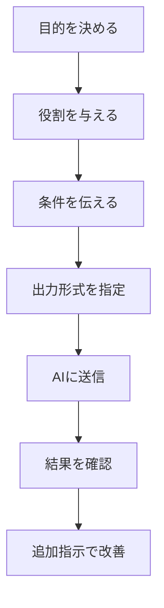

※本記事はアフィリエイト広告(PR)を含みます。

## AIプロンプト作成のコツを知れば回答の質は劇的に変わる

「ChatGPTに質問してみたけど、なんだかピントのずれた答えが返ってきた…」そんな経験はありませんか?実は、AIから思い通りの回答を引き出せるかどうかは、**プロンプト(AIへの指示文)の書き方**で大きく変わります。

この記事では、AI初心者の方に向けて、思い通りの回答を引き出すプロンプト作成のコツをわかりやすく解説します。読み終わるころには、すぐに使えるテンプレートや具体的な書き方が身につき、ChatGPTやClaudeなどのAIチャットをもっと便利に使いこなせるようになります。

> **プロンプトとは?**
> AIに対して「何をしてほしいか」を伝える指示文・質問文のことです。この指示の出し方ひとつで、AIの回答の質がガラッと変わります。

## なぜプロンプトが重要なのか

AIは非常に賢いですが、あなたの頭の中までは読めません。曖昧な指示には曖昧な答えしか返せないのです。

たとえば「ブログ記事を書いて」とだけ伝えると、テーマも長さも文体も分からないため、当たり障りのない一般的な文章が返ってきます。一方で「在宅ワーカー向けに、1500字程度で、親しみやすい文体で時短術のブログ記事を書いて」と伝えれば、ぐっと狙いに近い回答になります。

つまり、**良い回答は良い質問から生まれる**ということです。

## 思い通りの回答を引き出す5つの基本テクニック

まずは押さえておきたい基本のコツを5つ紹介します。

### 1. 役割(ロール)を与える

冒頭で「あなたは○○の専門家です」と役割を指定すると、回答の専門性や視点が安定します。

- 悪い例:「節約のコツを教えて」
- 良い例:「あなたは家計管理の専門家です。一人暮らしの会社員向けに節約のコツを教えてください」

### 2. 具体的な条件を伝える

文字数・形式・対象読者・トーンなど、思いつく条件はできるだけ書き出しましょう。

| 指定する項目 | 記入例 |
|---|---|
| 対象読者 | AI初心者 |
| 文字数 | 800字程度 |
| 文体 | やさしい敬語 |
| 形式 | 箇条書きで |
| 目的 | SNS投稿用 |

### 3. 出力形式を指定する

「表で」「箇条書きで」「3つの案を出して」など、欲しい形を明示すると、後から整理する手間が減ります。

### 4. 例(サンプル)を見せる

「こういう感じで」と具体例を1つ添えると、AIはあなたの好みのスタイルを真似してくれます。これは非常に効果的なテクニックです。

### 5. 一度で完璧を求めず対話する

AIとの会話は1回で終わりではありません。「もっとカジュアルに」「3つ目の案を詳しく」と追加で指示すれば、回答をどんどん磨いていけます。

## プロンプト作成の流れを図で理解する

良いプロンプトを作るときの考え方を、流れにまとめました。



この流れを意識するだけで、行き当たりばったりの質問から、狙った回答を引き出す質問へと変わります。

## そのまま使えるプロンプトのテンプレート

迷ったときは、次の型に当てはめてみてください。

```
# 役割
あなたは[専門分野]の専門家です。

# 依頼内容
[してほしいこと]をお願いします。

# 条件
- 対象読者:[誰向けか]
- 文字数:[目安]
- 文体:[トーン]
- 形式:[箇条書き/表など]

# 補足
[背景や注意点があれば記入]
```

この型に沿って情報を埋めるだけで、初心者でもプロ並みの指示文が作れます。

## よくある失敗とその対策

初心者がやりがちな失敗をまとめました。

- **指示が短すぎる** → 条件を3つ以上添える
- **一度に欲張りすぎる** → 1プロンプト1目的に絞る
- **専門用語を説明しない** → 前提知識をAIに伝える
- **回答が違っても放置** → 「ここを直して」と追加指示する

とくに「対話で育てる」意識を持つと、回答の精度が一気に上がります。

## Q&A:プロンプトに関するよくある疑問

### Q. プロンプトの練習は無料でできますか?

はい、ChatGPTやGemini、Claudeには無料で使えるプランがあります。まずは無料版でプロンプトの書き方を練習し、物足りなくなったら有料版を検討するのがおすすめです。無料版と有料版の違いについては、[ChatGPT有料版は必要?無料版との違いと元が取れる使い方を解説](/2026/06/20/chatgpt-paid-vs-free/)で詳しく紹介しています。なお料金やプラン内容は変わることがあるため、最新情報は各公式サイトでご確認ください。

### Q. どのAIチャットを使えばいいですか?

ツールによって得意分野が異なります。文章生成、要約、翻訳など、用途に合わせて選びましょう。各サービスの特徴は[ChatGPTとClaudeとGeminiを徹底比較!初心者におすすめのAIチャットはどれ?](/2026/06/09/ai-chat-comparison/)で比較しているので、最初の1本を選ぶ参考にしてください。

### Q. プロンプトをもっと体系的に学びたい

書籍で基礎から学ぶのもおすすめです。プロンプト作成のノウハウをまとめた入門書は、手元に置いておくと辞書代わりに使えて便利です。

👉 [Amazonで「プロンプトエンジニアリング 入門書」を見る](https://af.moshimo.com/af/c/click?a_id=5632371&p_id=170&pc_id=185&pl_id=38594&url=https%3A%2F%2Fwww.amazon.co.jp%2Fs%3Fk%3D%25E3%2583%2597%25E3%2583%25AD%25E3%2583%25B3%25E3%2583%2597%25E3%2583%2588%25E3%2582%25A8%25E3%2583%25B3%25E3%2582%25B8%25E3%2583%258B%25E3%2582%25A2%25E3%2583%25AA%25E3%2583%25B3%25E3%2582%25B0%2520%25E5%2585%25A5%25E9%2596%2580%25E6%259B%25B8)

また、ブログ執筆にAIを活用したい方は[AIでブログ記事を書く方法\|初心者向け完全ガイド](/2026/06/12/ai-blog-writing-guide/)も合わせて読むと、実践的なプロンプトの使い方がイメージしやすくなります。

## まとめ

AIから思い通りの回答を引き出すコツは、難しいテクニックではなく「丁寧に、具体的に伝える」という基本の積み重ねです。最後にポイントを振り返りましょう。

- 役割・条件・形式を明確に伝える
- 例を見せると好みのスタイルを再現しやすい
- 一度で完璧を求めず、対話で回答を磨く
- テンプレートを使えば初心者でもプロ並みの指示が作れる

まずは今回紹介したテンプレートを使って、いつもの質問を書き換えてみてください。回答の質が変わることをすぐに実感できるはずです。無料で使えるAIチャットも多いので、気軽に試しながら、自分だけの「効くプロンプト」を見つけていきましょう。
