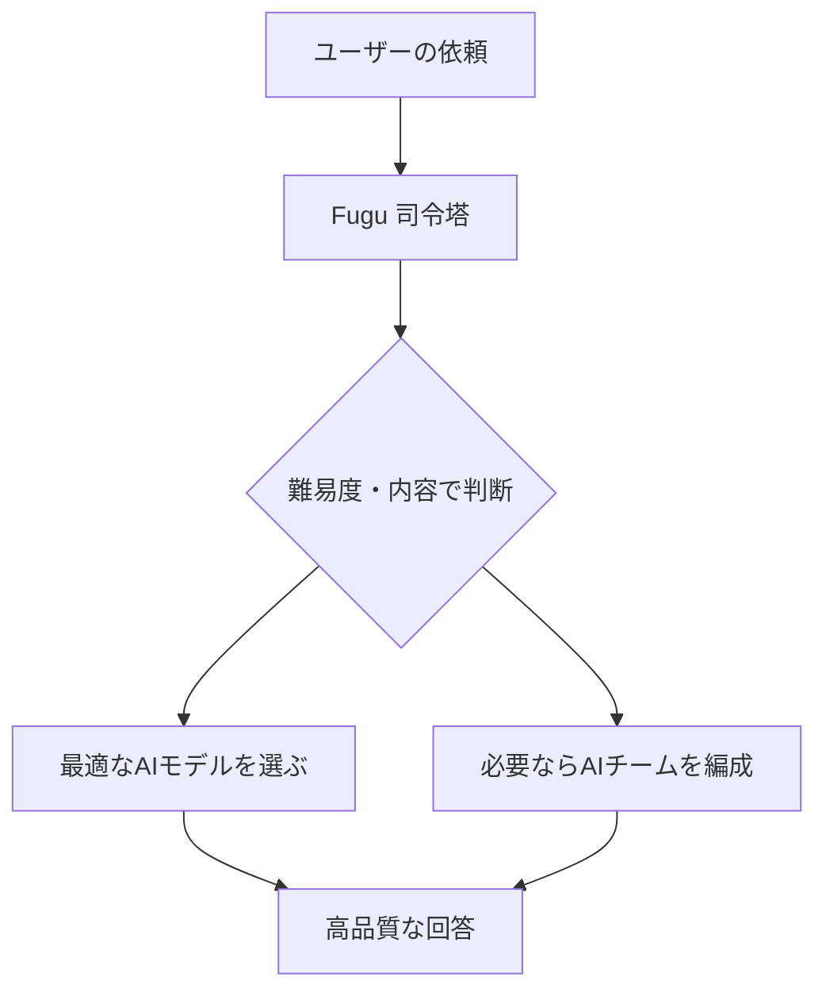

※本記事はアフィリエイト広告(PR)を含む場合があります。

## 日本のSakana AIが「集合知AI」で殴り込み

2026年6月22日、日本のAI企業 **Sakana AI** が、新しいAIシステム **「Sakana Fugu(ふぐ)」** と上位版 **「Fugu Ultra」** の提供を開始しました。

驚きなのはその中身です。Fuguは**1つの巨大なAIモデル**ではなく、**複数のAIモデルを束ねて協調させる“集合知”型**のシステム。それでいて、**一部のベンチマークでは、あのAnthropicの最上位モデル「Fable 5」を上回るスコア**を記録したと報じられています。

「自前で超巨大モデルを作らずに、頂点級の性能を出す」——この発想がいま大きな注目を集めています。

> ⚠️ ベンチマークの数値は条件・時期で変わります。最新の正確な情報は公式発表でご確認ください。

## Sakana Fuguとは?(集合知/オーケストレーション)

Fuguは、**複数のフロンティアAIを内部で連携(オーケストレーション)**させる仕組みです。

- ユーザーの依頼の**難易度や内容に応じて、最適なAIモデルを動的に選ぶ**
- 必要に応じて、**専用のAIエージェントでチームを組ませて**処理する
- 利用者は**1つのAPIを呼ぶだけ**(OpenAI形式と互換)で、裏側の複雑さを意識しなくていい

たとえるなら、**各分野の専門家を束ねる“優秀な司令塔”**。1人の天才ではなく、チームの力で勝ちにいくアプローチです。

## 性能:一部ベンチでFable 5・Opus 4.8超え

報じられている代表的なスコアです(数値は報告ベース)。

| ベンチマーク | Fugu Ultra | 比較 |
|---|---|---|
| SWE-Bench Pro(実務的なコーディング) | 73.7 | Opus 4.8=69.2 / GPT-5.5=58.6 を上回る |
| Terminal-Bench 2.1(エージェント開発) | Fable 5超えのスコア | — |

ポイントは2つです。

- **一般提供されている最上位モデル(Opus 4.8・GPT-5.5など)は明確に上回る**
- 最上位の **Fable 5 / Mythos Preview とは「肩を並べる〜一部で上回る」**水準

なお、**Fable 5 や Mythos Preview は一般非公開**のため、Fuguが内部で使う“AIチーム”には入っていません。それでも比肩・一部超えを実現した、という点が評価されています。各AIのコーディング比較は[ChatGPT・Claude・Geminiのプログラミング比較](/2026/06/16/ai-coding-comparison-2026/)もどうぞ。

## ここがすごい:輸出規制を「回避」できる

この発表が特に注目される理由が、**地政学リスクへの強さ**です。

先日、Anthropicの最上位モデルが[米政府の輸出規制で突然停止](/2026/06/15/claude-fable-5-suspended/)し、[日本にも影響](/2026/06/16/claude-fable-5-japan-impact/)が及びました。Fuguは**自前で巨大モデルを抱えず、利用可能なモデルを賢く組み合わせる**設計のため、「特定の最先端モデルが使えなくなっても、別の組み合わせで戦える」**柔軟さ**を持ちます。

つまり、「**輸出規制のリスクを負わずに、フロンティアレベルの実力を出す**」——これがSakana AIの狙いです。AIモデルが乱立する[今の時代](/2026/06/16/ai-model-flood-2026/)に合った、現実的な戦略といえます。

## 日本発という意義

世界のAIは米国・中国勢が中心ですが、Fuguは**日本発で世界トップ級に食い込んだ**事例です。Sakana AIはこれまでも、長時間の自律リサーチを行う「Marlin」などを手がけており、**「巨大モデルの力比べ」とは違う土俵で勝負する独自路線**が光ります。

## よくある質問

### Fuguは普通のChatGPTみたいに使える?

Fuguは**OpenAI形式のAPIと互換**で、個人・法人向けプランが用意されています。開発者が自分のアプリに組み込む使い方が中心です。

### 本当にFable 5より上なの?

**一部のベンチマークで上回る**のは事実とされますが、最上位のFable 5/Mythosとは総合的には「肩を並べる」水準という見方もあります。用途によって得意・不得意が変わるため、数値は参考程度に。

### 何がそんなに新しいの?

「1つの超巨大モデルを作る」のではなく、「**既存の複数モデルを賢く組み合わせて頂点級を出す**」という発想です。コストや規制リスクの面でも現実的です。

## まとめ

- 2026年6月22日、日本の**Sakana AIが「Fugu / Fugu Ultra」**を発表
- 複数AIを束ねる**集合知(オーケストレーション)型**で、**一部ベンチでFable 5・Opus 4.8を上回る**
- 強みは**輸出規制を回避できる柔軟さ**(Fable 5停止の教訓を突いた設計)
- **日本発で世界トップ級**に食い込んだ、独自路線の注目株

「巨大モデルだけが正義」ではない——AIの勝ち方が多様化していることを示す、象徴的なニュースです。

### 参考リンク

- [Sakana AI、複数のAIモデルを協調させる「Sakana Fugu」の正式提供を開始(gihyo.jp)](https://gihyo.jp/article/2026/06/sakana-fugu)
- [【一部でMythos越えの性能】Sakana AI、集合知AIモデル「Sakana Fugu」を提供開始(ビジネス＋IT)](https://www.sbbit.jp/article/cont1/185854)
- [Sakana Fugu: One Model to Command Them All(Sakana AI公式)](https://sakana.ai/fugu-release/)
