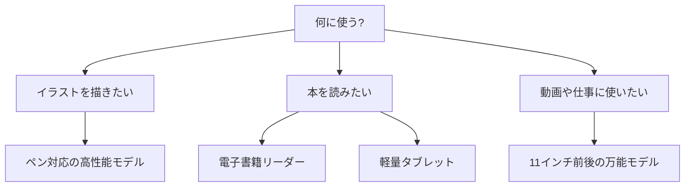

※本記事はアフィリエイト広告(PR)を含みます。

## この記事でわかること

「タブレットの選び方2026」で検索したあなたは、きっと「種類が多すぎてどれを選べばいいかわからない」と悩んでいるのではないでしょうか。この記事では、**AIお絵描き・電子書籍・動画視聴**といった用途別に、自分にぴったりのタブレットを選ぶ方法を初心者向けに解説します。

読み終えるころには、次のことがわかります。

- タブレット選びで見るべき5つのポイント
- 用途別(お絵描き・読書・仕事)のおすすめスペック
- iPad・Android・Kindleなど主要モデルの違い
- よくある疑問(安いタブレットでも大丈夫?など)への答え

それでは、さっそく見ていきましょう。

## まず知っておきたい!タブレット選びの5つのポイント

タブレットは見た目が似ていても、中身は大きく違います。購入前に次の5点を押さえておくと失敗が減ります。

### 1. 画面サイズと解像度

画面サイズは持ち運びやすさと見やすさのバランスで選びます。

- **8インチ前後**:軽くて片手で持てる。電子書籍・通勤向け
- **11インチ前後**:万能サイズ。お絵描き・動画・仕事に最適
- **13インチ前後**:大画面で作業向き。ただし重め

解像度(画面のきめ細かさ)が高いほど文字や絵がくっきり見えます。

### 2. CPU性能(処理の速さ)

CPUとは、タブレットの「頭脳」にあたる部品のこと。性能が高いほどアプリがサクサク動きます。お絵描きや動画編集をするなら高性能なモデルを、読書やネット閲覧中心なら標準的なモデルで十分です。

### 3. ペン(スタイラス)対応

イラストや手書きメモをするなら、**筆圧感知**(ペンの押し具合で線の太さが変わる機能)に対応したペンが使えるモデルを選びましょう。Apple PencilやAndroidのスタイラスペンが代表例です。

### 4. ストレージ容量

写真・アプリ・電子書籍を保存する容量です。最低でも64GB、お絵描きや動画をたくさん扱うなら128GB以上をおすすめします。

### 5. OS(基本ソフト)

タブレットには主に次の3種類のOSがあります。

| OS | 特徴 | 向いている人 |
|---|---|---|
| iPadOS(iPad) | アプリが豊富でペンの書き心地が良い | お絵描き・クリエイティブ作業 |
| Android | 価格帯が幅広く選択肢が多い | コスパ重視・汎用的に使いたい |
| 専用OS(Kindleなど) | 読書に特化 | 電子書籍メイン |

## あなたに合うタブレットはどれ?選び方フローチャート

用途から逆算すると、選ぶべきタイプが見えてきます。下の図を参考にしてみてください。

## 用途別おすすめタブレットの選び方

### AIお絵描きをしたい人向け

近年は、AIでイラストの下書きを作ったり、描いた絵をAIで仕上げたりする使い方が人気です。タブレットでお絵描きするなら、次の条件を満たすモデルを選びましょう。

- 筆圧感知ペンに対応している
- CPU性能が高くアプリが快適に動く
- 画面が11インチ以上で描きやすい

クリエイティブ用途では、ペンの追従性(線の遅れにくさ)が高いiPadシリーズが定番です。ただしAndroidのハイエンドモデルもペン性能が向上しており、選択肢は広がっています。

なお、タブレットで描いた絵を**AIで加工・仕上げ**したい方は、[無料で使える画像生成AIおすすめ5選\|商用利用の注意点も解説](/2026/06/11/free-image-ai-tools/)や、[AI画像編集ソフトおすすめ比較｜背景透過・加工を自動化する5選](/2026/06/19/ai-image-editing-tools/)もあわせてチェックすると、制作の幅がぐっと広がります。

👉 [Amazonで「タブレット ペン対応 イラスト」を見る](https://af.moshimo.com/af/c/click?a_id=5632371&p_id=170&pc_id=185&pl_id=38594&url=https%3A%2F%2Fwww.amazon.co.jp%2Fs%3Fk%3D%25E3%2582%25BF%25E3%2583%2596%25E3%2583%25AC%25E3%2583%2583%25E3%2583%2588%2520%25E3%2583%259A%25E3%2583%25B3%25E5%25AF%25BE%25E5%25BF%259C%2520%25E3%2582%25A4%25E3%2583%25A9%25E3%2582%25B9%25E3%2583%2588)

### 電子書籍を読みたい人向け

読書がメインなら、目に優しく軽い端末が快適です。選択肢は大きく2つあります。

1. **電子書籍リーダー(KindleやKobo)**:E Inkという紙のような表示方式で、長時間読んでも目が疲れにくい。読書専用。
2. **一般的なタブレット**:カラーで雑誌やマンガも楽しめるが、画面の光で目が疲れやすい場合も。

「読書だけできればいい」なら専用リーダーが断然おすすめです。詳しくは[電子書籍リーダーは買うべき?KindleとKoboを徹底比較【初心者向け】](/2026/06/13/kindle-kobo-comparison/)で、それぞれの違いを詳しく解説しています。

👉 [楽天市場で「電子書籍リーダー」を探す](https://af.moshimo.com/af/c/click?a_id=5632328&p_id=54&pc_id=54&pl_id=616&url=https%3A%2F%2Fsearch.rakuten.co.jp%2Fsearch%2Fmall%2F%25E9%259B%25BB%25E5%25AD%2590%25E6%259B%25B8%25E7%25B1%258D%25E3%2583%25AA%25E3%2583%25BC%25E3%2583%2580%25E3%2583%25BC%2F)

### 動画視聴・仕事に使いたい人向け

動画を観たり、ネット検索や書類作成をしたりと幅広く使いたいなら、11インチ前後の万能モデルが便利です。キーボードを付ければ簡単な文書作成もこなせます。在宅ワーク環境を整えたい方は、[在宅ワークが捗るデスク周りガジェット10選\|快適環境の作り方](/2026/06/11/home-office-gadgets/)も参考になります。

## よくある質問(Q&A)

### Q. 安いタブレットでも大丈夫?

用途によります。**読書やネット閲覧、動画視聴がメイン**なら、1〜2万円台の手頃なモデルでも十分快適です。ただし、お絵描きや動画編集など負荷の高い作業をすると、安価なモデルは動作がもたつくことがあります。「何に使うか」を先に決めてから予算を考えるのが失敗しないコツです。

### Q. iPadとAndroidタブレット、結局どっちがいい?

お絵描きやクリエイティブ用途を重視するならiPad、コスパや価格の選択肢を重視するならAndroidが向いています。アプリの使いやすさや周辺機器の豊富さではiPadに分があり、予算を抑えたい人にはAndroidが魅力的です。

### Q. ノートパソコンとタブレット、どちらを買うべき?

本格的な文書作成や長時間の作業がメインならノートパソコンが快適です。持ち運びの手軽さや手書き・お絵描きを重視するならタブレットが向いています。パソコン選びで迷っている方は、[AIノートパソコンの選び方2026\|快適に使うための7つのポイント](/2026/06/11/ai-laptop-guide-2026/)も合わせてご覧ください。

### Q. 価格はどれくらい見ておけばいい?

モデルやキャンペーンによって価格は変動します。エントリーモデルは1〜3万円台、ハイエンドモデルは10万円を超えることもあります。最新の正確な価格は、各メーカーの**公式サイトや販売ページで最新情報を確認してください**。

## 購入前のチェックリスト

買ってから後悔しないために、最後に次の点を確認しましょう。

- [ ] 主な用途(お絵描き・読書・仕事)を決めたか
- [ ] 画面サイズは持ち運び方に合っているか
- [ ] ペンやキーボードなど必要なアクセサリは別売りか
- [ ] ストレージ容量は十分か(写真や動画を多く保存するなら大きめに)
- [ ] 予算と性能のバランスが取れているか

## まとめ

タブレットの選び方2026のポイントを振り返りましょう。

- **用途を先に決める**ことが何より大切
- お絵描きなら**ペン対応の高性能モデル**、読書なら**専用リーダーや軽量タブレット**、仕事や動画なら**11インチ前後の万能モデル**がおすすめ
- OS(iPadOS・Android・専用OS)の違いで使い勝手が変わる
- 安いモデルでも用途次第で十分活躍する

タブレットは一度買えば数年使う相棒です。この記事のフローチャートとチェックリストを参考に、あなたの使い方にぴったりの一台を見つけてください。まずは「自分は何に一番使いたいか」を書き出すことから始めてみましょう。正確な価格や在庫は、購入前に必ず公式サイトや販売ページで最新情報を確認してくださいね。
