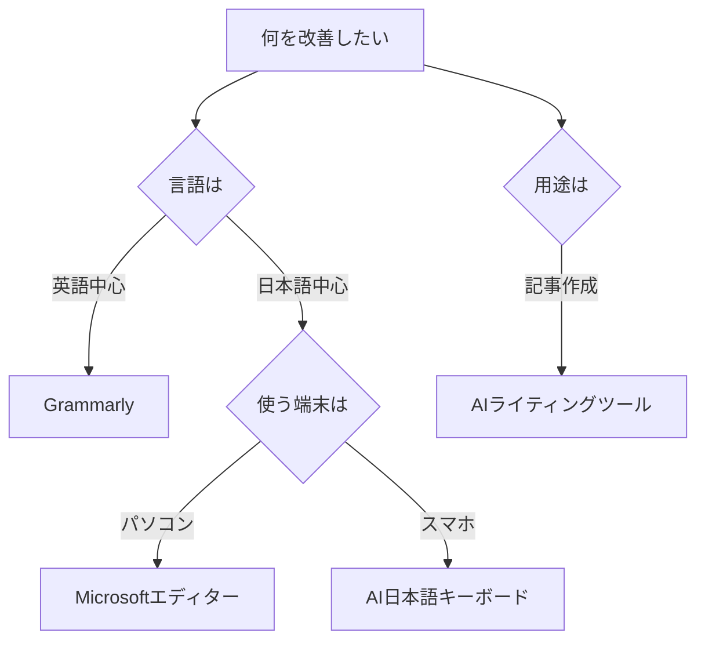

※本記事はアフィリエイト広告(PR)を含みます。

## AIキーボード入力支援ツールとは?この記事でわかること

「タイピングのたびに誤字が出てイライラする」「文章を打つスピードをもっと上げたい」——そんな悩みを解決してくれるのが、**AIキーボード入力支援ツール**です。

AIキーボード入力支援ツールとは、AI(人工知能=人間のように学習・判断する技術)が入力中の文章をリアルタイムで分析し、誤字脱字の自動修正・予測変換・文章の言い換えなどをサポートしてくれるソフトやサービスのことです。

この記事を読むと、次のことがわかります。

- AI入力支援ツールでできること(タイピング・誤字修正の自動化)
- 2026年におすすめのツール5選と特徴の比較
- 無料で使えるのか、選び方のポイント

初心者の方でも今日から試せるよう、できるだけわかりやすく解説していきますので、ぜひ最後までご覧ください。

## AI入力支援ツールでできること

まずは、AIが具体的にどんな作業を肩代わりしてくれるのかを整理してみましょう。

- **誤字脱字の自動修正**:打ち間違いをリアルタイムで検出し、正しい表記に直してくれます。
- **予測変換・文章補完**:入力途中で続きの文章を提案してくれるので、タイピング量が減ります。
- **言い換え・トーン調整**:「丁寧な表現にしたい」「短くまとめたい」といった要望に応えてくれます。
- **翻訳・多言語サポート**:英語などの文章作成も支援してくれるツールがあります。

つまり、AI入力支援ツールを使うと「速く・正確に・きれいに」文章を書けるようになるわけです。メール作成を効率化したい方は、[AIメール作成術\|ビジネスメールを3倍速く書く方法](/2026/06/14/ai-email-writing/)もあわせて参考にしてください。

## AIキーボード入力支援ツールおすすめ5選【2026年比較】

ここからは、2026年に注目したいツールを5つご紹介します。それぞれ得意分野が異なるので、自分の使い方に合うものを探してみてください。

### 1. Grammarly(グラマリー)

英語の文章作成に強い定番ツールです。スペルミスや文法ミスをリアルタイムで指摘してくれるほか、文章のトーンも調整できます。ブラウザの拡張機能(機能を追加する小さなプログラム)として使えるので、メールやSNSなどあらゆる場面で動作します。英語でのやり取りが多い方には特におすすめです。

### 2. Microsoft エディター

WordやEdge(マイクロソフトのブラウザ)に標準搭載されている入力支援機能です。日本語にも対応しており、誤字脱字や言い回しの改善提案をしてくれます。普段からOfficeを使っている方なら、追加コストなく使い始められるのが大きな魅力です。

### 3. flick(フリック)などのAI日本語キーボードアプリ

スマートフォンのキーボードアプリにもAIが搭載されつつあります。文脈に合った変換候補を提示したり、よく使うフレーズを学習したりして、スマホでの入力をぐっと快適にしてくれます。スマホで長文を打つ機会が多い方に向いています。

### 4. ChatGPT・Claudeなどの生成AIチャット

厳密には「キーボードツール」ではありませんが、書いた文章を貼り付けて「誤字を直して」「もっと自然にして」と頼むだけで、高精度に修正してくれます。汎用性が非常に高く、文章作成の最終チェックに使う人が増えています。どのチャットを選ぶか迷う方は、[ChatGPTとClaudeとGeminiを徹底比較](/2026/06/09/ai-chat-comparison/)を読むと選びやすくなります。

### 5. AIライティング特化ツール(Catchyなど)

ブログやマーケティング文章の作成に特化したツールです。テンプレートに沿って入力するだけで、誤字のない自然な文章を生成・補完してくれます。本格的に文章を量産したい方は、[AIライティングツール比較2026](/2026/06/19/ai-writing-tool-comparison-2026/)もチェックしてみてください。

## 主要ツールの特徴を表で比較

| ツール | 得意分野 | 日本語対応 | 主な利用シーン |
|---|---|---|---|
| Grammarly | 英語の文法・誤字 | 限定的 | 英文メール・SNS |
| Microsoft エディター | 日本語の校正 | ◎ | Word・Edge全般 |
| AI日本語キーボードアプリ | スマホ入力 | ◎ | チャット・メモ |
| ChatGPT/Claude | 万能な文章修正 | ◎ | 最終チェック全般 |
| AIライティング特化ツール | 長文・記事作成 | ◎ | ブログ・記事 |

※料金やプランは変更されることがあります。正確な価格は各**公式サイトで最新情報を確認してください**。

## 自分に合うツールの選び方

どれを選ぶか迷ったら、次のフローチャートを参考にしてみてください。

選ぶときのポイントは、大きく次の3つです。

1. **主に使う言語**:英語なら専用ツール、日本語なら国産対応のものを選びましょう。
2. **使う端末**:パソコン中心かスマホ中心かで、最適なツールが変わります。
3. **コスト**:無料で十分な場合も多いので、まずは無料版から試すのがおすすめです。

## AI入力支援ツールは無料で使える?

結論から言うと、**多くのツールに無料プランがあります**。

例えばGrammarlyやMicrosoftエディターは基本的な誤字修正なら無料で利用できます。ChatGPTにも無料版があり、文章の修正程度であれば十分に使えます。

ただし、高度な言い換え機能や文章生成の回数上限などは有料プランで解放されることが多いです。「まず無料で試して、物足りなければ有料を検討する」という流れが失敗しにくいでしょう。ChatGPTの有料版が気になる方は、[ChatGPT有料版は必要?無料版との違い](/2026/06/20/chatgpt-paid-vs-free/)も参考になります。

なお、料金体系は頻繁に変わるため、契約前に必ず**公式サイトで最新情報を確認してください**。

## 入力環境そのものを快適にするのもおすすめ

ソフト面だけでなく、ハード面(物理的な機器)を整えると入力のストレスがさらに減ります。打鍵感のよいキーボードに変えるだけで、誤字そのものが減ることも珍しくありません。

👉 [Amazonで「静音 ワイヤレスキーボード 日本語配列」を見る](https://af.moshimo.com/af/c/click?a_id=5632371&p_id=170&pc_id=185&pl_id=38594&url=https%3A%2F%2Fwww.amazon.co.jp%2Fs%3Fk%3D%25E9%259D%2599%25E9%259F%25B3%2520%25E3%2583%25AF%25E3%2582%25A4%25E3%2583%25A4%25E3%2583%25AC%25E3%2582%25B9%25E3%2582%25AD%25E3%2583%25BC%25E3%2583%259C%25E3%2583%25BC%25E3%2583%2589%2520%25E6%2597%25A5%25E6%259C%25AC%25E8%25AA%259E%25E9%2585%258D%25E5%2588%2597)

在宅ワークのデスク環境を見直したい方は、[在宅ワークが捗るデスク周りガジェット10選](/2026/06/11/home-office-gadgets/)もあわせてご覧ください。快適なキーボードとAIツールを組み合わせれば、文章作成の効率は大きく変わります。

## まとめ

AIキーボード入力支援ツールは、誤字修正やタイピングの負担を自動で減らしてくれる頼もしい相棒です。最後に要点を振り返りましょう。

- AI入力支援ツールは**誤字修正・予測変換・言い換え**を自動化してくれる
- 英語ならGrammarly、日本語ならMicrosoftエディターやAIキーボードアプリが便利
- 万能に使いたいならChatGPT・Claudeなどの生成AIチャットが強力
- **多くのツールに無料プランがある**ので、まず無料で試すのがおすすめ
- 料金は変動するため、契約前に公式サイトで最新情報を確認する

まずは普段使っている端末で1つ試してみて、文章作成がどれだけ楽になるかを体感してみてください。あなたの作業効率がぐっと上がるはずです。
