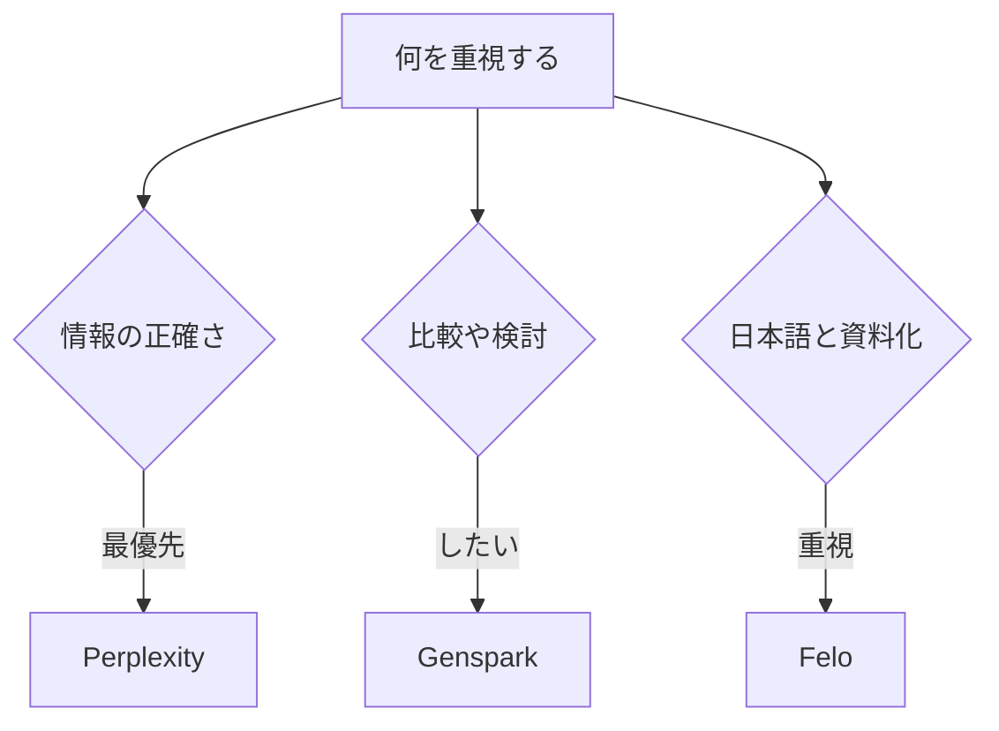

※本記事はアフィリエイト広告(PR)を含みます。

## AI検索エンジンのおすすめを知りたいあなたへ

「調べものをするたびに、たくさんのサイトを開いて読むのが大変…」そんな悩みを解決してくれるのが、いま注目の**AI検索エンジン**です。AI検索エンジンとは、質問を入力すると、AIがインターネット上の情報を自動で集めて要約し、出典付きで答えてくれるサービスのこと。Google検索のように自分でページを探さなくても、知りたい答えがすぐ手に入ります。

この記事では、人気のAI検索エンジン「**Perplexity(パープレキシティ)**」「**Genspark(ジェンスパーク)**」「**Felo(フェロー)**」の3つを徹底比較します。読み終えるころには、それぞれの特徴と「自分にはどれが合っているか」がはっきりわかるはずです。無料で使えるのか、日本語に強いのはどれか、といった疑問にもお答えします。

## そもそもAI検索エンジンとは?Google検索との違い

従来のGoogle検索は、キーワードに関連する「Webページの一覧」を表示してくれる仕組みでした。一方、AI検索エンジンは検索結果を読み込んだうえで、**質問への答えそのものを文章でまとめて返してくれる**のが大きな違いです。

| 項目 | Google検索 | AI検索エンジン |
|---|---|---|
| 結果の形 | サイトのリンク一覧 | 要約された回答文 |
| 出典の確認 | 自分でページを開く | 回答に出典リンクが付く |
| 追加の質問 | 再検索が必要 | 会話形式で深掘りできる |
| 向いている場面 | 公式サイトを探す | 情報を整理・比較したい |

なお、AIチャットそのものの違いについては、[ChatGPTとClaudeとGeminiを徹底比較!初心者におすすめのAIチャットはどれ?](/2026/06/09/ai-chat-comparison/)もあわせて読むと理解が深まります。

## Perplexity・Genspark・Feloの特徴を比較

ここからは3つのサービスを、それぞれの個性に注目しながら見ていきましょう。

### Perplexity:出典の信頼性が高い王道

Perplexityは、AI検索エンジンの中でも世界的に知名度が高い定番サービスです。

- **出典がしっかり明記される**ため、情報の裏取りがしやすい
- 回答の下に参照元のリンクが並び、信頼性を確認しやすい
- 学術的な調べものやビジネスの情報収集に向いている
- 「Pro検索」など、より深く調べるモードも用意されている

正確な情報を重視する人にとって、まず試したい一本です。ただし、新聞社との著作権をめぐる議論も起きており、その背景は[新聞社がPerplexityを提訴\|AI検索と著作権の問題をわかりやすく解説](/2026/06/17/perplexity-copyright-lawsuit/)で詳しく解説しています。

### Genspark:情報を一枚にまとめてくれる

Gensparkの特徴は、質問に対して**「スパークページ」と呼ばれる、まとめページを自動生成してくれる**点です。

- 複数の情報源を1ページに整理して見せてくれる
- 商品比較や旅行先の検討など、選択肢を並べたいときに便利
- 広告に左右されにくい中立的なまとめを目指している
- AIエージェント機能で、より複雑な調査も任せられる

「いろいろな選択肢をまとめて比較したい」というニーズにぴったりです。

### Felo:日本語に強く、使い勝手がよい

Feloは日本語環境での使いやすさに定評があるAI検索エンジンです。

- **日本語の質問・回答が自然**で、初心者でも違和感が少ない
- 検索結果をそのままスライド資料(プレゼン)に変換できる機能がある
- 多言語検索に対応し、海外の情報も日本語で取得しやすい
- スマホアプリも使いやすい

日本語中心で使いたい方や、調べた内容をそのまま資料化したい方におすすめです。

## 3つのサービスの比較表

| 項目 | Perplexity | Genspark | Felo |
|---|---|---|---|
| 強み | 出典の信頼性 | まとめページ生成 | 日本語の自然さ |
| 向いている人 | 裏取り重視 | 比較・検討重視 | 日本語中心の人 |
| 資料化機能 | △ | ○ | ◎(スライド) |
| 無料プラン | あり | あり | あり |

※料金やプラン内容は変更されることがあります。最新の情報は必ず各公式サイトでご確認ください。

## 自分に合うAI検索エンジンの選び方

どれを選べばいいか迷ったら、次のフローチャートを参考にしてみてください。

基本的には、**まず無料プランで実際に3つとも触ってみる**のがおすすめです。同じ質問を入力して、回答のわかりやすさや出典の見やすさを比べると、自分に合うものがすぐ見つかります。

## よくある質問(Q&A)

### Q. AI検索エンジンは無料で使える?

はい、Perplexity・Genspark・Feloはいずれも**無料プランが用意されています**。まずは無料で試して、物足りなければ有料プランを検討するのがよいでしょう。有料版では、より高性能なAIモデルを使えたり、検索回数の上限が増えたりします。なお、AIサービス全体の料金動向は[AIサブスク料金比較2026年6月](/2026/06/16/ai-subscription-pricing-2026/)でも触れています。

### Q. AI検索の回答は鵜呑みにしていい?

便利な一方で、AIが情報を誤って要約することもあります(これを「ハルシネーション」と呼びます)。**重要な判断をするときは、必ず出典リンクを開いて元の情報を確認する**習慣をつけましょう。Perplexityのように出典が明確なサービスは、この点で安心感があります。

### Q. 質問の仕方でも回答は変わる?

はい、大きく変わります。あいまいな質問より、具体的な条件を添えた質問のほうが精度の高い答えが返ってきます。質問のコツは[AIプロンプトのコツ\|思い通りの回答を引き出す書き方](/2026/06/22/ai-prompt-tips/)で詳しく紹介していますので、あわせてご覧ください。

## まとめ

今回は、AI検索エンジンのおすすめとして「Perplexity」「Genspark」「Felo」の3つを比較しました。最後にポイントを整理します。

- **Perplexity**:出典が明確で信頼性重視の人に最適
- **Genspark**:情報をまとめて比較・検討したい人向け
- **Felo**:日本語の自然さと資料化機能が魅力

どれも無料プランから始められるので、まずは同じ質問を3つに投げて、回答の使いやすさを比べてみてください。あなたの調べもののスタイルにいちばん合う一本が、きっと見つかります。料金やプランの最新情報は、各公式サイトで確認してから本格的に使い始めるのがおすすめです。
