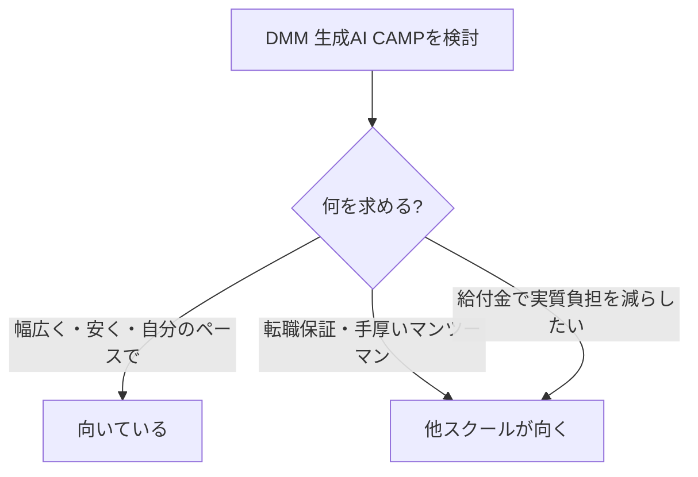

※本記事はアフィリエイト広告(PR)を含みます。内容は公式情報・公開されている口コミをもとに整理したもので、最新の料金・条件は必ず公式サイトでご確認ください。

## DMM 生成AI CAMPって実際どう?

「生成AIをちゃんと学びたいけど、DMM 生成AI CAMPって自分に合うの?」——そう迷っている方向けに、**料金・コース・評判を、いい点もイマイチな点も正直に**整理しました。

結論を先に言うと、**「月額制で幅広く学び放題」**という設計で、**まず広く生成AIに触れたい人**に向いています。一方で、**転職保証や手厚いマンツーマンを求める人には不向き**な面もあります。順番に見ていきましょう。

## 基本情報(2026年時点)

| 項目 | 内容 |
|---|---|
| 形式 | 月額制サブスク(学び放題) |
| 料金 | 月額14,800円(税込16,280円)前後 |
| 契約期間 | 最低契約期間なし・いつでも解約可 |
| 初期費用 | 入会金・教材費なし |
| レッスン | 約1,000レッスン/複数コース |
| サポート | メンター相談・24時間AIチューター・受講生コミュニティ |

※料金・コース内容は変更されることがあります。**申し込み前に公式で最新情報を確認してください。**

## 特徴・メリット

### 1. 月額制で「学び放題」

最大の魅力は、**月額1万円台で約1,000レッスンが受け放題**な点。基礎マスターから、マーケ・営業・人事などの職種別、生成AIエンジニア、Difyマスター、動画・デザイン系まで、**幅広い分野をまとめて学べます**。

### 2. 縛りがなく、始めやすい・やめやすい

**最低契約期間がなく、いつでも解約可能**。入会金・教材費もかからないため、「とりあえず1ヶ月試す」という気軽さがあります。高額なコース買い切り型に比べ、**金銭的なハードルが低い**のは大きな利点です。

### 3. サポートと実践機会

プロのメンターへの相談に加え、**24時間対応のAIチューター**、受講生コミュニティ、さらにDMMグループのサービスを題材にした**実案件コンペ**など、アウトプットの機会も用意されています。

## デメリット・注意点(ここが正直に大事)

良いことばかりではありません。**契約前に知っておきたい注意点**です。

- **別途ツール利用料がかかる**:ChatGPTやMidjourneyなど、学習で使う生成AIツールの料金は**自己負担**(受講料に含まれない)
- **範囲が広く、迷いやすい**:コース・レッスンが大量にあるため、**目的を決めずに始めると“つまみ食い”で終わりがち**
- **転職保証はない**:転職を確約する制度はありません。キャリアサポート重視の人は要検討
- **補助金(給付金)について**:現在の月額制プランは、教育訓練給付金などの**補助金対象外**とされています(その分、月額が手頃)。「最大70%還元」を狙うなら、給付金対象の別スクールを検討する必要があります

## どんな人に向く?/向かない?

- **向いている人**:まず生成AIを幅広く触りたい/独学に挫折した/コストを抑えたい/自分のペースで進めたい
- **向かない人**:転職を保証してほしい/つきっきりのマンツーマン指導が欲しい/給付金で実質負担を減らしたい

## 他スクールとの比較

生成AIスクールは「**目的との相性**」で選ぶのが鉄則です。DMM 生成AI CAMPを、タイプの違う代表的なスクールと並べてみましょう。

| スクール | 形式 | 料金の目安 | 給付金 | 向いている人 |
|---|---|---|---|---|
| DMM 生成AI CAMP | 月額制・学び放題 | 月1.6万円前後 | 対象外 | 幅広く・安く・自分のペースで |
| 侍エンジニア | マンツーマン | コース買い切り(数十万円〜) | 対象(最大70%) | 挫折しがち・転職目的 |
| キカガク | 長期・体系カリキュラム | 数十万円(長期) | 対象(最大80%) | AI・データを本格的に |
| Aidemy Premium | コース型・サポート付き | 数十万円 | 対象コースあり | AI実務スキルを集中習得 |

※料金・給付金の対象状況は変動します。必ず各公式で最新情報を確認してください。

### タイプ別の選び方

**① 幅広く・安く・気軽に → DMM 生成AI CAMP**
月額制で縛りがなく、入口として最適。「まず生成AIに触れたい」「コストを抑えたい」「自分のペースで進めたい」人向けです。

**② マンツーマンで挫折せず・転職も視野 → 侍エンジニア**
専属講師がつくマンツーマン型。経済産業省のリスキリング支援事業の対象で、条件を満たせば**受講料の最大70%(上限56万円)**が戻る場合があります。「独学で挫折した」「転職につなげたい」人向けです。

**③ AI・データサイエンスを本格的に → キカガク / Aidemy**
体系的なカリキュラムでAIを深く学べる専門スクール。キカガクは厚生労働省の専門実践教育訓練給付金の対象コースがあり、要件を満たせば**最大80%(上限64万円)**の給付が受けられる場合も。腰を据えて実務レベルを目指す人向けです。

### 結局どれ?(かんたん早見)

- **とにかく安く・広く触りたい** → DMM 生成AI CAMP
- **手厚さ・転職重視・給付金で実質負担を減らしたい** → 侍エンジニア
- **AI/データ分析を専門的に・給付金で本格的に** → キカガク・Aidemy

DMMの強みは「**入りやすさ**」、他社の強みは「**手厚さ・給付金・専門性**」です。**まずDMMで広く触り、必要になったら専門スクールへ**という二段構えも、コストを抑えつつ失敗しにくい賢い進め方です。

各スクールの選び方の全体像は、[生成AIが学べるオンラインスクールの比較記事](/2026/06/13/ai-online-school-guide/)で5つのチェックポイントとともに解説しています。「資格×AI」でキャリアに活かす視点は[生成AIとかけ合わせると強い資格](/2026/06/16/ai-strong-certifications/)も参考にどうぞ。

## 失敗しない使い方

月額制を最大限活かすコツは、**「最初に目的を1つ決める」**ことです。

1. **無料相談・無料セミナーで目的を整理**(公式で予約可)
2. 入会したら、**まず1コースに絞って完走**する
3. 慣れたら横展開。合わなければ**すぐ解約**(縛りなし)

「広く学べる」は裏を返せば「迷いやすい」。**ゴールを決めてから始める**のが、後悔しないコツです。



## よくある質問

### 初心者でも大丈夫?

はい。基礎マスターコースがあり、**ゼロから始める想定**の構成です。まずは無料相談で不安を解消するのがおすすめです。

### 本当に「学び放題」?追加料金は?

受講料は月額制で学び放題ですが、**学習に使う生成AIツールの利用料は別途自己負担**です。ここは見落としやすいので注意。

### 給付金は使える?

現在の月額制プランは**補助金の対象外**とされています。給付金狙いなら対象スクールを別途検討してください。最新の対象状況は公式で確認を。

### 合わなかったら?

**最低契約期間がなく、いつでも解約可能**です。まず1ヶ月試す、という使い方ができます。

## まとめ

- DMM 生成AI CAMPは**月額1万円台で約1,000レッスンが学び放題**の生成AIスクール
- **縛りなし・始めやすい・幅広い**のが強み。「まず広く触りたい人」に好相性
- 注意点は**ツール代別・範囲が広く迷いやすい・転職保証なし・補助金対象外**
- **目的を1つ決めてから**始めると失敗しにくい。まずは無料相談で相性チェックを

「自分に合うか」は、無料相談で話を聞いてみるのが一番確実です。気になる方は、下のリンクから公式の最新情報をチェックしてみてください。

### 参考リンク

- [DMM 生成AI CAMP 学び放題(公式)](https://genai.dmm.com/)
- [生成AIが学べるオンラインスクールおすすめ比較(当ブログ)](/2026/06/13/ai-online-school-guide/)
