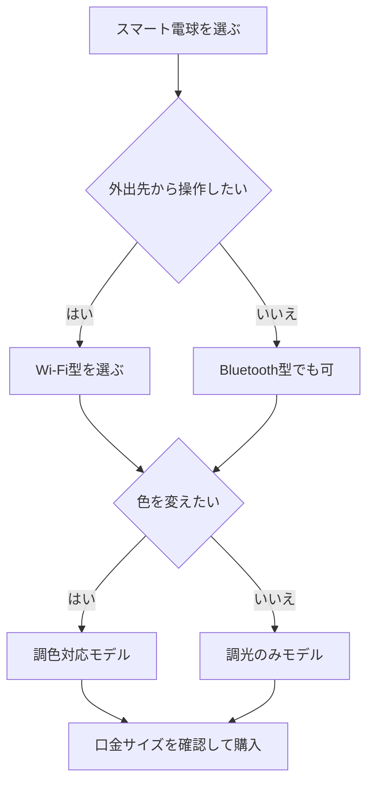

※本記事はアフィリエイト広告(PR)を含みます。

## AI搭載スマート電球とは?音声操作で部屋が変わる

「電気を消すのにわざわざベッドから起き上がるのが面倒」「帰宅したときに自動で部屋が明るくなったら便利なのに」——そんな悩みを解決してくれるのが**AI搭載スマート電球**です。

この記事では、スマート電球の選び方を初心者の方にもわかりやすく解説します。読み終わるころには、以下のことがわかります。

- スマート電球でできること(音声操作・自動点灯など)
- 失敗しないための選び方のポイント
- 自分の部屋にはどのタイプが合うのか
- セットアップの基本的な流れ

スマート電球とは、Wi-FiやBluetoothでスマホやスマートスピーカーとつながり、声やアプリで操作できる照明のことです。最近はAIアシスタント(AlexaやGoogleアシスタントなど、声で家電を操作できる仕組み)に対応したモデルが主流になり、「電気つけて」と話しかけるだけで点灯できるようになりました。

## スマート電球でできる5つのこと

まずは、スマート電球を導入すると何が便利になるのかを見ていきましょう。

| できること | 具体例 |
|---|---|
| 音声操作 | 「電気消して」と言うだけでオフにできる |
| スマホ操作 | 外出先からアプリで消灯確認・操作 |
| 自動化(スケジュール) | 朝7時に自動点灯、夜11時に消灯 |
| 調光・調色 | 明るさや色(暖色〜寒色)を自由に変更 |
| シーン設定 | 「映画モード」「読書モード」をワンタップ |

とくに便利なのが**調色機能**です。色温度(光の色みのこと。暖かいオレンジ色〜さわやかな白色まで)を変えられるので、朝はすっきりした白色、夜はリラックスできる暖色、といった切り替えができます。在宅ワークの集中力アップにも効果的です。

デスク周りの環境づくりに興味がある方は、[在宅ワークが捗るデスク周りガジェット10選\|快適環境の作り方](/2026/06/11/home-office-gadgets/)もあわせて読むと、より快適な部屋づくりのヒントが見つかります。

## スマート電球の選び方5つのポイント

### 1. 接続方式(Wi-Fi型かBluetooth型か)

スマート電球の接続方式は大きく2種類あります。

- **Wi-Fi型**:外出先からも操作可能。ハブ(中継機器)不要のものが多く初心者向け
- **Bluetooth型**:スマホが近くにある必要がある。比較的安価

外出先からの操作や自動化をしっかり使いたいなら、**Wi-Fi型**がおすすめです。

### 2. 口金(くちがね)のサイズを確認する

意外と見落としがちなのが、電球の差し込み部分である「口金」のサイズです。日本では主に以下の2種類が使われています。

- **E26**:一般的なシーリングライトや電気スタンドに多い
- **E17**:小型の照明やダウンライトに多い

今使っている電球の口金サイズを必ず確認してから購入しましょう。

### 3. 対応するAIアシスタントを確認する

お使いのスマートスピーカーや環境に合わせて選ぶことが重要です。

- Amazon Alexa対応
- Googleアシスタント対応
- Apple HomeKit対応(iPhoneユーザー向け)

まだスマートスピーカーを持っていない方は、[スマートスピーカーはどれを買うべき?Alexa・Google Home徹底比較](/2026/06/12/smart-speaker-comparison/)を参考に、電球とセットで選ぶと相性で失敗しません。

### 4. 明るさ(ルーメン)と調光・調色の有無

明るさは「ルーメン(lm)」という単位で表されます。一般的な6畳の部屋なら、メインの照明で十分な明るさが必要です。間接照明やデスクライト用なら控えめでも構いません。色を変えたい方は「調色対応」の表記があるかチェックしましょう。

### 5. 価格とメーカーの信頼性

安すぎる製品は、アプリが不安定だったり、サポートが受けられなかったりすることがあります。Philips Hue、TP-Link(Tapo/Kasa)、SwitchBotなど、実績のあるメーカーを選ぶと安心です。価格は時期や仕様で変動するため、**最新情報は公式サイトや販売ページで確認してください**。

👉 [Amazonで「スマート電球 wifi E26 調色」を見る](https://af.moshimo.com/af/c/click?a_id=5632371&p_id=170&pc_id=185&pl_id=38594&url=https%3A%2F%2Fwww.amazon.co.jp%2Fs%3Fk%3D%25E3%2582%25B9%25E3%2583%259E%25E3%2583%25BC%25E3%2583%2588%25E9%259B%25BB%25E7%2590%2583%2520wifi%2520E26%2520%25E8%25AA%25BF%25E8%2589%25B2)

## あなたに合うスマート電球の選び方フローチャート

このように、「外出先操作の有無」と「色の変更の有無」で絞り込むと、自分に必要なモデルが見えてきます。

## セットアップは難しい?基本の流れ

「機械が苦手だけど大丈夫かな」と不安な方も多いと思いますが、最近のスマート電球はとても簡単です。基本の流れは次の通りです。

1. 電球を照明器具に取り付ける
2. メーカー専用アプリをスマホにインストールする
3. アプリの案内に従ってWi-Fiに接続する
4. スマートスピーカーと連携設定する
5. 「電気つけて」と話しかけて動作確認

だいたい10〜15分ほどで完了します。アプリが日本語に対応しているメーカーを選ぶと、よりスムーズです。

## Q&A:よくある疑問に先回りで回答

### Q. スマート電球は無料で使えるの?

電球本体は購入が必要ですが、操作用のアプリや音声操作機能は基本的に**無料**で使えます。月額料金がかかることは通常ありません。ただし、一部の高度な自動化機能や、複数拠点の管理などで有料プランを用意しているメーカーもあるため、購入前に確認しておくと安心です。

### Q. 既存の照明器具をそのまま使える?

口金サイズが合えば、今お使いの電気スタンドやシーリングライトにそのまま取り付けられます。器具ごと買い替える必要はありません。

### Q. スマホがなくても操作できる?

スマートスピーカーと連携すれば、声だけで操作できます。ただし初期設定にはスマホとアプリが必要です。

### Q. 停電したらどうなる?

停電後に電気が復旧すると、多くのモデルは自動で点灯状態に戻ります。設定で挙動を変えられる製品もあります。

## さらに快適にするなら「シーン設定」を活用

スマート電球に慣れてきたら、ぜひ**シーン設定**を使ってみてください。複数の電球の明るさや色をまとめて切り替えられる機能です。

- **おはようモード**:朝の起床時にゆっくり明るくする
- **集中モード**:作業中はさわやかな白色光
- **リラックスモード**:夜は暖色で落ち着いた雰囲気

スマートスピーカーと組み合わせれば、「アレクサ、おやすみ」の一言で家中の照明を消すこともできます。こうした自動化を生活全体に広げたい方は、ロボット掃除機などの他のスマート家電もチェックしてみると良いでしょう。気になる方は[ロボット掃除機の選び方2026\|AI搭載モデルを価格・機能で徹底比較](/2026/06/16/robot-vacuum-guide-2026/)も参考になります。

👉 [楽天市場で「スマート電球 アレクサ対応」を探す](https://af.moshimo.com/af/c/click?a_id=5632328&p_id=54&pc_id=54&pl_id=616&url=https%3A%2F%2Fsearch.rakuten.co.jp%2Fsearch%2Fmall%2F%25E3%2582%25B9%25E3%2583%259E%25E3%2583%25BC%25E3%2583%2588%25E9%259B%25BB%25E7%2590%2583%2520%25E3%2582%25A2%25E3%2583%25AC%25E3%2582%25AF%25E3%2582%25B5%25E5%25AF%25BE%25E5%25BF%259C%2F)

## まとめ

AI搭載スマート電球は、声やスマホで照明を自由に操作でき、暮らしを一段と快適にしてくれるアイテムです。最後に選び方のポイントをおさらいしましょう。

- **接続方式**:外出先操作や自動化重視ならWi-Fi型
- **口金サイズ**:E26かE17か必ず確認
- **AIアシスタント対応**:手持ちのスピーカーに合わせる
- **明るさ・調色**:部屋の用途に合わせて選ぶ
- **メーカーの信頼性**:アプリの使いやすさとサポートを重視

まずは1部屋から導入してみると、その便利さに驚くはずです。価格や仕様は変動するため、購入前に公式サイトや販売ページで最新情報を確認してくださいね。あなたの部屋が、声ひとつで快適に変わる体験をぜひ味わってみてください。
