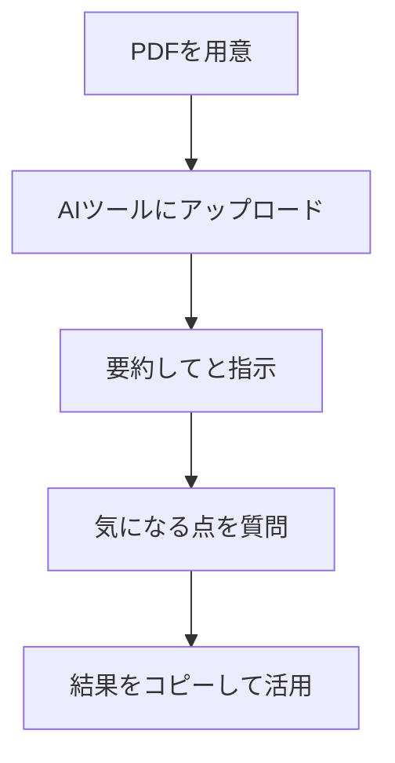

※本記事はアフィリエイト広告(PR)を含みます。

## AIでPDFを要約・分析するとは?この記事でわかること

「分厚いマニュアルや論文、契約書のPDFを全部読む時間がない…」そんな悩みはありませんか。実は今、**AIでPDFを要約・分析する方法**を使えば、数十ページの長文資料でも数分でポイントをつかめるようになりました。

この記事では、PDF要約に対応したおすすめのAIツール5選を、特徴や使い方とあわせて紹介します。読み終わるころには、「どのツールを、どんな場面で使えばいいか」がはっきりわかり、すぐに資料読みの時短を始められます。無料で使えるのか、機密書類をアップロードして大丈夫なのかといった疑問にもお答えするので、ぜひ最後までご覧ください。

## なぜAIでPDFを要約すると時短になるのか

AIによるPDF要約とは、文章の意味をAI(人工知能)が読み取り、要点だけを短くまとめてくれる仕組みのことです。従来の「キーワード検索」と違い、内容を理解したうえで答えてくれるのが大きな特徴です。

メリットを整理すると次のとおりです。

- **全体像を一瞬で把握**:50ページの資料でも「3行まとめ」をすぐ作れる
- **知りたい部分だけ質問できる**:「この契約の解約条件は?」と聞くと該当箇所を抜き出してくれる
- **専門資料の理解を助ける**:難しい用語をかみ砕いて説明してもらえる
- **複数資料の比較も可能**:ツールによっては複数PDFを横断して分析できる

つまり「読む」から「聞く」へと作業が変わり、資料調査の時間を大幅に減らせるのです。

## AIでPDFを要約・分析する基本の流れ

どのツールでも、おおまかな手順は共通しています。まずは全体像をつかんでおきましょう。

操作はとてもシンプルです。ファイルを読み込ませて、「3つの要点にまとめて」「専門用語をわかりやすく説明して」などと指示するだけ。質問の仕方を工夫すると精度が上がるので、[AIプロンプトのコツ](/2026/06/22/ai-prompt-tips/)もあわせて読んでおくと、より思い通りの回答を引き出せます。

## PDF要約におすすめのAIツール5選

ここからは、初心者でも使いやすい5つのツールを紹介します。それぞれ得意分野が違うので、目的に合わせて選んでみてください。

### 1. ChatGPT(有料版で本領発揮)

知名度No.1のAIチャットです。ファイルをアップロードして「要約して」と頼むだけで、自然な日本語のまとめを作ってくれます。要約後にそのまま追加質問できるため、対話しながら資料を深掘りできるのが魅力です。

ファイル添付などの機能は主に有料版で充実しています。無料版との違いが気になる方は、[ChatGPT有料版は必要?無料版との違いと元が取れる使い方](/2026/06/20/chatgpt-paid-vs-free/)をご覧ください。

### 2. Claude(長文に特に強い)

Anthropic社のClaudeは、一度に扱える文章量が多く、長いPDFの要約・分析に定評があります。論文や報告書など、ボリュームの大きい資料を丸ごと読ませたいときに頼りになります。文章の要約が自然で、ニュアンスを汲み取るのも得意です。

ChatGPTやGeminiとの違いを詳しく知りたい方は、[ChatGPTとClaudeとGeminiを徹底比較](/2026/06/09/ai-chat-comparison/)が参考になります。

### 3. Gemini(Googleサービスとの連携が便利)

GoogleのGeminiは、Googleドライブに保存したPDFをそのまま読み込ませやすいのが利点です。普段からGoogleドキュメントやドライブを使っている方なら、ファイルの行き来がスムーズで作業が止まりません。

### 4. Perplexity(出典つきで信頼性を重視)

PerplexityはAI検索エンジンとしても人気で、PDFをアップロードして質問すると、どの箇所をもとに答えたかを示してくれます。「根拠を確認しながら読みたい」というビジネス用途にぴったりです。他のAI検索ツールとの違いは[AI検索エンジンおすすめ徹底比較](/2026/06/23/ai-search-engine-comparison/)で詳しく解説しています。

### 5. Notion AI(資料を整理しながら活用)

メモアプリNotionに搭載されたAI機能で、読み込んだ資料の要約をそのままノートに残せます。「要約して終わり」ではなく、情報を蓄積・整理したい人に向いています。使い方は[Notion AIの使い方完全ガイド](/2026/06/17/notion-ai-guide/)で詳しく紹介しています。

### ツールの比較まとめ

| ツール | 得意なこと | こんな人におすすめ |
|---|---|---|
| ChatGPT | 対話しながら深掘り | まず1つ試したい人 |
| Claude | 長文の正確な要約 | 論文・報告書が多い人 |
| Gemini | Google連携 | ドライブ中心の人 |
| Perplexity | 出典つき回答 | 根拠を重視する人 |
| Notion AI | 整理・蓄積 | 情報をためたい人 |

※料金やファイル容量の上限は変更されることがあります。最新情報は各公式サイトで必ず確認してください。

## 自分に合ったツールの選び方

「結局どれを選べばいいの?」と迷ったら、次の基準で考えてみましょう。

- **とにかく手軽に試したい** → ChatGPT
- **超長文の資料が多い** → Claude
- **Googleサービスを多用している** → Gemini
- **出典・根拠が重要な仕事** → Perplexity
- **読んだ内容を整理して残したい** → Notion AI

まずは無料で触れる範囲から1つ試し、物足りなければ有料プランや別ツールに広げるのがおすすめです。

## よくある質問(Q&A)

### Q. AIのPDF要約は無料で使える?

はい、多くのツールに無料プランがあり、基本的な要約は無料でも試せます。ただし、無料版ではファイルサイズや1日に使える回数に制限があることが多く、大量のPDFや長文を扱うなら有料版が快適です。無料でどこまでできるかは公式サイトで最新の条件を確認しましょう。

### Q. 機密書類をアップロードしても安全?

ここは特に注意が必要です。会社の機密情報や個人情報を含むPDFは、安易にアップロードしないのが基本です。ツールによっては入力データをAIの学習に使わない設定にできる場合があります。利用前にプライバシーポリシーや「学習に使われない設定」の有無を確認し、社内ルールにも従いましょう。

### Q. 要約の内容は信用していい?

AIはときどき事実と違う内容を生成すること(ハルシネーション)があります。重要な判断に使う場合は、要約をうのみにせず、元のPDFの該当箇所を必ず確認しましょう。Perplexityのように出典を示すツールを使うと、確認作業がラクになります。

## 長文資料を快適に読むための環境づくり

AI要約と合わせて、読書・作業環境を整えると効率がさらに上がります。長時間のPDF閲覧には、目に優しい大きめのモニターや、姿勢が安定する椅子があると疲れにくくなります。デスク周りを整えたい方は[在宅ワークが捗るデスク周りガジェット10選](/2026/06/11/home-office-gadgets/)も参考になります。

外出先や移動中にPDFをじっくり読みたいなら、タブレットも便利な選択肢です。

👉 [Amazonで「タブレット 10インチ」を見る](https://af.moshimo.com/af/c/click?a_id=5632371&p_id=170&pc_id=185&pl_id=38594&url=https%3A%2F%2Fwww.amazon.co.jp%2Fs%3Fk%3D%25E3%2582%25BF%25E3%2583%2596%25E3%2583%25AC%25E3%2583%2583%25E3%2583%2588%252010%25E3%2582%25A4%25E3%2583%25B3%25E3%2583%2581)

集中して資料を読み込みたいときは、周囲の音を抑えるノイズキャンセリング機能つきのイヤホンも役立ちます。

👉 [楽天市場で「ワイヤレスイヤホン ノイズキャンセリング」を探す](https://af.moshimo.com/af/c/click?a_id=5632328&p_id=54&pc_id=54&pl_id=616&url=https%3A%2F%2Fsearch.rakuten.co.jp%2Fsearch%2Fmall%2F%25E3%2583%25AF%25E3%2582%25A4%25E3%2583%25A4%25E3%2583%25AC%25E3%2582%25B9%25E3%2582%25A4%25E3%2583%25A4%25E3%2583%259B%25E3%2583%25B3%2520%25E3%2583%258E%25E3%2582%25A4%25E3%2582%25BA%25E3%2582%25AD%25E3%2583%25A3%25E3%2583%25B3%25E3%2582%25BB%25E3%2583%25AA%25E3%2583%25B3%25E3%2582%25B0%2F)

## まとめ

AIでPDFを要約・分析すれば、長文の資料も短時間で要点をつかめるようになります。ポイントを振り返りましょう。

- **基本の流れ**はアップロード→要約指示→質問→活用とシンプル
- **ツールは目的で選ぶ**:手軽さならChatGPT、長文ならClaude、出典重視ならPerplexity
- **無料でも試せる**が、本格利用なら有料版が快適
- **機密情報の扱いと内容の確認**には十分注意する

まずは手持ちのPDFを1つ、気になるツールに読み込ませて「3つの要点にまとめて」と頼んでみてください。資料読みの時間が驚くほど短くなるはずです。料金や機能は変わることがあるので、導入前に各公式サイトで最新情報を確認してから始めましょう。
