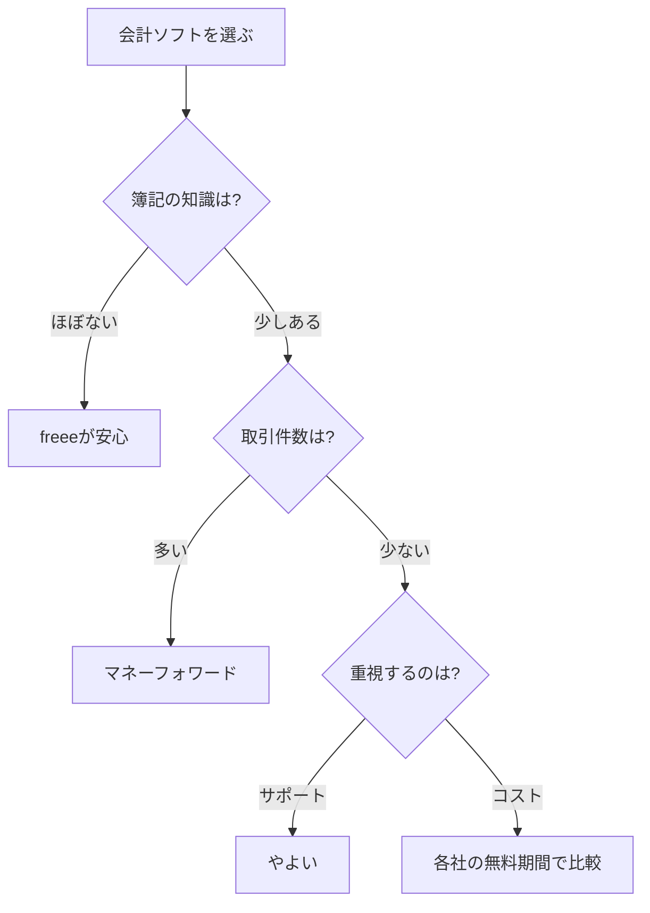

※本記事はアフィリエイト広告(PR)を含みます。

## 確定申告をAIで効率化したい個人事業主へ

毎年やってくる確定申告（1年間の所得や税金を計算して税務署に報告する手続き）に、頭を抱えている個人事業主やフリーランスの方は多いのではないでしょうか。「領収書の山を前にため息が出る」「仕訳のやり方がわからない」「結局、毎年ギリギリになってしまう」——そんな悩みを抱える方にこそ、AIを使った確定申告の効率化がおすすめです。

この記事を読むと、次のことがわかります。

- AIが確定申告のどの作業をラクにしてくれるのか
- 2026年におすすめのAI機能つき会計ソフト3つの比較
- 自分に合った会計ソフトの選び方
- 「会計ソフトは無料で使える?」といったよくある疑問への答え

専門用語にはそのつど簡単な説明を添えていますので、簿記や会計の知識がなくても安心して読み進めてください。

## なぜ確定申告にAIが役立つのか

そもそも確定申告で大変なのは、計算そのものよりも「日々の取引を1件ずつ記録する作業」です。ここにAIが入ると、面倒な部分の多くを自動化できます。

### AIが自動化してくれる主な作業

- **自動仕訳（じどうしわけ）**：銀行口座やクレジットカードの利用明細を読み取り、「これは消耗品費」「これは交通費」とAIが勘定科目（けいさんかもく＝費用の分類）を自動で振り分けてくれます。
- **レシート・領収書の読み取り**：スマホで撮影するだけで、日付・金額・店名をAIが文字データに変換します（OCRという技術です）。
- **入力ミスのチェック**：金額の桁違いや分類のミスをAIが指摘してくれます。
- **チャットでの質問対応**：「この経費は計上できる?」といった疑問に、AIチャットが答えてくれるソフトも増えています。

手作業で何時間もかかっていた入力が、AIによって数分〜数十分に短縮できるイメージです。日々の支出管理から見直したい方は、[家計簿アプリ×AIで節約\|自動で支出を見える化する方法](/2026/06/15/ai-household-budget-app/)も参考になりますよ。

## おすすめのAI会計ソフト比較2026

ここでは、個人事業主に人気の3大クラウド会計ソフトを比較します。いずれもAIによる自動仕訳機能を備えています。

| ソフト名 | 特徴 | こんな人におすすめ |
|---|---|---|
| freee（フリー） | 簿記の知識がなくても質問に答える形式で申告書が作れる | 会計がまったくの初心者 |
| マネーフォワード クラウド確定申告 | 銀行・カード連携が豊富で自動仕訳の精度が高い | 取引件数が多い人 |
| やよいの青色申告 オンライン | 老舗で操作がシンプル、サポートが手厚い | コストを抑えたい人 |

※料金プランや無料期間は改定されることがあります。最新の正確な情報は、必ず各公式サイトでご確認ください。

### freee（フリー）

簿記の専門用語をできるだけ使わず、「〇〇しましたか?」という質問に答えていくだけで申告書が完成するのが最大の強みです。会計の知識がゼロでも進めやすく、初めて確定申告をする方に向いています。

### マネーフォワード クラウド確定申告

銀行口座やクレジットカード、電子マネーとの連携先が非常に多く、明細を自動で取り込んでAIが仕訳します。取引数が多い方や、複数の収入源がある方に特に便利です。

### やよいの青色申告 オンライン

会計ソフトの老舗ブランドで、画面がシンプルでわかりやすいのが特徴。電話やチャットのサポートが充実しており、「困ったときに人に相談したい」という方に安心感があります。

## 自分に合った会計ソフトの選び方

どれを選べばいいか迷ったら、次のフローチャートを目安にしてみてください。

### 選ぶときのチェックポイント

- **連携できる金融機関**：自分が使っている銀行・カードに対応しているか
- **AI仕訳の精度**：実際に使ってみて、分類のやり直しが少ないか
- **スマホアプリの使いやすさ**：レシート撮影や外出先での入力に対応しているか
- **料金と無料お試し期間**：本契約前に操作感を確かめられるか

どのソフトも無料お試し期間を用意しているので、まずは2つほど試して、自分が「これなら続けられそう」と感じたものを選ぶのが失敗しないコツです。

## ChatGPTなどの汎用AIも組み合わせると便利

会計ソフトの自動仕訳に加えて、ChatGPTやClaudeのような汎用AIチャットを併用すると、確定申告の理解がさらに深まります。

- 「フリーランスが計上できる経費の種類を教えて」と質問して全体像をつかむ
- 「青色申告と白色申告の違いを初心者向けに説明して」と聞いて制度を理解する
- 申告に関する用語をその場で調べる

ただし、AIの回答は古い情報や誤りを含むこともあります。**最終的な税務判断は、必ず公式情報や税理士などの専門家に確認してください。** AIチャットの選び方は[ChatGPTとClaudeとGeminiを徹底比較!初心者におすすめのAIチャットはどれ?](/2026/06/09/ai-chat-comparison/)で詳しく解説しています。

また、ひとりで事業を回す仕組みづくりに興味がある方は、[AI時代の「一人会社」入門\|ひとりでも回る仕組みとAI活用術](/2026/06/14/ai-solo-company/)もあわせてどうぞ。

## レシート整理を効率化するガジェットも活用しよう

会計ソフトのスマホ撮影機能でも十分ですが、領収書や請求書が大量にある方は、専用のスキャナーがあると一気に取り込めて便利です。AIによる文字認識と組み合わせれば、紙の山を短時間でデータ化できます。

👉 [Amazonで「ドキュメントスキャナー 自動給紙」を見る](https://af.moshimo.com/af/c/click?a_id=5632371&p_id=170&pc_id=185&pl_id=38594&url=https%3A%2F%2Fwww.amazon.co.jp%2Fs%3Fk%3D%25E3%2583%2589%25E3%2582%25AD%25E3%2583%25A5%25E3%2583%25A1%25E3%2583%25B3%25E3%2583%2588%25E3%2582%25B9%25E3%2582%25AD%25E3%2583%25A3%25E3%2583%258A%25E3%2583%25BC%2520%25E8%2587%25AA%25E5%258B%2595%25E7%25B5%25A6%25E7%25B4%2599)

スキャンした書類の整理術については、[AIで名刺・書類を整理する方法\|おすすめスキャナーとアプリ活用術](/2026/06/17/ai-business-card-scanner/)でくわしく紹介しています。

## よくある質問（Q&A）

### Q. 会計ソフトは無料で使える?

A. 多くのクラウド会計ソフトには**一定期間の無料お試し**があります。ただし、確定申告書の作成・出力まで含めて使い続けるには、年額または月額のプランへの加入が必要になるのが一般的です。無料プランで使える範囲はソフトによって異なるため、公式サイトで最新の条件を確認しましょう。

### Q. AIの自動仕訳は信用していい?

A. AIの仕訳精度は年々向上していますが、100%正確ではありません。特に判断が難しい経費は、誤って分類されることもあります。**AIの結果をそのまま鵜呑みにせず、自分でも確認する**習慣をつけると安心です。

### Q. 簿記の知識がまったくなくても大丈夫?

A. freeeのように質問形式で進められるソフトを使えば、知識ゼロからでも申告書を作成できます。それでも基本的な用語（経費・勘定科目など）を少し知っておくと、ミスに気づきやすくなります。

## まとめ

確定申告は「面倒で時間がかかるもの」というイメージがありますが、AI機能つきの会計ソフトを使えば、入力作業の大半を自動化できます。

- **AIは自動仕訳・レシート読み取り・ミスチェックを得意とする**
- **初心者はfreee、取引が多い人はマネーフォワード、サポート重視はやよいが目安**
- **まずは無料お試し期間で操作感を比べてみる**
- **ChatGPTなどの汎用AIは制度理解の補助に便利だが、最終判断は専門家へ**

確定申告の時期に慌てないためには、年明けからではなく、日々の取引を少しずつ記録していくのが一番のコツです。まずは気になる会計ソフトの無料お試しに登録して、自動仕訳の便利さを体験してみてください。今年こそ、確定申告のストレスから解放されましょう。
