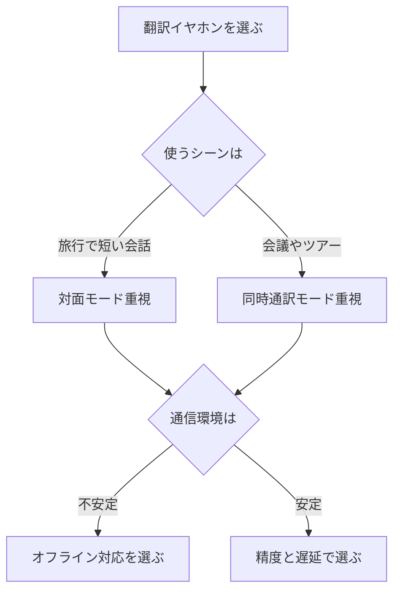

※本記事はアフィリエイト広告(PR)を含みます。

## AI翻訳イヤホンとは?この記事でわかること

海外旅行や外国人との会話で「言葉の壁」を感じたことはありませんか?そんな悩みを解決してくれるのが、**AI翻訳イヤホン**です。耳に着けたまま相手の言葉をほぼリアルタイムで翻訳してくれるため、スマホ画面を見せ合うよりもずっと自然に会話ができます。

この記事では、AI翻訳イヤホンの仕組みや選び方のポイント、2026年に注目したいおすすめモデルのタイプを比較しながら紹介します。読み終えるころには、「自分の使い方にはどんなモデルが合うのか」がはっきりわかるようになります。海外旅行を控えている方や、仕事で外国語のやり取りが増えてきた方は、ぜひ参考にしてください。

## AI翻訳イヤホンの仕組みをやさしく解説

AI翻訳イヤホンは、おもに次の流れで翻訳を行います。

1. イヤホンのマイクが相手の声を拾う
2. 音声をスマホアプリやクラウド(インターネット上のサーバー)に送る
3. **AI(人工知能)**が音声を文字に変換し、翻訳する
4. 翻訳された言葉を音声や文字で返す

つまり、イヤホン単体ではなく「イヤホン+アプリ+AI」がセットで動くのが基本です。最近は処理速度が上がり、話してから翻訳が返ってくるまでの**遅延(タイムラグ)**がかなり短くなってきました。

翻訳エンジンそのものの精度を知りたい方は、[AI翻訳ツール比較\|DeepL・Google翻訳・ChatGPTどれが正確?](/2026/06/11/ai-translation-comparison/)もあわせて読むと、どのAIがどんな言語に強いかが見えてきます。

## 失敗しない選び方の5つのポイント

### 1. 翻訳モード(会話の方式)

AI翻訳イヤホンには、主に次の3つのモードがあります。

- **対面モード**:片方のイヤホンを相手に渡し、お互いの言葉を翻訳
- **同時通訳モード**:相手の言葉を聞きながら、ほぼ同時に翻訳音声が流れる
- **タッチモード**:ボタンを押している間だけ録音して翻訳

旅行で店員さんと話すなら対面モード、会議やツアーガイドの説明を聞くなら同時通訳モードが便利です。

### 2. 対応言語数

メジャーな英語・中国語・韓国語はほぼ全モデル対応していますが、マイナー言語まで含めると差が出ます。旅行先で使う言語が含まれているか、必ず確認しましょう。

### 3. オフラインで使えるか

多くのモデルはインターネット接続が必要です。海外で通信環境が不安定だと翻訳できないこともあるため、**オフライン翻訳**に対応しているかは重要なポイントです。

### 4. 遅延(タイムラグ)と精度

会話のテンポを左右するのが遅延です。レビューや公式サイトで「リアルタイム翻訳」をうたっていても体感差があるため、できれば実機レビューを参考にしましょう。

### 5. バッテリーと装着感

長時間の旅行や会議では、連続使用時間と充電ケースの容量が効いてきます。耳に合わないと長時間の装着がつらいので、フィット感もチェックしたいところです。

## タイプ別の比較とおすすめの選び方

AI翻訳イヤホンは、大きく3つのタイプに分けられます。

| タイプ | 特徴 | 向いている人 |
| --- | --- | --- |
| 専用翻訳イヤホン型 | 翻訳に特化し対応言語が豊富 | 海外旅行が多い人 |
| 高機能ワイヤレスイヤホン型 | 音楽も楽しめて翻訳アプリ連携 | 日常使いも兼ねたい人 |
| スマホアプリ連携型 | 手持ちのイヤホン+無料アプリ | まず気軽に試したい人 |

### 専用翻訳イヤホン型

翻訳に特化したモデルは、対応言語数が多く、オフライン翻訳や双方向通訳に強いのが魅力です。旅行や商談で本格的に使うならこのタイプが安心です。

👉 [Amazonで「AI翻訳イヤホン」を見る](https://af.moshimo.com/af/c/click?a_id=5632371&p_id=170&pc_id=185&pl_id=38594&url=https%3A%2F%2Fwww.amazon.co.jp%2Fs%3Fk%3DAI%25E7%25BF%25BB%25E8%25A8%25B3%25E3%2582%25A4%25E3%2583%25A4%25E3%2583%259B%25E3%2583%25B3)

### 高機能ワイヤレスイヤホン型

普段は音楽用として使い、必要なときだけ翻訳アプリと連携するタイプです。1台で何役もこなせるため、荷物を増やしたくない人に向いています。イヤホン選びの基本的な考え方は、[テレワーク向けワイヤレスイヤホンの選び方\|失敗しないおすすめモデルの選定ポイント](/2026/06/13/wireless-earphones-telework/)も参考になります。

👉 [楽天市場で「ワイヤレスイヤホン 翻訳機能」を探す](https://af.moshimo.com/af/c/click?a_id=5632328&p_id=54&pc_id=54&pl_id=616&url=https%3A%2F%2Fsearch.rakuten.co.jp%2Fsearch%2Fmall%2F%25E3%2583%25AF%25E3%2582%25A4%25E3%2583%25A4%25E3%2583%25AC%25E3%2582%25B9%25E3%2582%25A4%25E3%2583%25A4%25E3%2583%259B%25E3%2583%25B3%2520%25E7%25BF%25BB%25E8%25A8%25B3%25E6%25A9%259F%25E8%2583%25BD%2F)

### スマホアプリ連携型

手持ちのイヤホンと無料の翻訳アプリを組み合わせる方法です。コストをかけずに翻訳イヤホンの便利さを体験できるので、「まず試してみたい」という方におすすめです。

## よくある質問(Q&A)

### Q. AI翻訳イヤホンは無料で使える?

イヤホン本体は有料ですが、翻訳機能の一部は無料アプリでまかなえます。たとえばGoogle翻訳アプリと手持ちのイヤホンを組み合わせれば、最低限の翻訳は無料で体験可能です。ただし、専用イヤホンの方が対応言語やオフライン機能で優れているケースが多いです。

### Q. ネットがないと使えないの?

モデルによります。クラウド翻訳が中心のものはネット接続が必須ですが、オフライン翻訳に対応した機種なら通信なしでも一部言語を翻訳できます。海外で使うなら、現地SIMやモバイルWi-Fiの準備もあわせて検討しましょう。

### Q. 翻訳の精度はどのくらい?

日常会話レベルなら十分実用的ですが、専門用語やスラング、早口には弱いことがあります。重要な商談などでは、要点をシンプルな文で話すと精度が上がります。

### Q. 英会話の練習にも使える?

翻訳イヤホンは「会話の橋渡し」が目的なので、語学学習には専用アプリの方が効果的です。独学で話せるようになりたい方は、[AI英会話アプリおすすめ5選\|独学で話せるようになる使い方](/2026/06/14/ai-english-apps/)を読んでみてください。

## 価格と最新情報の確認について

AI翻訳イヤホンは新モデルの登場が早く、価格やセール状況も頻繁に変わります。本記事では特定の価格を断定しませんので、購入前に**必ず公式サイトや販売ページで最新情報を確認してください**。対応言語やオフライン機能は、ファームウェア更新で増えることもあります。

## まとめ

AI翻訳イヤホンは、海外旅行や外国人との会話をぐっと身近にしてくれる便利なガジェットです。選ぶときは次のポイントを意識しましょう。

- **使うシーン**(旅行か会議か)で翻訳モードを選ぶ
- **対応言語数**と**オフライン対応**を確認する
- **遅延・精度・バッテリー・装着感**もチェックする
- まずは無料アプリ連携で気軽に試すのもアリ

本格的に使うなら専用翻訳イヤホン型、日常使いも兼ねるなら高機能ワイヤレスイヤホン型がおすすめです。自分の使い方に合った1台を見つけて、言葉の壁のない快適なコミュニケーションを楽しんでください。
