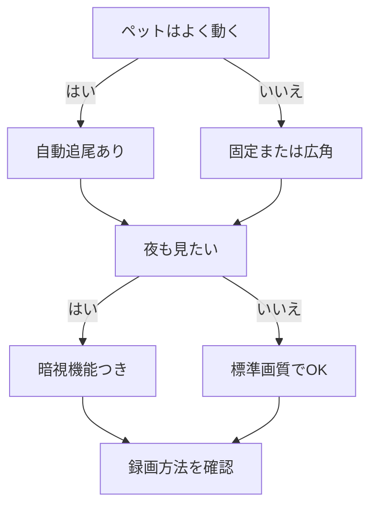

※本記事はアフィリエイト広告(PR)を含みます。

## AI搭載ペットカメラとは?留守中の見守りがもっと安心に

「仕事や外出中、家に残してきたペットが心配……」そんな悩みを解決してくれるのが、AI搭載ペットカメラです。この記事では、AI搭載ペットカメラの選び方を初心者にもわかりやすく解説し、留守中の見守りや自動追尾といった機能でどう選べばよいかを比較しながら紹介します。読み終わるころには、自分の住まいやペットに合った1台を選ぶ基準がわかるようになります。

AI搭載ペットカメラとは、カメラに映った映像をAI(人工知能=人間のように判断する仕組み)が解析し、ペットの動きを自動で追いかけたり、異常を検知して通知してくれるカメラのことです。従来のただ映すだけのカメラと違い、「賢く見守ってくれる」点が大きな魅力です。

## AI搭載ペットカメラでできること

まずは、AIが付くことでどんなことができるのかを整理しましょう。

- **自動追尾(オートトラッキング)**:ペットが動いてもカメラが自動で向きを変えて追いかけます。フレームから外れて見失う心配が減ります。
- **動体・異常検知**:動きを検知してスマホに通知。鳴き声を検知するモデルもあります。
- **双方向通話**:スマホからマイクで話しかけられ、ペットの声も聞けます。
- **自動録画・クラウド保存**:留守中の様子を記録し、後から見返せます。
- **おやつ自動給餌**:カメラと給餌機が一体になったタイプもあります。

こうした機能の組み合わせは商品によって大きく異なります。自分が「何を一番解決したいか」をはっきりさせておくと選びやすくなります。

## 選び方の6つのポイント

### 1. 自動追尾の有無

活発に動き回る犬や猫には、自動追尾機能がほぼ必須です。部屋の中を歩き回っても自動で追いかけてくれるので、画面の外に消えてしまうストレスがありません。一方、ケージ内やベッドであまり動かないペットなら、追尾なしの固定カメラでも十分なこともあります。

### 2. 画質と暗視性能

画質はフルHD(高精細な映像)以上がおすすめです。また、夜間や暗い部屋でもしっかり見える「暗視(ナイトビジョン)」機能があると、夜の留守番でも安心です。

### 3. 画角(視野の広さ)

レンズが映せる範囲を画角と呼びます。広角タイプや、左右・上下に首振りできるタイプなら、1台で部屋全体をカバーしやすくなります。

### 4. 通知・検知の賢さ

AIの精度が高いほど、誤検知(無関係な動きでの通知)が減ります。ペットと人を区別したり、特定エリアだけを監視したりできるモデルもあります。

### 5. 録画方法

録画データの保存先は、本体に挿す**microSDカード**と、インターネット上に保存する**クラウド**の2種類が主流です。クラウドは月額料金がかかることが多いので、コスト面も確認しましょう。

### 6. スマホアプリの使いやすさ

毎日使うものなので、アプリの操作性は重要です。設定が簡単か、通知が見やすいかなど、レビューもチェックすると失敗しにくくなります。

## 選び方フローチャート

迷ったときは、次の流れで考えると整理しやすいです。

## タイプ別おすすめの選び方

### 活発な犬・猫を飼っている人

自動追尾+広い画角+双方向通話が揃ったモデルがおすすめです。動き回っても見失わず、声かけもできるので留守番の不安が大きく減ります。

### 留守がちで記録を残したい人

動体検知と録画機能を重視しましょう。クラウド保存があると、本体が盗難・故障してもデータが残ります。月額料金は公式サイトで最新情報を確認してください。

### コスト重視で始めたい人

まずはmicroSD録画対応のシンプルな首振りカメラから試すのも手です。具体的な商品は下記から探せます。

👉 [Amazonで「AI ペットカメラ 自動追尾」を見る](https://af.moshimo.com/af/c/click?a_id=5632371&p_id=170&pc_id=185&pl_id=38594&url=https%3A%2F%2Fwww.amazon.co.jp%2Fs%3Fk%3DAI%2520%25E3%2583%259A%25E3%2583%2583%25E3%2583%2588%25E3%2582%25AB%25E3%2583%25A1%25E3%2583%25A9%2520%25E8%2587%25AA%25E5%258B%2595%25E8%25BF%25BD%25E5%25B0%25BE)

👉 [楽天市場で「ペットカメラ 見守り 首振り」を探す](https://af.moshimo.com/af/c/click?a_id=5632328&p_id=54&pc_id=54&pl_id=616&url=https%3A%2F%2Fsearch.rakuten.co.jp%2Fsearch%2Fmall%2F%25E3%2583%259A%25E3%2583%2583%25E3%2583%2588%25E3%2582%25AB%25E3%2583%25A1%25E3%2583%25A9%2520%25E8%25A6%258B%25E5%25AE%2588%25E3%2582%258A%2520%25E9%25A6%2596%25E6%258C%25AF%25E3%2582%258A%2F)

## よくある質問(Q&A)

### Q. AIペットカメラは月額料金が必要?

本体だけで使える機能(ライブ映像・双方向通話・SDカード録画など)は、多くの場合**追加料金なし**で利用できます。ただし、クラウド録画やAIによる高度な検知は有料プランになることが多いです。料金体系はメーカーごとに違うため、購入前に公式サイトで最新情報を確認してください。

### Q. Wi-Fiがないと使えない?

ほとんどのモデルは家庭のWi-Fi(無線インターネット)につないで使います。スマホで外出先から見るには、自宅と外出先の両方でインターネット接続が必要です。

### Q. スマートスピーカーと連携できる?

対応モデルなら、音声で映像をテレビに表示するなどの連携が可能です。スマートスピーカー選びについては[スマートスピーカーはどれを買うべき?Alexa・Google Home徹底比較](/2026/06/12/smart-speaker-comparison/)も参考になります。

## スマートホーム化でもっと快適に

ペットカメラは、ほかのスマート家電と組み合わせると留守中の環境づくりがさらに快適になります。たとえば、留守中の床掃除を任せられる[ロボット掃除機の選び方2026\|AI搭載モデルを価格・機能で徹底比較](/2026/06/16/robot-vacuum-guide-2026/)や、外出先から部屋の明かりを操作できる[AI搭載スマート電球の選び方｜音声操作で快適な部屋を作る方法](/2026/06/23/smart-bulb-guide/)を合わせて取り入れると、ペットも飼い主も快適に過ごせる環境が整います。

## まとめ

AI搭載ペットカメラは、「映すだけ」から「賢く見守る」へと進化したガジェットです。選ぶときは、次のポイントを押さえましょう。

- 動き回るペットには**自動追尾**が便利
- 夜の見守りには**暗視機能**を確認
- 記録重視なら**録画方法とクラウド料金**をチェック
- 毎日使うので**アプリの使いやすさ**も重要

まずは「自分が一番解決したい不安は何か」を明確にして、それに合った機能のモデルを選ぶのが失敗しないコツです。気になる商品が見つかったら、価格や月額料金などの最新情報を必ず公式サイトで確認したうえで、大切なペットとの安心な毎日を手に入れてください。
