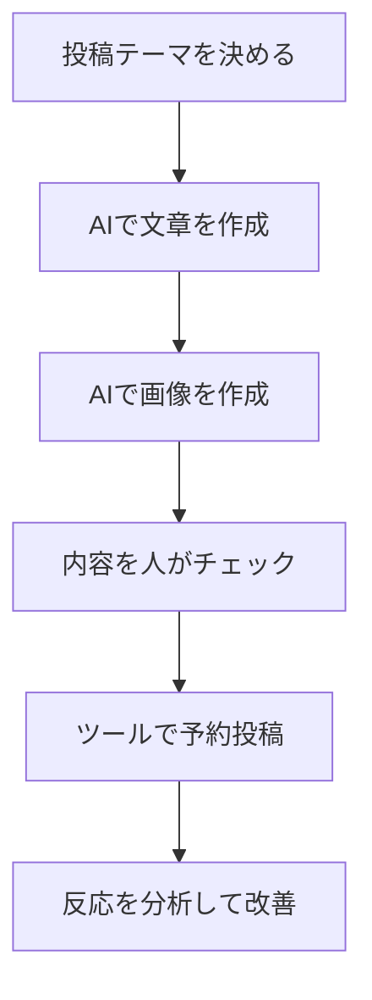

※本記事はアフィリエイト広告(PR)を含みます。

## AIでSNS投稿を自動化するとは?この記事でわかること

「SNSの投稿を毎日続けるのが大変」「ネタが思いつかず更新が止まってしまう」——そんな悩みを抱えていませんか?この記事では、**AIでSNS投稿を自動化する方法**と、X(旧Twitter)やInstagramの運用におすすめのツールを初心者向けに比較して解説します。

この記事を読むと、次のことがわかります。

- SNS投稿の自動化で「どこまで」自動にできるのか
- 投稿作成から予約投稿までの具体的な流れ
- X・Instagram運用におすすめのツールと選び方
- 無料で始められるのか、という疑問への答え

手作業に追われている方ほど効果を実感しやすい内容です。さっそく見ていきましょう。

## SNS投稿の「自動化」でできること

ひとくちに自動化といっても、その範囲はいくつかに分かれます。まずは全体像を整理しましょう。

| 工程 | 自動化の内容 | AIの得意度 |
|------|------------|----------|
| ネタ出し | 投稿テーマやアイデアの提案 | ◎ |
| 文章作成 | 投稿本文・ハッシュタグの生成 | ◎ |
| 画像作成 | 投稿用の画像・バナー生成 | ○ |
| 予約投稿 | 決めた日時に自動で投稿 | ◎ |
| 分析・改善 | 反応の良い投稿の分析 | ○ |

ここで大切なのは、「すべてを丸投げ」しないことです。AIはたたき台を作るのが得意ですが、最終的なチェックや、自分らしさを足す作業は人が担当したほうが、フォロワーに伝わる投稿になります。

### 自動化の基本の流れ

投稿自動化のステップは、大きく次のように進みます。

この流れのうち、文章作成・画像作成・予約投稿の3つをAIやツールに任せるだけで、作業時間は大きく減らせます。

## ステップ1:AIで投稿文を作る

まずは投稿の核となる文章作りです。ここはChatGPTやClaude、Geminiなどの**生成AI(文章や画像を自動で作るAI)**が活躍します。

たとえばXの投稿なら、次のように指示するだけでたたき台が完成します。

> 「在宅ワーク向けの便利グッズを紹介する140字以内のX投稿を、親しみやすい口調で3パターン作って。ハッシュタグも付けて」

複数パターンを出してもらい、一番しっくりくるものを選んで微調整するのが効率的です。どのAIを使うか迷う方は、[ChatGPTとClaudeとGeminiを徹底比較!初心者におすすめのAIチャットはどれ?](/2026/06/09/ai-chat-comparison/)も参考にしてください。

なお、思い通りの投稿文を引き出すには指示文の工夫がカギになります。[AIプロンプトのコツ\|思い通りの回答を引き出す書き方を初心者向けに解説](/2026/06/22/ai-prompt-tips/)もあわせて読むと、生成の精度がぐっと上がります。

## ステップ2:投稿用の画像をAIで作る

Instagramのように画像が主役のSNSでは、ビジュアルの質が反応を左右します。最近は無料で使える画像生成AIも増えており、テキストで指示するだけで投稿用のバナーやイラストが作れます。

商用利用の可否などの注意点も含め、[無料で使える画像生成AIおすすめ5選\|商用利用の注意点も解説](/2026/06/11/free-image-ai-tools/)で詳しくまとめています。投稿のトンマナ(雰囲気)を統一すると、アカウント全体の印象がぐっと良くなりますよ。

## ステップ3:予約投稿ツールで自動化する

文章と画像ができたら、あとは投稿を「いつ出すか」を仕込むだけです。ここで使うのがSNS予約投稿ツール(スケジューラー)です。決めた日時に自動で投稿してくれるので、毎回手動で投稿する必要がなくなります。

### X・Instagram運用におすすめのツール比較

代表的なツールの特徴を整理しました。

| ツール | 主な対応SNS | 特徴 |
|--------|-----------|------|
| Buffer | X・Instagram・他多数 | シンプルで初心者向け。無料プランあり |
| Hootsuite | X・Instagram・他多数 | 分析機能が充実。チーム運用向き |
| SocialDog | X中心 | 日本語対応が手厚く国内人気 |
| Later | Instagram中心 | ビジュアル管理が得意 |

まず1つ試すなら、操作がシンプルなBufferや、日本語サポートが手厚いSocialDogがおすすめです。料金プランは改定されることがあるため、**最新の価格や機能は必ず公式サイトで確認してください**。

## AIツールと予約投稿を組み合わせると最強

さらに一歩進めるなら、ChatGPTの予約タスク機能などを使い、「毎週決まった曜日に投稿案を作る」といった仕組み化も可能です。詳しくは[ChatGPT予約タスクが刷新\|自動でリマインド＆ウォッチできる新機能を解説](/2026/06/22/chatgpt-scheduled-tasks/)をご覧ください。

投稿の振り返りや作業をスマートに進めたい方は、作業環境を整えるのも効果的です。集中して作業するためのアイテムは、こちらから探せます。

👉 [Amazonで「ワイヤレスイヤホン ノイズキャンセリング」を見る](https://af.moshimo.com/af/c/click?a_id=5632371&p_id=170&pc_id=185&pl_id=38594&url=https%3A%2F%2Fwww.amazon.co.jp%2Fs%3Fk%3D%25E3%2583%25AF%25E3%2582%25A4%25E3%2583%25A4%25E3%2583%25AC%25E3%2582%25B9%25E3%2582%25A4%25E3%2583%25A4%25E3%2583%259B%25E3%2583%25B3%2520%25E3%2583%258E%25E3%2582%25A4%25E3%2582%25BA%25E3%2582%25AD%25E3%2583%25A3%25E3%2583%25B3%25E3%2582%25BB%25E3%2583%25AA%25E3%2583%25B3%25E3%2582%25B0)

## よくある質問:SNS自動化ツールは無料で使える?

「自動化ツールはお金がかかるのでは?」と心配な方も多いですよね。結論からいうと、**多くのツールに無料プランがあります**。

- **Buffer**:無料プランで複数アカウント・一定数の予約投稿が可能
- **SocialDog**:無料から始められ、有料で機能拡張
- **生成AI(ChatGPTなど)**:無料版でも投稿文の作成は十分可能

まずは無料の範囲で試し、「もっと予約数を増やしたい」「分析を強化したい」と感じたら有料へ移行するのが失敗しない進め方です。無料・有料の違いが気になる方は、[ChatGPT有料版は必要?無料版との違いと元が取れる使い方を解説](/2026/06/20/chatgpt-paid-vs-free/)も参考になります。

## 自動化するときの注意点

便利な自動化ですが、いくつか気をつけたいポイントがあります。

1. **投稿前に必ず人がチェックする** … AIの文章には事実誤認や不自然な表現が混じることがあります。
2. **完全放置にしない** … コメントへの返信など、人とのやりとりはアカウントの信頼につながります。
3. **各SNSの規約を守る** … 過度な自動化はアカウント制限の対象になる場合があります。公式の利用規約を確認しましょう。
4. **トンマナを統一する** … AI任せにすると投稿のばらつきが出やすいので、方向性を決めておきます。

自動化はあくまで「手間を減らして、人にしかできない部分に集中するため」の手段だと考えると、うまく付き合えます。

## まとめ

今回は、AIでSNS投稿を自動化する方法と、X・Instagram運用におすすめのツールを紹介しました。最後にポイントを振り返ります。

- 自動化は「文章作成」「画像作成」「予約投稿」の3つから始めると効果的
- 投稿文はChatGPTなどの生成AIで、画像は画像生成AIで時短できる
- 予約投稿はBuffer・SocialDog・Laterなどが初心者におすすめ
- 多くのツールに無料プランがあり、気軽に試せる
- 投稿前のチェックと規約遵守は必ず人が担当する

まずは生成AIで投稿文を作り、無料の予約投稿ツールに1週間分セットしてみるだけでも、運用がぐっとラクになります。今日からできる小さな自動化から、ぜひ始めてみてください。最新の料金や機能は各公式サイトで確認することをおすすめします。
