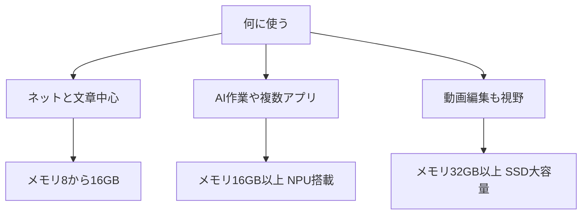

※本記事はアフィリエイト広告(PR)を含みます。

## ミニPCの選び方を知りたい人へ:この記事でわかること

「デスクをすっきりさせたい」「AI作業も快適にこなせる小さなパソコンが欲しい」——そんな方に向けて、この記事ではミニPCの選び方を2026年の最新事情をふまえてわかりやすく解説します。

ミニPC(手のひらサイズの小型デスクトップパソコン)は、ここ数年で性能が大きく向上し、文章作成やネット会議だけでなく、生成AIの利用や軽い動画編集までこなせるモデルが増えてきました。この記事を読むと、次のことがわかります。

- ミニPCがどんな人に向いているのか
- 失敗しないための選び方のポイント
- AI作業・省スペースを重視した用途別のおすすめ構成
- 「ミニPCでAIは動くの?」といった疑問への答え

それでは順番に見ていきましょう。

## そもそもミニPCとは?

ミニPCとは、文字どおり本体サイズが非常に小さいデスクトップパソコンのことです。手のひらや文庫本くらいのサイズの製品が多く、モニターの裏に取り付けたり、引き出しに収めたりできます。

一般的なタワー型パソコンと比べると、次のような違いがあります。

| 項目 | ミニPC | タワー型PC |
|---|---|---|
| サイズ | 非常に小さい | 大きい |
| 消費電力 | 少なめ | 多め |
| 静音性 | 静か | ファン音が大きいことも |
| 拡張性 | 低め | 高い |
| 価格帯 | 手頃〜中程度 | 幅広い |

ノートパソコンと迷う方も多いですが、画面やキーボードを自由に選べるのがミニPCの魅力です。ノート派の方は[AIノートパソコンの選び方2026\|快適に使うための7つのポイント](/2026/06/11/ai-laptop-guide-2026/)もあわせて読むと比較しやすくなります。

## ミニPCはこんな人におすすめ

ミニPCは、次のような方にぴったりです。

- **デスクを広く使いたい人**:本体が小さいので作業スペースが確保できます
- **静かな環境で作業したい人**:発熱・騒音が少ないモデルが多い
- **電気代を抑えたい人**:消費電力が小さく、つけっぱなしでも安心
- **AIチャットや文章作成が中心の人**:この用途なら十分快適に動きます

逆に、本格的な3Dゲームや重い動画レンダリングを毎日するなら、拡張性の高いタワー型のほうが向いています。

## ミニPCの選び方:5つのチェックポイント

### 1. CPU(頭脳)の性能を見る

CPUはパソコンの処理速度を決める最も重要な部品です。2026年時点では、Intel Core UltraシリーズやAMD Ryzen搭載モデルが主流です。

- **ネット・文章中心**:エントリー〜ミドルクラスで十分
- **AI作業・複数アプリ同時利用**:ミドル〜ハイクラスを選ぶと快適

最近は「NPU(AI処理専用の回路)」を搭載したCPUも増えており、画像生成やAI機能をローカル(自分のPC上)で動かしたい人は注目したいポイントです。

### 2. メモリ(同時作業のしやすさ)

メモリは複数の作業を同時にこなす力に直結します。目安は次のとおりです。

- **8GB**:最低限。軽い用途向け
- **16GB**:多くの人におすすめのバランス
- **32GB以上**:AI作業や動画編集も視野に入れる人向け

AIを快適に使いたいなら、16GB以上を選んでおくと安心です。

### 3. ストレージ(保存容量と速度)

保存用のストレージは、高速なSSDが標準になっています。容量は512GB前後あれば普段使いには十分ですが、データや動画を多く扱うなら1TB以上を検討しましょう。

### 4. 端子(ポート)の種類と数

モニター・キーボード・外付け機器をつなぐため、端子の種類は意外と重要です。

- HDMIやDisplayPort:モニター接続用
- USB Type-C / Type-A:周辺機器用
- 有線LANポート:安定した通信に便利

複数モニターを使いたい人は、映像出力端子が2つ以上あるかを確認しましょう。

### 5. 静音性と冷却

小型ゆえに熱がこもりやすいのがミニPCの弱点です。長時間のAI作業をするなら、口コミで冷却性能や静音性が高評価のモデルを選ぶと失敗しにくくなります。

## 用途別フローチャートで選ぶ

自分に合った構成は、用途から逆算すると見えてきます。下の図を参考にしてください。

## 用途別おすすめ構成の目安

### ライトユーザー向け(ネット・事務作業)

コストを抑えたい方は、ミドルクラスCPU+メモリ16GB+SSD512GBあたりが狙い目です。AIチャットを使う程度なら十分快適に動きます。

👉 [Amazonで「ミニPC 16GB SSD」を見る](https://af.moshimo.com/af/c/click?a_id=5632371&p_id=170&pc_id=185&pl_id=38594&url=https%3A%2F%2Fwww.amazon.co.jp%2Fs%3Fk%3D%25E3%2583%259F%25E3%2583%258BPC%252016GB%2520SSD)

### AI作業・在宅ワーク向け

生成AIをよく使う方や、複数のアプリを同時に開く方は、メモリ16〜32GB・NPU搭載クラスを選ぶと安心です。ネット会議も増えるなら、[Webカメラ・マイクのおすすめ｜オンライン会議の印象を良くする機材選び](/2026/06/15/webcam-mic-online-meeting/)もチェックしておくと環境が整います。

### クリエイター向け(動画・画像)

動画編集や画像生成もこなしたい方は、ハイクラスCPU+メモリ32GB以上+大容量SSDが理想です。発熱対策のしっかりした製品を選びましょう。

👉 [楽天市場で「ミニPC ゲーミング 32GB」を探す](https://af.moshimo.com/af/c/click?a_id=5632328&p_id=54&pc_id=54&pl_id=616&url=https%3A%2F%2Fsearch.rakuten.co.jp%2Fsearch%2Fmall%2F%25E3%2583%259F%25E3%2583%258BPC%2520%25E3%2582%25B2%25E3%2583%25BC%25E3%2583%259F%25E3%2583%25B3%25E3%2582%25B0%252032GB%2F)

省スペースなデスク環境をさらに整えたい方は、[在宅ワークが捗るデスク周りガジェット10選\|快適環境の作り方](/2026/06/11/home-office-gadgets/)も参考になります。

## よくある疑問(Q&A)

### Q. ミニPCで生成AIは動くの?

クラウド型のAI(ChatGPTやClaudeなどブラウザで使うサービス)であれば、ネットにつながる普通のミニPCで問題なく使えます。AI処理はサーバー側で行われるためです。

一方、画像生成AIなどを「自分のPC上で動かす」場合は、メモリやNPU・GPU性能が重要になります。まずはクラウド型から始めるのがおすすめです。

### Q. ミニPCはモニターやキーボードも別途必要?

はい、基本的に本体のみの販売が多いため、モニター・キーボード・マウスは別に用意します。すでに持っている方はそのまま流用できるので、買い替えコストを抑えられます。

### Q. AIを無料で試すこともできる?

できます。多くのAIチャットには無料プランがあります。どのサービスが自分に合うか迷う方は、[ChatGPTとClaudeとGeminiを徹底比較!初心者におすすめのAIチャットはどれ?](/2026/06/09/ai-chat-comparison/)を読んでから始めると失敗しにくいでしょう。

## 購入前に必ず確認したいこと

ミニPCは製品ごとに構成が大きく異なります。購入前には、次の点を最終チェックしましょう。

- 最新のCPU世代かどうか
- メモリ・ストレージが後から増設できるか
- 保証やサポート体制
- 最新の価格や在庫状況

なお、具体的な価格やスペックは時期によって変動するため、購入前に必ず各メーカーの公式サイトや販売ページで最新情報を確認してください。

## まとめ

ミニPCは、省スペースで静か、しかもAI作業まで快適にこなせる、2026年注目のパソコンです。選ぶときのポイントを最後におさらいします。

- **CPU**:用途に合わせてミドル〜ハイクラスを
- **メモリ**:AI作業なら16GB以上が安心
- **ストレージ**:512GB〜1TBが目安
- **端子と冷却**:接続環境と静音性も忘れずに

まずは自分の使い方を整理し、フローチャートを参考に必要な構成を決めてみましょう。クラウド型のAIなら一般的なミニPCでも十分活用できるので、気軽に省スペース環境への第一歩を踏み出してみてください。
