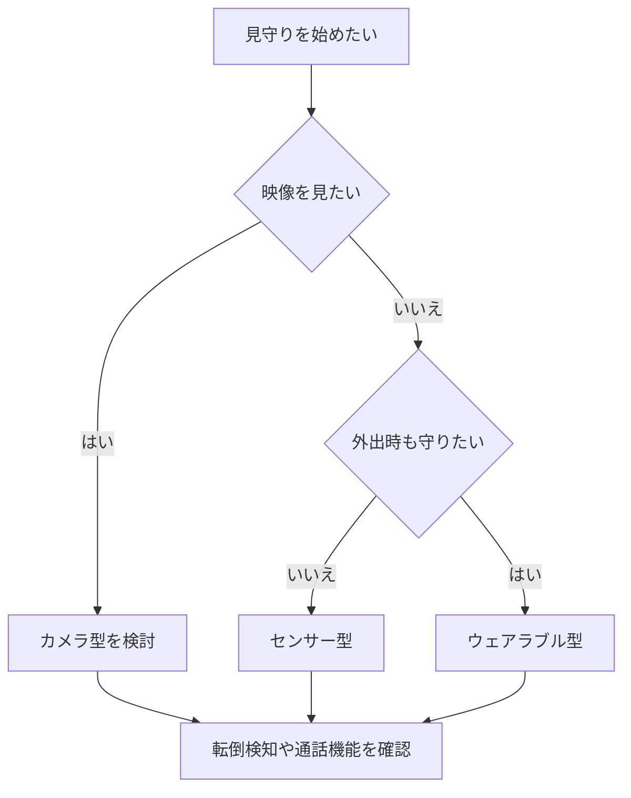

※本記事はアフィリエイト広告(PR)を含みます。

離れて暮らす親が心配、一人暮らしで万が一のときが不安——そんな悩みに応えてくれるのが、近年急速に進化している「AI見守りセンサー」や「AI防犯カメラ」です。この記事では、**AI見守りセンサーの選び方と2026年の最新比較ポイント**を、初心者の方にもわかりやすく解説します。

読み終えるころには、「自分や家族にはどんなタイプが合うのか」「どんな機能を見ればいいのか」「無料で使える範囲はあるのか」といった疑問がスッキリ解消できるはずです。具体的な商品検討に移れるよう、実用的なポイントを中心にまとめました。

## AI見守りセンサー・防犯カメラとは?

まず言葉の整理からです。

- **見守りセンサー**:人の動きや在室、温度、ドアの開閉などを感知して、異常があればスマホに通知する機器です。カメラを使わないタイプもあり、プライバシーに配慮しやすいのが特徴です。
- **防犯カメラ(見守りカメラ)**:映像で部屋の様子を確認できる機器です。スマホからいつでもライブ映像を見られます。
- **AI搭載**:ここでいうAIとは、「いつもと違う行動」を自動で見分けたり、人とペットを区別したり、転倒を検知したりする頭脳のことです。単なる録画ではなく「異常を判断して知らせてくれる」点が従来との大きな違いです。

つまり2026年の見守り機器は、ただ撮る・記録するだけでなく、**AIが状況を理解して必要なときだけ知らせてくれる**方向に進化しています。

## どんなタイプがある?主な3カテゴリー

### 1. カメラ型見守り
映像で様子を確認できる安心感が最大のメリットです。AIが人物や動きを検知し、転倒や長時間の不動を知らせるモデルも増えています。双方向通話(マイク・スピーカー内蔵で会話できる機能)があれば、声かけもできます。

### 2. センサー型見守り(カメラなし)
人感センサーやドアセンサーで生活リズムを把握します。「カメラで見られるのは抵抗がある」という高齢のご家族にも受け入れられやすいタイプです。トイレや冷蔵庫の開閉が一定時間ないと通知、といった使い方ができます。

### 3. ウェアラブル型
手首などに装着し、心拍や転倒、SOSボタンで異常を知らせます。外出時もカバーできるのが強みです。健康データの管理を重視するなら、[AI搭載スマートウォッチの比較記事](/2026/06/17/ai-smartwatch-comparison/)もあわせて参考にしてください。

## 選び方のフローチャート

自分や家族にどのタイプが合うか、下の図で整理してみましょう。

## 比較で見るべき5つのポイント

機種を選ぶときは、以下の5点をチェックすると失敗しにくくなります。

| 比較項目 | 確認するポイント |
|---|---|
| AI検知機能 | 転倒・不動・人物識別に対応しているか |
| 通知方法 | スマホアプリ・LINE通知などの使いやすさ |
| プライバシー配慮 | カメラなし選択やレンズ物理カバーの有無 |
| 録画・保存方式 | クラウドかSDカードか、月額費用の有無 |
| 設置のしやすさ | 工事不要・Wi-Fi接続だけで使えるか |

特に見落としがちなのが**録画の保存方式**です。クラウド保存(インターネット上に映像を保管する方式)は便利ですが、月額料金がかかる場合があります。SDカード保存なら本体だけで完結し、ランニングコストを抑えやすいです。

料金や機能は各社で頻繁に更新されるため、購入前に必ず**公式サイトで最新情報を確認してください**。

まずは手軽なカメラ型から試したい方は、以下のキーワードで探すと選択肢が見つかりやすいです。

👉 [Amazonで「見守りカメラ 高齢者 転倒検知」を見る](https://af.moshimo.com/af/c/click?a_id=5632371&p_id=170&pc_id=185&pl_id=38594&url=https%3A%2F%2Fwww.amazon.co.jp%2Fs%3Fk%3D%25E8%25A6%258B%25E5%25AE%2588%25E3%2582%258A%25E3%2582%25AB%25E3%2583%25A1%25E3%2583%25A9%2520%25E9%25AB%2598%25E9%25BD%25A2%25E8%2580%2585%2520%25E8%25BB%25A2%25E5%2580%2592%25E6%25A4%259C%25E7%259F%25A5)

👉 [楽天市場で「見守りセンサー 一人暮らし」を探す](https://af.moshimo.com/af/c/click?a_id=5632328&p_id=54&pc_id=54&pl_id=616&url=https%3A%2F%2Fsearch.rakuten.co.jp%2Fsearch%2Fmall%2F%25E8%25A6%258B%25E5%25AE%2588%25E3%2582%258A%25E3%2582%25BB%25E3%2583%25B3%25E3%2582%25B5%25E3%2583%25BC%2520%25E4%25B8%2580%25E4%25BA%25BA%25E6%259A%25AE%25E3%2582%2589%25E3%2581%2597%2F)

## よくある質問(Q&A)

### Q. AI見守りカメラは無料で使える?
本体の購入費は必ずかかりますが、**基本的な見守り機能(ライブ映像・動体検知・通知)は無料で使える機種が多い**です。ただし「過去のクラウド映像をさかのぼって見たい」「AIによる高度な人物識別を使いたい」といった機能は、月額のサブスクが必要になることがあります。無料で使える範囲は機種ごとに差が大きいので、購入前にチェックしましょう。

### Q. 工事は必要?
近年の家庭向けモデルは**工事不要でWi-Fiに繋ぐだけ**のものが主流です。コンセントに挿してアプリで設定すれば、その日から使い始められます。

### Q. 高齢の親が「見られている」と嫌がりそう…
その場合はカメラなしのセンサー型がおすすめです。生活リズムの変化だけを把握できるので、本人の負担感が少なくなります。声で操作できる機器と組み合わせると、より自然な見守りができます。スマートスピーカー連携を検討するなら[Alexa・Google Home徹底比較](/2026/06/12/smart-speaker-comparison/)も参考になります。

## 部屋全体で安心をつくるコツ

見守り機器は単体でも役立ちますが、ほかのスマート家電と組み合わせるとさらに効果的です。たとえば、夜間の転倒を防ぐために人感センサー付きの照明を導入すれば、暗い廊下も自動で明るくなります。照明の自動化については[AI搭載スマート電球の選び方](/2026/06/23/smart-bulb-guide/)で詳しく紹介しています。

また、ペットと暮らすご家庭なら、見守りと留守番カメラを兼ねられる[AI搭載ペットカメラの比較記事](/2026/06/25/ai-pet-camera-comparison/)もチェックしてみてください。人だけでなくペットの様子も同時に確認できるモデルがあります。

## 導入の流れ

初めて導入する場合は、次のステップで進めるとスムーズです。

1. 守りたい対象(本人・親・住まい)と心配事を整理する
2. カメラ型・センサー型・ウェアラブル型のどれが合うか決める
3. AI検知機能と通知方法、月額費用を比較する
4. まずは1台から設置し、使い勝手を確かめる
5. 必要に応じて照明やセンサーを追加して強化する

いきなり何台も揃える必要はありません。**1台試してから広げる**のが、無理なく続けるコツです。

## まとめ

AI見守りセンサー・防犯カメラは、高齢者や一人暮らしの「もしも」に素早く気づける心強い味方です。最後に要点を振り返りましょう。

- タイプは大きく**カメラ型・センサー型・ウェアラブル型**の3種類
- 選ぶときは**AI検知機能・通知方法・プライバシー・保存方式・設置のしやすさ**の5点をチェック
- 基本機能は無料でも、**高度な機能やクラウド保存は月額が必要なことがある**
- プライバシーが気になるならカメラなしのセンサー型が安心
- まずは1台から試し、照明やスピーカーと組み合わせて強化する

価格や機能は更新が早いため、気になる機種は必ず公式サイトで最新情報を確認してください。あなたとご家族が、より安心して過ごせる毎日につながれば幸いです。
