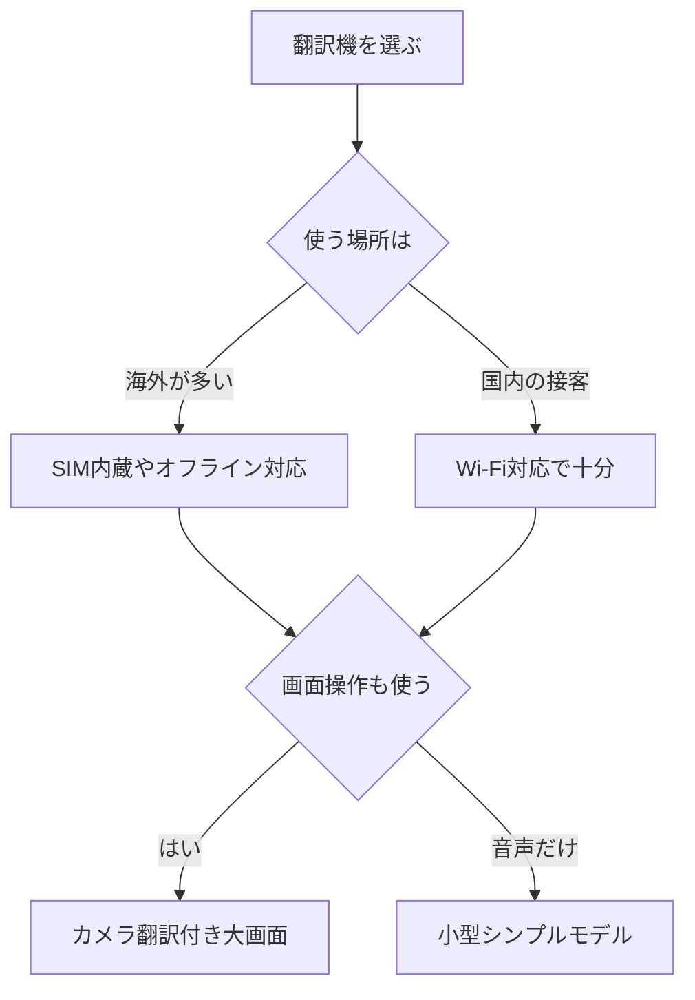

※本記事はアフィリエイト広告(PR)を含みます。

## この記事でわかること

「AI翻訳機」を探していると、ポケトークをはじめたくさんのモデルが出てきて、どれを選べばいいか迷ってしまいますよね。この記事では、2026年最新のAI翻訳機のおすすめを、初心者の方にもわかりやすく比較していきます。

この記事を読むと、次のことがわかります。

- AI翻訳機とは何か、スマホアプリとの違い
- 定番のポケトークと最新モデルの特徴
- 自分に合った1台を選ぶためのポイント
- 「無料で使えないの?」といったよくある疑問への答え

海外旅行や接客、ビジネスの場面で「言葉の壁」をなくしたい方は、ぜひ最後まで読んでみてください。

## AI翻訳機とは?スマホアプリと何が違う?

AI翻訳機とは、話しかけた言葉を瞬時に別の言語へ翻訳して、音声と文字で返してくれる専用の小型端末です。最近は**AI(人工知能=人間のように学習して判断する技術)**を使って、より自然で正確な翻訳ができるようになっています。

「スマホの翻訳アプリで十分では?」と思う方もいるかもしれません。確かに無料アプリも便利ですが、専用機には次のようなメリットがあります。

- **すぐ使える**:電源を入れてボタンを押すだけ。アプリの起動やログインが不要
- **マイク・スピーカーが高性能**:騒がしい場所でも声を拾いやすく、相手にも聞こえやすい
- **バッテリー持ちが良い**:スマホの電池を消費しない
- **操作がシンプル**:機械が苦手な方や高齢の方でも扱いやすい

スマホアプリ派の方は、[AI翻訳ツール比較\|DeepL・Google翻訳・ChatGPTどれが正確?](/2026/06/11/ai-translation-comparison/)も参考になりますよ。

## AI翻訳機の選び方|5つのチェックポイント

購入前に確認したいポイントを整理しました。

### 1. 対応言語数

旅行で使うなら主要言語だけでも十分ですが、ビジネスや多国籍の接客で使うなら対応言語が多いモデルが安心です。

### 2. オンライン/オフライン対応

多くの翻訳機はインターネット接続で精度を発揮しますが、一部はオフラインでも使えます。海外でWi-Fiが使えない場面が多い方はオフライン対応をチェックしましょう。

### 3. 通信方式(SIM内蔵かWi-Fiか)

SIM内蔵モデルは、現地でWi-Fiを探さなくてもそのまま使えるのが魅力です。月額料金や通信プランは公式サイトで最新情報を確認してください。

### 4. カメラ翻訳機能

メニューや看板を撮影して翻訳できる機能があると、旅行先でとても便利です。

### 5. 画面の見やすさ・サイズ

胸ポケットに入る小型タイプから、大きな画面で文字が見やすいタイプまであります。使う場面に合わせて選びましょう。

## 定番モデル「ポケトーク」の特徴

AI翻訳機の代名詞ともいえるのが**ポケトーク**です。世界中で使われてきた実績があり、初心者が最初に選ぶ一台としても安心感があります。

ポケトークの主な特徴は次の通りです。

- 多数の言語に対応し、双方向の会話翻訳がスムーズ
- 画面付きモデルでは文字でも翻訳結果を確認できる
- カメラで撮影したテキストの翻訳に対応するモデルがある
- 一定期間のグローバル通信がセットになったモデルもある

シリーズには複数の世代やグレードがあり、価格や機能が異なります。最新ラインナップと正確な価格は公式サイトや販売ページで確認するのが確実です。

👉 [Amazonで「ポケトーク 翻訳機」を見る](https://af.moshimo.com/af/c/click?a_id=5632371&p_id=170&pc_id=185&pl_id=38594&url=https%3A%2F%2Fwww.amazon.co.jp%2Fs%3Fk%3D%25E3%2583%259D%25E3%2582%25B1%25E3%2583%2588%25E3%2583%25BC%25E3%2582%25AF%2520%25E7%25BF%25BB%25E8%25A8%25B3%25E6%25A9%259F)

## 最新モデルの注目トレンド2026

2026年の翻訳機は、AIの進化によって「より自然な訳」「より速いレスポンス」が進んでいます。注目したい傾向を紹介します。

### より自然な会話翻訳

以前は単語の直訳に近かった翻訳も、文脈を理解して自然な言い回しに変換できるようになってきました。長めの文章でも崩れにくいのが最新モデルの強みです。

### 翻訳イヤホンという選択肢

手に持つタイプだけでなく、耳に着けて使う**翻訳イヤホン**も人気が高まっています。両手が自由に使えるので、観光やショッピングに向いています。詳しくは[AI翻訳イヤホンおすすめ比較2026\|海外旅行の会話に最適なのは?](/2026/06/24/ai-translation-earphones-2026/)で解説しています。

👉 [楽天市場で「翻訳機 AI 多言語」を探す](https://af.moshimo.com/af/c/click?a_id=5632328&p_id=54&pc_id=54&pl_id=616&url=https%3A%2F%2Fsearch.rakuten.co.jp%2Fsearch%2Fmall%2F%25E7%25BF%25BB%25E8%25A8%25B3%25E6%25A9%259F%2520AI%2520%25E5%25A4%259A%25E8%25A8%2580%25E8%25AA%259E%2F)

### オフライン精度の向上

ネット接続なしでも実用的な翻訳ができるモデルが増え、通信環境を気にせず使える場面が広がっています。

## タイプ別おすすめの選び方

用途に合わせたおすすめの方向性を表にまとめました。

| 使うシーン | おすすめタイプ | 重視するポイント |
| --- | --- | --- |
| 海外旅行 | SIM内蔵の音声＋カメラ翻訳 | すぐ使える・看板翻訳 |
| 店舗の接客 | 画面付きの据え置き寄りモデル | 双方向の見やすさ |
| 出張・商談 | 高精度な双方向翻訳機 | 自然な訳・正確さ |
| 観光で歩き回る | 翻訳イヤホン | ハンズフリー |

## よくある質問(Q&A)

### Q. AI翻訳機は無料で使えますか?

本体は購入が必要ですが、機種によっては通信費が一定期間無料、または本体価格に含まれているものがあります。一方でSIM内蔵モデルは月額・年額の通信プランが必要な場合もあるため、購入前に料金体系を必ず確認しましょう。「とにかく無料で試したい」という方は、まずスマホの無料翻訳アプリから始めるのも手です。

### Q. 語学の勉強にも使えますか?

翻訳機は「会話を成立させる」のが目的なので、学習が主目的ならアプリのほうが向いています。話す練習をしたい方は[AI英会話アプリおすすめ5選\|独学で話せるようになる使い方](/2026/06/14/ai-english-apps/)もチェックしてみてください。

### Q. スマホがあれば翻訳機はいらない?

人によります。たまの旅行ならアプリで十分なこともありますが、頻繁に使う・複数人で会話する・機械が苦手な家族と使う、といった場合は専用機の使いやすさが活きてきます。

## まとめ

AI翻訳機は、言葉の壁を越えて世界中の人とコミュニケーションを取るための心強い味方です。最後にポイントを振り返りましょう。

- **AI翻訳機**はすぐ使えてバッテリー持ちが良く、機械が苦手な人にもやさしい
- 選ぶときは「対応言語」「通信方式」「カメラ翻訳」「画面サイズ」をチェック
- 定番の**ポケトーク**は初めての一台として安心感がある
- 2026年は翻訳の自然さやオフライン精度が向上し、**翻訳イヤホン**という選択肢も人気
- 価格や通信プランは変動するため、必ず公式サイトで最新情報を確認する

まずは自分の使うシーンを思い浮かべて、表やフローチャートを参考に候補を絞り込んでみてください。ぴったりの一台が見つかれば、海外旅行も仕事の場面もぐっと楽しく、スムーズになりますよ。
