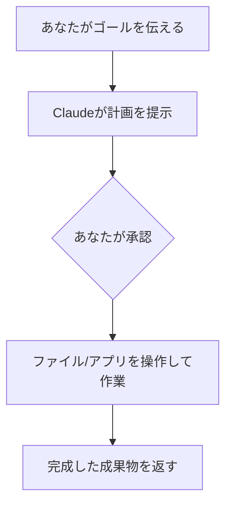

※本記事はアフィリエイト広告(PR)を含む場合があります。

## Claude Coworkとは?——「やり方を教える」から「やってもらう」へ

**Claude Cowork(クロード・コワーク)** は、Anthropicが提供する、**知的労働(ナレッジワーク)向けのAIエージェント**です。ひとことで言えば、エンジニア向けに人気の「Claude Code」のような**自分で作業を進める力**を、**プログラミング以外の普通のオフィス仕事にも広げたもの**です。

これまでのAIチャットは「やり方を説明してくれる」ものでした。Claude Coworkは違います。**パソコン上で、あなたのファイルやアプリを実際に操作し、複数ステップの作業を最初から最後までやり切って、完成した成果物を返してくれます。**

「AIに“相談”するのではなく、“仕事を任せる”」——その時代の入口になるツールです。

> ⚠️ 仕様・料金・提供対象は変更されることがあります。最新情報は[公式ページ](https://www.anthropic.com/product/claude-cowork)でご確認ください。

## 何ができるのか

Claude Coworkの主な特徴は次のとおりです。

- **ローカルのファイルを直接操作**:指定したフォルダ内のファイルを**読む・編集する・新規作成する**ことができます。「資料を作って」と頼めば、実際にファイルを仕上げてくれます。
- **アプリ・サービスと連携**:メールやSlackなど、許可したコネクタと連携して情報を取得・処理します。
- **予約タスク(スケジュール実行)**:「毎朝メールをチェックして要約」「毎週Slackのダイジェストを作成」など、**一度設定すれば定期的に自動で実行**してくれます。
- **実行前に“計画”を見せて承認を待つ**:いきなり勝手に動くのではなく、**何をするかの計画を提示し、あなたの承認を待ちます**。途中で方向修正もできるので安心です。

## 使い方(かんたん3ステップ)

1. **Claude Desktopアプリ**(macOS / Windows)をダウンロードして開く
2. サイドバーの **「Cowork」** をクリックしてCoworkモードに切り替える
3. **「Work in a folder(フォルダで作業)」** から、Claudeに作業させたいフォルダを選んでアクセスを許可する

あとは、やってほしいことを言葉で伝えるだけ。**アクセスできる範囲は自分で決められる**ので、見せたくないフォルダは渡さない、という運用ができます。

## 料金と提供状況

- 2026年1月に**研究プレビュー**として静かに登場し、**2026年4月9日に一般提供(GA)**を開始
- 現在は **Claudeの有料サブスク加入者**向けに、**macOS / Windowsの Claude Desktopアプリ**で利用できます

料金はClaudeのサブスクに含まれる形です。各AIサービスの料金感は[AIサブスク料金比較](/2026/06/16/ai-subscription-pricing-2026/)もあわせてどうぞ。

## Claude Codeとの違い

「Claude Codeと何が違うの?」という疑問はよくあります。ざっくり言うと**対象が違う**だけで、考え方は同じ「エージェント型」です。

| | Claude Code | Claude Cowork |
|---|---|---|
| 主な対象 | プログラミング・開発 | 文書作成・データ整理など知的労働全般 |
| 使う人 | エンジニア | ビジネスパーソン全般 |
| 共通点 | **タスクを丸ごと任せて、自分で実行する** | 同左 |

コーディング用途でのAI比較は[ChatGPT・Claude・Geminiのプログラミング比較](/2026/06/16/ai-coding-comparison-2026/)、AIエージェントの基礎は各記事もあわせてご覧ください。

## どんな仕事に使える?(活用例)

- **資料・レポート作成**:フォルダ内のデータをもとに、報告書やスライドの下書きを作成
- **メール・情報の整理**:毎朝のメールを要約し、対応が必要なものを抽出
- **定例業務の自動化**:週次レポートやSlackダイジェストを予約タスクで自動生成
- **ファイル整理・リネーム**:散らかったフォルダの整理を一括で

こうした「AIに作業を任せて、ひとりでも多くを回す」働き方は、[AIを活用した一人会社・スモールビジネス](/2026/06/14/ai-solo-company/)とも相性抜群です。ChatGPT側の同種機能は[ChatGPTの予約タスク](/2026/06/21/chatgpt-scheduled-tasks-2026/)もどうぞ。

## 使う前に知っておきたい注意点

- **アクセス権限は最小限に**:機密ファイルのあるフォルダは渡さない、必要な範囲だけ許可する
- **計画承認を活用**:実行前の計画をきちんと確認し、意図しない操作を防ぐ
- **重要作業はバックアップ**:ファイルを編集・作成するため、大事なデータは事前に控えを

まずは「失っても困らないフォルダ」で小さく試すのが、安全に慣れるコツです。AIを仕事に活かす考え方は[生成AIとかけ合わせると強い資格](/2026/06/16/ai-strong-certifications/)も参考になります。

👉 [Amazonで「生成AI 仕事術 本」を見る](https://af.moshimo.com/af/c/click?a_id=5632371&p_id=170&pc_id=185&pl_id=38594&url=https%3A%2F%2Fwww.amazon.co.jp%2Fs%3Fk%3D%25E7%2594%259F%25E6%2588%2590AI%2520%25E4%25BB%2595%25E4%25BA%258B%25E8%25A1%2593%2520%25E6%259C%25AC)

## よくある質問

### プログラミングできなくても使える?

はい。Claude Coworkは**知的労働全般**が対象で、エンジニアでなくても、資料作成やメール整理などに使えます。

### 勝手にファイルを書き換えられない?

**実行前に計画を提示して承認を待つ**仕組みなので、許可しない限り勝手には動きません。アクセスできるフォルダも自分で指定します。

### 無料で使える?

Claudeの**有料サブスク向け**機能です。無料での提供範囲は変わることがあるため、最新は公式で確認してください。

## まとめ

- **Claude Cowork**は、Claude Codeのエージェント力を**知的労働全般**に広げたデスクトップAI
- **ローカルのファイル・アプリを実際に操作**し、タスクを最後まで仕上げる(予約タスクで自動化も)
- **実行前に計画を承認**、**アクセス範囲も自分で指定**できて安心
- **2026年4月に一般提供**、有料サブスク向け(macOS / Windows)

「AIに相談する」から「AIに任せる」へ。Claude Coworkは、その働き方の変化を体感できるツールです。まずは小さなタスクから試してみてください。

### 参考リンク

- [Claude Cowork(Anthropic公式)](https://www.anthropic.com/product/claude-cowork)
- [Claude Cowork: Claude Code power for knowledge work(claude.com)](https://claude.com/product/cowork)
- [How to Use Claude Cowork in 2026: Step-by-Step Guide(AI.cc)](https://www.ai.cc/blogs/how-to-use-claude-cowork-2026-step-by-step-guide/)
