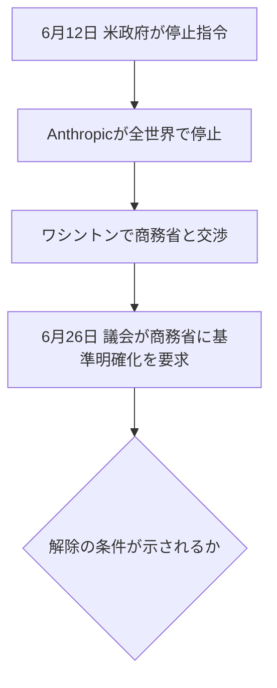

※本記事はアフィリエイト広告(PR)を含む場合があります。

## Fable 5、まだ止まったまま——でも動きが

2026年6月、Anthropicの最上位AI **Claude Fable 5** と **Mythos 5** が、米政府の輸出管理指令で公開3日で停止しました(経緯は[Claude Fable 5停止の解説記事](/2026/06/15/claude-fable-5-suspended/)、日本への影響は[こちら](/2026/06/16/claude-fable-5-japan-impact/)で詳しく解説しています)。

あれから2週間あまり。「**結局いつ戻るの?**」という声に応えて、**2026年6月26日時点の最新状況**を整理します。

> ⚠️ 本件は政府の指令が絡み状況が流動的です。最新情報は公式発表・信頼できる報道でご確認ください。

## 現状:まだ復旧していない(6/25時点)

結論から言うと、**まだ正式には復旧していません**。

- 6月25日時点でも、Anthropicのスタッフが「**Fable/Mythosのトラフィックはゼロ**(=稼働していない)」と確認しています
- SNSで広がった「**Fable 5が復活した!**」という情報は、**表示上のバグ(名前だけ出た)による誤報**だったと、Anthropic側が即座に否定しました

つまり、「戻った」という噂は**フライング**で、実際にはまだオフラインのままです。

## 6月26日が「山場」とされる理由

注目されているのが、**6月26日という日付**です。米議会が商務省に対し、**輸出規制を解除する基準を明確にするよう、6月26日までに求めている**とされ、この**議会期限が一つの節目**になると見られています。

## 交渉に「進展の兆し」

完全に膠着しているわけではなく、前向きな動きも報じられています。

- Anthropicは**ワシントンに技術チームを派遣**し、米商務省と交渉を継続
- 交渉の窓口が、CEOのダリオ・アモデイ氏から**共同創業者のトム・ブラウン氏に交代**。政府関係者から「**ブラウン氏とはきちんと話ができる**」との声も出て、交渉の空気が改善したと伝えられています
- Anthropicの国際担当役員は、**「数日以内に再開できると強く確信している」**と発言(ソウルでの会見)

ただし、これらは**会社側の見通し・期待であって、確定したスケジュールではありません**。

## いつ戻る?(正直な見通し)

現時点で**正式な復旧日は未定**です。「数日内」という前向きな発言はあるものの、政府の判断が絡むため断言はできません。**6月26日前後の議会・商務省の動きが、今後を占う材料**になりそうです。

## 私たちユーザーへの影響

繰り返しになりますが、**停止しているのは最上位の2モデル(Fable 5・Mythos 5)だけ**です。

- **Claude Opus 4.8・Sonnet 4.6・Haiku 4.5は通常どおり利用可能**
- 多くのユーザーの日常利用には、ほぼ影響ありません

「最先端だけを追うリスク」も浮き彫りになりました。実際、こうした**地政学リスクを回避する設計**として、中国Z.aiの[オープンモデルGLM-5.2](/2026/06/17/glm-5-2-guide/)や、日本の[Sakana AIのFugu](/2026/06/22/sakana-ai-fugu-2026/)のような「規制に強いAI」も注目を集めています。各AIの違いは[ChatGPT・Claude・Geminiの比較](/2026/06/09/ai-chat-comparison/)もどうぞ。

## よくある質問

### Fable 5はもう使える?

いいえ。**6月25日時点でも停止中**です。「復活した」という情報は誤報(表示バグ)とされています。

### いつ復旧する?

正式な日付は未定です。会社側は「数日内に再開できると確信」としていますが、政府の判断次第で流動的です。

### 普段のClaudeは使える?

はい。Opus・Sonnet・Haikuは通常どおり。停止は最上位2モデルのみです。

## まとめ

- **6月26日時点でFable 5・Mythos 5はまだ停止中**(「復活」報道は誤報)
- **6月26日は議会期限の山場**。商務省の対応が今後を左右する可能性
- 交渉役の交代などで**進展の兆し**。会社は「数日内に再開」と見込むが**確定ではない**
- 通常のClaude(Opus/Sonnet/Haiku)は**影響なし**

動きがあり次第、本ブログでも追っていきます。最新の正確な情報は公式発表でご確認ください。

### 参考リンク

- [「Claude Fable 5」「Mythos 5」全面停止 米政府の指令(ITmedia NEWS)](https://www.itmedia.co.jp/news/articles/2606/13/news026.html)
- [Claude Fable 5復活の兆し?問題の本質は技術ではなく政治か(@IT)](https://atmarkit.itmedia.co.jp/ait/articles/2606/23/news057.html)
- [Fable 5復活は誤報とAnthropicが否定、交渉担当者交代で進展の兆し(BigGoファイナンス)](https://finance.biggo.jp/news/3c36769e-621a-48fb-a6dd-6179ec6e1b40)
