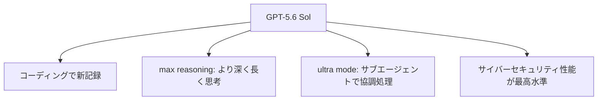

※本記事はアフィリエイト広告(PR)を含む場合があります。

## GPT-5.6、ついに登場——ただし「限定プレビュー」

長らく噂されていた **GPT-5.6** が、2026年6月26日、OpenAIから**限定プレビュー(limited preview)**として公開されました。「いつ出るの?」と待たれていたモデルが、ついに姿を現した形です。

ただし重要なのは、**今すぐ誰でも使えるわけではない**こと。現時点ではAPIとCodec(Codex)経由で、**信頼できる一部のパートナー・組織にのみ**提供されています。一般公開は「数週間以内」とされています。

この記事では、**何が登場したのか・何がすごいのか・私たちはいつ使えるのか**を整理します。

> ⚠️ 仕様・提供時期・料金は変更されることがあります。最新情報はOpenAIの公式発表でご確認ください。

## GPT-5.6は「3モデル」構成

今回のGPT-5.6は、単一モデルではなく**用途別の3モデル**で構成されています。

| モデル | 位置づけ | 特徴 |
|---|---|---|
| **Sol(ソル)** | フラッグシップ | 最高性能。コーディング・推論・セキュリティに強い |
| **Terra(テラ)** | バランス型 | 性能とコストのバランス重視 |
| **Luna(ルナ)** | 軽量・高速 | 速くて安い。日常用途向け |

用途や予算に応じて使い分けられる構成で、Claudeの「Opus/Sonnet/Haiku」やGeminiの「Pro/Flash」と似た考え方です。

## 何がすごいのか(Solの強化点)

- **コーディングで新記録**:コマンドライン作業を評価する**Terminal-Bench 2.1で新たな最高スコア**を記録。計画・反復・ツール連携が必要な実務的タスクに強い
- **新しい推論モード**:じっくり深く考える「**max(最大)推論**」モードと、**複数のサブエージェントを使って協調処理する「ultraモード」**を新搭載
- **セキュリティに最強クラス**:脆弱性の調査など、長時間の高度なセキュリティ作業で最高水準の性能

AIの「エージェント化(自律実行)」の流れを、さらに一歩進めた内容です。各AIのコーディング比較は[ChatGPT・Claude・Geminiのプログラミング比較](/2026/06/16/ai-coding-comparison-2026/)もどうぞ。

## なぜ「限定」なのか

これほど高性能なら、なぜすぐ全公開しないのでしょうか。理由は**安全性への配慮**です。

GPT-5.6 Solは、サイバーセキュリティや生物分野など、**悪用されると影響が大きい領域でも高い能力**を持ちます。そのためOpenAIは「**過去最も堅牢な安全対策**」を用意し、高リスクな利用への保護を強化したうえで、**まず限られたパートナーから慎重に提供**する方針をとっています。報道では、提供先を**政府の承認を得たパートナーに絞っている**との見方もあります。

この「**強力なAIほど、提供を慎重にする**」流れは、先日の[Claude Fable 5が輸出規制で停止した一件](/2026/06/15/claude-fable-5-suspended/)とも重なります(その後の[復旧交渉の最新](/2026/06/26/claude-fable-5-recovery-update/)もどうぞ)。最先端AIと「安全・規制」は、いまや切り離せないテーマです。

## 私たちはいつ使える?

OpenAIは、Sol・Terra・Lunaを**数週間以内に一般提供する予定**としています。つまり、**一般ユーザーが触れるのはもう少し先**です。

- 今は**慌てて待つ必要なし**。現行のGPT-5.5やChatGPTで十分高性能です
- 一般提供されたら、**自分の用途で試して**から判断するのがおすすめ
- 料金や対象プランは公開時に要確認(各AIの料金感は[AIサブスク料金比較](/2026/06/16/ai-subscription-pricing-2026/)を参照)

6月は[フラッグシップAIが相次いで登場した月](/2026/06/16/ai-model-flood-2026/)。その締めくくりにGPT-5.6が加わった形です。

## よくある質問

### GPT-5.6はもう使える?

**一般公開はまだ**です(2026年6月26日時点)。APIとCodex経由で、一部のパートナー・組織に限定提供されています。

### Sol・Terra・Lunaの違いは?

**Sol=最高性能、Terra=バランス、Luna=高速・低コスト**です。用途や予算で選べます。

### いつ誰でも使える?

OpenAIは「数週間以内に一般提供」としています。正確な時期は公式発表をご確認ください。

## まとめ

- 2026年6月26日、**GPT-5.6が限定プレビューで登場**(Sol・Terra・Lunaの3モデル)
- Solは**コーディングで新記録**、**max推論・ultraモード**、**セキュリティ最高水準**
- 高い能力ゆえに**安全性に配慮して限定提供**。一般公開は**数週間以内**の予定
- 一般ユーザーは慌てず、**公開後に自分の用途で試す**のが賢明

噂が現実になりましたが、私たちが手にするのはもう少し先。動きがあり次第、本ブログでも追っていきます。

### 参考リンク

- [Previewing GPT-5.6 Sol: a next-generation model(OpenAI)](https://openai.com/index/previewing-gpt-5-6-sol/)
- [OpenAI Launches GPT-5.6 Sol, Terra, and Luna in Limited Preview(MacRumors)](https://www.macrumors.com/2026/06/26/openai-gpt-5-6-sol/)
- [OpenAI upgrading ChatGPT and Codex with new GPT-5.6 models in limited release(9to5Mac)](https://9to5mac.com/2026/06/26/openai-upgrading-chatgpt-and-codex-with-new-gpt-5-6-models-in-limited-release/)
