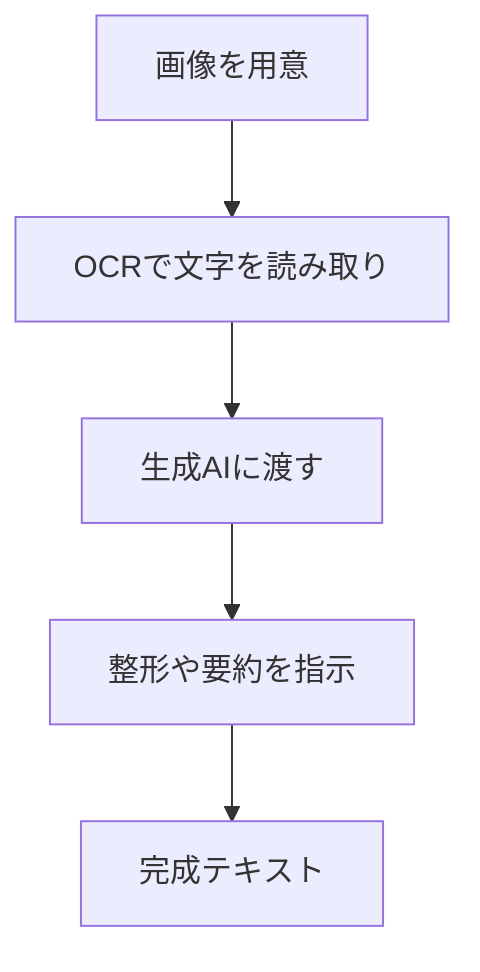

※本記事はアフィリエイト広告(PR)を含みます。

## この記事でわかること

「紙の書類やスクショの文字を、もう一度手で打ち直すのが面倒……」そんな悩みを解決してくれるのが、**画像から文章を生成する**技術です。この記事では、OCR（画像内の文字を読み取る技術）と生成AIを組み合わせて、写真やスクリーンショットからテキストを取り出し、さらに要約や整形まで自動で行う方法をわかりやすく紹介します。

この記事を読むと、次のことがわかります。

- OCRと生成AIの違いと、なぜ組み合わせると便利なのか
- 画像から文章を作る具体的な手順
- 2026年時点でおすすめのツール比較
- 無料で使えるのか、という疑問への答え

パソコンやスマホが苦手な方でも今日から試せる内容なので、ぜひ最後までご覧ください。

## そもそもOCRと生成AIは何が違う?

まずは2つの言葉を整理しておきましょう。

- **OCR（オーシーアール）**…「Optical Character Recognition」の略で、画像の中の文字を認識してテキストデータに変換する技術です。スキャンした書類や写真の文字を「コピーできる文字」に変えてくれます。
- **生成AI**…ChatGPTやGeminiに代表される、文章を作ったり要約したり整える人工知能です。

OCRは「文字を読み取る」のが得意ですが、読み取っただけの文章は改行が乱れていたり、誤読があったりします。そこで生成AIに渡して「整える・要約する・翻訳する」と、一気に使える文章に仕上がるわけです。

### 組み合わせるとできること

- 名刺やレシートの内容をきれいな一覧表にする
- 手書きメモを清書する
- 外国語の看板を読み取って翻訳する
- 資料のスクショを要約する

## 画像から文章を生成する流れ

実際の作業はとてもシンプルです。下の図のような流れになります。

最近では、この一連の流れを1つのツールでまとめて行えるサービスも増えています。ChatGPTやGeminiのように画像を直接アップロードして「この画像の文字を書き出して」と頼めば、OCRと整形を同時にこなしてくれるのです。

## おすすめツール比較2026

用途別に代表的なツールをまとめました。料金は変動しやすいため、最新情報は必ず各公式サイトでご確認ください。

| ツール | 得意なこと | 無料での利用 |
|---|---|---|
| ChatGPT（画像対応版） | 読み取り＋要約・翻訳まで一括 | 一部無料・有料で高機能 |
| Gemini | 画像認識と日本語整形が得意 | 無料枠あり |
| Google レンズ | スマホで手軽に文字抽出 | 無料 |
| Adobe Acrobat | 大量のPDF・書類のOCR | 一部無料・有料が中心 |
| 専用OCRアプリ | 名刺やレシートの整理 | アプリにより異なる |

### 1. ChatGPT・Geminiなどの生成AIチャット

画像をアップロードして「文字を書き出して」「表にまとめて」と頼むだけ。OCRと整形が同時に終わるのが最大の魅力です。どのチャットAIを選ぶか迷う方は、[ChatGPTとClaudeとGeminiを徹底比較した記事](/2026/06/09/ai-chat-comparison/)も参考にしてください。

### 2. Google レンズ（スマホ向け）

スマホのカメラで紙の文章を写すだけで文字を抽出できます。無料で手軽なので、まず体験してみたい方におすすめです。

### 3. 書類・名刺の整理に特化したツール

名刺やレシートを大量に処理したいなら、専用アプリが便利です。データベース化まで自動で行ってくれます。詳しくは[AIで名刺・書類を整理する方法](/2026/06/17/ai-business-card-scanner/)をご覧ください。

## どう選べばいい?

迷ったら次の基準で選んでみてください。

- **たまに使うだけ** → Google レンズや無料の生成AIチャット
- **要約や翻訳もしたい** → ChatGPTやGeminiの画像対応機能
- **大量の書類を処理** → Adobe Acrobatや専用OCRソフト
- **名刺・レシート整理** → 整理特化アプリ

スキャン作業をたくさんするなら、スマホスタンドや小型スキャナーがあると効率が上がります。

👉 [Amazonで「ドキュメントスキャナー 自動給紙」を見る](https://af.moshimo.com/af/c/click?a_id=5632371&p_id=170&pc_id=185&pl_id=38594&url=https%3A%2F%2Fwww.amazon.co.jp%2Fs%3Fk%3D%25E3%2583%2589%25E3%2582%25AD%25E3%2583%25A5%25E3%2583%25A1%25E3%2583%25B3%25E3%2583%2588%25E3%2582%25B9%25E3%2582%25AD%25E3%2583%25A3%25E3%2583%258A%25E3%2583%25BC%2520%25E8%2587%25AA%25E5%258B%2595%25E7%25B5%25A6%25E7%25B4%2599)

## よくある質問（Q&A）

### Q. 画像から文章を生成するのは無料でできる?

はい、基本的な読み取りなら無料で始められます。Google レンズは完全無料ですし、ChatGPTやGeminiにも無料枠があります。ただし、無料版は1日に使える回数や画像枚数に制限がある場合が多いです。大量に処理したい、長文を高精度で扱いたいという場合は有料版が快適です。

### Q. 手書き文字も読み取れる?

読み取れますが、クセの強い手書きは誤読が出やすいです。生成AIに「文脈から推測して修正して」と頼むと、精度がぐっと上がります。

### Q. PDFの資料を要約したいときは?

画像だけでなくPDFをそのまま扱いたい場合は、PDF対応のAIツールが便利です。[AIでPDFを要約・分析する方法](/2026/06/24/ai-pdf-summary-tools/)でくわしく紹介しています。

## 精度を上げるコツ

- 明るい場所で、影が入らないように撮影する
- 文字がまっすぐになるよう正面から撮る
- 生成AIには「誤字があれば直して」「箇条書きにして」と具体的に指示する

撮影品質が上がるだけで、読み取り精度は大きく変わります。書類をきれいに撮りたい方には、スマホ用の固定スタンドも役立ちます。

👉 [楽天市場で「スマホスタンド 俯瞰撮影」を探す](https://af.moshimo.com/af/c/click?a_id=5632328&p_id=54&pc_id=54&pl_id=616&url=https%3A%2F%2Fsearch.rakuten.co.jp%2Fsearch%2Fmall%2F%25E3%2582%25B9%25E3%2583%259E%25E3%2583%259B%25E3%2582%25B9%25E3%2582%25BF%25E3%2583%25B3%25E3%2583%2589%2520%25E4%25BF%25AF%25E7%259E%25B0%25E6%2592%25AE%25E5%25BD%25B1%2F)

## まとめ

画像から文章を生成する作業は、OCRで文字を読み取り、生成AIで整える、という2ステップで完結します。

- **手軽に試すなら**Google レンズや無料の生成AIチャット
- **要約・翻訳まで一括なら**ChatGPTやGemini
- **大量処理や書類整理なら**専用ソフト・アプリ

まずは手元のスマホで1枚の書類を撮って、AIに「文字を書き出して」と頼んでみてください。手入力の手間から解放される便利さを、きっと実感できるはずです。料金やプランは変わりやすいので、導入前に各公式サイトで最新情報を確認してから選ぶと安心ですよ。
