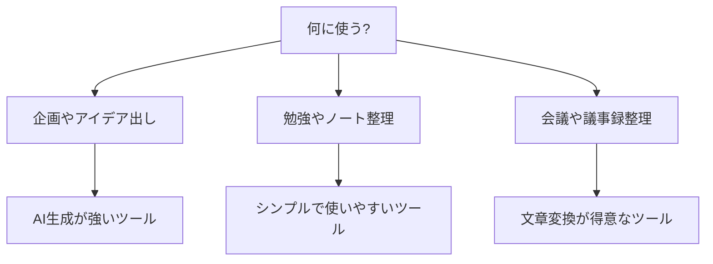

※本記事はアフィリエイト広告(PR)を含みます。

## AIマインドマップ作成ツールとは?この記事でわかること

「頭の中のアイデアがまとまらない」「企画書を書く前に考えを整理したい」――そんなときに役立つのが、AIマインドマップ作成ツールです。マインドマップとは、中心となるテーマから枝分かれするように関連する言葉やアイデアをつなげていく図解手法のこと。これにAI(人工知能)を組み合わせると、キーワードを入力するだけで関連するアイデアを自動で広げてくれたり、長い文章を自動で図に整理してくれたりします。

この記事では、AIマインドマップ作成ツールの選び方と、初心者にもおすすめの5つのツールを比較してご紹介します。「無料で使えるの?」「どれが自分に合っているの?」といった疑問にも答えていくので、読み終わるころには自分にぴったりのツールが見つかるはずです。

## なぜAIでマインドマップを作ると便利なのか

従来のマインドマップは、自分で1つひとつ枝を書き出していく必要がありました。これも頭の整理には効果的ですが、「最初の一歩が出てこない」「アイデアが途中で枯れてしまう」という悩みも多いものです。

AIマインドマップツールなら、こうした悩みを次のように解決してくれます。

- **アイデアの自動生成**: テーマを入力すると、関連するサブテーマをAIが提案してくれる
- **文章の自動構造化**: 長い議事録やメモを貼り付けると、自動的に階層構造の図に変換
- **発想の広がり**: 自分では思いつかなかった視点を提示してくれる
- **時短**: 手作業なら30分かかる整理が数分で完了

ブレインストーミング(自由にアイデアを出し合う発想法)の相棒として、とても心強い存在になります。

## AIマインドマップツールの選び方

ツールを選ぶときは、次の3つのポイントを意識すると失敗しにくくなります。

### 1. 何に使いたいかを明確にする

企画立案、勉強のまとめ、会議の整理など、用途によって向いているツールが変わります。まずは「自分の主な使い道」を考えましょう。

### 2. 無料プランの範囲を確認する

多くのツールは無料で試せますが、AI生成の回数やエクスポート機能に制限があることが多いです。まずは無料で使い心地を確かめるのがおすすめです。

### 3. 日本語対応の精度

海外製ツールも多いため、日本語での入力・出力がスムーズかどうかは重要なチェックポイントです。

## AIマインドマップ作成ツールおすすめ5選

ここからは、初心者にもおすすめの5つのツールを具体的に見ていきましょう。料金は変更されることがあるため、最新情報は必ず公式サイトでご確認ください。

### 1. Xmind AI

長年人気のマインドマップソフト「Xmind」のAI機能版です。テーマを入力するだけでマップの骨子を自動生成してくれます。デザイン性が高く、見栄えのよい図が作れるのが魅力です。

- **向いている人**: 美しい資料を作りたい人
- **特徴**: 豊富なテンプレート、スマホアプリ対応

### 2. Mapify

YouTube動画やPDF、長文テキストを読み込ませると、自動でマインドマップに変換してくれるツールです。情報のインプットを整理したい人に特に便利です。

- **向いている人**: 学習内容や資料を整理したい人
- **特徴**: 多様なファイル形式に対応

### 3. Whimsical AI

シンプルで直感的な操作が魅力のツールです。AIにキーワードを伝えると、サッと枝を広げてくれます。チームでの共同編集にも対応しています。

- **向いている人**: チームでアイデアを共有したい人
- **特徴**: 動作が軽く操作がわかりやすい

### 4. Taskade

マインドマップだけでなく、タスク管理やドキュメント作成も一体化したツールです。アイデア出しから実行までを1つのツールで完結できます。

- **向いている人**: アイデアを実際の行動につなげたい人
- **特徴**: AIエージェント機能を搭載

### 5. ChatGPTやClaude＋作図

専用ツールではありませんが、ChatGPTやClaudeにアイデアを箇条書きで出してもらい、それをマインドマップ化する方法もあります。汎用AIの発想力を生かせるのが強みです。どのAIチャットを選ぶか迷う方は、[ChatGPTとClaudeとGeminiを徹底比較!初心者におすすめのAIチャットはどれ?](/2026/06/09/ai-chat-comparison/)もあわせてご覧ください。

- **向いている人**: すでにAIチャットを使っている人
- **特徴**: 発想の幅が広い

## 比較表でひと目でチェック

| ツール名 | 得意なこと | 無料プラン | こんな人に |
|---|---|---|---|
| Xmind AI | デザイン性の高い図 | あり | 見栄え重視 |
| Mapify | 動画やPDFの変換 | あり | 学習整理 |
| Whimsical AI | シンプル操作 | あり | チーム作業 |
| Taskade | タスク連携 | あり | 実行まで一括管理 |
| ChatGPT等 | 自由な発想 | あり | AIチャット利用者 |

※プラン内容や料金は変わることがあります。詳細は各公式サイトで最新情報をご確認ください。

## Q&A:AIマインドマップツールは無料で使える?

**Q. 紹介されたツールは無料で使えますか?**

A. 多くのツールに無料プランが用意されており、基本的な機能は無料で試せます。ただし、AI生成の回数制限や、作成できるマップの数に上限があることが一般的です。まずは無料で操作感を確かめ、気に入ったら有料プランを検討するのがおすすめです。

**Q. スマホでも使えますか?**

A. XmindやTaskadeなど、スマホアプリに対応しているツールも多くあります。外出先で思いついたアイデアをすぐにメモしたい人には便利です。

**Q. 作ったマインドマップを他の作業に活かせますか?**

A. はい。整理したアイデアはそのまま企画書やプレゼン資料の土台になります。資料作成まで一気に進めたい方は、[AIプレゼン資料作成ツール比較\|パワポ作業を時短する5つの方法](/2026/06/13/ai-presentation-tools/)も参考になります。また、情報整理全般を効率化したい場合は[Notion AIの使い方完全ガイド](/2026/06/17/notion-ai-guide/)もおすすめです。

## 作業環境を整えるとさらに快適に

マインドマップ作成は、画面を広く使えると一気に効率が上がります。複数のウィンドウを並べて作業したい方は、外部モニターやモニターアームの導入も検討してみてください。

👉 [Amazonで「モニターアーム デュアル」を見る](https://af.moshimo.com/af/c/click?a_id=5632371&p_id=170&pc_id=185&pl_id=38594&url=https%3A%2F%2Fwww.amazon.co.jp%2Fs%3Fk%3D%25E3%2583%25A2%25E3%2583%258B%25E3%2582%25BF%25E3%2583%25BC%25E3%2582%25A2%25E3%2583%25BC%25E3%2583%25A0%2520%25E3%2583%2587%25E3%2583%25A5%25E3%2582%25A2%25E3%2583%25AB)

長時間の作業には、姿勢をサポートしてくれるチェアや、集中できるイヤホンもあると快適です。

👉 [楽天市場で「ワイヤレスイヤホン ノイズキャンセリング」を探す](https://af.moshimo.com/af/c/click?a_id=5632328&p_id=54&pc_id=54&pl_id=616&url=https%3A%2F%2Fsearch.rakuten.co.jp%2Fsearch%2Fmall%2F%25E3%2583%25AF%25E3%2582%25A4%25E3%2583%25A4%25E3%2583%25AC%25E3%2582%25B9%25E3%2582%25A4%25E3%2583%25A4%25E3%2583%259B%25E3%2583%25B3%2520%25E3%2583%258E%25E3%2582%25A4%25E3%2582%25BA%25E3%2582%25AD%25E3%2583%25A3%25E3%2583%25B3%25E3%2582%25BB%25E3%2583%25AA%25E3%2583%25B3%25E3%2582%25B0%2F)

## まとめ

AIマインドマップ作成ツールは、アイデア整理の自動化を強力にサポートしてくれる頼もしい存在です。最後にポイントを振り返りましょう。

- **用途を明確に**: 企画・学習・会議など目的でツールを選ぶ
- **まずは無料で試す**: ほとんどのツールに無料プランがある
- **日本語対応をチェック**: 海外製は事前に確認を
- **おすすめ5選**: Xmind AI・Mapify・Whimsical AI・Taskade・ChatGPT等の活用

どれも無料で始められるので、まずは気になったツールを1つ試してみてください。頭の中のモヤモヤが、すっきりとした1枚の図になる感覚をぜひ体験してみましょう。なお、料金や機能は変わることがあるため、導入前には必ず公式サイトで最新情報をご確認ください。
