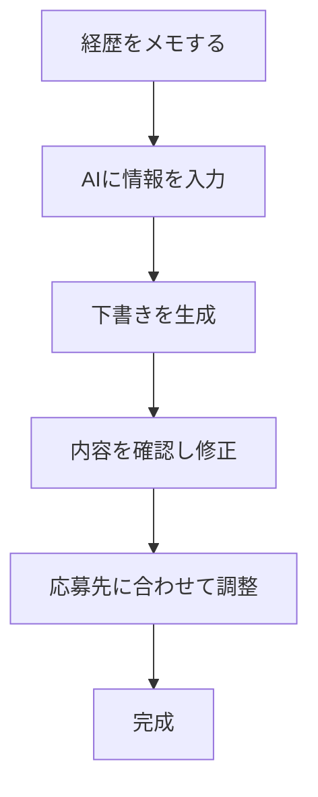

※本記事はアフィリエイト広告(PR)を含みます。

## AIで履歴書・職務経歴書は本当に作れるの?

「転職したいけれど、職務経歴書を書くのが面倒…」「自分の強みをうまく言葉にできない…」そんな悩みを持つ方は多いのではないでしょうか。実は今、**AIを使えば履歴書・職務経歴書の作成が驚くほどラクになります**。

この記事を読むと、次のことがわかります。

- AIで履歴書・職務経歴書を作る具体的な手順
- 転職活動に使えるおすすめのAIツール5選
- 自然で「使える」文章にするためのプロンプト(AIへの指示文)のコツ
- 無料で使えるのか、注意すべき点は何か

「AIに丸投げ」ではなく、**AIを“下書きの相棒”として使いこなす**ことが成功のポイントです。それでは順番に見ていきましょう。

## AIで履歴書・職務経歴書を作るメリット

まず、なぜAIを使うのがおすすめなのかを整理します。

| メリット | 内容 |
|---|---|
| 時短になる | ゼロから書く負担が減り、数分で下書きが完成 |
| 言語化が得意 | 自分では気づかない強みを引き出してくれる |
| 表現の幅が広がる | 同じ経歴でも複数の言い回しを提案してくれる |
| 応募先に合わせやすい | 求人内容に合わせた書き換えが簡単 |

特に「自分の経験をどう表現すればいいかわからない」という人にとって、AIは強力な味方になります。箇条書きのメモを渡すだけで、整った文章に仕上げてくれるからです。

## AIで職務経歴書を作る基本の流れ

難しそうに見えますが、流れはとてもシンプルです。下の図で全体像をつかみましょう。

### ステップ1:自分の情報をメモする

まずは箇条書きで構いません。次のような項目をメモしましょう。

- 勤務した会社名・期間・職種
- 担当した業務内容
- 成果(数字があれば最強です。例:売上を前年比120%に)
- 使えるスキルや資格

### ステップ2:AIに入力して下書きを作る

メモをAIに渡し、「職務経歴書の形に整えてください」とお願いします。このとき、後述するプロンプトのコツを使うと精度が大きく上がります。

### ステップ3:必ず自分で確認・修正する

AIは事実と異なる内容(専門用語で「ハルシネーション」と呼ばれる、もっともらしい嘘)を作ることがあります。**生成された文章は必ず自分の目でチェックし、事実と違う部分は修正**してください。

## 転職に使えるおすすめAIツール5選

ここからは、実際に使えるツールを5つ紹介します。価格やプランは変更されることがあるため、最新情報は各公式サイトでご確認ください。

### 1. ChatGPT(オールマイティな定番)

最も手軽なのがChatGPTです。メモを貼り付けて「職務経歴書にして」と頼むだけで下書きが完成します。無料版でも十分使えますが、より高性能なモデルを使いたい場合は有料版も検討の価値があります。無料版と有料版の違いは[ChatGPT有料版は必要?無料版との違いと元が取れる使い方を解説](/2026/06/20/chatgpt-paid-vs-free/)で詳しく解説しています。

### 2. Claude(長文・自然な文章が得意)

Claudeは文章の自然さに定評があり、長い職務経歴書を丁寧にまとめるのが得意です。読みやすく整った日本語を出してくれるため、文章表現にこだわりたい人におすすめです。

### 3. Gemini(検索との連携が強み)

GoogleのGeminiは、応募先企業の業界情報なども踏まえた文章作成がしやすいのが特長です。どのAIチャットを選ぶか迷う方は、[ChatGPTとClaudeとGeminiを徹底比較!初心者におすすめのAIチャットはどれ?](/2026/06/09/ai-chat-comparison/)も参考にしてください。

### 4. 履歴書作成に特化したオンラインサービス

最近は、テンプレートを選んで項目を埋めるだけで、AIが自己PRや志望動機を提案してくれる専用サービスも増えています。デザインが整った履歴書をそのままPDF出力できるのが便利です。

### 5. Canva(デザイン重視の人に)

クリエイティブ職など、見た目の印象も大切にしたい職種では、Canvaのテンプレート+AI文章生成機能が役立ちます。おしゃれな履歴書を手軽に作れます。

## 自然な文章にするプロンプトのコツ

AIから良い文章を引き出すには、指示の出し方が重要です。次の3つを意識しましょう。

1. **役割を与える**:「あなたは転職エージェントです」と前置きする
2. **条件を具体的にする**:応募する職種、文字数、トーンを伝える
3. **箇条書きで情報を渡す**:整理した情報のほうが精度が上がる

例えば、次のようなプロンプトが効果的です。

> あなたは経験豊富な転職エージェントです。以下のメモをもとに、営業職向けの職務経歴書の「職務要約」を300字程度で作成してください。実績の数字を強調し、前向きで誠実なトーンでお願いします。

プロンプトの基本をもっと知りたい方は、[AIプロンプトのコツ\|思い通りの回答を引き出す書き方を初心者向けに解説](/2026/06/22/ai-prompt-tips/)もあわせてご覧ください。

書き方の基礎を紙の本でじっくり学びたい人は、転職ノウハウ本を一冊持っておくとAIのチェックにも役立ちます。

👉 [Amazonで「職務経歴書 書き方 転職 本」を見る](https://af.moshimo.com/af/c/click?a_id=5632371&p_id=170&pc_id=185&pl_id=38594&url=https%3A%2F%2Fwww.amazon.co.jp%2Fs%3Fk%3D%25E8%2581%25B7%25E5%258B%2599%25E7%25B5%258C%25E6%25AD%25B4%25E6%259B%25B8%2520%25E6%259B%25B8%25E3%2581%258D%25E6%2596%25B9%2520%25E8%25BB%25A2%25E8%2581%25B7%2520%25E6%259C%25AC)

## よくある疑問Q&A

### Q. AIでの履歴書作成は無料でできる?

はい、ChatGPTやGeminiの無料版、Canvaの無料プランなどを使えば、基本的な作成は**無料で十分可能**です。ただし、出力回数の制限や高機能の利用に制限がある場合があります。より快適に使いたい場合は有料版を検討しましょう。詳しい料金感は[AIサブスク料金比較2026年6月](/2026/06/16/ai-subscription-pricing-2026/)も参考になります。

### Q. AIで作った職務経歴書はバレない?

「AIで作るのは不誠実では?」と心配する方もいますが、**AIはあくまで下書きの補助**です。最終的に内容を自分の言葉で整え、事実に基づいた経歴を書いていれば問題ありません。むしろ表現が洗練され、好印象につながることも多いです。

### Q. 個人情報を入力しても大丈夫?

氏名や住所などの個人情報は、できるだけ入力を控えるのが安心です。経歴やスキルなどの内容だけをAIに渡し、個人情報は手元で追記する運用がおすすめです。

## AI時代は「スキルの見せ方」も大切

転職市場では、AIを使いこなせること自体が評価される時代になっています。職務経歴書に書けるスキルを増やしたい方は、[生成AIとかけ合わせると強い資格8選\|AI時代に価値が上がるスキル](/2026/06/16/ai-strong-certifications/)もチェックしてみてください。AIを「作る道具」としてだけでなく、「アピールできる強み」として活かす視点が、これからの転職活動では効いてきます。

## まとめ

今回は、AIで履歴書・職務経歴書を作る方法とおすすめツールを紹介しました。ポイントを振り返ります。

- AIを使えば、面倒な職務経歴書の下書きが数分で完成する
- 流れは「メモする→AIに入力→確認・修正→応募先に調整」のシンプル4ステップ
- ChatGPT・Claude・Gemini・専用サービス・Canvaなど目的別に選べる
- プロンプトは「役割・条件・箇条書き」を意識すると精度が上がる
- 最終チェックは必ず自分で行い、事実と異なる記述を修正する

AIは、あなたの経験を魅力的に言語化してくれる頼もしい相棒です。まずは無料ツールから、気軽に試してみてください。整った職務経歴書が、次のキャリアへの第一歩になるはずです。
