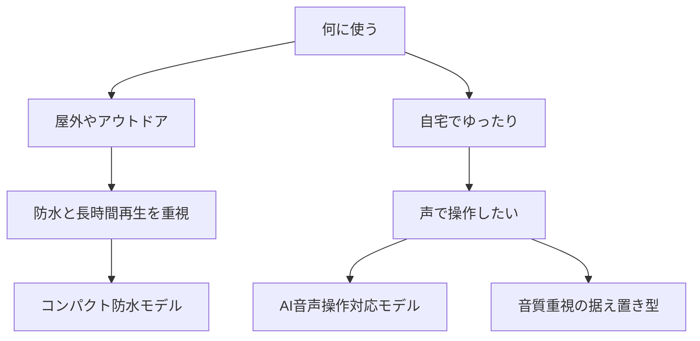

※本記事はアフィリエイト広告(PR)を含みます。

## この記事でわかること

「Bluetoothスピーカーがほしいけれど、種類が多すぎて選べない」「2026年の最新モデルではAI音声操作にも対応しているらしいけど、どれを選べばいいの?」——そんな悩みを持つ方に向けた記事です。

この記事を読むと、次のことがわかります。

- Bluetoothスピーカーを選ぶときに見るべき基本ポイント
- 2026年に注目される「AI音声操作対応モデル」の特徴と選び方
- 利用シーン別のおすすめの選定基準
- よくある疑問(防水は必要?無料アプリで何ができる?)への回答

専門用語はできるだけかみ砕いて説明していくので、はじめてスピーカーを買う方も安心して読み進めてください。

## そもそもBluetoothスピーカーとは?

Bluetoothスピーカーとは、スマホやパソコンと「Bluetooth(ブルートゥース)」という近距離の無線通信で接続して音を鳴らすスピーカーのことです。ケーブルでつながなくても音楽を流せるため、持ち運びや設置の自由度が高いのが魅力です。

近年は、声で操作できる「AI音声操作(音声アシスタント)」に対応したモデルも増えてきました。「OK Google」「Alexa」などと話しかけて、音楽の再生や音量調整、天気予報の確認まで手を使わずに行えます。

据え置き型のスマートスピーカーとの違いが気になる方は、[スマートスピーカーはどれを買うべき?Alexa・Google Home徹底比較](/2026/06/12/smart-speaker-comparison/)もあわせて読むと違いがはっきりします。

## Bluetoothスピーカーを選ぶ7つのポイント

まずは、AI機能の有無にかかわらず共通する基本のチェックポイントを押さえましょう。

### 1. 音質

音の良し悪しは「ドライバー(音を出す部品)」の大きさや数、対応する音声コーデック(音楽データの圧縮方式)で変わります。高音質を求めるなら「aptX」「LDAC」といった高音質コーデックに対応したモデルがおすすめです。ただし、スマホ側も同じコーデックに対応している必要があります。

### 2. バッテリー持ち(再生時間)

屋外やアウトドアで使うなら、連続再生時間は重要です。一般的に10〜24時間ほど再生できるモデルが多いですが、製品によって差があります。実際の数値は公式サイトで最新情報を確認してください。

### 3. 防水・防塵性能

お風呂やキャンプで使うなら防水性能は必須です。「IPX7」のように数字で表され、数字が大きいほど水に強くなります。IPX7なら一時的な水没にも耐えられるレベルです。

### 4. サイズと重さ

持ち運ぶなら軽量コンパクトなもの、自宅メインなら多少大きくても音質重視のものが向いています。

### 5. 接続の安定性

最新のBluetoothバージョン(5.0以降)に対応していると、接続が途切れにくく省電力です。

### 6. AI音声操作対応の有無

声で操作したいなら、AIアシスタント内蔵モデルを選びます。詳しくは後述します。

### 7. 価格

数千円のエントリーモデルから数万円の高級機まで幅広くあります。用途に合った価格帯を選びましょう。

## あなたに合うスピーカーの選び方フローチャート

下の図を使って、自分に合うタイプをざっくり絞り込んでみましょう。

## AI音声操作対応モデルの選び方

2026年のトレンドが、AIアシスタントを内蔵したBluetoothスピーカーです。ここでは選ぶときのポイントを整理します。

### 対応する音声アシスタントを確認する

スピーカーによって使えるアシスタントが異なります。普段使っているスマホやサービスに合わせて選ぶとスムーズです。

| アシスタント | 特徴 | 相性の良い人 |
|---|---|---|
| Amazon Alexa | スマート家電連携が豊富 | Echo製品を使っている人 |
| Google アシスタント | 検索や情報取得が得意 | Android中心の人 |
| Siri | Apple製品との連携が強い | iPhoneユーザー |

なお、AppleのSiriは2026年に大きく刷新されています。詳しくは[Siri AI発表まとめ｜Appleが新Siriを全面刷新、対応機種と日本語対応は?](/2026/06/15/apple-siri-ai-wwdc26/)で解説しています。

### スピーカー内蔵型かスマホ連携型か

AI音声操作には、大きく2タイプあります。

- **スピーカー単体で音声認識できるタイプ**:スピーカーに向かって話すだけで操作できる
- **スマホのアシスタントを呼び出すタイプ**:スマホのボタンや音声でアシスタントを起動して使う

手を使わずに操作したいなら、前者のマイク内蔵モデルがおすすめです。

### Wi-Fi対応もチェック

本格的にスマートスピーカーとして使いたいなら、Bluetoothに加えてWi-Fi接続にも対応したモデルが便利です。Wi-Fiなら、スマホが近くになくても単体で音楽配信サービスを再生できます。

まずは実機の人気モデルを見比べてみたい方は、こちらから探してみてください。

👉 [Amazonで「Bluetoothスピーカー 防水 AI音声操作」を見る](https://af.moshimo.com/af/c/click?a_id=5632371&p_id=170&pc_id=185&pl_id=38594&url=https%3A%2F%2Fwww.amazon.co.jp%2Fs%3Fk%3DBluetooth%25E3%2582%25B9%25E3%2583%2594%25E3%2583%25BC%25E3%2582%25AB%25E3%2583%25BC%2520%25E9%2598%25B2%25E6%25B0%25B4%2520AI%25E9%259F%25B3%25E5%25A3%25B0%25E6%2593%258D%25E4%25BD%259C)

## 利用シーン別のおすすめタイプ

### アウトドア・お風呂で使いたい

防水性能(IPX7など)と耐衝撃性を備えた、コンパクトモデルがおすすめです。カラビナ付きでバッグに引っ掛けられるタイプも人気です。

### 自宅でじっくり音楽を楽しみたい

大型ドライバー搭載で音質に優れた据え置き型が向いています。AIアシスタント内蔵なら、料理中や作業中でも声で操作できて便利です。

### デスクワークのお供にしたい

在宅ワーク環境を整えたい方は、スピーカー以外のガジェットも気になりますよね。[在宅ワークが捗るデスク周りガジェット10選\|快適環境の作り方](/2026/06/11/home-office-gadgets/)で、作業効率を上げる周辺機器をまとめています。

コスパ重視で選びたい方は、楽天のランキングもチェックしてみましょう。

👉 [楽天市場で「ワイヤレススピーカー Bluetooth 高音質」を探す](https://af.moshimo.com/af/c/click?a_id=5632328&p_id=54&pc_id=54&pl_id=616&url=https%3A%2F%2Fsearch.rakuten.co.jp%2Fsearch%2Fmall%2F%25E3%2583%25AF%25E3%2582%25A4%25E3%2583%25A4%25E3%2583%25AC%25E3%2582%25B9%25E3%2582%25B9%25E3%2583%2594%25E3%2583%25BC%25E3%2582%25AB%25E3%2583%25BC%2520Bluetooth%2520%25E9%25AB%2598%25E9%259F%25B3%25E8%25B3%25AA%2F)

## よくある質問(Q&A)

### Q. AI音声操作は無料で使える?

AlexaやGoogleアシスタントなどの基本的な音声操作機能は、追加料金なしで使えるのが一般的です。ただし、音楽配信サービス(Amazon MusicやSpotifyなど)を聴くには、各サービスの契約が別途必要な場合があります。詳しい対応範囲は購入前に公式サイトで最新情報を確認してください。

### Q. Bluetoothスピーカーとスマートスピーカーは何が違う?

Bluetoothスピーカーは「スマホと無線でつないで音を出す」のが主な役割で、持ち運びしやすいのが特徴です。一方スマートスピーカーは、Wi-Fiにつながり単体でAIアシスタントを使える据え置き型が中心です。最近は両方の機能を備えたモデルも増えています。

### Q. 複数台を同時に鳴らせる?

同じメーカーの対応モデル同士なら、2台をペアにしてステレオ再生したり、複数台を同時に鳴らしたりできる機能があります。パーティーや広い部屋で活躍します。

### Q. 音声操作とスマートウォッチは連携できる?

メーカーやアシスタントによっては連携できる場合があります。健康管理にも使えるウェアラブル機器が気になる方は、[AI搭載スマートウォッチおすすめ比較\|健康管理・睡眠分析に最適なのは?](/2026/06/17/ai-smartwatch-comparison/)も参考になります。

## まとめ

Bluetoothスピーカーを選ぶときは、次のポイントを意識すると失敗しにくくなります。

- **使うシーンを決める**:屋外なら防水と長時間再生、自宅なら音質を重視
- **音質はコーデックとドライバーで判断する**:高音質ならaptXやLDAC対応がおすすめ
- **AI音声操作は対応アシスタントを確認する**:普段使うスマホやサービスに合わせて選ぶ
- **本格活用ならWi-Fi対応モデルも検討する**

2026年はAI音声操作に対応したモデルがますます充実し、声だけで音楽も家電も操作できる時代になっています。まずは自分の使い方を整理し、この記事のフローチャートを参考にタイプを絞り込んでみてください。気になるモデルが見つかったら、価格や再生時間などの最新スペックは各メーカーの公式サイトで確認してから購入するのがおすすめです。あなたの生活にぴったりの一台が見つかりますように。
