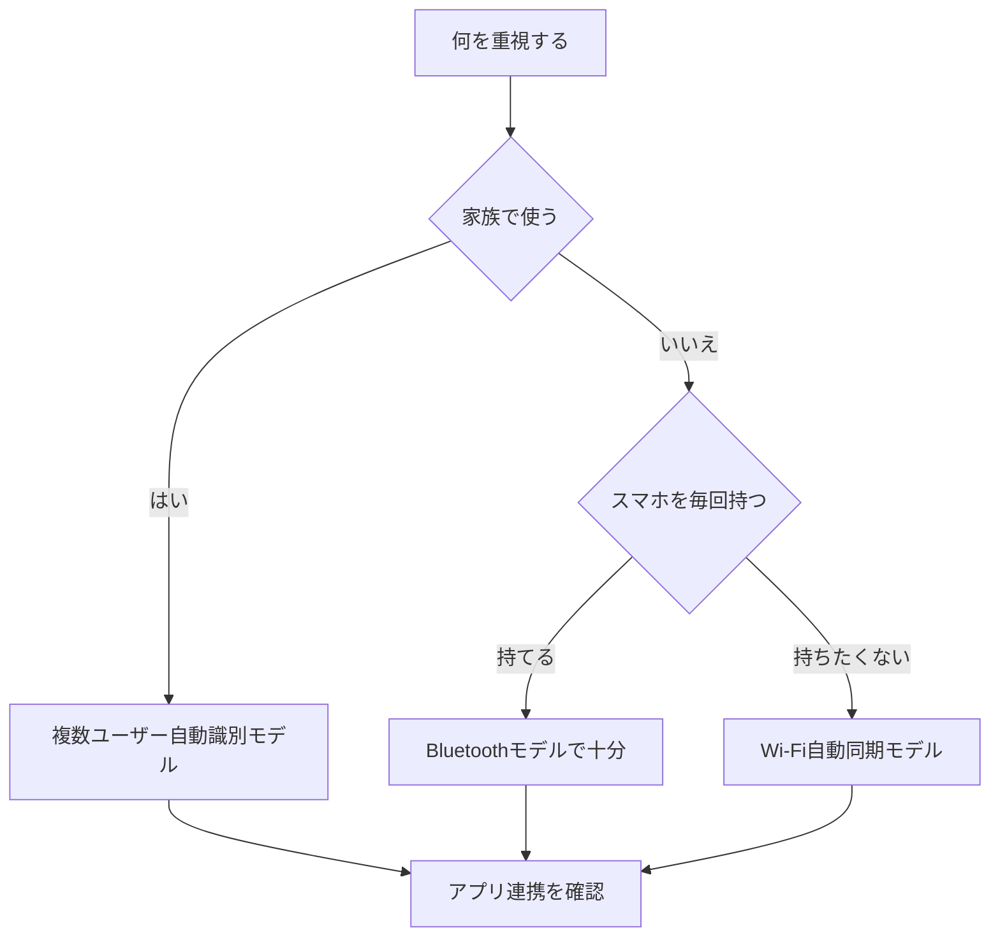

※本記事はアフィリエイト広告(PR)を含みます。

## この記事でわかること

「毎日体重を測ってもノートに書き写すのが面倒」「体脂肪率や筋肉量まで管理したいけど続かない」——そんな悩みをお持ちの方に向けて、この記事では**AI搭載体組成計・スマート体重計**の選び方とおすすめモデルの比較ポイントをわかりやすく解説します。

AI体組成計とは、乗るだけで体重だけでなく体脂肪率・筋肉量・基礎代謝などを測定し、スマホアプリに自動で記録してくれる体重計のことです。さらに最近のモデルはAIが測定データの傾向を分析し、健康状態のアドバイスまでしてくれます。この記事を読めば、自分に合った1台を選ぶための基準と、健康管理を「自動化」するコツがわかります。

## そもそもAI体組成計とは?普通の体重計との違い

まずは基本から整理しましょう。「体組成計(たいそせいけい)」とは、体重に加えて体を構成する成分(脂肪・筋肉・水分など)を推定する機器のことです。

従来の体重計との大きな違いは次の3点です。

- **測定項目が多い**:体重だけでなく、体脂肪率・筋肉量・基礎代謝・推定骨量・体内年齢などを測れる
- **アプリと自動連携**:Wi-FiやBluetoothでスマホに数値を送り、グラフで自動記録
- **AIによる分析**:測定データの推移をAIが読み取り、傾向や改善ポイントを提示してくれる

つまり、「測る→記録する→振り返る」という健康管理の手間を、ほぼ全自動にできるのが最大のメリットです。

### AIは具体的に何をしてくれるの?

メーカーによって差はありますが、AI機能では主に以下のようなことができます。

- 体重・体脂肪の増減傾向をグラフ化し、変化のクセを分析
- 目標体重までのペースを予測し、無理のない計画を提案
- 家族など複数ユーザーを自動で識別し、それぞれのデータを記録
- スマートウォッチや運動アプリと連携して、消費カロリーと合わせて管理

睡眠や運動と合わせて総合的に体調を管理したい方は、[AI搭載スマートウォッチおすすめ比較\|健康管理・睡眠分析に最適なのは?](/2026/06/17/ai-smartwatch-comparison/)も合わせて読むと、ウェアラブル機器との組み合わせ方がイメージしやすくなります。

## AI体組成計の選び方5つのポイント

選ぶ際にチェックしたい項目を、優先度の高い順にまとめました。

### 1. 測定できる項目

体脂肪率と筋肉量はほとんどのモデルで測れますが、内臓脂肪レベルや骨量、体内年齢などは機種によって異なります。「何を管理したいか」を先に決めておくと選びやすくなります。

### 2. アプリの使いやすさと連携先

毎日使うものなので、アプリの見やすさは重要です。また、Apple ヘルスケアやGoogle Fit、フィットネスアプリと連携できるかも確認しましょう。連携できると、データの活用範囲が一気に広がります。

### 3. 通信方式(Wi-Fi or Bluetooth)

- **Bluetooth**:測定時にスマホが近くにあれば同期。安価なモデルに多い
- **Wi-Fi**:スマホを持っていなくても自動でクラウドに同期。便利だがやや高価

### 4. 複数ユーザー対応

家族で使う場合は、自動で個人を識別してくれるモデルが便利です。対応人数も確認しておきましょう。

### 5. 精度と安全性

体組成は微弱な電流を流して推定する「生体インピーダンス法」という仕組みで測定します。妊娠中の方やペースメーカーを使用している方は使用を避けるべきモデルもあるため、購入前に必ず注意書きを確認してください。

## 選び方フローチャート

自分に合うタイプを下の図で確認してみましょう。

## タイプ別おすすめの選び方

具体的な価格は変動するため断定は避けますが、おおまかなタイプ別に整理しました。最新の価格・仕様は各メーカーの公式サイトでご確認ください。

| タイプ | 向いている人 | チェックポイント |
|---|---|---|
| エントリーモデル | まず気軽に始めたい人 | Bluetooth接続・基本項目중心 |
| 多機能モデル | 体脂肪や内臓脂肪まで管理したい人 | 測定項目の多さ・AI分析 |
| Wi-Fi自動同期モデル | 記録の手間を完全になくしたい人 | スマホ不要で自動記録 |
| 家族共用モデル | 家族みんなで使いたい人 | ユーザー自動識別・対応人数 |

各タイプとも、まずは実際に売れ筋モデルを見てみるとイメージがつかみやすくなります。

👉 [Amazonで「スマート体重計 体組成計 アプリ連携」を見る](https://af.moshimo.com/af/c/click?a_id=5632371&p_id=170&pc_id=185&pl_id=38594&url=https%3A%2F%2Fwww.amazon.co.jp%2Fs%3Fk%3D%25E3%2582%25B9%25E3%2583%259E%25E3%2583%25BC%25E3%2583%2588%25E4%25BD%2593%25E9%2587%258D%25E8%25A8%2588%2520%25E4%25BD%2593%25E7%25B5%2584%25E6%2588%2590%25E8%25A8%2588%2520%25E3%2582%25A2%25E3%2583%2597%25E3%2583%25AA%25E9%2580%25A3%25E6%2590%25BA)

楽天で探したい方はこちらからも比較できます。

👉 [楽天市場で「体組成計 wi-fi スマホ連携」を探す](https://af.moshimo.com/af/c/click?a_id=5632328&p_id=54&pc_id=54&pl_id=616&url=https%3A%2F%2Fsearch.rakuten.co.jp%2Fsearch%2Fmall%2F%25E4%25BD%2593%25E7%25B5%2584%25E6%2588%2590%25E8%25A8%2588%2520wi-fi%2520%25E3%2582%25B9%25E3%2583%259E%25E3%2583%259B%25E9%2580%25A3%25E6%2590%25BA%2F)

## 健康管理を自動化するコツ

せっかく良いモデルを買っても、続かなければ意味がありません。自動化を成功させるコツを紹介します。

- **置き場所を固定する**:洗面所など毎日通る場所に置くと、測定が習慣になります
- **測るタイミングを統一する**:朝起きてトイレ後など、同じ条件で測ると数値がブレにくくなります
- **数値に一喜一憂しない**:体組成は水分量などで変動します。AIが示す「週単位の傾向」を見るのがおすすめです
- **支出管理とセットにする**:健康のための食材費や運動費もまとめて管理したい方は、[家計簿アプリ×AIで節約\|自動で支出を見える化する方法を初心者向けに解説](/2026/06/15/ai-household-budget-app/)も参考になります

## よくある質問(Q&A)

### Q. スマホアプリは無料で使える?

多くのメーカーは専用アプリを無料で提供しています。ただし、AIによる高度な分析やコーチング機能の一部は有料プランになっている場合があります。購入前に「無料でどこまで使えるか」を公式サイトで確認しておくと安心です。

### Q. 測定値の精度はどれくらい正確?

家庭用体組成計は医療機器ほどの精度ではなく、あくまで「推定値」です。大切なのは絶対値そのものよりも、同じ条件で測り続けたときの「変化の傾向」です。継続して記録することで、自分の体の動きが見えてきます。

### Q. スマートウォッチがあれば体組成計はいらない?

スマートウォッチは心拍数や睡眠、活動量の計測が得意ですが、体脂肪率や筋肉量を正確に測るのは苦手です。両方を組み合わせると、運動・睡眠・体組成をまとめて把握できる理想的な健康管理環境が作れます。

### Q. 在宅ワークの運動不足対策にも使える?

はい。デスクワーク中心で体を動かす機会が減っている方ほど、数値の見える化が効果的です。立ち作業を取り入れたい方は[スタンディングデスクは効果ある?在宅ワーカーの実践レビュー観点まとめ](/2026/06/14/standing-desk-review/)も合わせてチェックしてみてください。

## まとめ

AI搭載体組成計・スマート体重計は、「乗るだけ」で体重・体脂肪・筋肉量などを自動記録し、AIが傾向を分析してくれる便利なガジェットです。最後にポイントを振り返りましょう。

- 選ぶときは**測定項目・アプリ・通信方式・複数ユーザー対応・精度**の5点をチェック
- 記録の手間を完全になくしたいなら**Wi-Fi自動同期モデル**が便利
- 続けるコツは**置き場所と測るタイミングの固定**、そして**週単位の傾向を見ること**
- スマートウォッチや家計簿アプリと組み合わせると、健康管理がさらに充実する

まずは自分が「何を管理したいか」を決めて、無理なく続けられる1台を選んでみてください。具体的な価格や最新の仕様は、必ず各メーカーの公式サイトや販売ページで最新情報を確認してから購入することをおすすめします。
