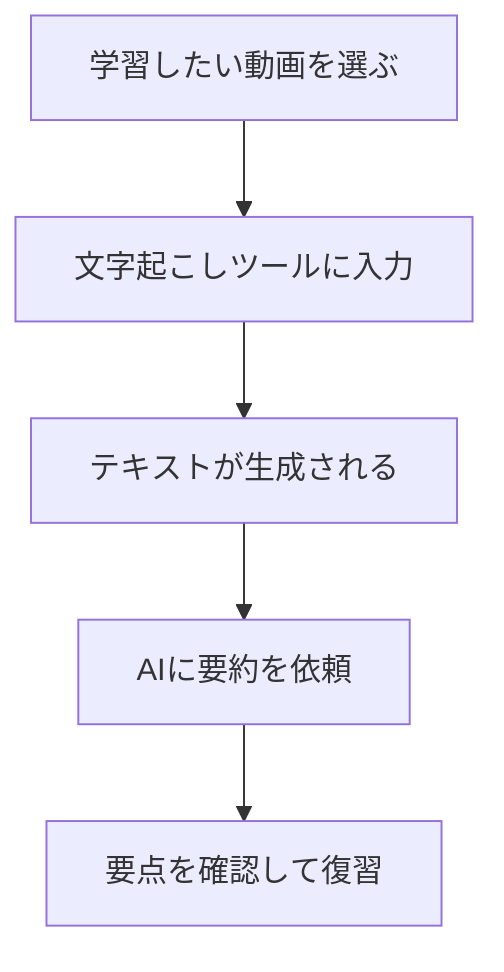

※本記事はアフィリエイト広告(PR)を含みます。

## この記事でわかること

「YouTubeで勉強したいけれど、動画が長くて時間が足りない…」そんな悩みはありませんか?この記事では、**AIで動画から文字起こし＆要約する方法**を、初心者の方にもわかりやすく解説します。YouTube学習に最適なツールの比較や、無料で使えるかどうかまで具体的に紹介するので、読み終わるころには自分に合ったツールを選んで今日から試せるようになります。

動画を文字に変換し、さらに要点をまとめてもらえば、1時間の解説動画も数分でポイントを把握できます。通勤時間やスキマ時間の学習効率がグッと上がりますよ。

## なぜAIで動画を文字起こし＆要約すると学習が捗るのか

まず、専門用語を簡単に説明しておきます。

- **文字起こし(トランスクリプト)**…動画や音声で話されている内容を、文章のテキストに変換すること。
- **要約(サマリー)**…長い文章の要点だけを短くまとめること。

この2つをAIに任せると、次のようなメリットがあります。

1. **時短になる** … 長い動画も要点だけ先に把握できる
2. **検索できる** … テキスト化すれば気になる箇所をキーワードで探せる
3. **復習しやすい** … 文字で残るのでノート代わりになる
4. **ながら学習に強い** … 移動中でもテキストでサッと読める

特にYouTubeには質の高い学習コンテンツが豊富にあるので、AIと組み合わせれば「観る学習」から「読む・まとめる学習」へと効率化できます。

## 動画を文字起こし＆要約する基本の流れ

大まかな手順は次のとおりです。難しい操作はほとんどありません。

YouTube動画なら**URLを貼り付けるだけ**で文字起こし＆要約まで一気にやってくれるツールもありますし、自分で録画した動画やセミナーの音声を使う場合は、音声・動画ファイルをアップロードする方法もあります。

## YouTube学習におすすめのツール比較

ここでは代表的な方法を、特徴ごとに比較します。なお、料金プランは変更されることが多いため、最新情報は必ず各公式サイトでご確認ください。

| ツール・方法 | 特徴 | こんな人向け |
| --- | --- | --- |
| YouTube標準の文字起こし機能 | 動画下の説明欄から自動字幕を表示・コピー可能 | まず無料で試したい人 |
| ChatGPT・Geminiなどの生成AI | テキストを貼り付けて要約・質問できる | 要約や深掘りをしたい人 |
| 専用の動画要約サービス | URLを貼るだけで要約まで自動 | 手間を最小にしたい人 |
| 文字起こし特化アプリ | 録音・録画ファイルを高精度にテキスト化 | 自分の動画・会議を扱う人 |

### 1. まずは無料のYouTube標準機能から

YouTubeには自動字幕(キャプション)機能があり、動画の説明欄にある「文字起こしを表示」からテキストを取り出せます。これをコピーして生成AIに貼り付けるだけでも、立派な要約フローが完成します。コストをかけたくない方の最初の一歩としておすすめです。

### 2. 生成AIで要約・質問する

取り出したテキストを**ChatGPTやGemini、Claude**などに貼り付け、「この内容を箇条書きで5つに要約して」「初心者向けにわかりやすく説明して」とお願いすれば、目的に合わせたまとめが手に入ります。

どのAIチャットを使うか迷っている方は、[ChatGPTとClaudeとGeminiを徹底比較!初心者におすすめのAIチャットはどれ?](/2026/06/09/ai-chat-comparison/)も参考にしてみてください。

また、思い通りの要約を引き出すには指示の出し方が大切です。[AIプロンプトのコツ\|思い通りの回答を引き出す書き方を初心者向けに解説](/2026/06/22/ai-prompt-tips/)を読むと、要約の精度がさらに上がりますよ。

### 3. URLを貼るだけの自動要約サービス

動画のURLを入力するだけで、文字起こしから要約、章ごとのまとめまで自動で行ってくれるWebサービスも増えています。手間をかけたくない方には最適ですが、無料枠に回数制限があることが多いので、使う頻度に応じて有料プランを検討すると良いでしょう。

## よくある質問(Q&A)

### Q. AIの動画要約は無料で使えるの?

はい、多くの方法は無料で始められます。YouTubeの自動字幕や、ChatGPT・Geminiの無料版を組み合わせれば0円で文字起こし＆要約が可能です。ただし、無料版は長文の処理回数や精度に制限があることもあります。本格的に使うなら有料版が快適です。ChatGPTの有料版が自分に必要か迷う方は、[ChatGPT有料版は必要?無料版との違いと元が取れる使い方を解説](/2026/06/20/chatgpt-paid-vs-free/)をチェックしてみましょう。

### Q. 文字起こしの精度はどのくらい?

近年のAIはかなり高精度ですが、専門用語や固有名詞、聞き取りにくい音声では誤変換が起こることがあります。要約前にざっと見直すと安心です。会議やインタビューなど、より高い精度が必要な場面は[AI文字起こしツールおすすめ比較\|会議・インタビューに最適なのは?](/2026/06/12/ai-transcription-comparison/)で詳しいツールを紹介しています。

### Q. もっと快適に学習するには?

音声をクリアに聞き取れる環境があると、文字起こしの精度も上がり学習もはかどります。ノイズを抑えられるイヤホンがあると、移動中の「ながら学習」も快適です。

👉 [Amazonで「ワイヤレスイヤホン ノイズキャンセリング」を見る](https://af.moshimo.com/af/c/click?a_id=5632371&p_id=170&pc_id=185&pl_id=38594&url=https%3A%2F%2Fwww.amazon.co.jp%2Fs%3Fk%3D%25E3%2583%25AF%25E3%2582%25A4%25E3%2583%25A4%25E3%2583%25AC%25E3%2582%25B9%25E3%2582%25A4%25E3%2583%25A4%25E3%2583%259B%25E3%2583%25B3%2520%25E3%2583%258E%25E3%2582%25A4%25E3%2582%25BA%25E3%2582%25AD%25E3%2583%25A3%25E3%2583%25B3%25E3%2582%25BB%25E3%2583%25AA%25E3%2583%25B3%25E3%2582%25B0)

自分で動画や音声を録音して文字起こしする場合は、専用のボイスレコーダーがあると便利です。

👉 [楽天市場で「AI ボイスレコーダー」を探す](https://af.moshimo.com/af/c/click?a_id=5632328&p_id=54&pc_id=54&pl_id=616&url=https%3A%2F%2Fsearch.rakuten.co.jp%2Fsearch%2Fmall%2FAI%2520%25E3%2583%259C%25E3%2582%25A4%25E3%2582%25B9%25E3%2583%25AC%25E3%2582%25B3%25E3%2583%25BC%25E3%2583%2580%25E3%2583%25BC%2F)

## 学習を効率化する組み合わせ術

要約したテキストは、そのまま保存するだけでなく整理して使うと記憶に定着しやすくなります。例えば、要約結果をノートアプリにまとめたり、マインドマップ化したりする方法があります。

- 要点をノートアプリで一元管理する
- キーワードを図解にして全体像をつかむ
- 定期的に見返して復習する

アイデアや学んだ内容を整理したい方は、[AIマインドマップ作成ツール比較\|アイデア整理を自動化する5選](/2026/06/27/ai-mindmap-tools/)も合わせて読むと、学習効率をさらに高められます。

## まとめ

AIを使えば、長いYouTube動画でも文字起こし＆要約で効率よく学べます。最後にポイントを整理しましょう。

- まずは**YouTubeの無料字幕＋生成AI**で気軽に始めるのがおすすめ
- 手間を減らしたいなら**URLを貼るだけの自動要約サービス**
- 自分の動画・会議を扱うなら**文字起こし特化ツール**
- 料金や機能は変わりやすいので、最新情報は必ず公式サイトで確認を

今日からさっそく、気になる学習動画でAI文字起こし＆要約を試してみてください。スキマ時間がそのまま学びの時間に変わりますよ。
