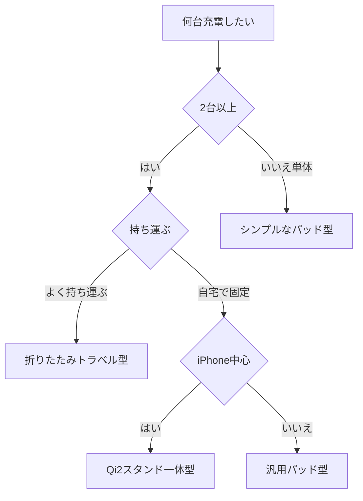

※本記事はアフィリエイト広告(PR)を含みます。

## ワイヤレス充電器の選び方2026|まず結論から

「スマホもイヤホンもスマートウォッチも、ケーブルだらけで充電が面倒……」そんな悩みを一気に解決してくれるのが、**複数デバイス同時充電できるワイヤレス充電器**です。この記事を読むと、2026年時点でのワイヤレス充電器の選び方の基準と、複数台を一度に充電したい人がチェックすべき比較ポイント、そして自分に合ったタイプの見つけ方がわかります。

ワイヤレス充電器とは、ケーブルを挿さずに、置くだけでスマホなどを充電できる機器のことです。スマホの裏面と充電器のコイル（電気を送る部品）が反応して電気が流れる仕組みで、「Qi（チー）」という国際規格に対応しているのが基本です。難しい言葉も後ほど一つずつ説明しますので、安心して読み進めてください。

## ワイヤレス充電器を選ぶ前に知っておきたい3つの基礎用語

比較表を読む前に、最低限おさえておきたい言葉を整理します。

- **Qi（チー）/ Qi2（チーツー）**：ワイヤレス充電の世界共通規格です。Qi2はその新しいバージョンで、磁石でピタッと位置が合う「マグネット式」に対応し、充電効率が上がっています。iPhoneの「MagSafe」とも相性が良いのが特徴です。
- **出力（W＝ワット）**：充電のパワーを表す数値です。数字が大きいほど速く充電できる傾向がありますが、機種によって対応する上限が決まっています。
- **同時充電**：1台の充電器で、スマホ・イヤホン・スマートウォッチなど複数を同時に充電できる機能のことです。

## 複数デバイス同時充電タイプの種類

「同時充電できる」と一口に言っても、形はいくつかあります。自分の持ち物に合わせて選びましょう。

### 1. スタンド一体型（2〜3台向け）

スマホを立てかけられるスタンドに、イヤホン置き場やウォッチ用の充電部がついた一体型です。デスクや寝室の定位置に置きやすく、動画を見ながら充電できるのが便利です。在宅ワークのデスクに置くなら特におすすめで、[在宅ワークが捗るデスク周りガジェット10選](/2026/06/11/home-office-gadgets/)とあわせて環境を整えると快適さが一気に上がります。

### 2. パッド（マット）型

平らな板の上に複数のデバイスを横並びで置くタイプです。場所を選ばず、どこに置いても充電できる自由度が魅力ですが、置く位置がずれると充電が始まらないこともあります。

### 3. 折りたたみ・トラベル型

3つ折りにして持ち運べるコンパクトなタイプです。出張や旅行が多い人に向いています。Apple製品をまとめて使っている人は、Apple Watchの充電に対応しているかを必ず確認しましょう。スマートウォッチ選びで迷っている方は[AI搭載スマートウォッチおすすめ比較](/2026/06/17/ai-smartwatch-comparison/)も参考になります。

## 失敗しないための5つの比較ポイント

買ってから後悔しないために、次の5点をチェックしてください。

| チェック項目 | 見るべきポイント |
| --- | --- |
| 同時充電できる台数 | 自分の持ち物（スマホ・イヤホン・ウォッチ）に合うか |
| 規格 | Qi2 / MagSafe対応だと位置合わせがラク |
| 出力（W数） | 手持ち機種の対応上限と合っているか |
| 対応機種 | Apple Watchやイヤホンに本当に対応しているか |
| 安全性 | 過熱・過充電を防ぐ保護機能や認証マークの有無 |

特に見落としやすいのが**対応機種**です。「3台同時充電」とうたっていても、Apple Watchには非対応だったり、特定メーカーのイヤホンしか置けなかったりするケースがあります。購入前に必ず手持ちのデバイスが対応リストに入っているか確認しましょう。

なお、具体的な価格や最大出力はモデルや時期によって変わります。気になる商品を見つけたら、必ず公式サイトや販売ページで最新情報を確認してください。

## あなたに合うタイプはどれ?選び方フローチャート

迷ったら、次の流れで考えると選びやすくなります。

このように「台数 → 持ち運びの有無 → 主に使う機種」の順で絞り込むと、自分にぴったりのタイプが見えてきます。

## おすすめの探し方と購入のコツ

ワイヤレス充電器は同じような見た目でも品質に差があります。レビュー件数が多く、メーカー保証がしっかりした製品を選ぶと安心です。複数デバイス対応モデルは種類が豊富なので、まずは比較しながら探してみましょう。

👉 [Amazonで「ワイヤレス充電器 3in1 Qi2」を見る](https://af.moshimo.com/af/c/click?a_id=5632371&p_id=170&pc_id=185&pl_id=38594&url=https%3A%2F%2Fwww.amazon.co.jp%2Fs%3Fk%3D%25E3%2583%25AF%25E3%2582%25A4%25E3%2583%25A4%25E3%2583%25AC%25E3%2582%25B9%25E5%2585%2585%25E9%259B%25BB%25E5%2599%25A8%25203in1%2520Qi2)

👉 [楽天市場で「ワイヤレス充電器 複数同時充電」を探す](https://af.moshimo.com/af/c/click?a_id=5632328&p_id=54&pc_id=54&pl_id=616&url=https%3A%2F%2Fsearch.rakuten.co.jp%2Fsearch%2Fmall%2F%25E3%2583%25AF%25E3%2582%25A4%25E3%2583%25A4%25E3%2583%25AC%25E3%2582%25B9%25E5%2585%2585%25E9%259B%25BB%25E5%2599%25A8%2520%25E8%25A4%2587%25E6%2595%25B0%25E5%2590%258C%25E6%2599%2582%25E5%2585%2585%25E9%259B%25BB%2F)

また、外出先でもワイヤレス充電を使いたい場合は、ワイヤレス出力に対応したモバイルバッテリーという選択肢もあります。容量や安全性の選び方は[モバイルバッテリーの選び方2026](/2026/06/13/mobile-battery-guide-2026/)で詳しく解説しているので、あわせてご覧ください。

## よくある質問（Q&A）

### Q. ワイヤレス充電はケーブル充電より遅いですか?

A. 一般的にはケーブル充電の方が速い傾向があります。ただし、Qi2やマグネット式の登場で差は縮まっており、「夜に置いて朝まで充電」「デスクで作業しながら充電」といった使い方なら速度はほとんど気になりません。急いで充電したいときだけケーブルを使う、と割り切るのもおすすめです。

### Q. スマホケースを付けたままでも充電できますか?

A. 厚さ数ミリ程度のケースなら多くの場合そのまま充電できます。ただし、金属プレートや分厚いケースは充電を妨げることがあります。MagSafe対応ケースなら磁石でしっかり吸着するので、ズレにくく安心です。

### Q. 安い無名メーカーの製品でも大丈夫?

A. 充電器は発熱やバッテリーに関わる機器なので、安全性は重視したいところです。過熱を防ぐ保護機能や、PSEマーク（日本の電気用品安全法の適合マーク）の有無を確認しましょう。価格だけで選ばず、レビューや認証もチェックすると失敗しにくくなります。

## まとめ

ワイヤレス充電器を選ぶときは、次のポイントを押さえれば失敗しにくくなります。

- **同時に充電したい台数**を最初に決める
- **Qi2 / MagSafe対応**なら位置合わせがラクで効率も良い
- 手持ちの**機種が対応しているか**を必ず確認する
- **出力（W数）と安全性**（保護機能・認証マーク）をチェックする
- 持ち運ぶなら折りたたみ型、自宅固定ならスタンド型が便利

ケーブルのごちゃつきから解放されると、デスク周りも気持ちもスッキリします。まずは自分の持ち物を書き出して、何台同時に充電したいかを決めるところから始めてみましょう。気になるモデルを見つけたら、最新の価格や対応機種を公式ページで確認したうえで、快適なワイヤレス充電生活を手に入れてください。
