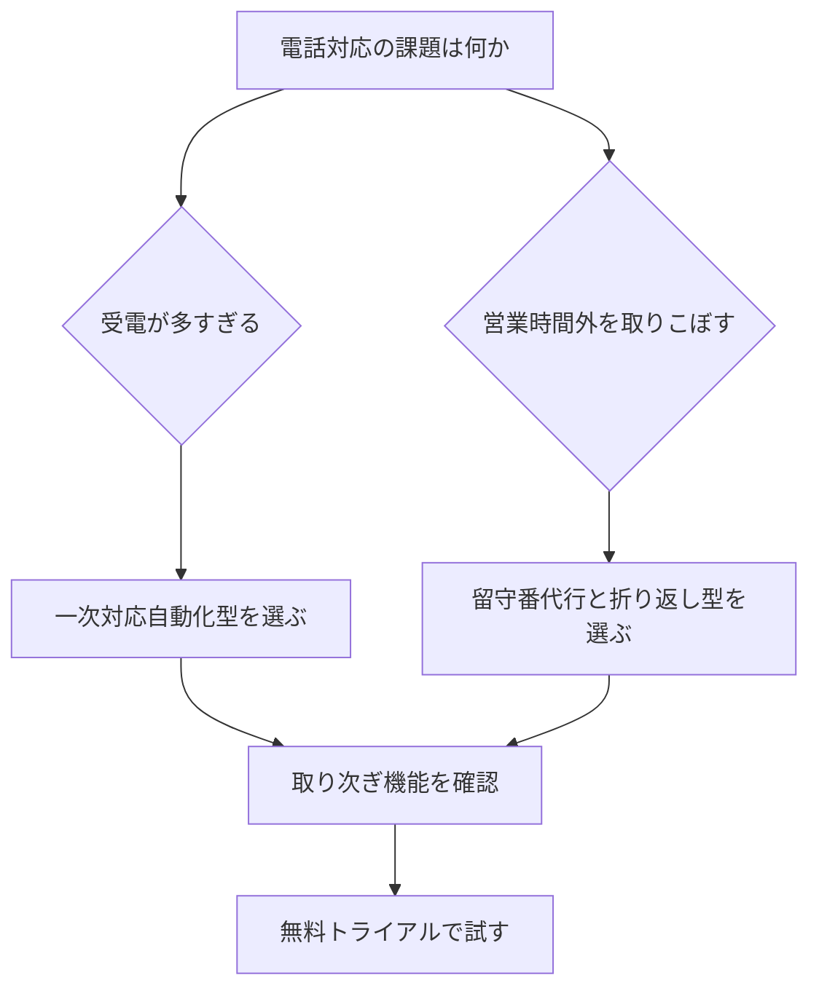

※本記事はアフィリエイト広告(PR)を含みます。

## AIコールセンター・電話応答ツールとは?この記事でわかること

「電話対応に追われて本業が進まない」「少人数なので電話が鳴ると手が止まる」——そんな悩みを抱える中小企業の方に注目されているのが、AIコールセンター・電話応答ツールです。これは、人間の代わりにAI(人工知能)が電話を受け、用件を聞き取り、必要に応じて担当者へ取り次いだり、よくある質問に自動で答えたりしてくれるサービスのことです。

この記事を読むと、次のことがわかります。

- AI電話応答ツールでできること・できないこと
- 中小企業がツールを選ぶときに見るべきポイント
- 代表的なツールの比較と料金の考え方
- 導入の流れと、失敗しないためのコツ

専門知識がなくても理解できるように、用語にはやさしい説明を添えながら進めていきます。

## AI電話応答ツールでできること

ひと口に「AIが電話に出る」といっても、機能はさまざまです。代表的なものを整理しました。

### 1. 自動音声応答(IVRの進化版)

IVR(アイブイアール)とは「お問い合わせの方は1を、ご予約の方は2を…」という自動音声ガイダンスのことです。従来は番号を押す方式が中心でしたが、AIを使うと**話し言葉をそのまま理解**して案内できるようになります。お客様は「予約をしたいです」と話すだけで適切な対応につながります。

### 2. 一次対応・よくある質問への自動回答

営業時間や住所、料金など、毎回同じ質問に答える手間をAIが肩代わりします。これにより、スタッフは複雑な相談に集中できます。

### 3. 用件の聞き取りとテキスト化

AIが通話内容を文字に起こし、要約して担当者へ通知します。聞き間違いや伝言ミスを減らせるのが大きなメリットです。通話の文字起こし技術に興味がある方は、[AI文字起こしツールおすすめ比較](/2026/06/12/ai-transcription-comparison/)もあわせて参考になります。

### 4. 折り返し予約・取り次ぎ

営業時間外の電話を取りこぼさず、「あとで折り返します」と伝えて予約を取る、といった使い方も可能です。

## 中小企業がツールを選ぶときの5つのポイント

ツール選びで迷ったら、次の5点を確認しましょう。

| 比較ポイント | チェック内容 |
|---|---|
| 料金体系 | 月額固定か従量課金か。通話時間で増えないか |
| 日本語の精度 | 自然な日本語を聞き取り・発話できるか |
| 既存電話との連携 | 今の電話番号をそのまま使えるか |
| 取り次ぎ機能 | 人へのエスカレーション(引き継ぎ)が可能か |
| 導入の手軽さ | 専門知識なしで設定できるか |

とくに中小企業では、**「初期費用を抑えて、まずは小さく試せるか」**が重要です。最低契約期間が長いプランは慎重に検討しましょう。

### 自分に合うタイプの選び方フローチャート

## 代表的なAI電話応答ツールの比較

ここでは、中小企業でよく検討されるタイプを整理します。具体的なサービス名や料金は改定が多いため、必ず各公式サイトで最新情報を確認してください。

### クラウド型電話応答サービス

インターネット経由で使える月額制のサービスです。電話番号の取得から自動応答まで一括で提供され、初期投資が少なく済むのが魅力です。小規模オフィスや店舗に向いています。

### 既存の電話に追加するAIオペレーターサービス

今使っている電話番号はそのままに、AIが応答だけを担当するタイプです。番号を変えたくない事業者に適しています。

### チャットボットと連携できる総合型

電話だけでなく、Webサイトのチャット対応も同時に自動化したい場合に便利です。問い合わせ窓口をまとめて効率化できます。Webからの問い合わせ対応も強化したい方は、[AIチャットボットを自社サイトに導入する方法](/2026/06/18/ai-chatbot-website/)で具体的な選び方を解説しています。

なお、AIが話す音声の自然さも顧客満足度に関わります。合成音声の品質を知りたい方は[AI音声読み上げツールおすすめ比較](/2026/06/16/ai-voice-narration-tools/)も参考になるでしょう。

## AI電話応答ツールは無料で使える?

結論から言うと、**「完全無料で本格運用」は難しいものの、無料トライアルや小規模な無料枠を用意しているサービスは多い**です。

- 無料トライアル(数日〜2週間)で使い勝手を確認できるツールが一般的
- 月数十件程度の少量なら低価格プランで始められる場合がある
- 通話量が増えると従量課金で費用がかさむことがあるため注意

まずは無料トライアルで「自社の業種特有の言い回しをきちんと聞き取れるか」を試すのがおすすめです。料金は変動しやすいので、申し込み前に公式サイトで最新の条件を必ず確認してください。

## 導入の流れ

初めてでも、おおむね次のステップで進められます。

1. **課題を整理する**:受電件数が多いのか、時間外対応なのかを明確にする
2. **2〜3社の無料トライアルを比較する**:日本語精度と取り次ぎを重点チェック
3. **応答シナリオを作る**:よくある質問と回答をリスト化して登録
4. **少人数・一部業務から試験運用**:いきなり全面導入しない
5. **通話ログを見て改善**:答えられなかった質問を追加学習させる

AIの応答内容を確認・修正する担当者を一人決めておくと、運用がスムーズになります。

### 音声品質を上げる周辺機器も大切

人が取り次ぎ対応する場面では、聞き取りやすいヘッドセットがあると通話品質が安定します。在宅スタッフが対応する体制なら、ノイズを抑えられる機材への投資も検討しましょう。

👉 [Amazonで「コールセンター ヘッドセット ノイズキャンセリング」を見る](https://af.moshimo.com/af/c/click?a_id=5632371&p_id=170&pc_id=185&pl_id=38594&url=https%3A%2F%2Fwww.amazon.co.jp%2Fs%3Fk%3D%25E3%2582%25B3%25E3%2583%25BC%25E3%2583%25AB%25E3%2582%25BB%25E3%2583%25B3%25E3%2582%25BF%25E3%2583%25BC%2520%25E3%2583%2598%25E3%2583%2583%25E3%2583%2589%25E3%2582%25BB%25E3%2583%2583%25E3%2583%2588%2520%25E3%2583%258E%25E3%2582%25A4%25E3%2582%25BA%25E3%2582%25AD%25E3%2583%25A3%25E3%2583%25B3%25E3%2582%25BB%25E3%2583%25AA%25E3%2583%25B3%25E3%2582%25B0)

## 導入時の注意点

- **複雑なクレーム対応はAIに任せきりにしない**:感情的な対応は人が引き継ぐ設計に
- **個人情報の取り扱い**:通話録音やデータ保管のルールを確認する
- **過度な自動化を避ける**:「人につながらない」という不満を生まないよう、いつでも担当者に切り替えられる導線を残す

AIはあくまで「業務を軽くする道具」です。お客様にとって心地よい体験になるよう、人とAIの役割分担を設計することが成功のカギになります。

## まとめ

AIコールセンター・電話応答ツールは、人手が限られる中小企業にとって、電話対応の負担を大きく減らせる心強い味方です。最後にポイントを振り返ります。

- AIは一次対応・FAQ自動回答・用件の文字起こし・折り返し予約などをこなせる
- 選ぶときは料金体系・日本語精度・既存電話との連携・取り次ぎ・導入の手軽さを確認
- 完全無料は難しいが、無料トライアルでまず試すのがおすすめ
- 複雑な対応は人が引き継ぐ「役割分担」で顧客満足度を保つ

まずは気になるツールの無料トライアルに申し込み、自社の電話で実際に試してみましょう。小さく始めて少しずつ改善していくことが、業務効率化への一番の近道です。
