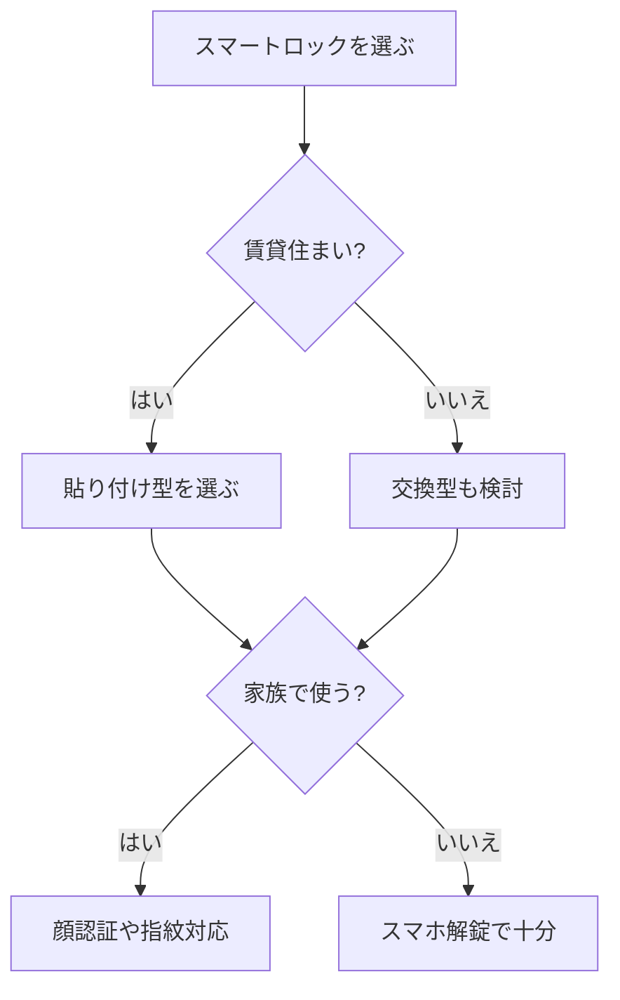

※本記事はアフィリエイト広告(PR)を含みます。

## この記事でわかること

「鍵を持ち歩くのが面倒」「鍵を閉め忘れて不安になる」——そんな悩みを解決してくれるのが、**AI搭載スマートロック**です。この記事では、2026年に注目したいスマートロックのおすすめポイントや選び方を、初心者の方にもわかりやすく比較しながら解説します。

スマートロックとは、玄関ドアの鍵を**スマホや顔認証、指紋などで開け閉めできるようにする機器**のこと。最近はAIが「いつもの帰宅パターン」を学習したり、不審な動きを検知したりと、ますます賢くなっています。読み終えるころには、自分の住まいに合った1台の選び方がはっきりイメージできるはずです。

## AI搭載スマートロックでできること

まずは、最新のスマートロックでどんなことができるのかを整理しておきましょう。

- **スマホ解錠**:アプリやBluetoothで、ポケットからスマホを出さずに解錠できる
- **顔認証**:カメラに顔を向けるだけで解錠。荷物で両手がふさがっていても便利
- **指紋・暗証番号**:スマホを持たない家族でも使える
- **オートロック**:閉め忘れを自動で防ぐ
- **遠隔操作**:外出先からスマホで施錠状態を確認・操作できる
- **AIによる学習・通知**:解錠履歴を記録し、いつもと違う動きを通知

とくにAI機能は、「子どもが帰宅したらスマホに通知」「不在時の不審な操作を検知」といった**見守り・防犯の面**で力を発揮します。一人暮らしや共働き家庭にうれしい機能ですね。

## スマートロックの選び方5つのポイント

### 1. 解錠方法で選ぶ

もっとも重要なのが「どうやって開けるか」です。スマホ解錠だけのモデルは比較的安価ですが、**顔認証や指紋認証に対応したモデルは利便性が一段上**がります。家族構成に合わせて選びましょう。

### 2. 取り付け方式(賃貸かどうか)

スマートロックには、大きく分けて2つの取り付け方式があります。

| 方式 | 特徴 | 向いている人 |
|------|------|------------|
| 貼り付け型 | 両面テープで設置。工事不要で原状回復しやすい | 賃貸住まいの人 |
| 交換型 | 既存の鍵やシリンダーを交換する | 持ち家でしっかり固定したい人 |

賃貸の場合は、**ドアに穴を開けない貼り付け型**が安心です。

### 3. 電源・バッテリーの持ち

多くのスマートロックは乾電池や充電式バッテリーで動きます。電池切れで締め出されないよう、**残量通知機能があるか**を確認しましょう。

### 4. スマートホーム連携

スマートスピーカーと連携すれば「ただいま」で解錠、といった使い方も可能です。AlexaやGoogle Homeとの相性は、[スマートスピーカーはどれを買うべき?Alexa・Google Home徹底比較](/2026/06/12/smart-speaker-comparison/)も参考にしてみてください。

### 5. セキュリティの強さ

通信の暗号化や、解錠ログの記録機能があるかは要チェック。鍵という性質上、**セキュリティの信頼性**は妥協しないようにしましょう。

## 選び方フローチャート

自分に合ったタイプを、次の流れで絞り込んでみましょう。

## タイプ別おすすめの選び方

### コスパ重視ならスマホ解錠タイプ

まずは手軽に始めたい方には、**貼り付け型のスマホ解錠モデル**がおすすめです。数千円〜1万円台から見つかり、工事不要ですぐ使えます。

👉 [Amazonで「スマートロック スマホ解錠」を見る](https://af.moshimo.com/af/c/click?a_id=5632371&p_id=170&pc_id=185&pl_id=38594&url=https%3A%2F%2Fwww.amazon.co.jp%2Fs%3Fk%3D%25E3%2582%25B9%25E3%2583%259E%25E3%2583%25BC%25E3%2583%2588%25E3%2583%25AD%25E3%2583%2583%25E3%2582%25AF%2520%25E3%2582%25B9%25E3%2583%259E%25E3%2583%259B%25E8%25A7%25A3%25E9%258C%25A0)

### 利便性重視なら顔認証・指紋タイプ

家族みんなで使うなら、顔認証や指紋認証に対応したモデルが快適です。両手がふさがっていても、カメラの前に立つだけで解錠できます。価格はやや高めですが、毎日の使い勝手は格段に向上します。

👉 [楽天市場で「スマートロック 顔認証」を探す](https://af.moshimo.com/af/c/click?a_id=5632328&p_id=54&pc_id=54&pl_id=616&url=https%3A%2F%2Fsearch.rakuten.co.jp%2Fsearch%2Fmall%2F%25E3%2582%25B9%25E3%2583%259E%25E3%2583%25BC%25E3%2583%2588%25E3%2583%25AD%25E3%2583%2583%25E3%2582%25AF%2520%25E9%25A1%2594%25E8%25AA%258D%25E8%25A8%25BC%2F)

価格や対応機種は時期によって変わるため、購入前に**公式サイトや販売ページで最新情報を確認**してください。

## よくある質問(Q&A)

### Q. スマートロックは賃貸でも使える?

はい、**貼り付け型を選べば賃貸でも使えます**。ドアに穴を開けず、両面テープで固定するため、退去時にはがせば原状回復が可能です。ただし、ドアの形状や鍵の位置によっては設置できない場合があるので、購入前に対応サムターン(内側のつまみ)の形を確認しましょう。

### Q. 電池が切れたら締め出される?

多くのモデルは電池残量が少なくなるとスマホに通知が届きます。さらに、物理鍵を併用できる設計になっている製品が多いので、いざというときも安心です。心配な方は**物理鍵が使えるモデル**を選びましょう。

### Q. ほかの見守り機器と組み合わせたほうがいい?

防犯や見守りを強化したいなら、センサー類との併用が効果的です。離れて暮らす家族の安否確認には、[AI見守りセンサー比較2026\|高齢者・一人暮らしの安心対策ガイド](/2026/06/26/ai-monitoring-sensor-2026/)もあわせてチェックしてみてください。

## 快適なスマートホームへの第一歩に

スマートロックは、スマートホーム化の「入り口」としても人気の高いアイテムです。鍵だけでなく、照明や掃除も自動化すれば、暮らしはさらに快適になります。あわせて検討したい方は、[AI搭載スマート電球の選び方｜音声操作で快適な部屋を作る方法](/2026/06/23/smart-bulb-guide/)もおすすめです。

## まとめ

AI搭載スマートロックは、鍵を持ち歩く手間や閉め忘れの不安から解放してくれる便利なガジェットです。最後に選び方のポイントをおさらいしましょう。

- **解錠方法**:手軽さ重視ならスマホ解錠、利便性重視なら顔認証・指紋
- **取り付け方式**:賃貸なら貼り付け型が安心
- **電源**:残量通知や物理鍵併用で締め出し対策
- **連携・防犯**:スマートスピーカーや見守りセンサーと組み合わせると効果的

まずは自分の住まいが賃貸か持ち家か、家族で使うかどうかを基準に、今回紹介したフローチャートで候補を絞ってみてください。価格や仕様は変動するため、最終的な購入は**公式サイトで最新情報を確認**したうえで、ぴったりの1台を見つけましょう。
