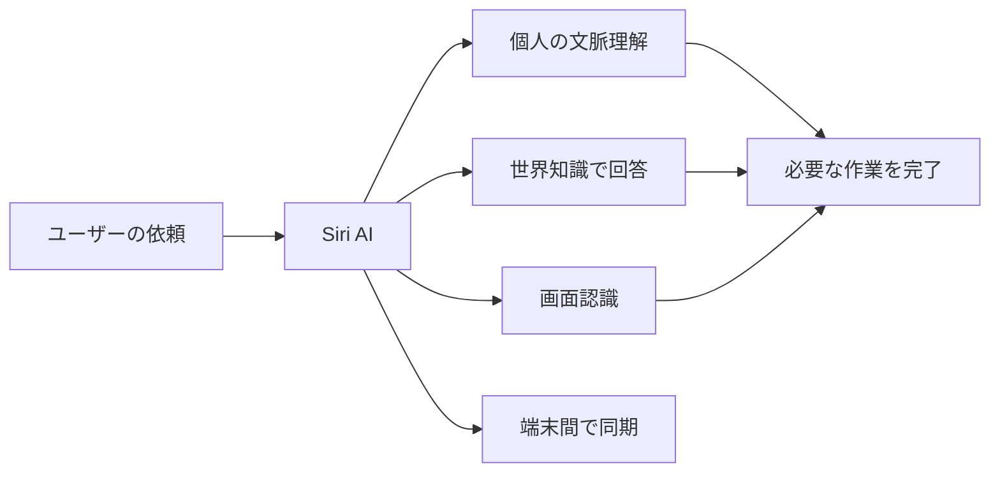

※本記事はアフィリエイト広告(PR)を含みます。

「Siriがやっと賢くなるって本当?」「自分のiPhoneは新しいSiri AIに対応しているの?」——そんな疑問を持って検索した方に向けた記事です。

Appleが年次開発者会議「WWDC26」（2026年6月）で、まったく新しいバージョンのSiri、その名も**「Siri AI」**を発表しました。この記事を読むと、**Siri AIで何ができるようになるのか／対応機種はどれか／いつから使えるのか／日本語対応はどうなるのか／料金はかかるのか**が、初心者の方でもひととおりわかります。

直近1週間ではOpenAIの新モデル「GPT-5.6」など大きな発表も続きましたが、こちらは限定プレビュー中で一般の人がすぐ触れません。そこで今回は、日本のiPhoneユーザーに直接関わる「Siri AI」を取り上げます。

## そもそも何が発表されたの?

Appleが発表したのは、同社のAI基盤「**Apple Intelligence**（アップル・インテリジェンス＝iPhoneなどに組み込まれたApple独自のAI機能群）」を土台にした、まったく新しいSiriです。

これまでのSiriは「タイマーをセットして」「天気を教えて」といった単純な指示が中心でした。新しいSiri AIは、次の3つの力を備えた、はるかに会話的で高機能なアシスタントへと進化します。

- **個人的な文脈の理解**：あなたのメッセージ・メール・写真などから関連情報を引き出して手伝ってくれる
- **広範な世界知識**：ウェブ上のほぼあらゆるトピックの質問に答えられる
- **画面認識（onscreen awareness）**：いまiPhoneの画面に表示されている内容について質問できる

さらに、製品をまたいで会話を見返せる専用アプリ、強化された「Visual Intelligence（カメラや画面の情報を読み取る機能）」、文章作成を助ける統合ツールなども含まれます。プライバシー保護のために設計された新しいアーキテクチャを持つのも特徴です。

また基盤面では、AppleがGoogleの「**Gemini**（グーグルの生成AI）」を活用してApple Intelligenceを強化し、Siri AIの実現に道筋をつけたと報じられています。

## 読者にとって何が嬉しいのか

具体的に、私たちの使い方がどう変わるのかを見ていきましょう。

### 複数のアプリをまたぐお願いができる

たとえば「先週△△さんに送ったメールの内容を踏まえて返信案を作って」といった、これまでは自分で情報を探して組み合わせる必要があった依頼にも、自然に応えてくれるイメージです。こうした「自分で考えて手順を進めるAI」の考え方は、[AIエージェントとは?ChatGPTとの違いと初心者向けの始め方を解説](/2026/06/13/ai-agent-guide/)でも紹介しているので、あわせて読むと理解が深まります。

### 画面を見たまま操作できる

画面認識のおかげで、表示中のテキストや画像について「この単語を説明して」「この内容で予定を作って」とお願いできます。情報をコピペしたり、アプリを切り替えたりする手間が減るのが嬉しいポイントです。

### デバイス間で会話を引き継げる

会話履歴はiCloudを通じて端末間で同期されます。Macで始めた対話の続きを、移動中にiPhoneやApple Watchで再開できます。

### 呼び出し方が増える

「Hey Siri」と話しかけるほかに、iPhoneではサイドボタンを押す、またはダイナミックアイランド（画面上部の黒い部分）を下にスワイプして会話を始められます。

## あなたのiPhoneは対応している?

いちばん気になる「自分が使えるか」をまとめます。

### 対応機種

iOS 27などのApple IntelligenceおよびSiri AIは、おもに次の端末で利用できるとされています。

| 種類 | 対応モデル |
| --- | --- |
| iPhone | iPhone 16以降、iPhone 15 Pro／15 Pro Max |
| iPad | iPad mini（A17 Pro）、M1以降のiPad |
| Mac | M1以降のMac |
| その他 | Apple Vision Pro、Apple Watch Series 9以降 |

ただし、**より表現力の高い音声や高精度の音声入力などの一部機能は、12GBの統合メモリを備えた新しい端末（iPhone 17 Proなど）が必要**とされています。つまり「対応機種なら全部の機能が使える」とは限らない点に注意してください。

### 提供開始時期

- 開発者向けのテスト提供は発表当日（2026年6月8日／WWDC26当日）からスタート
- 一般ユーザー向けには**年内にベータ版**として提供
- 正式版のOS（iOS 27など）は、例年どおりであれば今秋（9月頃）に対応端末へ無償配信される見込み

### 日本語対応はどうなる?

ここは正直にお伝えします。AppleはSiri AIについて「**年内に、まず英語から提供する**」と説明しており、**日本語でいつから使えるかは現時点で明確になっていません**。また、Apple WatchのSiri AIは他のOSより遅れることが見込まれています。

日本語を待つあいだも会話AIを試したい方は、[ChatGPTとClaudeとGeminiを徹底比較!初心者におすすめのAIチャットはどれ?](/2026/06/09/ai-chat-comparison/)で、いま使えるAIチャットを比べてみるのもおすすめです。

### 料金

iOS 27は無料アップデートで、Apple Intelligenceはこれまで追加のサブスクリプション（月額課金）なしで提供されてきました。Siri AIも基本的に無料アップデートの範囲で使える流れと考えられます。

## 使うときの注意点

- **「対応機種＝全機能」ではない**：高度な音声機能などは新しい端末が必要です。
- **日本語の提供時期は未定**：英語が先行します。日本語をすぐ使いたい人は急いで買い替える必要はないかもしれません。
- **時期や仕様は変わる可能性がある**：ベータ版や正式版で内容が更新されることがあります。購入前には必ず[Apple公式サイト](https://www.apple.com/newsroom/2026/06/apple-introduces-siri-ai-a-profoundly-more-capable-and-personal-assistant/)で最新情報を確認してください。

なお、音声でデバイスを操作する体験そのものに興味がある方は、[スマートスピーカーはどれを買うべき?Alexa・Google Home徹底比較](/2026/06/12/smart-speaker-comparison/)も参考になります。

## まとめ

今回のポイントを整理します。

- AppleがWWDC26で、会話力・画面認識・個人文脈の理解を備えた新しい「Siri AI」を発表
- 複数アプリをまたぐ依頼や、画面を見たままの操作ができるようになる見込み
- 対応機種はiPhone 16以降や15 Proなど。ただし一部機能は新端末が必要
- 提供は年内にベータ、正式版OSは今秋見込み。料金は無料アップデートの流れ
- 日本語対応の時期は未定で、まず英語から提供される

「ようやくSiriが賢くなる」期待の大きい発表ですが、日本語での本格利用にはもう少し時間がかかりそうです。自分の端末が対応しているかをチェックしつつ、続報を待ちましょう。

## 参考リンク

- [Apple introduces Siri AI, a profoundly more capable and personal assistant（Apple Newsroom）](https://www.apple.com/newsroom/2026/06/apple-introduces-siri-ai-a-profoundly-more-capable-and-personal-assistant/)
- [Apple unveils next generation of Apple Intelligence, Siri AI, and more（Apple Newsroom）](https://www.apple.com/newsroom/2026/06/apple-unveils-next-generation-of-apple-intelligence-siri-ai-and-more/)
- [Gemini活用で「Siri AI」がついに実現、だがアップルが越えるべき壁は多い（日経クロステック）](https://xtech.nikkei.com/atcl/nxt/column/18/00086/00409/)
- [Siri AIとは？対応機種や提供時期・できることを完全解説【WWDC26】（AIsmiley）](https://aismiley.co.jp/ai_news/siri-ai-wwdc26-apple/)
- [「Siri AI」のフル機能にはiPhone 17 ProかiPhone Airが必要!?（Yahoo!ニュース）](https://news.yahoo.co.jp/articles/93aba79ebed34c1031ae4980a6c6614f32777bd1)
