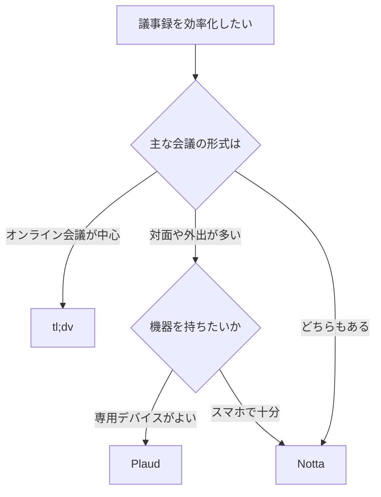

※本記事はアフィリエイト広告(PR)を含みます。

## AI議事録ツール比較でわかること

「会議のたびにメモを取るのが大変」「議事録をまとめる時間がもったいない」——そんな悩みを解決してくれるのが**AI議事録ツール**です。音声を自動で文字起こしし、要約まで作ってくれるので、会議に集中できるうえに後処理の手間がぐっと減ります。

この記事では、人気の3サービス「**Notta(ノッタ)**」「**tl;dv(ティーエルディーブイ)**」「**Plaud(プラウド)**」を実際の使い勝手の観点で比較レビューします。読み終えるころには、「自分の使い方ならどれを選べばいいか」がはっきり分かるはずです。価格や仕様は変わりやすいので、最終的な数字は各公式サイトで最新情報を確認してくださいね。

## そもそもAI議事録ツールとは?

AI議事録ツールとは、会議や打ち合わせの音声を**AIが自動で文字起こし(音声をテキストに変換すること)し、さらに要約や話者の区別までしてくれる**サービスのことです。

大きく分けると、次の2タイプがあります。

- **アプリ・Web型**:スマホやPCのアプリ、オンライン会議に同席させて使うタイプ(Notta・tl;dv)
- **専用デバイス型**:ICレコーダーのような端末で録音し、アプリで文字起こしするタイプ(Plaud)

それぞれ得意分野が違うので、「どんな場面で使いたいか」を意識しながら読み進めてみてください。議事録作成全般のおすすめは[AIで議事録作成を自動化する方法\|おすすめツール5選](/2026/06/10/ai-meeting-minutes/)でも紹介しています。

## 3つのツールをざっくり比較

まずは全体像を表で確認しましょう。

| 項目 | Notta | tl;dv | Plaud |
|---|---|---|---|
| タイプ | アプリ・Web | オンライン会議特化 | 専用デバイス＋アプリ |
| 得意な場面 | 対面・録音・Web会議 | Zoom/Meet/Teams | 対面・外出先の録音 |
| 日本語の精度 | 高い | 良好 | 高い |
| 要約機能 | あり | あり | あり |
| 無料プラン | あり | あり | デバイス購入が必要 |

それぞれの特徴を、もう少し詳しく見ていきます。

### Notta:日本語に強い万能タイプ

Nottaは日本発のサービスで、**日本語の文字起こし精度に定評がある**のが大きな強みです。スマホアプリでの録音、PCでの会議録音、Web会議への参加など、対応の幅が広く「とりあえず1つ選ぶなら無難」という万能型です。

- 録音した音声をその場で文字起こし
- 自動要約で議事録のたたき台が作れる
- 多言語の翻訳にも対応

対面の打ち合わせからオンライン会議まで幅広くこなしたい人に向いています。

### tl;dv:オンライン会議に特化

tl;dvは、ZoomやGoogle Meet、Microsoft Teamsといった**オンライン会議に同席させて使うこと**に特化したツールです。会議に「AIの参加者」として入り、録画・文字起こし・要約を自動で行ってくれます。

- 会議の録画とタイムスタンプ付き文字起こし
- 重要なシーンにマーカーを付けて後から見返せる
- チームでの共有がしやすい

リモートワークでオンライン会議が中心の人には特に便利です。会議環境を整えたい方は[Webカメラ・マイクのおすすめ｜オンライン会議の印象を良くする機材選び](/2026/06/15/webcam-mic-online-meeting/)も参考になります。

### Plaud:録音デバイスで対面・外出に強い

Plaudは、**専用の録音デバイス**を使うのが特徴です。スマホに貼り付けたり首から下げたりして録音し、専用アプリでAI文字起こし・要約を行います。

- アプリを起動しなくてもボタン一つで録音
- バッテリー持ちがよく、長時間の会議や取材に強い
- 対面の商談や外出先のメモに便利

「スマホのアプリを立ち上げるのが面倒」「現場でサッと録りたい」という人にぴったりです。こうした専用機が気になる方は、最新モデルをチェックしてみましょう。

👉 [Amazonで「AIボイスレコーダー 文字起こし」を見る](https://af.moshimo.com/af/c/click?a_id=5632371&p_id=170&pc_id=185&pl_id=38594&url=https%3A%2F%2Fwww.amazon.co.jp%2Fs%3Fk%3DAI%25E3%2583%259C%25E3%2582%25A4%25E3%2582%25B9%25E3%2583%25AC%25E3%2582%25B3%25E3%2583%25BC%25E3%2583%2580%25E3%2583%25BC%2520%25E6%2596%2587%25E5%25AD%2597%25E8%25B5%25B7%25E3%2581%2593%25E3%2581%2597)

ボイスレコーダー全般の選び方は[AI搭載ボイスレコーダーおすすめ比較\|会議・取材の文字起こしに最適なのは?](/2026/06/20/ai-voice-recorder-comparison/)でも詳しく解説しています。

## どれを選べばいい?タイプ別フローチャート

迷ったときは、次のフローで考えると選びやすくなります。

おおまかな目安は次のとおりです。

- **オンライン会議が多い** → tl;dv
- **対面・外出先での録音が多い** → Plaud
- **どちらもバランスよく使いたい** → Notta

## AI議事録ツールは無料で使える?

結論から言うと、**Nottaとtl;dvには無料プランがあり、まずはお試しで使えます**。ただし、無料プランには「文字起こしできる時間の上限」や「機能制限」があるのが一般的です。

- 無料プラン:月あたりの文字起こし時間に上限あり
- 有料プラン:時間の上限が大幅に増え、要約や共有機能が充実

一方、Plaudは専用デバイスの購入が前提になるため、完全無料で始めることはできません。デバイス代に加え、文字起こしの利用量に応じたプランが用意されている場合があります。

いずれも料金体系は改定されることがあるので、契約前に必ず公式サイトで最新の無料枠・価格を確認してください。

## 使うときの注意点

どのツールも便利ですが、使ううえで知っておきたいポイントがあります。

1. **録音の許可を取る**:会議や取材を録音する際は、参加者に一言伝えるのがマナーであり、トラブル防止にもなります。
2. **機密情報の扱い**:クラウドにアップする仕組みのため、社内ルールやセキュリティ方針を確認しましょう。
3. **AIの文字起こしは完璧ではない**:専門用語や固有名詞は誤変換することがあるので、最終チェックは人の目で行うのが安心です。
4. **マイク環境で精度が変わる**:周囲が騒がしいと精度が落ちます。静かな環境やマイクの質が大切です。

要約の精度をさらに高めたい場合は、文字起こし結果を生成AIに渡して整える方法もあります。詳しくは[AIプロンプトのコツ\|思い通りの回答を引き出す書き方を初心者向けに解説](/2026/06/22/ai-prompt-tips/)が役立ちます。

## まとめ

AI議事録ツールは、もはや「会議のメモ取り」という作業から私たちを解放してくれる頼れる存在です。今回比較した3つは、それぞれ得意分野がはっきりしています。

- **Notta**:日本語に強く、対面もオンラインもこなす万能型
- **tl;dv**:Zoomなどオンライン会議に特化、共有もしやすい
- **Plaud**:専用デバイスで対面・外出先の録音に強い

まずは無料プランのあるNottaやtl;dvを試して、使い心地を確かめるのがおすすめです。対面の現場が多い方は、Plaudのような専用デバイスも検討してみてください。自分の働き方に合ったツールを選べば、議事録づくりのストレスはきっと大きく減りますよ。最新の料金や仕様は各公式サイトで確認しながら、ぜひ一度試してみてください。
