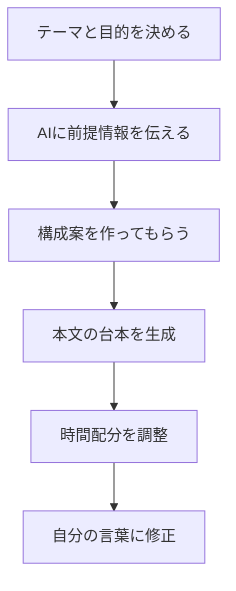

※本記事はアフィリエイト広告(PR)を含みます。

## AIプレゼン台本作成術とは?この記事でわかること

「来週のプレゼン、台本がまったくできていない…」「スピーチ原稿を書くのに毎回3時間かかってしまう」——そんな悩みを抱えていませんか?

この記事では、**AIプレゼン台本作成**のやり方を初心者向けにわかりやすく解説します。ChatGPTなどの生成AI(文章を自動で作ってくれるAI)を使えば、スピーチ原稿のたたき台をわずか3分ほどで作ることができます。

この記事を読むと、次のことがわかります。

- AIでプレゼン台本を作る具体的な手順
- そのまま使えるプロンプト(AIへの指示文)の例
- おすすめのAIツールと選び方
- 「AIツールは無料で使える?」という疑問への答え

難しい知識は不要です。順番に読んでいけば、今日からあなたのプレゼン準備がぐっとラクになります。

## なぜAIでプレゼン台本を作ると速いのか

プレゼン台本づくりが大変なのは、「何を・どんな順番で・どう話すか」を一から考えなければならないからです。AIはこの「構成を考える」「言葉に落とし込む」という作業を一気に肩代わりしてくれます。

人間が手作業で書いた場合とAIを使った場合を比べてみましょう。

| 項目 | 手作業 | AI活用 |
|------|--------|--------|
| 構成案づくり | 30分〜1時間 | 数十秒 |
| 原稿の下書き | 1〜2時間 | 3分程度 |
| 言い回しの調整 | 30分 | 数分 |
| 時間配分の調整 | 手計算で面倒 | 文字数指定で一発 |

もちろんAIが作った原稿をそのまま読むのではなく、自分の言葉に直す作業は必要です。でも「白紙から書く」のと「たたき台を直す」のとでは、心理的なハードルがまったく違います。

## AIプレゼン台本を3分で作る手順

実際の流れを図にすると、次のようになります。

### ステップ1:テーマと前提を整理する

まずAIに渡す材料を準備します。といっても箇条書きでメモする程度でOKです。

- プレゼンのテーマ(例:新商品の社内提案)
- 聞き手は誰か(例:上司や役員)
- 持ち時間(例:5分)
- 一番伝えたいこと(例:予算承認をもらいたい)

この「聞き手」と「目的」を伝えるのが、良い台本を作る最大のコツです。

### ステップ2:プロンプトを入力する

以下のような指示文をAIに貼り付けてみましょう。

> あなたはプレゼンのプロです。以下の条件でスピーチ原稿を作ってください。
> ・テーマ:新商品Aの社内提案
> ・聞き手:役員3名
> ・持ち時間:5分(約1500文字)
> ・ゴール:予算の承認を得る
> まず構成案を3パターン提案し、私が選んだら本文を書いてください。

このように「まず構成案を出させてから本文を書かせる」と、的外れな原稿になりにくくなります。プロンプトの書き方をもっと深めたい方は、[AIプロンプトのコツ\|思い通りの回答を引き出す書き方を初心者向けに解説](/2026/06/22/ai-prompt-tips/)もあわせてご覧ください。

### ステップ3:時間配分を調整する

原稿ができたら「もう少し短く」「導入をもっとインパクトのある一言に」など、追加で注文を出します。話すスピードは一般的に1分あたり300文字前後が目安なので、「5分なら1500文字程度に」と文字数で指定すると時間が合わせやすくなります。

### ステップ4:自分の言葉に直す

最後に、AIが書いた表現を自分の話し方に合わせて整えます。声に出して読んでみて、言いにくい箇所や不自然な敬語を修正すれば完成です。

## プレゼン台本作成におすすめのAIツール

### ChatGPT(オールラウンダー)

文章の自然さと指示への理解力のバランスがよく、最初の1つとして最適です。無料版でも基本的な台本づくりは十分こなせます。

### Claude(長文・丁寧な文章が得意)

落ち着いた読みやすい文章を作るのが得意で、長めの講演原稿にも向いています。

### Gemini(検索情報との連携が強い)

最新の情報を踏まえた台本を作りたいときに便利です。

どのツールが自分に合うか迷ったら、[ChatGPTとClaudeとGeminiを徹底比較!初心者におすすめのAIチャットはどれ?](/2026/06/09/ai-chat-comparison/)で特徴を比べてみてください。

なお、台本と一緒にスライドも用意するなら、[AIプレゼン資料作成ツール比較\|パワポ作業を時短する5つの方法](/2026/06/13/ai-presentation-tools/)が役立ちます。台本とスライドをセットでAI化すると、準備時間を大幅に短縮できます。

## AIプレゼンツールは無料で使える?

結論から言うと、**多くのツールに無料プランがあり、基本的な台本作成なら無料でも十分使えます**。

ただし、無料版には1日の利用回数や使えるモデルに制限がある場合があります。長文を何度も作り直したい、より賢い最新モデルを使いたいという方は有料版を検討してもよいでしょう。

料金体系は改定されることが多いため、具体的な金額は各サービスの公式サイトで最新情報を確認してください。有料版を検討する際は[ChatGPT有料版は必要?無料版との違いと元が取れる使い方を解説](/2026/06/20/chatgpt-paid-vs-free/)も参考になります。

## 本番で差がつく!台本を活かすコツ

良い台本ができても、棒読みでは伝わりません。最後に、本番で活かすためのポイントを紹介します。

- **声に出して練習する**:文字で読むのと話すのは別物です。3回は通し練習を
- **手元資料はキーワードだけに**:全文を読むと目線が下がり、印象が悪くなります
- **手元で操作しやすくする**:スライド送りはプレゼンターリモコンがあると視線を切らずに済みます

手元のスライド操作をスマートにしたい方は、こうしたアイテムを用意しておくと安心です。

👉 [Amazonで「プレゼンターリモコン ワイヤレス」を見る](https://af.moshimo.com/af/c/click?a_id=5632371&p_id=170&pc_id=185&pl_id=38594&url=https%3A%2F%2Fwww.amazon.co.jp%2Fs%3Fk%3D%25E3%2583%2597%25E3%2583%25AC%25E3%2582%25BC%25E3%2583%25B3%25E3%2582%25BF%25E3%2583%25BC%25E3%2583%25AA%25E3%2583%25A2%25E3%2582%25B3%25E3%2583%25B3%2520%25E3%2583%25AF%25E3%2582%25A4%25E3%2583%25A4%25E3%2583%25AC%25E3%2582%25B9)

また、オンラインでのプレゼンが多い方は、声がクリアに届くマイク環境も大切です。詳しくは[Webカメラ・マイクのおすすめ\|オンライン会議の印象を良くする機材選び](/2026/06/15/webcam-mic-online-meeting/)をご覧ください。

## まとめ

AIプレゼン台本作成術のポイントを振り返りましょう。

- AIを使えばスピーチ原稿のたたき台を3分ほどで作れる
- コツは「聞き手」と「目的」を伝え、まず構成案を出させること
- 時間配分は文字数(1分あたり約300文字)で指定すると合わせやすい
- ChatGPT・Claude・Geminiなど主要ツールは無料でも台本作成に使える
- 仕上げは必ず自分の言葉に直し、声に出して練習する

AIはあくまで「優秀なアシスタント」です。最終的にあなたの想いを乗せて話すことで、聞き手の心に届くプレゼンになります。まずは次のプレゼンで、AIにたたき台を作らせるところから試してみてください。準備時間が短くなった分、練習に時間を使えるようになりますよ。
