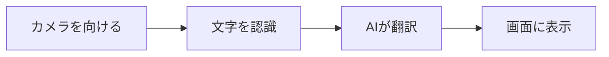

※本記事はアフィリエイト広告(PR)を含みます。

## 翻訳カメラアプリとは?看板・メニューを瞬時に翻訳できる便利ツール

海外旅行や出張で、「このレストランのメニューが読めない」「道路標識の意味がわからない」と困った経験はありませんか?そんなときに役立つのが、スマホのカメラをかざすだけで文字を瞬時に翻訳してくれる「翻訳カメラアプリ」です。

この記事では、AI搭載の翻訳カメラアプリを比較し、看板やメニューを瞬時に翻訳する方法を初心者向けにわかりやすく解説します。読み終わるころには、「自分にはどのアプリが合っているか」「無料で使えるのか」「どうやって使うのか」がはっきりわかるはずです。海外へ行く前に、ぜひチェックしてみてください。

## 翻訳カメラアプリの仕組み|なぜ写真で翻訳できるの?

翻訳カメラアプリは、大きく分けて2つの技術を組み合わせて動いています。

- **OCR(文字認識)**:写真の中にある文字を読み取って、テキストデータに変換する技術です。「Optical Character Recognition(光学文字認識)」の略で、画像の中の文字をパソコンが扱える文字に変える仕組みです。
- **AI翻訳エンジン**:読み取った文字を、別の言語に翻訳する技術です。近年は生成AIの進化により、文脈を踏まえた自然な翻訳ができるようになっています。

つまり、「カメラで文字を読み取る」→「AIが翻訳する」という流れを一瞬でこなしているのです。

最近のアプリは、元の画像に翻訳文を重ねて表示する「AR翻訳(現実の映像に文字を重ねる機能)」にも対応しており、まるで看板そのものが日本語に書き換わったように見えます。

画像から文字を取り出して活用する技術については、[画像から文章を生成する方法\|OCR＋生成AIおすすめツール比較2026](/2026/06/26/ocr-ai-text-generation/)でも詳しく解説していますので、あわせてご覧ください。

## 主要な翻訳カメラアプリを比較

ここでは、代表的な翻訳カメラアプリの特徴を比較します。

| アプリ名 | 主な特徴 | オフライン対応 | 料金の目安 |
|---|---|---|---|
| Google翻訳 | カメラ翻訳が定番。対応言語が豊富 | 一部の言語で可能 | 無料 |
| Microsoft Translator | 複数人会話翻訳にも対応 | 一部対応 | 無料 |
| Papago | アジア言語(韓国語・中国語)に強い | 一部対応 | 無料 |
| Apple 翻訳 | iPhone標準アプリで手軽 | 対応 | 無料(標準搭載) |
| DeepL | 翻訳精度の高さに定評 | 限定的 | 無料/有料プランあり |

※料金や機能は変更される場合があります。最新情報は各公式サイトで必ず確認してください。

### 旅行で使うならどれを選ぶ?

それぞれのアプリには得意分野があります。選ぶときの目安を紹介します。

- **とにかく無料で幅広く使いたい** → Google翻訳。対応言語が多く、カメラ翻訳の完成度も高いです。
- **iPhoneだけで完結させたい** → Apple純正の「翻訳」アプリ。標準搭載で手軽です。
- **韓国・中国・東南アジアへ行く** → Papago。アジア圏の言語に強みがあります。
- **翻訳の自然さを重視する** → DeepL。長めの文章でも違和感の少ない訳になりやすいです。

テキスト翻訳の精度そのものを比較したい方は、[AI翻訳ツール比較\|DeepL・Google翻訳・ChatGPTどれが正確?](/2026/06/11/ai-translation-comparison/)も参考になります。

## 翻訳カメラの使い方|3ステップでメニューを翻訳

ここでは、Google翻訳を例に基本的な使い方を紹介します。他のアプリでもほぼ同じ流れです。

### ステップ1:アプリを起動してカメラモードにする

アプリを開き、「カメラ」アイコンをタップします。翻訳元の言語と翻訳先の言語(例:英語→日本語)を選んでおきましょう。言語を「自動検出」に設定できるアプリもあります。

### ステップ2:翻訳したい文字にカメラを向ける

メニューや看板にスマホをかざすだけです。AR翻訳に対応していれば、画面の中の文字がそのまま日本語に置き換わって表示されます。

### ステップ3:必要なら写真を撮って翻訳する

暗い場所や文字が小さい場合は、いったん写真を撮ってから翻訳すると精度が上がることがあります。撮影後に翻訳したい部分を指でなぞって選択できるアプリもあります。

## よくある疑問Q&A

### Q. 翻訳カメラアプリは無料で使える?

はい、紹介した主要アプリの多くは基本機能を無料で使えます。Google翻訳やApple翻訳、Papagoはカメラ翻訳まで無料で利用できます。ただしDeepLのように、より高度な機能や翻訳量の上限を増やすために有料プランが用意されているものもあります。最新の料金は公式サイトで確認してください。

### Q. オフライン(電波がない場所)でも使える?

アプリによっては、あらかじめ言語データをダウンロードしておくことでオフライン翻訳が可能です。海外では通信環境が不安定なこともあるので、出発前に使う言語のデータを端末に保存しておくと安心です。

### Q. スマホアプリと専用翻訳機、どちらがいい?

手軽さならスマホアプリ、会話の翻訳や精度を重視するなら専用機という選び方が基本です。長時間使うとスマホのバッテリーを消費するため、旅行先で長く使う方はモバイルバッテリーを用意しておくと安心です。

👉 [Amazonで「モバイルバッテリー 大容量 軽量」を見る](https://af.moshimo.com/af/c/click?a_id=5632371&p_id=170&pc_id=185&pl_id=38594&url=https%3A%2F%2Fwww.amazon.co.jp%2Fs%3Fk%3D%25E3%2583%25A2%25E3%2583%2590%25E3%2582%25A4%25E3%2583%25AB%25E3%2583%2590%25E3%2583%2583%25E3%2583%2586%25E3%2583%25AA%25E3%2583%25BC%2520%25E5%25A4%25A7%25E5%25AE%25B9%25E9%2587%258F%2520%25E8%25BB%25BD%25E9%2587%258F)

会話の翻訳まで本格的にしたい方は、専用デバイスも検討の価値があります。詳しくは[AI翻訳機おすすめ比較2026\|ポケトークと最新モデルを徹底レビュー](/2026/06/26/ai-translation-device-2026/)や、耳に着けて使う[AI翻訳イヤホンおすすめ比較2026\|海外旅行の会話に最適なのは?](/2026/06/24/ai-translation-earphones-2026/)をご覧ください。

## より快適に使うためのコツ

翻訳カメラを使いこなすために、覚えておきたいポイントをまとめました。

- **明るい場所で使う**:暗いと文字認識の精度が下がります。照明やフラッシュを活用しましょう。
- **手ブレを抑える**:文字にしっかりピントを合わせると認識が安定します。
- **複雑なデザイン文字に注意**:装飾の多いロゴ風の文字は認識しにくい場合があります。その場合は手入力での翻訳も併用しましょう。
- **翻訳結果を鵜呑みにしない**:AI翻訳は非常に便利ですが、まれに誤訳もあります。重要な契約書などは専門家に確認しましょう。

海外旅行中はスマホの充電切れが心配です。コンパクトな充電グッズも持っておくと安心ですね。

👉 [楽天市場で「モバイルバッテリー 急速充電 PD対応」を探す](https://af.moshimo.com/af/c/click?a_id=5632328&p_id=54&pc_id=54&pl_id=616&url=https%3A%2F%2Fsearch.rakuten.co.jp%2Fsearch%2Fmall%2F%25E3%2583%25A2%25E3%2583%2590%25E3%2582%25A4%25E3%2583%25AB%25E3%2583%2590%25E3%2583%2583%25E3%2583%2586%25E3%2583%25AA%25E3%2583%25BC%2520%25E6%2580%25A5%25E9%2580%259F%25E5%2585%2585%25E9%259B%25BB%2520PD%25E5%25AF%25BE%25E5%25BF%259C%2F)

## まとめ

AI搭載の翻訳カメラアプリを使えば、スマホをかざすだけで看板やメニューを瞬時に翻訳できます。最後に要点を振り返りましょう。

- 翻訳カメラは「OCR(文字認識)」と「AI翻訳」を組み合わせた便利な技術
- Google翻訳・Apple翻訳・Papago・DeepLなど、目的に合わせて選べる
- 主要アプリの多くは無料で使え、オフライン対応のものもある
- 明るい場所・ピント合わせで認識精度が上がる
- 会話翻訳や高精度を求めるなら専用翻訳機やイヤホンも選択肢

まずは無料のアプリをインストールして、身近なものを翻訳して試してみてください。使い方に慣れておけば、いざ海外へ行ったときも安心です。料金や対応言語の最新情報は、各アプリの公式サイトで確認してから出発しましょう。
