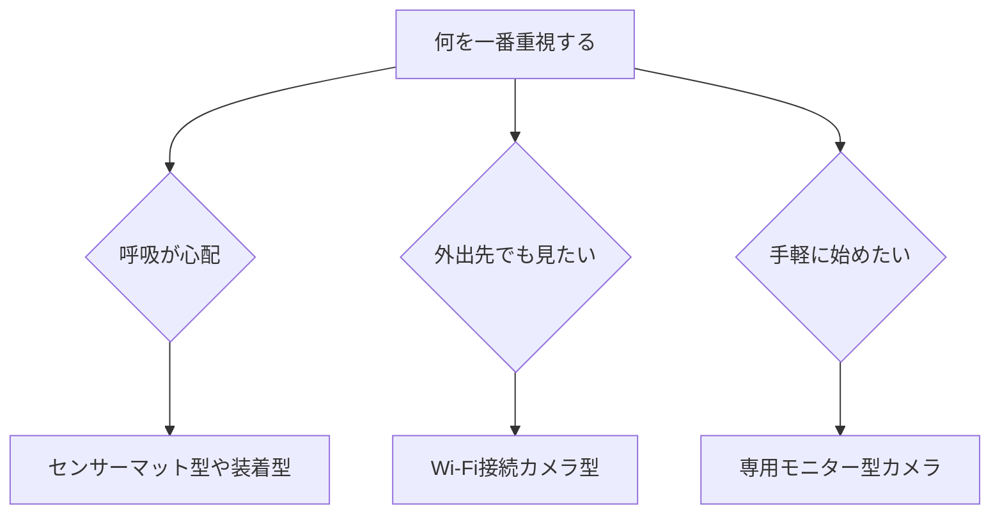

※本記事はアフィリエイト広告(PR)を含みます。

## この記事でわかること

「夜中に赤ちゃんがちゃんと息をしているか心配で、何度も起きてしまう……」そんな悩みを抱えるパパ・ママに向けて、この記事では**AI見守りベビーモニター**の選び方とおすすめの比較ポイントを、初心者にもわかりやすく解説します。

近年のベビーモニターは、ただ映像を映すだけでなく、AI(人工知能=コンピューターが状況を判断する技術)が赤ちゃんの**呼吸・泣き声・寝返り・顔の向き**などを自動で検知してくれるものが増えています。この記事を読めば、以下のことがわかります。

- AI見守りベビーモニターでできること
- 失敗しない選び方の5つのポイント
- 呼吸・泣き声検知タイプの違い
- よくある疑問(月額料金は必要?など)への回答

それでは、さっそく見ていきましょう。

## AI見守りベビーモニターとは?

AI見守りベビーモニターとは、カメラやセンサーで赤ちゃんの様子を見守り、AIが「いつもと違う状態」を検知してスマホに通知してくれる育児ガジェットです。

従来のベビーモニターは「映像と音を別室に飛ばす」だけでしたが、AIモデルでは次のような自動検知が可能になっています。

- **呼吸モニタリング**:お腹の動きや専用センサーで呼吸の有無・回数を検知
- **泣き声検知**:泣き始めたタイミングを音声AIが判別して通知
- **顔覆い検知**:布団などが顔にかかると警告
- **寝返り・うつ伏せ検知**:危険な体勢になると通知
- **睡眠分析**:何時間眠れたか、起きた回数などをレポート

つまり、画面をずっと見ていなくても、異変があったときだけ知らせてくれるのが大きなメリットです。家事をしたり、自分の睡眠時間を確保したりする余裕が生まれます。

## AI見守りベビーモニターの選び方5つのポイント

### 1. 検知方式(カメラ型・センサー型・装着型)

まず大切なのが、どうやって赤ちゃんを見守るかという「検知方式」です。

| 方式 | 特徴 | 向いている人 |
|------|------|------------|
| カメラ型 | 映像で全体を確認。泣き声や動き検知が中心 | まず手軽に始めたい人 |
| センサーマット型 | 敷布団の下に敷き、体動・呼吸を検知 | 呼吸が特に心配な人 |
| 装着型(ウェアラブル) | 足や衣類に付け、心拍・酸素を測定 | しっかり数値で管理したい人 |

呼吸検知を重視するなら、**センサーマット型**や**装着型**が安心感が高い傾向にあります。

### 2. 通知の精度と誤作動の少なさ

AIの検知は便利ですが、誤通知が多いと逆に疲れてしまいます。レビューで「誤作動が少ない」「通知が的確」と評価されている製品を選ぶと安心です。

### 3. 画質と暗視機能(ナイトビジョン)

夜間の見守りがメインになるため、暗くてもはっきり映る**ナイトビジョン**(赤外線で暗所を撮影する機能)はほぼ必須です。フルHD以上の画質なら、表情までしっかり確認できます。

### 4. 接続方式とプライバシー

接続方式には大きく分けて2種類あります。

- **Wi-Fi接続型**:外出先からスマホで確認できる
- **専用モニター型**:ネットを使わずローカルで完結し、ハッキングリスクが低い

Wi-Fi型は便利ですが、セキュリティ対策(パスワードの強化など)も忘れずに行いましょう。プライバシーを最優先するなら専用モニター型も選択肢です。

### 5. 月額料金の有無

AIによる高度な分析や録画クラウド保存には、**月額のサブスク料金**が必要な製品もあります。本体価格だけでなく、ランニングコストも合わせて確認しておきましょう。

## 選び方フローチャート

迷ったときは、次の流れで考えると自分に合うタイプが見つけやすくなります。

## 機能タイプ別の特徴比較

### 呼吸検知を重視するなら

敷布団の下に敷くセンサーマット型や、足に付ける装着型は、呼吸や体動を直接モニタリングできるのが強みです。一定時間動きがないとアラームで知らせてくれるため、新生児期の不安を軽減してくれます。価格や対応月齢は製品ごとに異なるため、購入前に公式サイトで最新情報を確認してください。

👉 [楽天市場で「ベビーモニター 呼吸 センサー」を探す](https://af.moshimo.com/af/c/click?a_id=5632328&p_id=54&pc_id=54&pl_id=616&url=https%3A%2F%2Fsearch.rakuten.co.jp%2Fsearch%2Fmall%2F%25E3%2583%2599%25E3%2583%2593%25E3%2583%25BC%25E3%2583%25A2%25E3%2583%258B%25E3%2582%25BF%25E3%2583%25BC%2520%25E5%2591%25BC%25E5%2590%25B8%2520%25E3%2582%25BB%25E3%2583%25B3%25E3%2582%25B5%25E3%2583%25BC%2F)

### 泣き声検知・映像重視なら

「泣いたらすぐ駆けつけたい」「表情も見たい」という人には、AI泣き声検知付きのカメラ型がおすすめです。スマホアプリと連携し、泣き始めた瞬間に通知が届きます。首振り(パン・チルト)機能付きなら、赤ちゃんが動いても自動で追尾してくれるモデルもあります。

👉 [Amazonで「AIベビーモニター 見守りカメラ」を見る](https://af.moshimo.com/af/c/click?a_id=5632371&p_id=170&pc_id=185&pl_id=38594&url=https%3A%2F%2Fwww.amazon.co.jp%2Fs%3Fk%3DAI%25E3%2583%2599%25E3%2583%2593%25E3%2583%25BC%25E3%2583%25A2%25E3%2583%258B%25E3%2582%25BF%25E3%2583%25BC%2520%25E8%25A6%258B%25E5%25AE%2588%25E3%2582%258A%25E3%2582%25AB%25E3%2583%25A1%25E3%2583%25A9)

## よくある質問(Q&A)

### Q. AIベビーモニターに月額料金は必要?

製品によります。基本的な映像確認や泣き声通知は本体だけで使えるものが多い一方、**クラウド録画**や**詳細な睡眠レポート**を使う場合は月額プランが必要なことがあります。購入前に「無料で使える範囲」を必ずチェックしましょう。

### Q. 普通の見守りカメラとの違いは?

普通の見守りカメラは映像を送るのが主な役割ですが、AIモデルは「異変を判断して通知する」点が大きく違います。家庭内の見守り全般に興味がある方は、[AI搭載ペットカメラおすすめ比較](/2026/06/25/ai-pet-camera-comparison/)や[AI見守りセンサー比較2026](/2026/06/26/ai-monitoring-sensor-2026/)も考え方の参考になります。

### Q. スマートスピーカーと連携できる?

一部の製品はAlexaやGoogle Homeに対応し、「カメラの映像を表示して」と音声操作できます。連携を重視するなら[スマートスピーカー比較記事](/2026/06/12/smart-speaker-comparison/)もあわせてご覧ください。

## 購入前にチェックしたい注意点

- **過信しないこと**:AI検知は補助ツールであり、医療機器ではありません。最終的な見守りは保護者の目が基本です。
- **設置場所の安全**:コードが赤ちゃんに届かない位置に設置しましょう。
- **対応月齢を確認**:特に装着型は対象月齢が決まっていることがあります。

価格や仕様は頻繁に更新されるため、最終的な判断は各メーカーの公式サイトで最新情報を確認してから行うことをおすすめします。

## まとめ

AI見守りベビーモニターは、赤ちゃんの呼吸や泣き声を自動で検知し、パパ・ママの不安と負担を大きく減らしてくれる頼もしいガジェットです。最後に選び方のポイントをおさらいします。

- 呼吸が心配なら**センサーマット型・装着型**
- 外出先でも見たいなら**Wi-Fi接続カメラ型**
- 手軽さ・安心重視なら**専用モニター型**
- **誤作動の少なさ・暗視機能・月額料金**を必ず確認

まずは「自分が一番不安に感じていること」を整理し、それを解決できるタイプから検討してみてください。あなたとお子さんが、少しでも安心して眠れる夜を過ごせますように。
