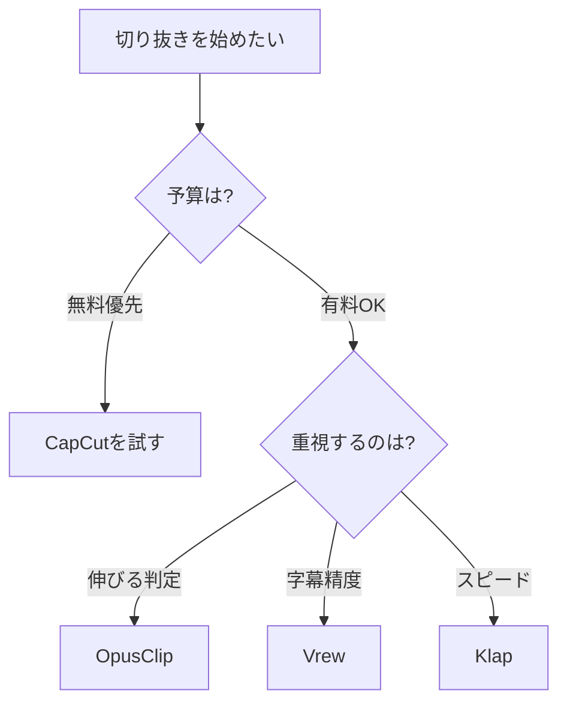

※本記事はアフィリエイト広告(PR)を含みます。

## この記事でわかること

「長い動画から見どころだけを切り抜いて、TikTokやYouTube Shortsに量産したいけれど手作業が大変…」そんな悩みを解決してくれるのが、AIによる切り抜きショート自動生成ツールです。この記事では、**AIで動画から切り抜きショートを量産する方法**と、TikTok・YouTube Shorts向けの人気ツールの比較を、初心者にもわかりやすく解説します。

この記事を読むと、次のことがわかります。

- AI切り抜きツールが何をしてくれるのか
- 主要ツールの特徴と選び方
- 実際の作業手順(5ステップ)
- 無料で使えるのか?という疑問への答え

まずは「自分の動画でも使えそうか」をイメージしながら読み進めてみてください。

## AI切り抜きショートツールとは?

AI切り抜きツールとは、1時間などの長い動画(長尺動画)をアップロードすると、AIが「バズりそうな見どころ」を自動で抜き出し、縦型のショート動画に仕上げてくれるサービスのことです。

以前はこの作業を人の手で行っていました。動画を最初から最後まで見て、おもしろい部分を探し、切り取り、字幕(テロップ)を付ける…と、1本作るだけでも何時間もかかっていたのです。

AIツールを使うと、おおむね次の作業を自動化できます。

- **見どころの検出**:盛り上がっている箇所をAIが判断
- **縦型へのリサイズ**:横長の動画を9:16の縦型に自動変換
- **話者の自動追尾**:話している人を画面中央に映し続ける
- **字幕の自動生成**:音声を認識してテロップを付ける
- **絵文字やBGMの追加**:見栄えを良くする演出

つまり、これまで数時間かかっていた作業が、数分〜十数分に短縮できるわけです。

## どんな人におすすめ?

AI切り抜きツールは、特に次のような方に向いています。

- ポッドキャストや対談動画を配信している方
- セミナー・ウェビナーの録画を活用したい方
- YouTubeの長尺動画からショートを量産したい方
- 切り抜き許可を得て他人の動画を編集する「切り抜き師」を目指す方

逆に、最初から数十秒で完結する短い動画しか撮らない方には、あまりメリットがないかもしれません。

## 主要なAI切り抜きツールを比較

ここでは代表的なツールの特徴を整理します。料金プランは変更されることが多いので、必ず**公式サイトで最新情報を確認してください**。

| ツール | 特徴 | 日本語字幕 | こんな人に |
|---|---|---|---|
| OpusClip | 世界的に人気。バイラルスコアで見どころを採点 | 対応 | まず試すならコレ |
| Vrew | 字幕編集に強い国産系。直感的な操作 | 得意 | 字幕重視の方 |
| Capcut | 無料で多機能。手動編集との相性も良い | 対応 | コストを抑えたい方 |
| Klap | シンプルで素早い切り抜き向け | 対応 | スピード重視の方 |

### OpusClip

海外発の定番ツールで、AIが各クリップに「バイラルスコア(伸びそうな度合いの点数)」を付けてくれるのが特徴です。どのクリップを優先して投稿すべきか判断しやすく、初心者でも迷いません。

### Vrew

音声認識による字幕生成が得意な日本でも人気のツールです。字幕を文章のように編集できるため、テロップの精度を重視する方に向いています。動画の文字起こしを軸にした使い方は、[動画から文字起こし＆要約をAIで\|YouTube学習に最適なツール比較](/2026/06/28/ai-video-transcription-summary/)も参考になります。

### CapCut

スマホアプリとしても有名な編集ツールで、無料でも多くの機能が使えます。AIによる自動切り抜き機能に加え、手動で細かく仕上げたい場合にも便利です。

ツール全般の編集機能をもっと知りたい方は、[AI動画編集ツール比較\|YouTube初心者におすすめの自動編集ソフト5選](/2026/06/16/ai-video-editing-tools/)もあわせてご覧ください。

## ツールの選び方フローチャート

自分に合うツールを選ぶ流れを図にまとめました。

まずは無料ツールで操作感をつかみ、物足りなくなったら有料ツールに移行するのがおすすめです。

## AI切り抜きの基本手順5ステップ

どのツールでも、大まかな流れは共通しています。

1. **元動画を用意する**:YouTubeのURLを貼るか、ファイルをアップロード
2. **言語や形式を設定**:日本語・縦型(9:16)などを選ぶ
3. **AIに解析させる**:数分待つと候補クリップが生成される
4. **クリップを微調整**:字幕の誤字や切り出し位置を整える
5. **書き出して投稿**:TikTokやShortsにアップロード

ポイントは、ステップ4の「微調整」を省かないことです。AIの字幕は固有名詞や専門用語を間違えることがあるため、投稿前に必ず見直しましょう。

### 良い切り抜きにするコツ

- **最初の3秒で惹きつける**:結論や驚きを冒頭に置く
- **字幕は大きく読みやすく**:音を出さずに見る人が多い
- **1本1テーマに絞る**:情報を詰め込みすぎない

撮影音声をクリアに録っておくと、AIの字幕精度も上がります。声をしっかり拾いたい方は、収録用のマイク選びも大切です。

👉 [Amazonで「配信用 USBマイク コンデンサー」を見る](https://af.moshimo.com/af/c/click?a_id=5632371&p_id=170&pc_id=185&pl_id=38594&url=https%3A%2F%2Fwww.amazon.co.jp%2Fs%3Fk%3D%25E9%2585%258D%25E4%25BF%25A1%25E7%2594%25A8%2520USB%25E3%2583%259E%25E3%2582%25A4%25E3%2582%25AF%2520%25E3%2582%25B3%25E3%2583%25B3%25E3%2583%2587%25E3%2583%25B3%25E3%2582%25B5%25E3%2583%25BC)

## AI切り抜きツールは無料で使える?

ここが多くの方の気になる点だと思います。結論から言うと、**無料でも始められますが、本格的に量産するなら有料が現実的**です。

多くのツールには無料プランがありますが、次のような制限があるのが一般的です。

- 1か月に処理できる動画の本数や時間に上限がある
- 書き出した動画にツールのロゴ(ウォーターマーク)が入る
- 高画質での出力ができない

まずは無料プランで「自分の動画と相性が良いか」を確かめ、続けられそうなら有料プランを検討するのが失敗しない順番です。料金は頻繁に変わるため、契約前に**公式サイトで最新の情報を必ず確認してください**。

## 撮影・編集環境を整えるとさらに効率アップ

AIツールの性能を活かすには、元動画の質と作業環境も重要です。AI処理は意外とパソコンに負荷がかかるため、快適に作業したい方はマシン選びも検討しましょう。詳しくは[AIノートパソコンの選び方2026\|快適に使うための7つのポイント](/2026/06/11/ai-laptop-guide-2026/)が参考になります。

外出先で編集データを扱うことが多い方には、安定した電源環境もあると安心です。

👉 [楽天市場で「モバイルバッテリー 大容量 急速充電」を探す](https://af.moshimo.com/af/c/click?a_id=5632328&p_id=54&pc_id=54&pl_id=616&url=https%3A%2F%2Fsearch.rakuten.co.jp%2Fsearch%2Fmall%2F%25E3%2583%25A2%25E3%2583%2590%25E3%2582%25A4%25E3%2583%25AB%25E3%2583%2590%25E3%2583%2583%25E3%2583%2586%25E3%2583%25AA%25E3%2583%25BC%2520%25E5%25A4%25A7%25E5%25AE%25B9%25E9%2587%258F%2520%25E6%2580%25A5%25E9%2580%259F%25E5%2585%2585%25E9%259B%25BB%2F)

## まとめ

AIによる切り抜きショートの量産は、いまや特別なスキルがなくても始められる時代になりました。最後にポイントを振り返ります。

- AI切り抜きツールは、見どころ検出・縦型変換・字幕生成までを自動化してくれる
- 初心者はまずCapCutなど無料ツールで操作感をつかむのがおすすめ
- 伸びる判定ならOpusClip、字幕精度ならVrewなど、目的で選ぶ
- 無料でも始められるが、量産するなら有料プランが現実的
- AIの字幕は誤字があるため、投稿前の微調整は必ず行う

まずは手元にある長尺動画を1本、無料ツールに通してみてください。数分後には、そのまま投稿できそうなショート動画が並んでいるはずです。今日から「切り抜き量産」の第一歩を踏み出してみましょう。
