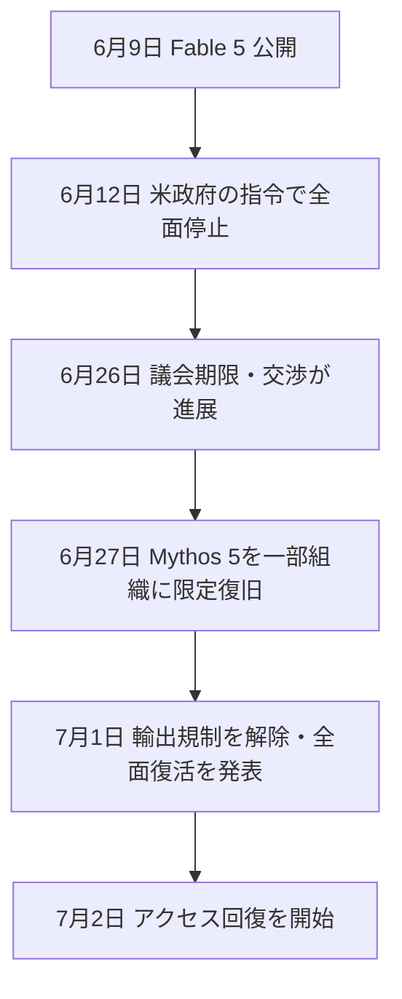

※本記事はアフィリエイト広告(PR)を含む場合があります。

## Claude Fable 5、ついに復活へ

2026年7月1日、Anthropicが**Claude Fable 5・Mythos 5の復活**を発表しました。**米商務省が輸出管理の規制を解除**したとの通知を受け、Anthropicは**翌日(7月2日)からアクセスの回復を開始**するとしています。

米政府の指令で6月12日に全面停止してから約3週間。最上位AIをめぐる異例の事態が、ようやく決着に向かいます。これまでの経緯は[Fable 5停止の解説](/2026/06/15/claude-fable-5-suspended/)や[復旧交渉の続報](/2026/06/26/claude-fable-5-recovery-update/)もあわせてご覧ください。

> ⚠️ 復旧は段階的に進む可能性があります。最新の提供状況は公式発表でご確認ください。

## 経緯の振り返り(全体の流れ)

- **6月9日**:Claude Fable 5(と上位のMythos 5)を公開
- **6月12日**:米政府の輸出管理指令により、**全世界の全ユーザーに対して全面停止**
- **6月26日ごろ**:議会の期限を節目に、商務省との交渉が進展
- **6月27日**:まず**Mythos 5を、信頼できるサイバー防衛組織や重要インフラ事業者に限定的に復旧**
- **7月1日**:**輸出規制が解除**され、Anthropicが**全面復活と翌日からの回復開始**を発表

## 何が決まったのか

- **Fable 5・Mythos 5への輸出管理規制が解除**された
- **全世界の全ユーザーに向けて、両モデルの提供を再開**していく方針
- 回復は**7月1〜2日から順次**始まる見込み

つまり、「外国籍ユーザーのアクセスを止めよ」という当初の指令が撤回され、**通常どおり使える状態に戻る**ということです。

## 私たちユーザーへの影響

- **最上位のFable 5(・Mythos 5)が、再び使えるようになる**
- ただし復旧は段階的な可能性があり、**すぐに全機能・全地域で使えるとは限らない**点に注意
- なお、停止中も**通常のClaude(Opus/Sonnet/Haiku)は影響なし**でした。さらに6月30日には[新モデルのClaude Sonnet 5](/2026/07/01/claude-sonnet-5-guide/)も登場しており、**選択肢はむしろ充実**しています

## 今回の出来事が示したもの

今回の一件は、「**便利なAIも、政治・規制の判断ひとつで突然止まりうる**」という**可用性リスク**を、あらためて浮き彫りにしました([日本への影響](/2026/06/16/claude-fable-5-japan-impact/)でも触れたテーマです)。

だからこそ、**特定の最先端モデルだけに依存しない備え**も大切です。実際、規制に強い選択肢として、中国Z.aiの[オープンモデルGLM-5.2](/2026/06/17/glm-5-2-guide/)や、日本の[Sakana AIのFugu](/2026/06/22/sakana-ai-fugu-2026/)のような「集合知・オープン系」も存在感を増しています。今後も同様の規制・停止が起こる可能性は、頭の片隅に置いておくとよいでしょう。

## よくある質問

### いつから使える?

Anthropicは**7月2日からアクセス回復を開始**するとしています。復旧は段階的に進む可能性があるため、実際の利用可否は公式の案内をご確認ください。

### なぜ復活できたの?

**米商務省が輸出管理の規制を解除**したためです。約3週間にわたる交渉を経て、規制が撤回されました。

### また止まることはある?

可能性はゼロではありません。最先端AIは規制・政治の影響を受けやすいため、**「止まることもある」前提**で付き合うのが安全です。

## まとめ

- 2026年7月1日、**Fable 5・Mythos 5の輸出規制が解除**され、**翌日から復活**へ
- 6月12日の全面停止から**約3週間で決着**
- ユーザーは最上位モデルを再び使えるように(復旧は段階的な可能性)
- 教訓は**可用性リスク**。特定モデルに依存しすぎない備えも大切

止まったAIが戻ってくるのは朗報ですが、「最先端と規制は隣り合わせ」という現実も見えた一件でした。最新状況は公式発表でご確認ください。

### 参考リンク

- [米政府「Fable 5／Mythos 5」の輸出規制解除 Anthropic「明日からアクセス回復」(ITmedia)](https://www.itmedia.co.jp/aiplus/article/2607/01/2000000146/)
- [Anthropic、Claude Fable 5の明日復帰を予告(テクノエッジ)](https://www.techno-edge.net/article/2026/07/01/5241.html)
- [いま最強のAI「Claude Fable 5/Mythos 5」が復活。規制が解除に(ギズモード・ジャパン)](https://www.gizmodo.jp/article/anthropic_announced_restoring_access_fable_mythos/)
