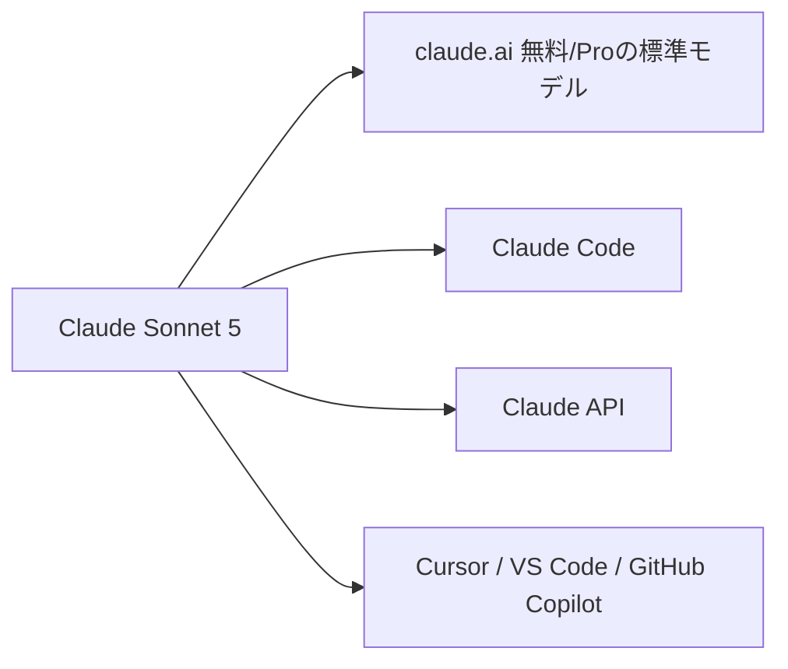

※本記事はアフィリエイト広告(PR)を含む場合があります。

## Claude Sonnet 5——「高性能なのに安い」エージェント向けモデル

2026年6月30日、AnthropicがAIモデル **Claude Sonnet 5** を公開しました。Claudeの「Sonnet」は、最上位の「Opus」と軽量の「Haiku」の**中間=バランス型**の位置づけですが、今回のSonnet 5は**最上位Opusに迫る性能を、ずっと安い価格で**実現した点が大きな話題になっています。

ひとことで言えば、**「AIエージェントを、安く・たくさん動かせる」**モデル。すでに**claude.aiの無料・Proプランの標準モデル**になり、Claude CodeやAPIなどでも使えます。

> ⚠️ ベンチマークの数値や料金・提供条件は変更されることがあります。最新情報は[公式発表](https://www.anthropic.com/news/claude-sonnet-5)でご確認ください。

## 何がすごい?(ベンチマーク)

Sonnet 5の売りは、**エージェント(自律的にタスクをこなす能力)**です。単に質問に答えるだけでなく、**手順を計画し、ツール(ブラウザやターミナル)を使い、結果を読んで自分で進める**——人が逐一指示しなくても作業を完了します。

報じられている主なスコアは次のとおりです(報告ベース)。

| ベンチマーク | Sonnet 5 | 参考 |
|---|---|---|
| SWE-bench Verified(実務的コーディング) | 92.4% | 前フラッグシップOpus 4.6=80.8% |
| GPQA Diamond(博士レベルの科学) | 96.2% | Gemini 3.1 Proの94.3%を抜き記録更新 |
| OSWorld-Verified(デスクトップ操作) | 88.3% | 人間専門家=72.4%(人間を上回る) |

特にコーディングの**SWE-bench 92.4%**は、少し前の最上位モデルを大きく上回る数字で、「Sonnet(中位)なのにここまで?」と驚かれています。AIのコーディング比較全体は[ChatGPT・Claude・Geminiのプログラミング比較](/2026/06/16/ai-coding-comparison-2026/)もどうぞ。

## 基本スペック

- **コンテキスト長**:最大100万トークン(大量の資料を一度に扱える)
- **最大出力**:128kトークン(ベータ機能で300kまで拡張可)
- **知識のカットオフ**:2026年1月

## 料金:ここが一番のインパクト

Sonnet 5は、**性能のわりに非常に安い**のが特徴です(100万トークンあたり)。

| 期間 | 入力 | 出力 |
|---|---|---|
| 〜2026年8月31日(導入価格) | 約2ドル | 約10ドル |
| 2026年9月1日〜 | 約3ドル | 約15ドル |

最上位の **Opus 4.8(入力5ドル/出力25ドル)** と比べると大幅に安く、**エージェントのように大量のトークンを使う用途でも、コストを抑えやすい**のが魅力です。各AIの料金感は[AIサブスク料金比較](/2026/06/16/ai-subscription-pricing-2026/)も参考に。

### 注意:新トークナイザーで「実効コスト」が上がることも

ひとつ重要な注意点があります。Sonnet 5は**新しいトークナイザー**を採用しており、**同じ文章でもトークン数が約1.0〜1.35倍になる**との報告があります。つまり、**1トークンあたりは安くても、実際の請求は見かけより高くなる場合がある**ということ。導入前に、自分の用途で一度コストを試算するのがおすすめです。

## どこで使える?

- **claude.ai**:無料・Proユーザーの**標準(デフォルト)モデル**に
- **Claude Code**(開発)や**Claude API**(アプリ組み込み)
- **Cursor・VS Code・GitHub Copilot**などの開発ツール

知的労働を任せる[Claude Cowork](/2026/06/26/claude-cowork-guide/)のようなエージェント用途とも相性がよく、「**高性能エージェントを安く回す**」流れを後押ししそうです。

## 私たちユーザーへの意味

- **無料・Proユーザーは、何もしなくても標準モデルが強化**された
- **エージェント(Claude Code/Cowork)を、よりコストを気にせず使える**
- ただし**新トークナイザーの影響**は要チェック。ヘビーに使うなら実コストを試算

6月は[フラッグシップAIが相次いで登場](/2026/06/16/ai-model-flood-2026/)し、月末には[GPT-5.6も限定プレビュー](/2026/06/26/gpt-5-6-sol-preview/)に。**「高性能を安く」という競争**が、ますます利用者に追い風になっています。

## よくある質問

### Sonnet 5は無料で使える?

はい。**claude.aiの無料プランの標準モデル**になっています(利用量の上限はあります)。

### Opus 4.8とどっちがいい?

最高性能はOpusですが、Sonnet 5は**多くの用途でOpusに迫る性能をはるかに安く**提供します。コスト重視・エージェント用途ならSonnet 5が有力です。

### 料金が安いと聞いたけど本当?

1トークンあたりは安いです。ただし**新トークナイザーでトークン数が増える**ため、実際のコストは用途次第。試算してから本格利用するのが安全です。

## まとめ

- 2026年6月30日、**Claude Sonnet 5**が公開。**エージェント特化**で最上位Opusに迫る性能
- **SWE-bench 92.4%・GPQA 96.2%(記録更新)**など高スコア。100万トークン文脈
- 料金は**8/31まで導入価格(入力2ドル/出力10ドル)**、9月以降も**Opusより大幅に安い**
- 注意点は**新トークナイザーで実効コストが上がりうる**こと。用途で試算を

「高性能なAIエージェントを、安く動かす」——その実用ラインがまた一段下がりました。無料・Proユーザーはまず触ってみるのがおすすめです。

### 参考リンク

- [Introducing Claude Sonnet 5(Anthropic公式)](https://www.anthropic.com/news/claude-sonnet-5)
- [Anthropic launches Claude Sonnet 5 as a cheaper way to run agents(TechCrunch)](https://techcrunch.com/2026/06/30/anthropic-launches-claude-sonnet-5-as-a-cheaper-way-to-run-agents/)
- [Claude Sonnet 5: It closes the gap with Opus 4.8(The New Stack)](https://thenewstack.io/claude-sonnet-5-launch/)
