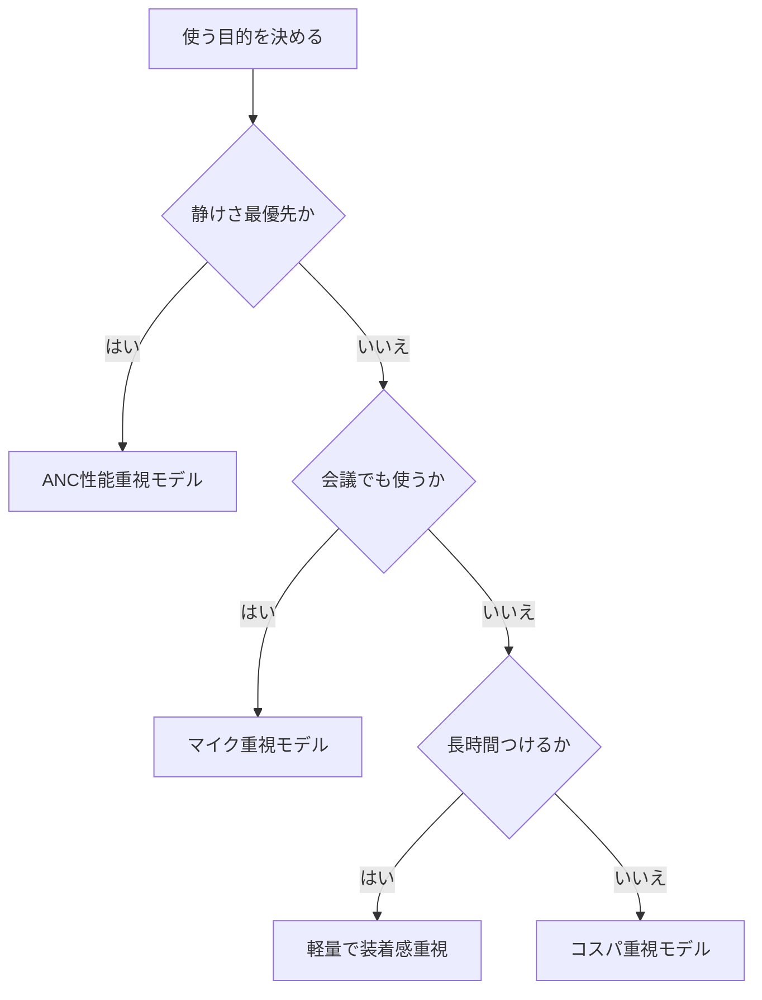

※本記事はアフィリエイト広告(PR)を含みます。

## ノイズキャンセリングヘッドホンの選び方を2026年版で解説

「在宅ワークで周りの音が気になって集中できない」「家族の生活音やエアコンのノイズで仕事がはかどらない」——そんな悩みを解決してくれるのが**ノイズキャンセリングヘッドホン**です。

この記事を読むと、次のことがわかります。

- ノイズキャンセリングとは何か、その仕組み
- 在宅集中力を高めるために重視すべき選び方のポイント
- 自分に合った1台を見つけるためのチェック項目
- よくある疑問(価格・イヤホンとの違いなど)への回答

初心者の方でも迷わず選べるように、専門用語にはかんたんな説明を添えながら丁寧に解説していきます。それでは見ていきましょう。

## そもそもノイズキャンセリングとは?

**ノイズキャンセリング(ANC:アクティブ・ノイズ・キャンセリング)** とは、ヘッドホンに内蔵されたマイクが周囲の騒音を拾い、その音と「逆向きの音波」を発生させて打ち消す技術のことです。難しく聞こえますが、要するに「雑音を電子的に静かにしてくれる機能」だと考えればOKです。

ノイズキャンセリングには大きく2種類あります。

- **アクティブ式(ANC)**:マイクと電子回路で能動的に騒音を打ち消す。低音(エアコン・電車・PCのファン音など)に強い。
- **パッシブ式**:イヤーパッドの素材や密閉構造で物理的に音を遮る。高音(話し声など)にも効果がある。

最近のモデルはこの両方を組み合わせており、在宅ワークの集中環境づくりにとても役立ちます。

## 在宅集中力を高めるための選び方5つのポイント

### 1. ノイズキャンセリングの強さ

まず重視したいのが、肝心のノイズキャンセリング性能です。一般的に上位モデルほど打ち消せる騒音の幅が広く、静寂感が高くなります。製品によっては**騒音の強さに応じて自動で強度を調整する機能**を備えたものもあり、在宅と外出の両方で使う方に便利です。

### 2. 装着感(長時間でも疲れないか)

在宅ワークでは数時間つけっぱなしになることも多いため、装着感はとても重要です。チェックしたいのは次の点です。

- イヤーパッドの柔らかさと通気性
- ヘッドバンドの締めつけ具合
- 本体の重量(軽いほど首や耳への負担が少ない)

可能であれば家電量販店で試着してから選ぶと失敗が減ります。

### 3. 連続再生時間(バッテリー)

ワイヤレスタイプの場合、1回の充電でどれだけ使えるかも大切です。在宅で一日中使うなら、連続再生20時間以上を目安にすると安心です。短時間の充電で数時間使える「急速充電」対応だとさらに便利でしょう。

### 4. 通話品質(オンライン会議で使うなら)

ヘッドホンをオンライン会議でも使うなら、マイク性能や通話時のノイズ抑制機能も確認しましょう。相手に自分の声をクリアに届けたい方は、マイク重視のモデル選びが大切です。会議の音声をきれいに届けたい方は、[Webカメラ・マイクのおすすめ｜オンライン会議の印象を良くする機材選び](/2026/06/15/webcam-mic-online-meeting/)もあわせて参考にしてください。

### 5. 外音取り込み機能の有無

**外音取り込み(アンビエントモード)** とは、ヘッドホンを着けたまま周囲の音を聞ける機能です。インターホンや家族の呼びかけに気づきたいとき、いちいち外さずに済むのでとても便利です。在宅ワークでは意外と重宝する機能です。

## 選び方フローチャート

自分に合うタイプを下の図で確認してみましょう。

このように、まず「何を一番重視するか」を決めると、選ぶべき方向性が見えてきます。

## ヘッドホンとイヤホン、どっちがいい?

在宅ワーク用にノイズキャンセリング機器を探していると、「ヘッドホンとイヤホンどちらがいいの?」と迷う方が多いです。それぞれの特徴を表で比べてみましょう。

| 項目 | ヘッドホン | イヤホン |
|------|-----------|---------|
| ノイズ遮断 | 強い(耳全体を覆う) | やや弱め |
| 装着感 | 締めつけ感はあるが耳穴は楽 | 軽くて持ち運びやすい |
| 長時間使用 | 蒸れやすいが耳への負担少 | 耳穴の違和感が出ることも |
| 携帯性 | かさばる | コンパクト |

じっくり腰を据えて自宅で集中したいならヘッドホン、外出も多く身軽さを求めるならイヤホンが向いています。イヤホン派の方は[テレワーク向けワイヤレスイヤホンの選び方\|失敗しないおすすめモデルの選定ポイント](/2026/06/13/wireless-earphones-telework/)で詳しく解説しているので、あわせてご覧ください。

## タイプ別おすすめの選び方

### とにかく静けさを求める人

ハイエンドのノイズキャンセリングヘッドホンは、エアコンやファンの低音をしっかり打ち消してくれます。価格はやや高めですが、集中環境への投資と考えると満足度が高い選択です。

👉 [Amazonで「ノイズキャンセリング ヘッドホン」を見る](https://af.moshimo.com/af/c/click?a_id=5632371&p_id=170&pc_id=185&pl_id=38594&url=https%3A%2F%2Fwww.amazon.co.jp%2Fs%3Fk%3D%25E3%2583%258E%25E3%2582%25A4%25E3%2582%25BA%25E3%2582%25AD%25E3%2583%25A3%25E3%2583%25B3%25E3%2582%25BB%25E3%2583%25AA%25E3%2583%25B3%25E3%2582%25B0%2520%25E3%2583%2598%25E3%2583%2583%25E3%2583%2589%25E3%2583%259B%25E3%2583%25B3)

### コスパを重視する人

近年はミドルクラスでも十分な性能のモデルが増えています。「まずはノイズキャンセリングを試してみたい」という方は、手頃な価格帯から始めるのもおすすめです。

👉 [楽天市場で「ワイヤレスヘッドホン ノイズキャンセリング」を探す](https://af.moshimo.com/af/c/click?a_id=5632328&p_id=54&pc_id=54&pl_id=616&url=https%3A%2F%2Fsearch.rakuten.co.jp%2Fsearch%2Fmall%2F%25E3%2583%25AF%25E3%2582%25A4%25E3%2583%25A4%25E3%2583%25AC%25E3%2582%25B9%25E3%2583%2598%25E3%2583%2583%25E3%2583%2589%25E3%2583%259B%25E3%2583%25B3%2520%25E3%2583%258E%25E3%2582%25A4%25E3%2582%25BA%25E3%2582%25AD%25E3%2583%25A3%25E3%2583%25B3%25E3%2582%25BB%25E3%2583%25AA%25E3%2583%25B3%25E3%2582%25B0%2F)

### 快適なデスク環境ごと整えたい人

ヘッドホン単体だけでなく、デスク周りの環境を整えると集中力はさらに高まります。照明・モニター・椅子などをトータルで見直したい方は、[在宅ワークが捗るデスク周りガジェット10選\|快適環境の作り方](/2026/06/11/home-office-gadgets/)も参考になります。

## よくある質問(Q&A)

### Q. ノイズキャンセリングヘッドホンは安いものでも効果ある?

A. 効果はありますが、価格帯によって静寂感に差が出ます。低価格モデルでもエアコンや空調の低音はある程度抑えられますが、より広い範囲の騒音を消したい場合は中〜上位モデルが安心です。

### Q. 正確な価格はどこで確認すればいい?

A. 価格はセールや為替で変動することが多いため、購入前に各メーカーの公式サイトや販売ページで最新情報を確認してください。型番ごとに性能や付属品が異なる点にも注意しましょう。

### Q. 有線と無線、どちらがいい?

A. ケーブルの煩わしさがなく取り回しやすいのは無線(Bluetooth)です。一方、音の遅延を気にしたい方や充電したくない方は有線も選択肢になります。在宅ワークでは取り回しのよい無線タイプが人気です。

### Q. 集中力アップに本当に効果がある?

A. 騒音が減ると脳が処理する情報量が減り、目の前の作業に集中しやすくなると言われています。音楽を流さずノイズキャンセリングだけをオンにして「静けさ」を作る使い方も効果的です。

## まとめ

ノイズキャンセリングヘッドホンは、在宅ワークの集中力を高めるための強い味方です。最後に選び方のポイントをおさらいしましょう。

- **ノイズキャンセリング性能**:低音の騒音を消したいならANC重視
- **装着感**:長時間使うなら軽さと通気性が大切
- **バッテリー**:一日中使うなら20時間以上が目安
- **通話品質**:会議でも使うならマイク性能を確認
- **外音取り込み**:家族やインターホンに気づきたいなら必須

まずは「自分が何を一番重視するか」をはっきりさせ、フローチャートを参考にタイプを絞り込むのが失敗しないコツです。価格やスペックは変動するため、最終的には公式サイトで最新情報を確認してから選びましょう。

静かな環境を手に入れて、在宅ワークの集中力をぐっと高めてみてください。
