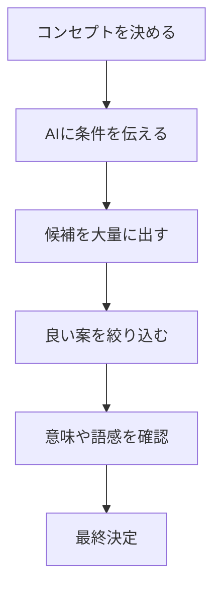

※本記事はアフィリエイト広告(PR)を含みます。

「新しい商品やサービスの名前が思いつかない」「キャッチコピーを何時間も考えているのに、しっくりこない」——そんな悩みを抱えていませんか?この記事では、**AIネーミング**を活用して名前やキャッチコピーを自動で考える方法と、おすすめのツール5選をわかりやすく紹介します。

この記事を読むと、次のことがわかります。

- AIで名前・キャッチコピーを考える具体的な手順
- ネーミング自動化に使えるおすすめツール5選と特徴
- 「無料で使えるの?」という疑問への答え
- 自分に合ったツールの選び方

最後まで読めば、今日からAIを使ってネーミング作業を一気に時短できるようになりますよ。

## AIネーミングとは?なぜ今注目されているのか

AIネーミングとは、その名の通り**AI(人工知能)を使って商品名・サービス名・キャッチコピーなどを自動生成すること**です。ChatGPTのような対話型AIや、ネーミングに特化した専用ツールにキーワードやコンセプトを入力すると、候補を数十個単位で一瞬で出してくれます。

従来は、担当者が辞書とにらめっこしながら何日もかけて考えたり、外部のネーミング会社に高額で依頼したりするのが一般的でした。AIを使えば、そのプロセスの「アイデア出し」の部分を大幅に短縮できるのが最大のメリットです。

### AIネーミングでできること

| できること | 具体例 |
| --- | --- |
| 商品・サービス名の候補出し | アプリ名、店舗名、ブランド名など |
| キャッチコピーの生成 | 広告文、LPの見出し、SNS投稿文 |
| ドメイン向けの短い名前 | 覚えやすい造語の作成 |
| 名前の意味・由来の説明 | なぜその名前が良いのかの理由付け |

このように、単に候補を出すだけでなく「その名前を選ぶ理由」まで説明してくれるのがAIの強みです。

## AIで名前・キャッチコピーを考える基本の手順

まずは専用ツールを使う前に、身近なAIチャットで試すのがおすすめです。基本的な流れは次の通りです。

### ステップ1:コンセプトを言葉にする

AIに丸投げする前に、「誰に」「どんな価値を」「どんな雰囲気で」届けたいのかを整理しましょう。ここが曖昧だと、出てくる候補もぼやけてしまいます。

### ステップ2:条件を具体的にAIへ伝える

AIへの指示(プロンプト)は具体的なほど良い結果が出ます。たとえば次のように伝えます。

> 「30代女性向けのオーガニック紅茶ブランドの名前を10個提案してください。やわらかく上品な語感で、カタカナ3〜5文字。それぞれ由来も添えてください。」

プロンプトの書き方をもっと詳しく知りたい方は、[AIプロンプトのコツ\|思い通りの回答を引き出す書き方を初心者向けに解説](/2026/06/22/ai-prompt-tips/)もあわせて読むと精度が上がります。

### ステップ3:大量に出して絞り込む

AIの強みは「量」です。まずは30個ほど出してもらい、その中から気になるものを5個選び、「この方向でさらに10個」と深掘りしていくと、質の高い候補にたどり着けます。

### ステップ4:意味・語感・重複をチェック

候補が固まったら、**他言語で変な意味にならないか**、**既存の商標や社名と重複していないか**を必ず確認しましょう。この最終チェックだけは人間の目で行うのが安全です。

## ネーミング自動化におすすめのツール5選

ここからは、実際にAIネーミングに使えるツールを5つ紹介します。料金プランは変更されることがあるため、詳細は各公式サイトで最新情報を確認してください。

### 1. ChatGPT(汎用型・万能タイプ)

もっとも手軽に始められるのがChatGPTです。名前もキャッチコピーも、由来の説明も一つのチャットで完結します。無料版でも十分に使えますが、より高性能なモデルを使いたい場合は有料版も検討の価値があります。

有料版と無料版の違いは[ChatGPT有料版は必要?無料版との違いと元が取れる使い方を解説](/2026/06/20/chatgpt-paid-vs-free/)で詳しく解説しています。

### 2. Catchy(キャッチー・日本語特化)

Catchyは日本発のAIライティングツールで、ネーミングやキャッチコピー生成のテンプレートが豊富に用意されています。「何を入力すればいいか」がフォーム形式でガイドされるため、プロンプトに慣れていない初心者でも扱いやすいのが魅力です。

### 3. Gemini(Google製・情報の広さが強み)

GoogleのGeminiも、名前やコピーのアイデア出しに向いています。各AIチャットの違いを知りたい方は[ChatGPTとClaudeとGeminiを徹底比較!初心者におすすめのAIチャットはどれ?](/2026/06/09/ai-chat-comparison/)を参考にすると、自分に合ったものが見つかります。

### 4. Copy.ai(コピー・英語圏で人気)

海外発のCopy.aiは、キャッチコピーや広告文の生成に強いツールです。英語のネーミングにも対応しているため、グローバル展開を見据えたブランド名づくりに向いています。

### 5. ネーミング特化Webサービス

「商品名だけをサクッと大量に出したい」という場合は、ネーミング専用のWebサービスも便利です。キーワードを入れるだけで造語を含む候補を一覧表示してくれるものが多く、ドメイン取得を意識した短い名前づくりに役立ちます。

## 用途別・ツールの選び方

どれを選べばいいか迷ったら、次の基準で考えてみてください。

| こんな人 | おすすめタイプ |
| --- | --- |
| まず無料で試したい | ChatGPT・Gemini |
| フォーム入力で簡単に使いたい | Catchy |
| 英語のネーミングもしたい | Copy.ai |
| とにかく候補を大量に出したい | ネーミング特化サービス |

ブログやビジネスの立ち上げそのものを考えている方は、[AI時代の「一人会社」入門\|ひとりでも回る仕組みとAI活用術](/2026/06/14/ai-solo-company/)もヒントになります。

## AIネーミングは無料で使える?

結論から言うと、**多くのツールに無料プランや無料トライアルがあります**。ChatGPTやGeminiは無料でも十分にネーミングを試せますし、CatchyやCopy.aiも一定回数まで無料で使える枠が用意されていることが一般的です。

ただし、無料プランでは1日の生成回数や利用できる機能に制限がある場合が多いです。本格的に大量のネーミングを行うなら、有料プランのほうが結果的に効率的なこともあります。最新の料金や無料枠の内容は、必ず各公式サイトで確認してください。

## AIネーミングを使うときの注意点

便利なAIネーミングですが、使う際は以下の点に気をつけましょう。

- **商標・社名の重複チェックは必ず人間が行う**:AIが出した名前がすでに他社に使われている可能性があります。
- **他言語での意味を確認する**:海外で意外な意味を持つ言葉になっていないか調べましょう。
- **AIの提案を鵜呑みにしない**:あくまで「たたき台」として使い、最後は自分の感性で決めることが大切です。
- **ありきたりな案になりやすい**:条件を細かく指定して、独自性のある方向に誘導しましょう。

AIはアイデアを広げる相棒ですが、最終決定を下すのはあなた自身です。この主従関係を忘れないことが、良いネーミングにつながります。

## まとめ

AIネーミングを活用すれば、これまで何時間もかかっていた名前やキャッチコピーのアイデア出しを、わずか数分に短縮できます。ポイントを振り返りましょう。

- **コンセプトを言葉にしてから**AIに具体的な条件を伝える
- まずは**大量に出して、少しずつ絞り込む**
- **無料でも試せるツールが多い**ので、ChatGPTやGeminiから始めるのがおすすめ
- 商標や他言語の意味など、**最終チェックは人間が行う**

まずは今日、手元のAIチャットに「〇〇の名前を10個考えて」と入力するところから始めてみてください。ぴったりの名前とキャッチコピーが、意外なほどあっさり見つかるかもしれませんよ。
