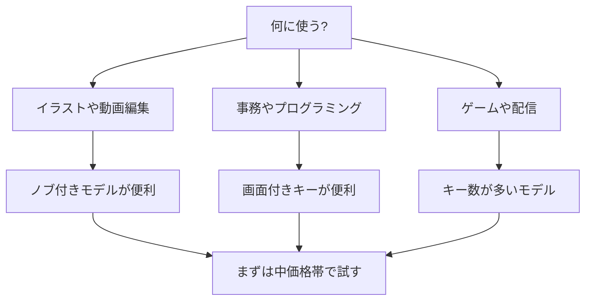

※本記事はアフィリエイト広告(PR)を含みます。

## 左手デバイス・マクロパッドとは?選び方の前に基本を押さえよう

「作業をもっと速くしたい」「よく使う操作をボタン一つで済ませたい」——そんな悩みを解決してくれるのが**左手デバイス・マクロパッド**です。この記事では、2026年の最新事情をふまえた**左手デバイス・マクロパッドの選び方**を、初心者の方にもわかりやすく解説します。読み終わるころには、自分の用途にぴったりの一台を選べるようになっているはずです。

まず言葉の意味から整理しましょう。

- **左手デバイス**:主にペンタブやマウスを持つ手と反対の「左手」で操作する補助入力機器のこと。イラスト制作や動画編集でよく使われます。
- **マクロパッド**:複数のキーに「マクロ(=一連の操作を自動で実行する登録機能)」を割り当てられる小型キーボードのこと。

呼び方は違いますが、どちらも「よく使う操作をボタンに登録して、作業を時短する」という目的は同じです。この記事ではまとめて解説していきます。

## 左手デバイス・マクロパッドで何ができるの?

具体的にどんなことができるのか、代表的な使い方を挙げてみます。

- **ショートカットの一発実行**:コピー&ペースト、取り消し(Ctrl+Z)などをボタン1つに
- **アプリの切り替え**:よく使うソフトを一発で起動
- **音量・再生の操作**:ノブ(回すつまみ)で音量調整や動画のコマ送り
- **定型文の入力**:メールの挨拶文や住所などをワンタッチで
- **ゲーム・配信の操作**:シーン切り替えやミュートを瞬時に

イラストレーターや動画編集者はもちろん、事務作業やプログラミングをする人にも役立ちます。デスク環境全体を快適にしたい方は、[在宅ワークが捗るデスク周りガジェット10選](/2026/06/11/home-office-gadgets/)もあわせてチェックすると、より効率的な作業スペースが作れますよ。

## 選び方の5つのポイント

ここからが本題です。左手デバイス・マクロパッドを選ぶときにチェックしたい5つのポイントを紹介します。

### 1. キー数(ボタンの数)

登録したい操作の数に合わせて選びます。目安は次のとおりです。

| キー数 | 向いている人 |
|--------|-------------|
| 3〜6キー | 使う操作が少ない・省スペース重視 |
| 9〜15キー | 一般的な作業・動画編集向け |
| 20キー以上 | イラスト・ゲーム・多機能を求める人 |

最初は「少なすぎるかな?」と思う数でも意外と足ります。迷ったら**中間の10キー前後**から始めるのがおすすめです。

### 2. 接続方式(有線かワイヤレスか)

- **有線(USB)**:遅延がなく安定。充電不要でずっと使える
- **ワイヤレス(Bluetoothなど)**:ケーブルがなくデスクがすっきり。ただし充電やペアリングが必要

デスクをスッキリさせたいならワイヤレス、安定性を重視するなら有線が基本です。

### 3. 画面付きキーの有無

最近は各キーに**小さな液晶画面**が付いていて、割り当てた機能のアイコンを表示できるモデルが人気です。「どのボタンが何の機能だっけ?」と忘れずに済むのが大きなメリット。ただし価格は高めになります。

### 4. ノブ(ダイヤル)の有無

くるくる回せる**ノブ**があると、音量調整・動画のスクロール・ブラシサイズの変更などが直感的にできます。動画編集やイラスト作業をする人には特におすすめの機能です。

### 5. 設定ソフトの使いやすさ

どんなに高機能でも、設定ソフトが使いにくいと宝の持ち腐れです。購入前に「対応OS(WindowsやMac)」「日本語対応か」を公式サイトで確認しておきましょう。

## 用途別・選び方フローチャート

自分に合うタイプがわからない方向けに、選び方の流れを図にまとめました。

まずは「何に使うか」を決めることが、失敗しない選び方の第一歩です。

## タイプ別おすすめの選び方

### コスパ重視で試したい人

初めての一台なら、まずは手ごろな価格の小型マクロパッドから始めるのが安心です。「思ったより使わなかった」というリスクを抑えられます。数千円台から手に入るモデルも多いので、気軽に試せます。

👉 [Amazonで「マクロパッド 左手デバイス」を見る](https://af.moshimo.com/af/c/click?a_id=5632371&p_id=170&pc_id=185&pl_id=38594&url=https%3A%2F%2Fwww.amazon.co.jp%2Fs%3Fk%3D%25E3%2583%259E%25E3%2582%25AF%25E3%2583%25AD%25E3%2583%2591%25E3%2583%2583%25E3%2583%2589%2520%25E5%25B7%25A6%25E6%2589%258B%25E3%2583%2587%25E3%2583%2590%25E3%2582%25A4%25E3%2582%25B9)

### イラスト・動画編集をする人

ノブ付きで、ペンタブと相性の良いモデルがおすすめです。ブラシサイズやタイムラインの操作が驚くほどスムーズになります。動画編集の効率をさらに上げたい方は、[AI動画編集ツール比較](/2026/06/16/ai-video-editing-tools/)も参考にすると、編集全体の時短につながります。

### 見た目と多機能を求める人

画面付きキーのモデルは、机の上で映えるうえに機能を直感的に把握できます。配信者やクリエイターに人気です。

👉 [楽天市場で「液晶付き マクロパッド」を探す](https://af.moshimo.com/af/c/click?a_id=5632328&p_id=54&pc_id=54&pl_id=616&url=https%3A%2F%2Fsearch.rakuten.co.jp%2Fsearch%2Fmall%2F%25E6%25B6%25B2%25E6%2599%25B6%25E4%25BB%2598%25E3%2581%258D%2520%25E3%2583%259E%25E3%2582%25AF%25E3%2583%25AD%25E3%2583%2591%25E3%2583%2583%25E3%2583%2589%2F)

## よくある質問(Q&A)

### Q. 無料の設定ソフトだけで使える?

はい、多くのメーカーが**無料の専用ソフト**を提供しています。基本的なキー割り当てやマクロ登録は無料の範囲でしっかり使えます。ただし一部の高度な機能は有料の場合もあるので、購入前に公式サイトで確認しておくと安心です。

### Q. MacでもWindowsでも使える?

モデルによって対応OSが異なります。**両対応のものが多い**ですが、片方のOSでは一部機能が制限されるケースもあります。必ず公式サイトで最新の対応状況を確認してください。

### Q. スマホやタブレットでも使える?

一部のBluetoothモデルはタブレットでも使えますが、専用ソフトがPC限定のこともあります。タブレットで絵を描く方は、[タブレットの選び方2026](/2026/06/22/tablet-guide-2026/)もあわせてご覧ください。

### Q. 価格はどれくらい?

数千円のシンプルなものから、画面付きの1万円以上のモデルまで幅広くあります。**正確な価格は変動するため、購入前に必ず販売ページで最新情報を確認してください。**

## 導入前に知っておきたい注意点

- **最初から完璧を目指さない**:使いながら少しずつ割り当てを調整していくのがコツです。
- **デスクのスペースを確認**:意外と場所を取るので、モニターやキーボードとの配置を考えておきましょう。
- **慣れるまで数日かかる**:体が操作を覚えると、一気に作業が速くなります。

作業効率化はデバイス単体だけでなく、椅子やモニター配置などの環境全体で決まります。長時間作業が多い方は[ゲーミングチェアの選び方2026](/2026/06/18/gaming-chair-guide-2026/)も見ておくと、疲れにくい環境が整いますよ。

## まとめ

左手デバイス・マクロパッドは、「よく使う操作をボタン1つで済ませる」ことで作業効率を大きく高めてくれる頼れる相棒です。選ぶときのポイントを振り返っておきましょう。

- **キー数**は用途に合わせて。迷ったら10キー前後から
- **接続方式**は安定の有線かスッキリのワイヤレスか
- **画面付きキー**や**ノブ**があると使い勝手が向上
- **設定ソフトの対応OSと使いやすさ**を購入前に確認

まずは手ごろな価格のモデルから試して、自分の作業にどれだけ効果があるかを体感してみるのがおすすめです。ぴったりの一台を見つけて、毎日の作業をもっと快適にしていきましょう。なお、価格やスペックは変わることがあるため、最終的な仕様は必ず公式サイトや販売ページで最新情報を確認してくださいね。
