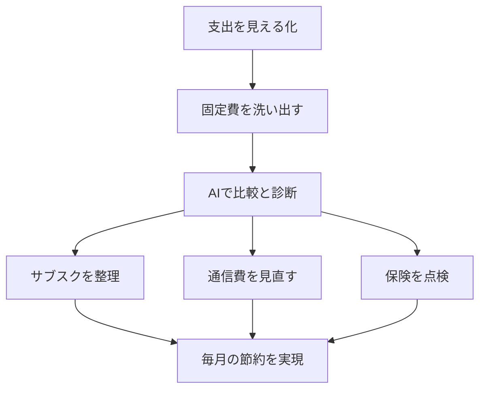

※本記事はアフィリエイト広告(PR)を含みます。

## AIで固定費を見直すと家計はどう変わる?

「毎月なんとなくお金が減っていく」「気づいたら使っていないサブスクに払い続けていた」——そんな悩みを抱えていませんか?この記事では、**AIで固定費を見直す方法**を初心者向けにわかりやすく解説します。サブスク・保険・通信費という「3大固定費」を対象に、AIをどう活用すれば無理なく節約できるのかを、具体的な手順とおすすめのツールとともに紹介します。

読み終えるころには、

- どの固定費から見直せば効果が大きいか
- AIをどう使えば面倒な作業を自動化できるか
- 今日から取れる具体的なアクション

がわかるようになります。難しい家計の知識は不要です。スマホとAIチャットさえあれば始められます。

## そもそも「固定費」とは?見直すべき理由

固定費とは、**毎月ほぼ一定額でかかり続ける支出**のことです。代表的なものは次の通りです。

- 家賃・住宅ローン
- 通信費(スマホ・光回線)
- 保険料(生命保険・医療保険など)
- サブスクリプション(動画・音楽・アプリなどの月額サービス)
- 水道光熱費

節約というと「食費を減らす」「電気をこまめに消す」など変動費の節約を思い浮かべがちですが、実は**固定費の見直しは一度やれば効果がずっと続く**のが大きなメリットです。毎月500円の節約でも、1年で6,000円、10年で6万円になります。しかも毎日我慢する必要がありません。

だからこそ、まずは固定費から手をつけるのが王道なのです。

## AIを固定費見直しに使うメリット

従来、固定費の見直しは「明細を集める」「各社のプランを比較する」「乗り換え手続きを調べる」といった面倒な作業がハードルでした。ここでAIが役立ちます。

- **情報整理が速い**:複数プランの条件を貼り付けると、AIが比較表にまとめてくれる
- **わかりにくい用語をかみ砕いてくれる**:保険や通信の専門用語を初心者向けに説明
- **自分の状況に合わせた提案**:家族構成や使い方を伝えると、優先順位を整理してくれる

AIチャットの選び方に迷う方は、[ChatGPTとClaudeとGeminiを徹底比較!初心者におすすめのAIチャットはどれ?](/2026/06/09/ai-chat-comparison/)も参考にしてみてください。

## 見直しの全体フロー

まずは全体の流れをイメージしましょう。

このように「見える化 → 洗い出し → AIで診断 → 実行」の順に進めると迷いません。順番に見ていきましょう。

## ステップ1:まず支出を見える化する

何にいくら払っているかを把握しないと、見直しは始まりません。最初にやるべきは**支出の見える化**です。

家計簿アプリを使えば、銀行口座やクレジットカードと連携して自動で支出を分類してくれます。最近はAIが「無駄になっていそうな支出」を指摘してくれるものもあります。具体的な使い方は[家計簿アプリ×AIで節約\|自動で支出を見える化する方法を初心者向けに解説](/2026/06/15/ai-household-budget-app/)で詳しく紹介していますので、あわせてご覧ください。

見える化すると、「あれ、これ何の引き落とし?」という支出が必ず見つかります。それこそが見直しの第一候補です。

## ステップ2:サブスクを整理する

### 使っていないサブスクを洗い出す

サブスク(月額課金サービス)は、契約したことを忘れて払い続けやすい代表格です。まずはクレジットカードやアプリストアの明細から、加入中のサービスをすべて書き出しましょう。

そのリストをAIに貼り付けて、こんなふうに聞いてみます。

> 「以下は私が契約中の月額サービスです。ジャンルごとに分類し、機能が重複していそうなものを教えてください。」

すると、動画配信が3つ重複している、音楽サービスが2つある、といった「かぶり」が一目でわかります。

### 残すもの・解約するものを決める

分類できたら、次の基準で仕分けます。

| 判断 | 目安 |
|------|------|
| 残す | 週1回以上使っている |
| 保留 | 月1〜2回だが満足度が高い |
| 解約 | 1か月以上使っていない |

迷ったら「解約して不便を感じたら再契約する」くらいの気持ちで大丈夫です。多くのサービスはいつでも再開できます。

なお、AIサービス自体のサブスク料金も見直し対象です。世代交代や値下げが続いているので、[AIサブスク料金比較2026年6月](/2026/06/16/ai-subscription-pricing-2026/)で最新の状況を確認しておくとよいでしょう。

## ステップ3:通信費を見直す

通信費は、固定費の中でも**節約効果が大きい**項目です。特に大手キャリアの高額プランをそのまま使っている場合は、格安SIMやオンライン専用プランに乗り換えるだけで月数千円下がることもあります。

AIには、こう相談してみましょう。

> 「私は月のデータ使用量が◯GB、通話はほとんどLINE通話です。今は月◯◯円払っています。乗り換え先を選ぶときのチェックポイントを教えてください。」

AIは「データ量に対して料金が高すぎないか」「通話オプションが本当に必要か」といった観点を整理してくれます。ただし、**具体的な料金プランは各社で頻繁に変わります**。最終的な金額や条件は必ず公式サイトで最新情報を確認してください。

家でも光回線とスマホのセット割が使えるケースがあるので、「セット割の有無」もAIに確認事項として挙げてもらうとよいでしょう。

## ステップ4:保険を点検する

保険は「なんとなく勧められて入ったまま」という人が非常に多い項目です。保障内容が今の生活に合っていないと、無駄に高い保険料を払い続けることになります。

AIに証券(契約内容の書類)の要点を伝えて、次のように聞いてみましょう。

> 「現在加入中の保険はこの内容です。保障が重複していないか、独身/子育て中などの私の状況に対して過剰・不足がないか、確認すべきポイントを整理してください。」

AIは中立的に「重複している保障」「見落としがちな点」を整理してくれます。ただし、保険は個人の事情で最適解が大きく変わるため、**AIの回答はあくまで下調べ**と考え、重要な判断は保険の専門家にも相談するのがおすすめです。AIで論点を整理してから相談に行くと、話がスムーズに進みます。

## 節約したお金を活かすなら

固定費の見直しで浮いたお金は、暮らしを快適にする投資に回すのも一つの手です。たとえば在宅ワーク環境を整えたり、電力消費を抑える機器に買い替えたりすると、さらなる節約や生産性アップにつながります。

👉 [Amazonで「スマートプラグ 電力測定」を見る](https://af.moshimo.com/af/c/click?a_id=5632371&p_id=170&pc_id=185&pl_id=38594&url=https%3A%2F%2Fwww.amazon.co.jp%2Fs%3Fk%3D%25E3%2582%25B9%25E3%2583%259E%25E3%2583%25BC%25E3%2583%2588%25E3%2583%2597%25E3%2583%25A9%25E3%2582%25B0%2520%25E9%259B%25BB%25E5%258A%259B%25E6%25B8%25AC%25E5%25AE%259A)

消費電力を「見える化」できるスマートプラグを使えば、待機電力の多い家電がわかり、光熱費の見直しにも役立ちます。

## よくある質問(Q&A)

### Q. 固定費の見直しにAIは無料で使える?

はい、多くのAIチャットには無料プランがあり、今回紹介した「比較」「分類」「用語の説明」といった用途なら無料版でも十分こなせます。より高度な分析や大量の資料整理をしたい場合は有料版が便利です。無料版と有料版の違いは[ChatGPT有料版は必要?無料版との違いと元が取れる使い方を解説](/2026/06/20/chatgpt-paid-vs-free/)で詳しく解説しています。

### Q. 個人情報をAIに入力しても大丈夫?

口座番号やマイナンバーなど、そのままの個人情報は入力しないのが安全です。金額やプラン名など、比較に必要な情報だけを伝えれば十分に役立ちます。心配な場合は、名前や口座を伏せて相談しましょう。

### Q. どの固定費から見直すと効果が大きい?

一般的には「通信費 → サブスク → 保険」の順に取り組むと、手間の割に効果を実感しやすいです。通信費は乗り換えるだけで大きく下がることが多く、サブスクは解約の手続きが簡単だからです。

## まとめ

AIを活用すれば、これまで面倒だった固定費の見直しがぐっとラクになります。ポイントを振り返りましょう。

- **固定費の見直しは一度やれば効果が続く**、コスパのよい節約
- まずは家計簿アプリなどで**支出を見える化**する
- AIに明細やプランを整理してもらい、**サブスク・通信費・保険**を点検する
- 具体的な料金や保険の判断は、**公式サイトや専門家で最終確認**する

大切なのは、完璧を目指さず「まず1つ解約してみる」「1社だけ料金を比較してみる」と小さく始めることです。AIという頼れる相談相手がいれば、面倒さのハードルはぐっと下がります。今日、契約中のサブスクを1つ書き出すところから始めてみてください。それが家計を軽くする第一歩になります。
