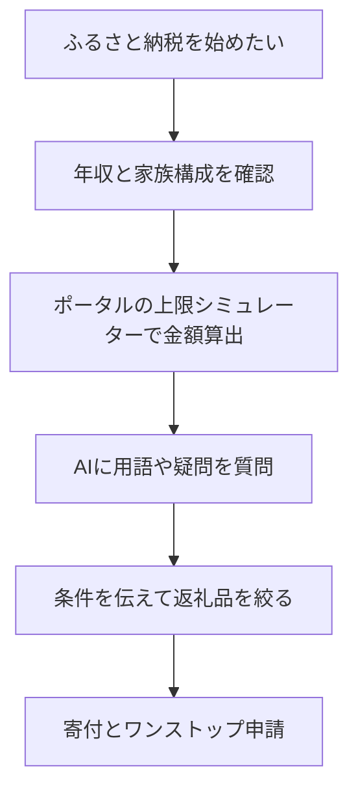

※本記事はアフィリエイト広告(PR)を含みます。

## AI×ふるさと納税の選び方をやさしく解説

「ふるさと納税、お得なのは知っているけど、返礼品選びも上限額の計算も面倒で結局やっていない…」という方は多いのではないでしょうか。この記事では、そんな悩みをAI(人工知能。ここではChatGPTなどの対話型AIを指します)で解決する方法を、初心者にもわかりやすく解説します。

この記事を読むと、次のことがわかります。

- ふるさと納税でAIが役立つ具体的な場面
- 返礼品探しや上限額計算をAIで時短するコツ
- 無料で使えるのか、注意すべき点は何か

難しい税金の知識がなくても、AIを「相談相手」として使えば、驚くほどスムーズに進められます。さっそく見ていきましょう。

## そもそもふるさと納税とは?(かんたん復習)

ふるさと納税とは、自分が応援したい自治体に寄付をすると、寄付額のうち2,000円を超える部分が所得税・住民税から控除(差し引かれること)され、さらに地域の特産品などの「返礼品」がもらえる制度です。

つまり、実質2,000円の自己負担で各地の特産品を受け取れるお得な仕組みです。ただし、控除を全額受けられる寄付額には**上限**があり、この上限は年収や家族構成によって変わります。ここが初心者にとって一番のつまずきポイントです。

## ふるさと納税でAIが役立つ3つの場面

AIは万能ではありませんが、次のような「考える・調べる・比べる」作業でとても頼りになります。

### 1. 上限額のシミュレーションの理解

上限額そのものは各ポータルサイトの計算機能を使うのが正確ですが、「なぜこの金額になるのか」「ふるさと納税以外に医療費控除もある場合はどう考えればいいか」といった疑問はAIに質問するとわかりやすく説明してくれます。

### 2. 返礼品選びの相談

膨大な返礼品の中から選ぶのは大変です。AIに条件を伝えると、選ぶ基準を整理してくれます。

### 3. スケジュールや手続きの整理

ワンストップ特例制度(確定申告なしで控除を受けられる仕組み)の申請期限など、やるべきことを時系列でまとめてもらえます。

## 返礼品探しをAIで時短するプロンプト例

AIに指示を出す文章を「プロンプト」と呼びます。返礼品選びでは、次のように具体的に条件を伝えるのがコツです。

> 「一人暮らしで冷凍庫が小さいです。ふるさと納税の返礼品で、常温保存できて日持ちする食品のジャンルを、選ぶときの注意点とあわせて教えてください。」

このように「保存環境」「家族構成」「欲しいジャンル」を伝えると、AIが選び方の観点を整理してくれます。

AIから思い通りの答えを引き出すコツは、[AIプロンプトのコツ\|思い通りの回答を引き出す書き方を初心者向けに解説](/2026/06/22/ai-prompt-tips/)でも詳しく紹介していますので、あわせてご覧ください。

### 返礼品選びで伝えるとよい条件リスト

| 項目 | 伝える内容の例 |
|------|----------------|
| 家族構成 | 一人暮らし / 4人家族など |
| 保存環境 | 冷凍庫の大きさ、常温希望など |
| 用途 | 日常使い / ギフト / 防災備蓄 |
| 予算感 | 寄付上限の範囲内で分けたい金額 |
| 苦手なもの | アレルギー、嫌いな食材 |

※実際の返礼品の内容・在庫・寄付額は変動します。最終的な情報は必ずポータルサイトの公式ページで最新情報を確認してください。

## 上限額計算はAIとシミュレーターの合わせ技が正解

注意したいのは、**正確な上限額の計算はAIだけに任せない**ことです。AIは一般的な考え方の説明は得意ですが、あなたの正確な年収や各種控除に基づいた金額を保証できるわけではありません。

おすすめは次の2ステップです。

1. **正確な金額**は、ふるさと納税ポータルサイトの上限額シミュレーターで算出する
2. **わからない用語や考え方**をAIに質問して理解を深める

この役割分担なら、正確さとわかりやすさの両方を手に入れられます。

## AIでふるさと納税は無料で使える?

結論から言うと、**基本的な相談なら無料で十分使えます**。ChatGPTやGeminiなどの対話型AIには無料プランがあり、返礼品選びの相談や用語の質問程度であれば無料版でも問題ありません。

どのAIチャットが自分に合うか迷う場合は、[ChatGPTとClaudeとGeminiを徹底比較!初心者におすすめのAIチャットはどれ?](/2026/06/09/ai-chat-comparison/)を参考にすると選びやすくなります。

より高度な使い方(家計全体のシミュレーションや大量データの分析など)をしたい場合のみ、有料版を検討すればよいでしょう。

## さらにお得にするための周辺テクニック

ふるさと納税は、他の家計改善策と組み合わせるとより効果的です。

- **ポイント還元と併用**:寄付時のポイント還元をうまく使うと、実質負担を抑えられます。[AIでポイ活を効率化する方法](/2026/07/03/ai-point-activity/)もチェックしてみてください。
- **家計の見える化**:寄付額を含めた支出全体を把握しておくと計画が立てやすくなります。[家計簿アプリ×AIで節約\|自動で支出を見える化する方法](/2026/06/15/ai-household-budget-app/)が参考になります。

また、返礼品で受け取った食材をおいしく調理するために、調理家電を見直すのもおすすめです。

👉 [楽天市場で「電気圧力鍋 自動調理」を探す](https://af.moshimo.com/af/c/click?a_id=5632328&p_id=54&pc_id=54&pl_id=616&url=https%3A%2F%2Fsearch.rakuten.co.jp%2Fsearch%2Fmall%2F%25E9%259B%25BB%25E6%25B0%2597%25E5%259C%25A7%25E5%258A%259B%25E9%258D%258B%2520%25E8%2587%25AA%25E5%258B%2595%25E8%25AA%25BF%25E7%2590%2586%2F)

## AIを使うときの注意点

便利なAIですが、次の点には注意しましょう。

- **金額や制度は必ず公式で確認**:AIの回答は古い情報や誤りを含むことがあります。控除額や申請期限などの重要事項は、必ず総務省やポータルサイトの公式情報で確認してください。
- **個人情報の入力は最小限に**:年収などを相談する際も、氏名やマイナンバーなどの機密情報は入力しないようにしましょう。
- **最終判断は自分で**:AIはあくまで補助役です。寄付先や金額は自分で納得したうえで決めましょう。

## まとめ

ふるさと納税は「返礼品選び」と「上限額計算」という2つのハードルさえ超えれば、とてもお得な制度です。AIを活用すれば、この2つを次のように時短できます。

- **返礼品選び**:条件を伝えてAIに絞り込みの観点を整理してもらう
- **上限額計算**:正確な金額はシミュレーター、疑問の解消はAIという役割分担
- **無料で開始OK**:基本的な相談は無料AIで十分

まずは使い慣れたAIチャットに「ふるさと納税を始めたいので、進め方を教えて」と話しかけてみてください。そこから一歩ずつ進めれば、今年こそスムーズにお得を受け取れるはずです。金額や制度の詳細は、必ず公式サイトで最新情報を確認しながら進めましょう。
