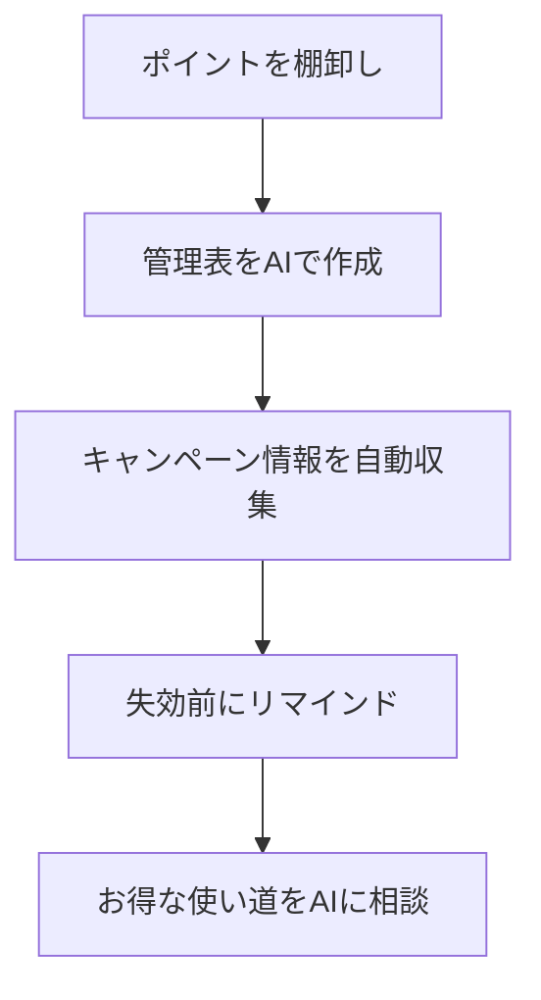

※本記事はアフィリエイト広告(PR)を含みます。

## AIでポイ活を効率化するとは?この記事でわかること

「ポイ活(ポイント活動の略)」は、買い物やアンケート、キャンペーン参加でポイントを貯めてお得に暮らす節約術です。でも、複数のポイントサービスを使っていると「どこに何ポイント貯まっているか分からない」「気づいたら失効していた」「お得なキャンペーンを見逃した」という悩みが出てきますよね。

この記事では、**AIでポイ活を効率化する方法**を初心者向けにやさしく解説します。具体的には、次のことがわかります。

- AIでポイント管理をラクにする考え方
- キャンペーン情報を自動で集める仕組みの作り方
- ポイント失効を防ぐリマインドの設定方法
- 無料で始められるツールと注意点

「難しそう…」と感じる方も大丈夫です。特別なスキルは不要で、スマホとAIチャットがあれば今日から始められます。

## そもそもポイ活のどこがAI向きなのか

ポイ活には「情報収集」「管理」「判断」という3つの作業があります。これらは実はAIが得意な分野です。

| ポイ活の作業 | 従来のやり方 | AIを使うと |
|---|---|---|
| キャンペーン情報の収集 | 自分でサイトを巡回 | 条件を伝えて要約・整理してもらう |
| ポイントの管理 | 手帳やメモで手動記録 | 一覧化・計算を任せる |
| 使い方の判断 | 感覚で決める | 「どれを優先して使うべきか」を相談 |

つまりAIは「調べる・まとめる・考える」を肩代わりしてくれる、優秀なポイ活の相棒になるのです。

## AIでポイ活を効率化する4つのステップ

全体の流れを図にすると、次のようになります。

ひとつずつ見ていきましょう。

### ステップ1:貯めているポイントを棚卸しする

まずは今使っているポイントサービスを書き出します。楽天ポイント、Vポイント、dポイント、PayPayポイントなど、意外とたくさんあるはずです。

ここでAIチャット(ChatGPTやGeminiなど)に、こう頼んでみましょう。

> 「次のポイントを管理する表を作ってください。項目はサービス名・現在のポイント数・有効期限・主な貯め方でお願いします」

すると、コピーして使える表がすぐに完成します。どのAIチャットを選ぶか迷う方は、[ChatGPTとClaudeとGeminiを徹底比較!初心者におすすめのAIチャットはどれ?](/2026/06/09/ai-chat-comparison/)も参考にしてみてください。

### ステップ2:ポイント管理表をAIで整える

作った表は、スプレッドシートやメモアプリに貼り付けて管理します。ポイント残高を入力すれば、AIに「合計で何円分になるか」「今月中に失効するものはどれか」を計算・チェックしてもらえます。

家計全体でお金の流れを見える化したい方は、[家計簿アプリ×AIで節約\|自動で支出を見える化する方法](/2026/06/15/ai-household-budget-app/)と組み合わせると、ポイントも含めた「お得な家計」が作れます。

### ステップ3:キャンペーン情報を自動で集める

ポイ活で差がつくのは、やはりキャンペーンの活用です。とはいえ毎日いくつものサイトをチェックするのは大変ですよね。

そこで役立つのが、AI検索エンジンや予約タスク機能です。

- **AI検索を使う**:Perplexityなどに「今月の◯◯ポイントの還元キャンペーンをまとめて」と聞くと、要点を整理して教えてくれます。使い分けは[AI検索エンジンおすすめ徹底比較](/2026/06/23/ai-search-engine-comparison/)が詳しいです。
- **予約タスクで定期チェック**:ChatGPTの予約タスク機能を使えば、決まった曜日に自動でキャンペーンの確認を促してもらえます。詳しくは[ChatGPT予約タスクが刷新\|自動でリマインド＆ウォッチできる新機能を解説](/2026/06/22/chatgpt-scheduled-tasks/)をご覧ください。

ただし、AIが示す情報が最新・正確とは限りません。実際に参加する前に、必ず各サービスの**公式サイトで最新のキャンペーン内容と条件を確認**しましょう。

### ステップ4:失効を防ぎ、お得な使い道を相談する

せっかく貯めたポイントも、失効しては意味がありません。有効期限を管理表に入れておき、AIのリマインド機能や[AIスケジュール管理術\|忙しい人のためのタスク自動化入門](/2026/06/13/ai-schedule-automation/)を活用して、期限前に通知が届くようにしておくと安心です。

さらに「1000ポイントを一番お得に使うには?」とAIに相談すれば、ポイント投資・買い物・支払い充当など、選択肢を整理してくれます。最終判断は自分で行うのが基本ですが、考える材料が一気にそろいます。

## AIツールは無料で使える?

「便利そうだけどお金がかかるのでは?」と気になる方も多いはずです。結論から言うと、**ポイ活の効率化なら無料プランでも十分始められます**。

- ChatGPT・Gemini・Claudeなどのチャットには無料プランがあります
- 表作成や情報整理といった軽い作業なら無料枠で足ります
- 予約タスクや高度な検索は有料プランで使いやすくなる場合があります

まずは無料で試し、「もっと自動化したい」と感じたら有料版を検討する流れがおすすめです。有料版の違いは[ChatGPT有料版は必要?無料版との違いと元が取れる使い方を解説](/2026/06/20/chatgpt-paid-vs-free/)で詳しく解説しています。

## ポイ活をさらに効率化する小ワザ

ポイ活はスキマ時間の積み重ねが大切です。移動中や家事の合間に情報チェックやAIへの相談をする方は、片手で操作しやすい環境を整えると効率が上がります。音声で調べ物をしたい人には、集中しやすいイヤホンも便利です。

👉 [Amazonで「ワイヤレスイヤホン ノイズキャンセリング」を見る](https://af.moshimo.com/af/c/click?a_id=5632371&p_id=170&pc_id=185&pl_id=38594&url=https%3A%2F%2Fwww.amazon.co.jp%2Fs%3Fk%3D%25E3%2583%25AF%25E3%2582%25A4%25E3%2583%25A4%25E3%2583%25AC%25E3%2582%25B9%25E3%2582%25A4%25E3%2583%25A4%25E3%2583%259B%25E3%2583%25B3%2520%25E3%2583%258E%25E3%2582%25A4%25E3%2582%25BA%25E3%2582%25AD%25E3%2583%25A3%25E3%2583%25B3%25E3%2582%25BB%25E3%2583%25AA%25E3%2583%25B3%25E3%2582%25B0)

また、ポイントは「固定費の支払い」に充てると効果が大きいものです。通信費やサブスクの見直しとあわせて考えると、節約効果がさらに高まります。[AIで固定費を見直す方法2026\|サブスク・保険・通信費の節約術](/2026/07/03/ai-fixed-cost-saving/)もチェックしてみてください。

## AIポイ活で気をつけたい注意点

便利なAIですが、使う際は次の点に注意しましょう。

1. **個人情報を入力しすぎない**:クレジットカード番号やパスワードはAIに入力しないようにしましょう。
2. **情報は必ず一次情報で確認**:キャンペーンの還元率や期間は変わりやすいため、公式サイトで最終確認を。
3. **貯めることが目的にならないように**:必要のない買い物でポイントを追うと、かえって出費が増えます。

この3つを守れば、AIポイ活を安全に楽しめます。

## まとめ

最後に、AIでポイ活を効率化するポイントを振り返りましょう。

- ポイ活の「情報収集・管理・判断」はAIが得意な分野
- まずは**ポイントの棚卸しと管理表作り**から始める
- キャンペーン情報は**AI検索と予約タスク**で自動収集
- **失効前のリマインド**と**使い道の相談**で取りこぼしを防ぐ
- 無料プランでも十分始められる
- 個人情報の入力は避け、条件は公式サイトで確認する

AIを使えば、これまで手間だったポイント管理や情報収集がぐっとラクになり、貯め忘れ・使い忘れを防げます。まずは今日、使っているポイントを書き出して、AIチャットに管理表を作ってもらうところから始めてみましょう。小さな一歩が、着実な「お得」につながりますよ。
