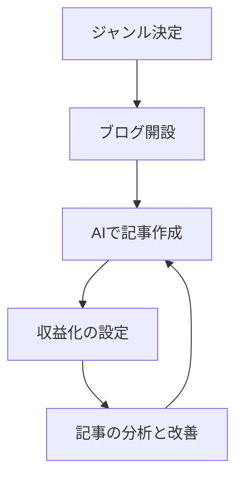

※本記事はアフィリエイト広告(PR)を含みます。

「ブログ×AIで月1万円くらい稼げたらいいな」——そう思って検索したあなたに向けた記事です。この記事を読むと、**AIを活用したブログで月1万円を目指すための現実的なロードマップ**がわかります。ジャンルの決め方、記事の作り方、収益化の仕組み、そして「どのくらいで達成できるのか」という時間の目安まで、初心者がつまずきやすいポイントを丁寧に解説します。

先に結論をお伝えすると、AIを使えば記事作成のスピードは大きく上がりますが、「AIに丸投げすれば自動で稼げる」わけではありません。人間の企画力や体験と、AIの作業スピードを掛け合わせることが、月1万円への一番の近道です。

## 月1万円は現実的?まず知っておきたい前提

ブログの収益は「アクセス数 × 収益率」で決まります。ざっくりしたイメージですが、月1万円を稼ぐには一定数の記事とアクセスの積み重ねが必要で、**多くの人は3〜6か月ほどの継続**を経て達成しています。

大切なのは、最初の数か月は「収益ゼロが普通」だと理解しておくことです。ここで諦める人が非常に多いので、逆に言えば**続けるだけで上位に残れる**のがブログの世界です。AIは、この「続ける」ハードルを下げてくれる強力な味方になります。

### AIでできること・できないこと

| AIが得意なこと | 人間がやるべきこと |
| --- | --- |
| 記事の下書き・構成案作成 | ジャンルやテーマの決定 |
| 文章のリライト・校正 | 実体験や独自の意見の追加 |
| キーワードのアイデア出し | 情報の正確性チェック |
| タイトル・見出しの案出し | 読者に響く企画づくり |

AIはあくまで「優秀なアシスタント」です。最終的に価値を決めるのは、あなた自身の視点や体験だと覚えておきましょう。

## 月1万円までの5ステップ・ロードマップ

全体の流れを図で見てみましょう。

記事を書いて分析し、また改善して書く——このサイクルを回すことが基本です。それぞれのステップを見ていきましょう。

### ステップ1:稼ぎやすいジャンルを決める

最初の関門がジャンル選びです。以下の3つの条件が重なる分野が理想的です。

- **自分が興味を持って続けられる**こと
- **読者に悩みがあり検索される**こと
- **紹介できる商品やサービスがある**こと

たとえば「AIツール」「ガジェット」「副業」「節約」などは、紹介できる商材が多く初心者にも取り組みやすいジャンルです。まずは1つのテーマに絞り込みましょう。あれもこれもと手を広げると、専門性が薄まってアクセスが集まりにくくなります。

### ステップ2:ブログを開設する

本気で収益化を目指すなら、無料ブログではなく**独自ドメイン + レンタルサーバー**でのWordPress運用がおすすめです。広告の自由度が高く、資産として育てやすいためです。

サーバー選びに迷ったら、[AIブログにおすすめのレンタルサーバー比較\|WING・VPS・ロリポップ](/2026/06/14/rental-server-for-ai-blog/)を参考にしてください。月1,000円前後から始められるプランが一般的ですが、料金は変動するため公式サイトで最新情報を確認してください。

### ステップ3:AIで記事を効率よく作る

いよいよAIの出番です。ただし、AIが出した文章をそのままコピペするのはNG。読者にとって薄い内容になりやすく、検索エンジンからの評価も上がりにくいためです。

おすすめは次の役割分担です。

1. **構成案をAIに作らせる**(見出しの流れを整理)
2. **下書きをAIに書かせる**(たたき台として)
3. **自分の体験・意見を加筆する**(ここが一番大事)
4. **AIで誤字脱字や読みやすさを校正する**

具体的な手順は[AIでブログ記事を書く方法\|初心者向け完全ガイド](/2026/06/12/ai-blog-writing-guide/)で詳しく解説しています。また、思い通りの文章を引き出すには指示の出し方が重要なので、[AIプロンプトのコツ](/2026/06/22/ai-prompt-tips/)も合わせて読んでおくと作業効率が一気に上がります。

### ステップ4:収益化を設定する

ブログの主な収益源は次の2つです。

- **クリック型広告(Googleアドセンスなど)**:記事が読まれるほど少しずつ収益が発生
- **アフィリエイト**:紹介した商品が売れると報酬が発生。単価が高く月1万円達成の主力になりやすい

初心者はまずアフィリエイトのASP(広告を仲介するサービス)に登録し、記事の内容に合った商品を自然に紹介するところから始めましょう。

### ステップ5:分析して改善する

記事を公開したら、アクセス解析ツールで「どの記事が読まれているか」を確認します。読まれている記事をさらに強化し、読まれない記事はタイトルや内容をリライトする——この地道な改善が収益を伸ばします。

## AIツールは無料で使える?費用の目安

「まず費用をかけずに試したい」という方も多いはず。結論として、**無料でも十分に始められます**。ChatGPTやGeminiなどには無料プランがあり、記事の下書き作成程度なら無料版でも対応可能です。

ただし、長文をたくさん書く・より賢いモデルを使いたい場合は有料版が快適です。自分に必要かどうかは[ChatGPT有料版は必要?無料版との違いと元が取れる使い方を解説](/2026/06/20/chatgpt-paid-vs-free/)で判断してみてください。ライティング特化ツールの比較は[AIライティングツール比較2026](/2026/06/19/ai-writing-tool-comparison-2026/)が参考になります。

最低限かかる費用の目安は次のとおりです(価格は変動するため公式サイトで確認してください)。

| 項目 | 月額の目安 |
| --- | --- |
| レンタルサーバー | 1,000円前後 |
| 独自ドメイン | 数十〜数百円 |
| AIツール(任意) | 無料〜3,000円程度 |

## 挫折しないためのコツ

月1万円達成の最大の敵は「途中でやめてしまうこと」です。集中して作業できる環境を整えるのも立派な投資です。カフェや自宅で作業に没頭したい方は、周囲の音を遮る道具があると効率が上がります。

👉 [Amazonで「ノイズキャンセリング ワイヤレスイヤホン」を見る](https://af.moshimo.com/af/c/click?a_id=5632371&p_id=170&pc_id=185&pl_id=38594&url=https%3A%2F%2Fwww.amazon.co.jp%2Fs%3Fk%3D%25E3%2583%258E%25E3%2582%25A4%25E3%2582%25BA%25E3%2582%25AD%25E3%2583%25A3%25E3%2583%25B3%25E3%2582%25BB%25E3%2583%25AA%25E3%2583%25B3%25E3%2582%25B0%2520%25E3%2583%25AF%25E3%2582%25A4%25E3%2583%25A4%25E3%2583%25AC%25E3%2582%25B9%25E3%2582%25A4%25E3%2583%25A4%25E3%2583%259B%25E3%2583%25B3)

また、AIブログを本格的な副業として育てたい方は、他の稼ぎ方も知っておくと視野が広がります。[AI副業の始め方｜初心者でも稼げる仕事5選とおすすめツール](/2026/06/20/ai-side-business-start/)も合わせてチェックしてみてください。

## まとめ

ブログ×AIで月1万円を目指すロードマップを振り返りましょう。

- 月1万円は**3〜6か月の継続**で達成する人が多い、現実的な目標
- AIは記事作成のスピードを上げる「アシスタント」。**丸投げでは稼げない**
- 手順は「ジャンル決定 → 開設 → AIで作成 → 収益化 → 分析改善」の5ステップ
- 無料ツールでも始められるが、本格運用なら独自ドメイン+サーバーがおすすめ
- 最大のコツは、**とにかく続けること**

まずは今日、興味のあるジャンルを1つ紙に書き出し、AIに構成案を作らせてみるところから始めてみましょう。小さな一歩の積み重ねが、月1万円への確実な道になります。
