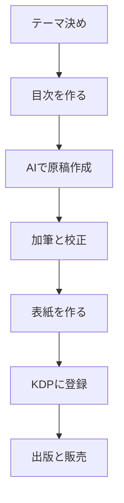

※本記事はアフィリエイト広告(PR)を含みます。

「本を書いてみたいけれど、文章を書くのが苦手…」「Kindle出版に興味はあるけど、何から始めればいいかわからない」——そんな方に朗報です。近年はAIを使って電子書籍(Kindle出版)を作る方法が一般的になり、初心者でも数日で1冊を仕上げられるようになりました。

この記事では、**AIで電子書籍を作る方法**を、企画から執筆・表紙作成・出版までの流れに沿ってやさしく解説します。読み終えるころには「どのツールを使い、どんな順番で進めればいいか」がイメージできるはずです。無料で始めるコツや、やってはいけない注意点もあわせて紹介します。

## AIで電子書籍を作るとは?まず全体像をつかもう

Kindle出版とは、Amazonが提供する「KDP(Kindle Direct Publishing)」という仕組みを使って、個人が自分の電子書籍を出版・販売できるサービスのことです。出版社を通さず、誰でも無料でアカウントを作って本を登録できます。

ここにAIを組み合わせると、次のような作業を効率化できます。

- 本のテーマ・タイトル・目次(構成)のアイデア出し
- 各章の原稿の下書き作成
- 文章の校正・リライト(読みやすく整える作業)
- 表紙デザインのたたき台づくり
- 紹介文(商品ページの説明文)の作成

つまりAIは「優秀なアシスタント」として、時間のかかる作業を肩代わりしてくれる存在です。ただし、最終的な内容の判断や責任は自分にあることは忘れないようにしましょう。

## 執筆から出版までの流れ

全体の流れを図にすると、次のようになります。

それぞれのステップを見ていきましょう。

### 1. テーマとターゲットを決める

まずは「誰に向けて、何を伝える本か」を決めます。売れやすいのは、自分の経験や得意分野を活かした実用書やノウハウ本です。「初心者向けの〇〇入門」のように、読者と悩みを具体的に絞るほど刺さりやすくなります。

テーマ選びに迷ったら、ChatGPTなどのAIチャットに「30代の副業初心者が読みたいKindleのテーマをTHE理由つきで10個出して」と聞くと、たくさんのアイデアが得られます。AIチャット選びに迷う方は、[ChatGPTとClaudeとGeminiを徹底比較!初心者におすすめのAIチャットはどれ?](/2026/06/09/ai-chat-comparison/)も参考にしてください。

### 2. 目次(構成)を作る

テーマが決まったら、目次を作ります。目次は本の設計図であり、ここがしっかりしていると執筆がスムーズに進みます。AIに「このテーマで5〜7章構成の目次案を作って」と依頼し、章立てを整えていきましょう。

### 3. AIで原稿を作成する

目次が固まったら、章ごとに原稿を作成します。「第2章の『〇〇』について、初心者向けに1500字で書いて」のように、章単位で少しずつ指示するのがコツです。一度に全部を書かせようとすると、内容が浅くなりがちです。

AIへの指示(プロンプト)の出し方次第で文章の質は大きく変わります。より良い原稿を引き出したい方は、[AIプロンプトのコツ\|思い通りの回答を引き出す書き方を初心者向けに解説](/2026/06/22/ai-prompt-tips/)や、[AIでブログ記事を書く方法\|初心者向け完全ガイド](/2026/06/12/ai-blog-writing-guide/)が役立ちます。書籍もブログも、文章を組み立てる考え方は共通しています。

### 4. 加筆・校正して自分の言葉にする

AIが書いた文章は、あくまで「下書き」です。そのまま出すと機械的で薄い印象になったり、事実と異なる内容(AIが平気で間違える現象)が含まれることもあります。必ず自分で読み返し、体験談やエピソードを加えて「あなたらしい本」に仕上げましょう。この加筆こそが、他の本との差別化になります。

### 5. 表紙を作る

電子書籍は表紙の第一印象がとても大切です。画像生成AIを使えば、デザインのたたき台を無料で作ることもできます。詳しくは[無料で使える画像生成AIおすすめ5選\|商用利用の注意点も解説](/2026/06/11/free-image-ai-tools/)をご覧ください。文字入れなど細かい調整は、Canvaなどの無料デザインツールを併用すると仕上がりが安定します。

### 6. KDPに登録して出版する

原稿と表紙が完成したら、KDPのサイトにアカウントを登録し、原稿ファイル(WordやEPUB形式)と表紙をアップロードします。価格やカテゴリー、紹介文を設定して申請すると、審査を経て数十時間ほどで販売が始まります。紹介文もAIに「読みたくなる紹介文を作って」と手伝ってもらえます。

## AIツールはどう選ぶ?比較の考え方

執筆に使えるAIツールは多く、迷いやすいポイントです。特徴をざっくり整理すると次のとおりです。

| ツールの種類 | 得意なこと | 向いている人 |
| --- | --- | --- |
| 汎用AIチャット | アイデア出し・原稿作成 | まず無料で試したい人 |
| 専用ライティングツール | 型に沿った長文作成 | 効率重視で量産したい人 |
| 画像生成AI | 表紙のデザイン | 表紙にこだわりたい人 |

どのライティングツールが自分に合うか迷ったら、[AIライティングツール比較2026\|ChatGPT・Jasper・Catchyどれが使える?](/2026/06/19/ai-writing-tool-comparison-2026/)で特徴を比べてみると選びやすくなります。

## AIでの電子書籍づくりは無料で始められる?

「お金をかけずに始めたい」という方も多いはずです。結論から言うと、**基本的には無料で始められます**。

- KDPへの登録・出版は無料
- ChatGPTなどのAIチャットには無料プランがある
- 画像生成AIやCanvaにも無料枠がある

ただし、無料版は文字数や機能に制限がある場合が多く、本格的に量産するなら有料プランのほうが効率的です。有料版が必要かどうか迷う方は、[ChatGPT有料版は必要?無料版との違いと元が取れる使い方を解説](/2026/06/20/chatgpt-paid-vs-free/)を参考に判断すると良いでしょう。料金や機能は変わりやすいので、契約前に必ず各サービスの公式サイトで最新情報を確認してください。

## 執筆環境を整えると作業がはかどる

AIとの対話や長文の校正は、意外と目や姿勢に負担がかかります。読みやすい大きめのタブレットや、集中できるイヤホンがあると作業効率が上がります。完成した自分の本を実機で読み返すためにも、電子書籍リーダーを1台持っておくと便利です。

👉 [Amazonで「Kindle 電子書籍リーダー」を見る](https://af.moshimo.com/af/c/click?a_id=5632371&p_id=170&pc_id=185&pl_id=38594&url=https%3A%2F%2Fwww.amazon.co.jp%2Fs%3Fk%3DKindle%2520%25E9%259B%25BB%25E5%25AD%2590%25E6%259B%25B8%25E7%25B1%258D%25E3%2583%25AA%25E3%2583%25BC%25E3%2583%2580%25E3%2583%25BC)

端末選びで迷う方は、[電子書籍リーダーは買うべき?KindleとKoboを徹底比較【初心者向け】](/2026/06/13/kindle-kobo-comparison/)もチェックしてみてください。

## 出版時に気をつけたい注意点

AIを活用する際は、次の点に注意しましょう。

- **著作権と事実確認**:AIの文章に他者の表現や誤情報が混ざることがあります。必ず自分で確認・修正を。
- **AI生成であることの明示**:プラットフォームによってはAI利用の申告を求める場合があります。KDPの最新ガイドラインを確認しましょう。
- **薄い内容にしない**:AIまかせの量産本は評価が下がりがちです。読者の役に立つ独自の価値を必ず加えてください。
- **画像の商用利用範囲**:表紙に使う画像生成AIの利用規約を事前に確認しましょう。

電子書籍出版はれっきとした副業の一つです。ほかのAI副業と組み合わせて収益の柱を増やしたい方は、[AI副業の始め方｜初心者でも稼げる仕事5選とおすすめツール](/2026/06/20/ai-side-business-start/)もあわせてご覧ください。

## まとめ

AIを使えば、文章に自信がない人でも電子書籍(Kindle出版)に挑戦しやすくなりました。改めて流れを整理します。

1. テーマとターゲットを決める
2. 目次を作る
3. AIで章ごとに原稿を作成する
4. 自分の言葉で加筆・校正する
5. 表紙と紹介文を用意する
6. KDPに登録して出版する

ポイントは、AIを「下書きを作るアシスタント」として使い、最後は必ず自分の経験と判断で仕上げることです。まずは無料のAIチャットで目次案を作るところから、気軽に一歩を踏み出してみましょう。料金や各サービスの規約は変わることがあるため、始める前に公式サイトで最新情報の確認をおすすめします。
