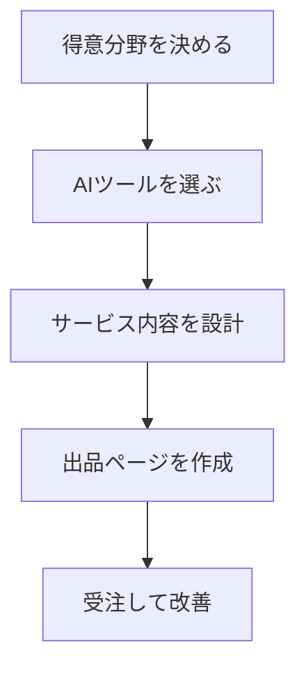

※本記事はアフィリエイト広告(PR)を含みます。

「AIを使ってスキル販売を始めてみたいけれど、何を売ればいいのか、どう始めればいいのかわからない」——そんな悩みを持つ方はとても多いです。この記事では、**AIでスキル販売を始める方法**を初心者向けにやさしく解説します。ココナラなどのスキルマーケットで「売れるサービス」を作る具体的な手順や、使うべきAIツール、価格の付け方、集客のコツまで一通り理解できる内容になっています。

読み終えるころには、「明日から自分でも出品できそう」と思えるはずです。まずは全体像から見ていきましょう。

## AIスキル販売とは?まず知っておきたい基本

スキル販売とは、自分の得意なこと(文章作成、デザイン、翻訳、資料作成など)をサービスとして出品し、必要な人に販売する副業スタイルです。代表的なプラットフォーム(出品・販売の場)には、以下のようなものがあります。

- **ココナラ**:知識・スキルを気軽に売買できる国内最大級のサービス
- **クラウドワークス/ランサーズ**:案件に応募する形式が中心
- **SKIMA/ストアカ**:イラストや講座などジャンル特化型

ここに「AI」を掛け合わせると何が変わるのか。ポイントは、**作業のスピードと品質を底上げできる**という点です。たとえば文章作成なら、AIが下書きを一瞬で作ってくれるので、あなたは仕上げと品質チェックに集中できます。つまり、同じ時間でより多くの案件をこなせるようになるのです。

### AIを使えば「未経験ジャンル」でも戦える

これまで「専門知識がないから無理」と諦めていた分野でも、AIが下地を作ってくれることで挑戦しやすくなりました。もちろん最終的な責任は自分で持つ必要がありますが、参入のハードルは確実に下がっています。

## AIで売れやすいサービスのジャンル

まずは「どんなサービスが売れやすいか」を知ることが大切です。AIと相性が良く、初心者でも始めやすいジャンルを表にまとめました。

| ジャンル | 具体例 | 使えるAIの役割 |
|---|---|---|
| ライティング | ブログ記事・商品説明・SNS文章 | 下書き作成・構成案 |
| 資料作成 | プレゼン資料・企画書 | 骨子作成・デザイン提案 |
| 画像・デザイン | アイコン・バナー・ロゴ案 | 画像生成・アイデア出し |
| 翻訳・要約 | 文章翻訳・長文の要約 | 一次翻訳・下訳 |
| 相談・アドバイス | AI活用のコンサル・プロンプト作成 | 知識の整理 |

とくに文章系は需要が安定していておすすめです。ブログ記事の書き方については[AIでブログ記事を書く方法\|初心者向け完全ガイド](/2026/06/12/ai-blog-writing-guide/)で詳しく解説しているので、ライティング系サービスを考えている方はあわせてご覧ください。

## サービス作りの5ステップ

ここからは、実際にサービスを作って出品するまでの流れを見ていきましょう。全体像は次の図の通りです。

### ステップ1:得意分野・売るものを決める

まずは自分が「少しでも得意」「苦にならない」ことを棚卸ししましょう。完璧なスキルは不要です。AIが補ってくれるので、「興味がある」「調べるのが好き」といったレベルでも十分スタートできます。

### ステップ2:使うAIツールを選ぶ

次に、作業を支えるAIツールを決めます。多くのジャンルで役立つのがChatGPTやClaude、Geminiなどのチャット型AIです。どれを選べばよいか迷う方は、[ChatGPTとClaudeとGeminiを徹底比較!初心者におすすめのAIチャットはどれ?](/2026/06/09/ai-chat-comparison/)を参考にすると自分に合ったものが見つかります。

画像系サービスを作るなら画像生成AIも必要です。無料で始めたい方は[無料で使える画像生成AIおすすめ5選\|商用利用の注意点も解説](/2026/06/11/free-image-ai-tools/)で商用利用の注意点まで確認しておきましょう。ここは特に重要で、**AI生成物を販売する際は各ツールの利用規約(商用利用の可否)を必ず確認**してください。

### ステップ3:サービス内容を設計する

売るものと道具が決まったら、サービスの中身を具体化します。

- **提供内容**:何を、どこまでやるか(例:2000字の記事1本+1回修正)
- **納期**:現実的に守れる日数を設定
- **価格**:相場を調べて設定(後述)

「何をしないか」も明記すると、後のトラブルを防げます。

### ステップ4:出品ページを作る

スキルマーケットでは、出品ページの見せ方で売上が大きく変わります。以下を意識しましょう。

- タイトルに「誰の・どんな悩みを解決するか」を入れる
- サンプルや実績を載せて安心感を出す
- 料金プランは松竹梅の3段階にすると選ばれやすい

この出品ページの文章づくり自体もAIに手伝ってもらえます。

### ステップ5:受注しながら改善する

最初から完璧を目指す必要はありません。少しずつ受注し、お客様の反応を見ながらサービスを磨いていきましょう。良い評価が集まると、自然と依頼が増えていきます。

## 価格はどう決める?初心者の設定のコツ

価格設定は最初の関門です。基本の考え方は次の通りです。

1. 同じジャンルの出品者の価格を調べる
2. 最初は相場よりやや低めに設定して実績を作る
3. 良い評価がたまったら少しずつ値上げする

なお、各プラットフォームは販売額に対して手数料がかかります。手数料率は改定されることもあるため、**出品前に必ず公式サイトで最新の料率を確認**してください。手取り額を計算したうえで価格を決めると安心です。

## よくある疑問Q&A

### Q. AIツールは無料で使える?

多くのチャット型AIには無料プランがあり、まずは無料でも十分に始められます。ただし、無料版は使用回数や機能に制限があることが多いです。本格的に受注が増えてきたら有料版を検討するとよいでしょう。有料版の必要性については[ChatGPT有料版は必要?無料版との違いと元が取れる使い方を解説](/2026/06/20/chatgpt-paid-vs-free/)が参考になります。

### Q. AIで作ったものをそのまま売っていい?

AIの出力をそのまま納品するのは避けましょう。事実の誤り(ハルシネーションと呼ばれる、AIがもっともらしい嘘を作る現象)が含まれることがあるためです。**必ず自分の目でチェックし、手を加えて品質を担保する**ことが、リピートにつながる最大のコツです。

### Q. どんな作業環境を用意すればいい?

在宅で長時間作業するなら、集中できる環境づくりも大切です。周囲の音が気になる方は、ノイズキャンセリング機能付きのイヤホンがあると作業がはかどります。

👉 [Amazonで「ワイヤレスイヤホン ノイズキャンセリング」を見る](https://af.moshimo.com/af/c/click?a_id=5632371&p_id=170&pc_id=185&pl_id=38594&url=https%3A%2F%2Fwww.amazon.co.jp%2Fs%3Fk%3D%25E3%2583%25AF%25E3%2582%25A4%25E3%2583%25A4%25E3%2583%25AC%25E3%2582%25B9%25E3%2582%25A4%25E3%2583%25A4%25E3%2583%259B%25E3%2583%25B3%2520%25E3%2583%258E%25E3%2582%25A4%25E3%2582%25BA%25E3%2582%25AD%25E3%2583%25A3%25E3%2583%25B3%25E3%2582%25BB%25E3%2583%25AA%25E3%2583%25B3%25E3%2582%25B0)

快適なデスク環境については[在宅ワークが捗るデスク周りガジェット10選\|快適環境の作り方](/2026/06/11/home-office-gadgets/)も参考にしてください。

## さらにステップアップしたい人へ

スキル販売に慣れてきたら、次のような展開も見えてきます。

- **サービスの多角化**:1つの得意分野から派生した複数サービスを出品する
- **仕組み化**:定型作業をAIに任せ、1人でも回る体制を作る

1人でビジネスを効率よく回す考え方は[AI時代の「一人会社」入門\|ひとりでも回る仕組みとAI活用術](/2026/06/14/ai-solo-company/)で紹介しています。副業全般の始め方を知りたい方は[AI副業の始め方｜初心者でも稼げる仕事5選とおすすめツール](/2026/06/20/ai-side-business-start/)もあわせてどうぞ。

## まとめ

AIでスキル販売を始める流れを振り返ります。

- スキル販売は自分の得意を売る副業。AIを掛け合わせると速度と品質が上がる
- 売れやすいのはライティング・資料作成・デザイン・翻訳などのジャンル
- 「得意分野を決める→ツール選び→サービス設計→出品→改善」の5ステップで始められる
- 価格は相場を調べ、手数料を考慮して設定(最新の料率は公式サイトで確認)
- AIの出力はそのまま売らず、必ず自分でチェック・改善して品質を担保する

最初の一歩は「無料のAIツールを触ってみること」と「実際に出品ページを1つ作ってみること」です。小さく始めて、お客様の反応を見ながら育てていきましょう。あなたの得意なことが、きっと誰かの役に立つはずです。
