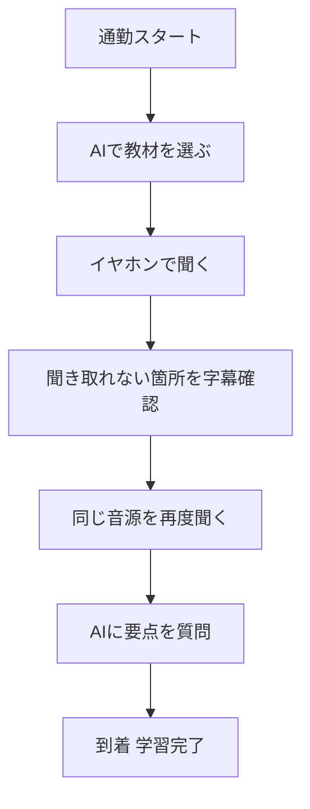

※本記事はアフィリエイト広告(PR)を含みます。

## この記事でわかること

「英語のリスニングを鍛えたいけれど、まとまった勉強時間が取れない」——そんな悩みを持つ方は多いのではないでしょうか。実は近年のAI（人工知能）を活用すれば、片道30分の通勤時間だけでもリスニング力を効率よく伸ばすことができます。

この記事では、**AIで英語リスニングを鍛える方法**を初心者向けにわかりやすく解説します。具体的には、

- なぜAIを使うとリスニング学習がはかどるのか
- 通勤時間を活かすおすすめの学習ステップ
- 使いやすいAIツール・アプリの選び方
- 学習効果を高めるイヤホン選びのコツ

がわかります。「机に向かう時間がない」という方こそ、ぜひ読み進めてみてください。

## なぜリスニング学習にAIが向いているのか

これまでのリスニング学習といえば、教材のCDを繰り返し聞いたり、英語のニュースをひたすら聞き流したりするのが一般的でした。しかし、この方法には「自分のレベルに合っているかわからない」「聞き取れなかった箇所を確認しにくい」という弱点があります。

そこで役立つのがAIです。AIを使ったリスニング学習には、次のようなメリットがあります。

| メリット | 具体的な内容 |
|---|---|
| レベル調整 | あなたの理解度に合わせて難易度や再生速度を自動調整してくれる |
| 即時フィードバック | 聞き取れなかった部分をその場で文字（字幕）で確認できる |
| 弱点の把握 | どんな音や単語が苦手かをAIが分析してくれる |
| 話し相手になる | AI英会話で「聞いて答える」実践練習ができる |

特に「聞き取れなかった箇所をすぐテキストで確認できる」点は、リスニング力の伸びを大きく左右します。わからないまま聞き流すのではなく、**「聞く→確認する→もう一度聞く」**というサイクルを回せるのがAI学習の強みです。

## 通勤時間を活かすリスニング学習の全体像

まずは、通勤時間を使ったAIリスニング学習の流れをイメージしてみましょう。

ポイントは、ただ聞き流すのではなく、**短い区間を「聞く・確認する・聞き直す」で繰り返す**ことです。通勤時間は細切れですが、この小さなサイクルを毎日続けることで着実に耳が慣れていきます。

## 具体的な学習ステップ

### ステップ1：自分のレベルに合った教材をAIで用意する

いきなり難しいニュース英語に挑戦すると挫折しやすいので、まずはレベルを合わせることが大切です。ChatGPTなどの生成AIに「TOEIC500点レベルの短い英語の会話文を作って、日本語訳もつけて」とお願いすれば、自分専用の教材を作れます。

生成AIそのものの使い方に不安がある方は、まず[ChatGPTとClaudeとGeminiを徹底比較!初心者におすすめのAIチャットはどれ?](/2026/06/09/ai-chat-comparison/)を読んで、自分に合ったチャットAIを選ぶところから始めるとスムーズです。

### ステップ2：AI音声で「聞く教材」に変換する

作った英文は、AI音声読み上げツールを使えば自然な発音の音声に変換できます。再生速度を落として聞けば初心者でも聞き取りやすく、慣れてきたら等倍・1.2倍と上げていくのがおすすめです。

読み上げツールの選び方は[AI音声読み上げツールおすすめ比較\|自然な合成音声はどれ?](/2026/06/16/ai-voice-narration-tools/)で詳しく解説しているので、あわせてご覧ください。

### ステップ3：AI英会話アプリで「聞いて答える」練習をする

リスニングは「聞くだけ」より「聞いて反応する」練習を混ぜると定着が早くなります。AI英会話アプリなら、AIが話す英語を聞いて答えるやり取りを、恥ずかしがらずに何度でも練習できます。

どのアプリを選べばいいか迷ったら、[AI英会話アプリおすすめ5選\|独学で話せるようになる使い方](/2026/06/14/ai-english-apps/)で目的別に比較しているので参考にしてください。

### ステップ4：YouTube動画を教材にする

「もっと生の英語に触れたい」という方は、YouTubeの英語動画をAIで文字起こし・要約して教材にする方法もあります。動画を見る前に要約で内容を把握しておくと、リスニングのハードルがぐっと下がります。

やり方は[動画から文字起こし＆要約をAIで\|YouTube学習に最適なツール比較](/2026/06/28/ai-video-transcription-summary/)で紹介しています。

## リスニング学習を助けるイヤホン選び

通勤中のリスニング学習では、イヤホンの質が学習効果を大きく左右します。電車やバスの騒音の中では、細かい発音が聞き取れず学習効率が落ちてしまうためです。

選ぶときのポイントは次の3つです。

- **ノイズキャンセリング機能**：周囲の騒音を打ち消し、英語の音に集中できる
- **装着感の良さ**：長時間つけても疲れにくいもの
- **バッテリー持ち**：往復の通勤で電池切れしない持続時間

とくにノイズキャンセリング（周囲の雑音を電子的に低減する機能）付きのモデルは、リスニング学習との相性が抜群です。

👉 [Amazonで「ワイヤレスイヤホン ノイズキャンセリング」を見る](https://af.moshimo.com/af/c/click?a_id=5632371&p_id=170&pc_id=185&pl_id=38594&url=https%3A%2F%2Fwww.amazon.co.jp%2Fs%3Fk%3D%25E3%2583%25AF%25E3%2582%25A4%25E3%2583%25A4%25E3%2583%25AC%25E3%2582%25B9%25E3%2582%25A4%25E3%2583%25A4%25E3%2583%259B%25E3%2583%25B3%2520%25E3%2583%258E%25E3%2582%25A4%25E3%2582%25BA%25E3%2582%25AD%25E3%2583%25A3%25E3%2583%25B3%25E3%2582%25BB%25E3%2583%25AA%25E3%2583%25B3%25E3%2582%25B0)

どのモデルを選ぶか迷う方は、[テレワーク向けワイヤレスイヤホンの選び方\|失敗しないおすすめモデルの選定ポイント](/2026/06/13/wireless-earphones-telework/)も判断の参考になります。学習にも仕事にも使えるモデルを選べば一石二鳥です。

通勤ではなく在宅でじっくり学習したい方には、より遮音性の高いヘッドホンもおすすめです。

👉 [楽天市場で「ノイズキャンセリング ヘッドホン」を探す](https://af.moshimo.com/af/c/click?a_id=5632328&p_id=54&pc_id=54&pl_id=616&url=https%3A%2F%2Fsearch.rakuten.co.jp%2Fsearch%2Fmall%2F%25E3%2583%258E%25E3%2582%25A4%25E3%2582%25BA%25E3%2582%25AD%25E3%2583%25A3%25E3%2583%25B3%25E3%2582%25BB%25E3%2583%25AA%25E3%2583%25B3%25E3%2582%25B0%2520%25E3%2583%2598%25E3%2583%2583%25E3%2583%2589%25E3%2583%259B%25E3%2583%25B3%2F)

## よくある質問（Q&A）

### Q. AIを使った英語リスニング学習は無料でできる?

はい、工夫すれば無料でも始められます。ChatGPTの無料版で英文教材を作り、無料の音声読み上げ機能で聞くだけでも十分に学習をスタートできます。ただし、より高度な機能（高品質な音声、発音チェック、学習履歴の分析など）は有料プランで使えることが多いです。料金は変更されることがあるため、各サービスの公式サイトで最新情報を確認してください。

### Q. 1日どのくらい続ければ効果が出る?

個人差はありますが、まずは「毎日10〜20分を継続する」ことが何より大切です。通勤の往復を活用すれば無理なく確保できます。長時間まとめて聞くよりも、短時間でも毎日耳を英語に慣らすほうが効果を実感しやすいでしょう。

### Q. 聞き流すだけでも効果はある?

完全に意味を理解していない状態での聞き流しは、残念ながら効果が薄いといわれています。この記事で紹介した「聞く→字幕で確認→聞き直す」のように、**内容を理解しながら聞く**ことを意識すると、同じ時間でも伸びが大きく変わります。

## 学習を長続きさせるコツ

どんな学習法も、続かなければ意味がありません。最後に、AIリスニング学習を習慣化するためのコツを紹介します。

- **時間ではなく行動をトリガーにする**：「電車に乗ったらイヤホンをつける」と決めておく
- **教材のハードルを下げる**：難しすぎる教材はやめ、8割わかるレベルにする
- **記録をつける**：AIチャットに「今日学んだ表現」をメモしてもらうと達成感が出る
- **完璧を目指さない**：聞き取れない日があってもOK。ゼロにしないことが大切

小さな成功体験を積み重ねることが、長続きの一番の秘訣です。

## まとめ

今回は、**AIで英語リスニングを鍛える方法**と、通勤時間を活かす学習法を紹介しました。ポイントを振り返りましょう。

- AIを使えば、自分のレベルに合った教材づくりや聞き取れない箇所の確認が簡単にできる
- 通勤中は「聞く→字幕で確認→聞き直す」の小さなサイクルを繰り返すのが効果的
- 生成AIで教材を作り、AI英会話アプリで「聞いて答える」練習を組み合わせると定着が早い
- ノイズキャンセリングイヤホンを使えば、騒音の中でも集中して学習できる
- まずは無料ツールから、毎日10〜20分の継続を目指すのがおすすめ

まずは今日の帰り道から、ChatGPTで作った短い英文を1つ聞いてみるところから始めてみてください。毎日の通勤時間が、あなたの英語力を伸ばす貴重な学習時間に変わっていくはずです。
