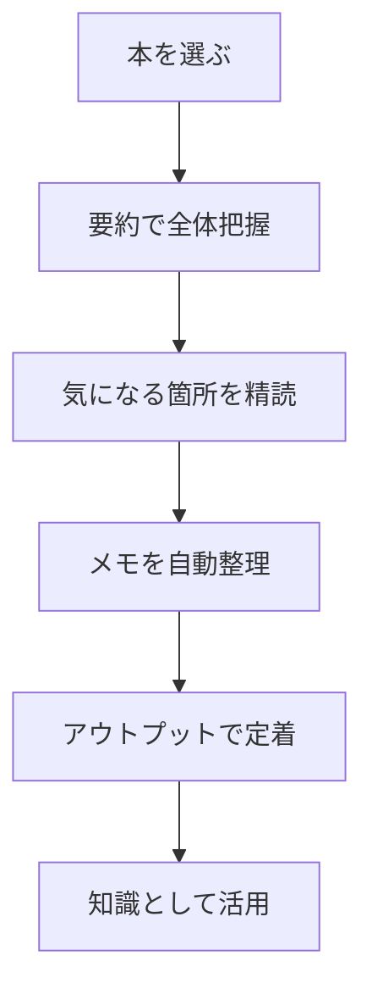

※本記事はアフィリエイト広告(PR)を含みます。

## AIで読書を効率化する方法とは?この記事でわかること

「本を読みたいけれど時間がない」「読んでも内容をすぐ忘れてしまう」——そんな悩みを持つ方は多いのではないでしょうか。実は、AI(人工知能)を使えば読書はぐっと効率化できます。要約で全体像をつかみ、メモを自動で整理し、学んだ内容をアウトプット(自分の言葉で書き出すこと)まで一気にサポートしてくれるからです。

この記事では、**AIで読書を効率化する具体的な方法**を、初心者の方にもわかりやすく解説します。読み終えるころには、次のことがわかります。

- AIを使った読書の3つの活用フェーズ(要約・メモ・アウトプット)
- 目的別のおすすめツールと使い方
- 「AI読書ツールは無料で使える?」という疑問への答え
- 効率化しつつ理解を深めるためのコツ

それでは、さっそく見ていきましょう。

## AI読書の全体像|3つのフェーズで考える

AIを読書に活用するときは、次の3つのフェーズに分けて考えるとスムーズです。

まず要約で本の全体像をつかみ、そのうえで本当に読むべき箇所を精読します。読みながら取ったメモをAIで整理し、最後に自分の言葉でまとめる(アウトプットする)ことで、記憶に定着させる——この流れが基本です。

それぞれのフェーズで役立つAIの使い方を、順番に紹介していきます。

## フェーズ1:AIで要約して全体像をつかむ

読書が続かない大きな原因のひとつが「最初から全部を丁寧に読もうとして疲れてしまう」ことです。そこでまず、AIに本の要約を作ってもらい、全体の地図を手に入れましょう。

### 目次や章のポイントを先に把握する

ChatGPTやClaude、Geminiといった生成AI(文章を作り出すAI)に、次のようなプロンプト(指示文)を投げてみましょう。

> 「◯◯という本の主要なテーマと、各章のポイントを箇条書きで教えてください」

これで本の骨組みが見えてきます。ただし注意点として、AIは実在しない内容をもっともらしく答えてしまう「ハルシネーション(もっともらしい誤り)」を起こすことがあります。要約はあくまで「読む前の地図」として使い、細部は必ず本文で確認しましょう。

どのAIチャットを使えばいいか迷う方は、[ChatGPTとClaudeとGeminiを徹底比較!初心者におすすめのAIチャットはどれ?](/2026/06/09/ai-chat-comparison/)も参考にしてみてください。

### PDFや電子書籍の内容を直接要約する

手元にPDF資料やビジネス書のスキャンデータがある場合は、それ自体をAIに読み込ませて要約できます。長い資料を短時間で把握したいときにとても便利です。具体的なツールは[AIでPDFを要約・分析する方法｜長文資料を時短で読むツール5選](/2026/06/24/ai-pdf-summary-tools/)で詳しく紹介しています。

## フェーズ2:AIでメモを整理する

読書中に気になった箇所をメモしても、あとで見返さないまま埋もれてしまう——これはよくある失敗です。AIを使えば、バラバラのメモを意味のあるまとまりに整理できます。

### 抜き書きメモをテーマ別に分類する

読みながら気になった文章をメモアプリに書き溜め、あとでAIにまとめて渡します。

> 「以下のメモをテーマごとに分類し、それぞれ見出しをつけて整理してください」

これだけで、雑多なメモが構造化された知識ノートに変わります。Notion AIのようにメモアプリと一体化したツールを使えば、書きながらその場で整理・要約ができて効率的です。使い方は[Notion AIの使い方完全ガイド\|情報整理とタスク管理を効率化する活用法](/2026/06/17/notion-ai-guide/)にまとめています。

### 図解でアイデアをつなげる

本の内容を頭の中で整理したいときは、マインドマップ(中心テーマから枝分かれさせて考えを広げる図)にするのがおすすめです。AIマインドマップツールを使えば、メモから自動で図を作れます。

## フェーズ3:アウトプットで知識を定着させる

読書の効果を最大化する鍵は、なんといってもアウトプットです。「学んだことを人に説明できるか」で理解度は大きく変わります。AIはこのアウトプットの練習相手として非常に優秀です。

### AIに「先生役」や「読者役」になってもらう

次のように役割を与えると、理解の穴が見つかります。

- 「この本の内容を、私が高校生に教えるとしたら、と想定して質問してください」
- 「私が説明した内容を聞いて、わかりにくい点を指摘してください」

AIに質問役をしてもらうことで、「わかったつもり」を防げます。

### 読書ブログや感想文に発展させる

学んだことをブログ記事や感想文としてまとめれば、記憶に残りやすく、副業にもつながります。AIを執筆のたたき台に使う方法は[AIでブログ記事を書く方法\|初心者向け完全ガイド](/2026/06/12/ai-blog-writing-guide/)で解説していますので、あわせてご覧ください。

## 目的別・AI読書ツールの選び方

どんな目的で読書を効率化したいかによって、選ぶべきツールは変わります。

| 目的 | 向いているツール | 特徴 |
| --- | --- | --- |
| 本や資料をざっと要約したい | ChatGPT・Claude・Gemini | 対話形式で柔軟に要約 |
| PDF資料を分析したい | PDF対応AIツール | ファイルを直接読み込み |
| メモを整理・蓄積したい | Notion AI | メモと整理が一体化 |
| アイデアを図で整理したい | AIマインドマップツール | 自動で図解化 |

まずは普段使っているAIチャットで要約から試し、必要に応じて専用ツールを組み合わせるのがおすすめです。

## よくある疑問Q&A

### Q. AI読書ツールは無料で使える?

はい、多くのツールに無料プランがあります。ChatGPTやGemini、Claudeにはそれぞれ無料版があり、要約やメモ整理といった基本的な用途なら十分試せます。ただし、無料版は利用回数や読み込めるファイルの容量に制限があることが多く、長い本や大量の資料を扱うなら有料版が快適です。料金や制限は変更されることがあるため、**最新情報は各公式サイトで必ず確認してください**。有料版を検討する際は[ChatGPT有料版は必要?無料版との違いと元が取れる使い方を解説](/2026/06/20/chatgpt-paid-vs-free/)が参考になります。

### Q. 紙の本でもAIは活用できる?

できます。紙の本の気になったページをスマホで撮影し、OCR(画像から文字を読み取る技術)でテキスト化すれば、AIに要約や整理を任せられます。とはいえ、AI活用を前提にするなら電子書籍のほうがテキストのコピーがしやすく便利です。読書環境そのものを見直したい方は[電子書籍リーダーは買うべき?KindleとKoboを徹底比較【初心者向け】](/2026/06/13/kindle-kobo-comparison/)をチェックしてみてください。

### Q. 耳で読書する「聴く読書」との組み合わせは?

通勤中や家事の合間に本を「聴く」オーディオブックと、AI要約を組み合わせると学習効率がさらに上がります。集中して聴くにはノイズキャンセリング機能付きのイヤホンがあると快適です。

👉 [Amazonで「ワイヤレスイヤホン ノイズキャンセリング」を見る](https://af.moshimo.com/af/c/click?a_id=5632371&p_id=170&pc_id=185&pl_id=38594&url=https%3A%2F%2Fwww.amazon.co.jp%2Fs%3Fk%3D%25E3%2583%25AF%25E3%2582%25A4%25E3%2583%25A4%25E3%2583%25AC%25E3%2582%25B9%25E3%2582%25A4%25E3%2583%25A4%25E3%2583%259B%25E3%2583%25B3%2520%25E3%2583%258E%25E3%2582%25A4%25E3%2582%25BA%25E3%2582%25AD%25E3%2583%25A3%25E3%2583%25B3%25E3%2582%25BB%25E3%2583%25AA%25E3%2583%25B3%25E3%2582%25B0)

読書に集中できる静かな環境づくりには、こうしたガジェットへの投資も効果的です。

## AI読書を成功させる3つのコツ

最後に、AIで読書を効率化するときに意識したいポイントをまとめます。

1. **要約を鵜呑みにしない**:AIの要約は地図として使い、重要な箇所は必ず本文で確認する。
2. **アウトプットまでセットにする**:要約だけで終わらず、自分の言葉でまとめて初めて知識になる。
3. **ツールを欲張らない**:最初は1つのAIチャットだけで十分。慣れてから専用ツールを増やす。

この3つを守るだけで、「読んだのに覚えていない」という状態から抜け出せます。

## まとめ

AIを使えば、読書は「要約で全体把握 → 精読 → メモ整理 → アウトプット」という流れで驚くほど効率化できます。

- **要約**で本の地図を手に入れ、読むべき箇所を絞る
- **メモ整理**で散らばった気づきを構造化する
- **アウトプット**で知識を自分のものにする

まずは手元のAIチャットに、気になっている本の要約を頼むところから始めてみましょう。無料版でも十分に効果を実感できるはずです。ツールの機能や料金は日々アップデートされているので、導入前には各公式サイトで最新情報を確認することをおすすめします。AIを味方につけて、限られた時間でも学びの多い読書を楽しんでください。
