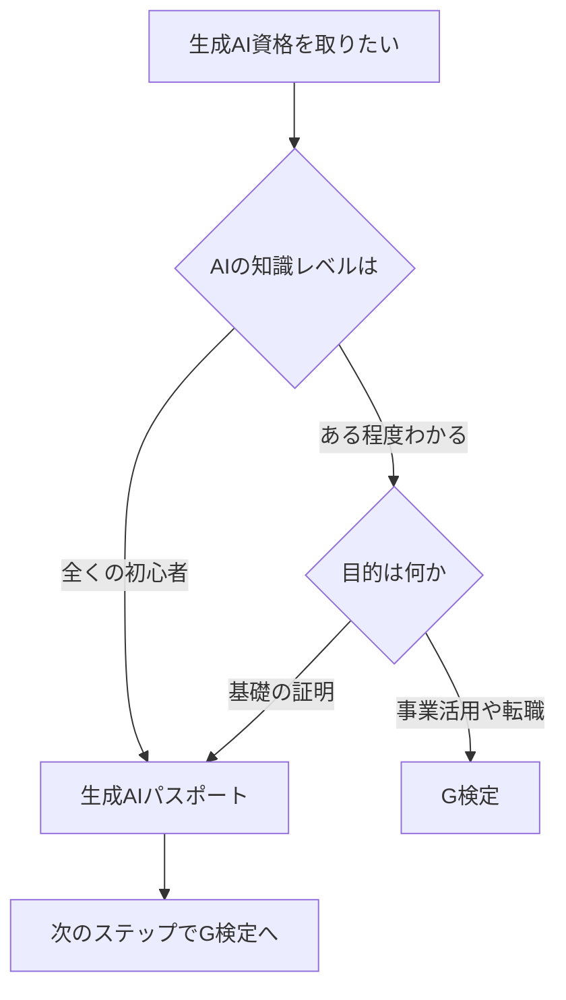

※本記事はアフィリエイト広告(PR)を含みます。

「生成AIのスキルを証明できる資格が欲しいけれど、G検定と生成AIパスポートって何が違うの?」——そんな疑問を持ってこの記事にたどり着いた方は多いのではないでしょうか。

この記事を読むと、**生成AI資格の代表格である「G検定」と「生成AIパスポート」の違い・難易度・勉強法**がひととおりわかります。それぞれどんな人に向いているのか、どのくらいの勉強時間が必要なのか、独学でも合格できるのかまで、初心者の方にもわかりやすく丁寧に解説していきます。「まずはどっちから受ければいいの?」という結論も後半でお伝えしますので、ぜひ最後までご覧ください。

## 生成AI資格が注目される理由

ここ数年で生成AI(文章や画像などを自動で作り出すAI)は一気に普及し、仕事の現場でも当たり前のように使われるようになりました。そうなると、「自分はAIをきちんと理解して使えます」と示せる証明が価値を持ちます。それが**生成AI関連の資格**です。

資格を取るメリットは主に次の3つです。

- **知識が体系的に整理される**(独学でつまみ食いしがちな知識に土台ができる)
- **転職・社内評価でアピールしやすい**(履歴書に書ける)
- **学習のゴールができてモチベーションが続く**

AI時代に価値が上がる資格全般については、[生成AIとかけ合わせると強い資格8選\|AI時代に価値が上がるスキル](/2026/06/16/ai-strong-certifications/)でも詳しく紹介していますので、あわせてご覧ください。

## G検定とは?

**G検定(ジェネラリスト検定)**は、日本ディープラーニング協会(JDLA)が実施している検定試験です。「ディープラーニング(深層学習=AIの中心的な技術)を事業に活用する知識を持っているか」を問う内容で、AI資格の中では知名度が非常に高いのが特徴です。

### G検定の特徴

- **対象**:AIをビジネスに活かしたい人全般(エンジニアでなくてもOK)
- **出題範囲**:AIの歴史、機械学習・ディープラーニングの仕組み、法律・倫理、生成AIの動向など幅広い
- **形式**:オンラインの自宅受験(選択式・多数の問題を時間内に解く)
- **難易度**:合格率はおおむね6〜7割程度とされ、しっかり対策すれば合格を狙えるレベル

ポイントは「出題範囲が広く、用語の量が多い」こと。技術そのものより、幅広い知識をまんべんなく問われるイメージです。

## 生成AIパスポートとは?

**生成AIパスポート**は、一般社団法人 生成AI活用普及協会(GUGA)が実施している、生成AIに特化した入門的な資格です。ChatGPTなどの生成AIを「安全に・正しく使うための基礎知識」を証明するもので、比較的新しい資格です。

### 生成AIパスポートの特徴

- **対象**:これから生成AIを使い始めるビジネスパーソン・学生など初心者
- **出題範囲**:生成AIの仕組みの基礎、活用方法、情報漏洩や著作権などのリスク管理
- **形式**:オンライン受験
- **難易度**:入門者向けで、G検定より易しめとされる

「まず生成AIの基本とリスクをきちんと押さえたい」という方にぴったりの、いわば入り口の資格です。

## G検定と生成AIパスポートを比較

2つの資格をわかりやすく表で整理してみましょう。

| 項目 | G検定 | 生成AIパスポート |
|------|-------|----------------|
| 主催 | 日本ディープラーニング協会(JDLA) | 生成AI活用普及協会(GUGA) |
| レベル感 | 中級(幅広い知識) | 入門 |
| 範囲 | AI全般・ディープラーニング中心 | 生成AIの基礎とリスク |
| 難易度 | やや高め | やさしめ |
| 向いている人 | AIを事業活用したい人 | まず基礎を固めたい人 |

※受験料・試験日程・出題数などの具体的な数値は改定されることがあります。**必ず各資格の公式サイトで最新情報を確認してください。**

### どちらを選ぶ?フローチャート

迷ったら「**生成AIパスポート → G検定**」という順番がおすすめです。入門で全体像をつかんでから、より広く深いG検定に進むと無理なくステップアップできます。

## それぞれの勉強法

### 生成AIパスポートの勉強法

入門資格なので、独学でも十分合格を狙えます。

1. **公式テキストを1〜2周読む**(全体像を把握)
2. **用語をノートやアプリにまとめる**
3. **公式の問題例で出題形式に慣れる**

目安の勉強時間は数十時間程度と言われますが、生成AIを普段から触っている人ならもっと短くて済むこともあります。まずは実際にChatGPTなどを触ってみるのが理解の近道です。ツール選びに迷う方は[ChatGPTとClaudeとGeminiを徹底比較!初心者におすすめのAIチャットはどれ?](/2026/06/09/ai-chat-comparison/)を参考にしてください。

### G検定の勉強法

範囲が広いため、計画的な学習が必要です。

1. **公式テキスト(通称・白本)で全範囲をインプット**
2. **問題集(黒本など)を繰り返し解く**
3. **苦手分野を重点的に復習**
4. **本番は調べながら解けるが、時間配分の練習が重要**

市販の公式テキストや問題集は書店やオンラインで手に入ります。

👉 [Amazonで「G検定 公式テキスト 問題集」を見る](https://af.moshimo.com/af/c/click?a_id=5632371&p_id=170&pc_id=185&pl_id=38594&url=https%3A%2F%2Fwww.amazon.co.jp%2Fs%3Fk%3DG%25E6%25A4%259C%25E5%25AE%259A%2520%25E5%2585%25AC%25E5%25BC%258F%25E3%2583%2586%25E3%2582%25AD%25E3%2582%25B9%25E3%2583%2588%2520%25E5%2595%258F%25E9%25A1%258C%25E9%259B%2586)

独学に不安がある場合は、体系的に学べるオンラインスクールを活用するのも一つの手です。詳しくは[生成AIが学べるオンラインスクールおすすめ比較\|失敗しない選び方](/2026/06/13/ai-online-school-guide/)や[DMM 生成AI CAMPの料金・評判・特徴](/2026/06/23/dmm-ai-camp-review/)をご覧ください。

## Q&A:よくある疑問に先回りで回答

### Q. 生成AIパスポートやG検定は無料で受けられる?

いいえ、どちらも**受験料がかかる有料の検定**です。金額は改定されることがあるため、公式サイトで最新の受験料を確認しましょう。ただし、学習に使えるサンプル問題や解説記事は無料で公開されていることが多いので、まずはそこから始めるとコストをかけずに雰囲気をつかめます。

### Q. 資格を取れば仕事に就ける?

資格はあくまで「知識の証明」です。取っただけで仕事が保証されるわけではありませんが、**実務での活用経験とセットにすると強力なアピール**になります。学んだ知識を使って、日々の業務でAIを試してみることが大切です。

### Q. どちらか一方だけでいい?

目的次第です。生成AIの基礎だけ押さえたいなら生成AIパスポート、AI全般を事業に活かしたいならG検定。両方取れば「入門から応用まで理解している」という強い証明になります。

## まとめ

最後に、この記事のポイントを整理します。

- **生成AIパスポート**は初心者向けの入門資格。生成AIの基礎とリスク管理を学べる
- **G検定**はAI全般を事業活用するための中級資格。範囲が広く用語量が多い
- 迷ったら「**生成AIパスポート → G検定**」の順でステップアップするのがおすすめ
- どちらも有料。**受験料や日程は必ず公式サイトで最新情報を確認**
- 資格の勉強と並行して、実際にAIツールを触ることが合格と実務の両方に効く

資格取得は、AI時代に自分の市場価値を高めるための確かな一歩です。まずは無料のサンプル問題や身近なAIツールから触れてみて、自分に合ったレベルの資格からチャレンジしてみてください。
